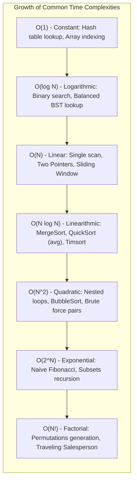

# Algorithmic Complexity Analysis (Big-O, Big-Ω, Big-Θ & Amortized Analysis)

## 1. Why This Matters
In banking and financial backend systems, an algorithm that is $O(N^2)$ instead of $O(N \log N)$ can freeze a settlement engine during peak trading or UPI clearing windows. At IDFC FIRST Bank's Strategic Projects, engineers write code handling tens of thousands of concurrent payment requests. In interviews, stating an algorithm's complexity is not enough: interviewers will ask you to mathematically derive worst-case, average-case, and amortized bounds, identify auxiliary memory allocations, and analyze garbage collection overhead.

---

## 2. Prerequisites
- Basic algebra (logarithms, exponents, summation formulas $\sum_{i=1}^{n} i = \frac{n(n+1)}{2}$).
- Understanding of stack frames and heap allocations in programming languages (Node.js/V8, Python).

---

## 3. Concept

### Asymptotic Notations
- **Big-O ($O$):** Upper bound. Formal definition: $f(N) = O(g(N))$ if there exist positive constants $c$ and $N_0$ such that $0 \le f(N) \le c \cdot g(N)$ for all $N \ge N_0$. Represents the worst-case scenario.
- **Big-Omega ($\Omega$):** Lower bound. $f(N) \ge c \cdot g(N)$ for all $N \ge N_0$. Best-case performance.
- **Big-Theta ($\Theta$):** Tight bound. When an algorithm's upper bound and lower bound match: $c_1 \cdot g(N) \le f(N) \le c_2 \cdot g(N)$.
- **Little-o ($o$):** Strict upper bound where $f(N)$ grows strictly slower than $g(N)$.



### Amortized Analysis
When an operation is occasionally very expensive but predominantly cheap, the *amortized cost* averages the total cost over a long sequence of operations.
**The Accounting Method:** You overcharge cheap operations (e.g., normal array append = 1 unit of work charged as 3 units) and store the surplus as credit. When the expensive resizing operation occurs (copying $N$ elements = $N$ units of work), the accumulated credit pays for the reallocation. Thus, the amortized cost per append is strictly $O(1)$.

---

## 4. Simple Example: Linear vs Logarithmic Search

```python
# Linear Search: O(N) Time, O(1) Space
def linear_search(arr: list[int], target: int) -> int:
    for i in range(len(arr)):
        if arr[i] == target:
            return i
    return -1

# Binary Search: O(log N) Time, O(1) Space
def binary_search(sorted_arr: list[int], target: int) -> int:
    left, right = 0, len(sorted_arr) - 1
    while left <= right:
        mid = left + (right - left) // 2  # Prevents integer overflow
        if sorted_arr[mid] == target:
            return mid
        elif sorted_arr[mid] < target:
            left = mid + 1
        else:
            right = mid - 1
    return -1
```

---

## 5. Real-World Banking Example: High-Throughput Transaction Deduplication
Suppose an incoming UPI payment batch has $N = 100,000$ transactions. You must verify that no two transactions share the same `idempotency_key`.

- **Brute Force ($O(N^2)$):** Comparing each transaction against every other transaction requires:
  $$\frac{100,000 \times 99,999}{2} \approx 5 \times 10^9 \text{ operations} \implies \approx 5\text{–}10 \text{ seconds (CPU freeze)}.$$
- **Hash Set Optimization ($O(N)$ Time, $O(N)$ Space):**
  Checking existence in a hash set takes $O(1)$ on average:
  $$100,000 \text{ lookups} \approx 0.015 \text{ seconds}.$$
- **In-place Sort + Adjacent Scan ($O(N \log N)$ Time, $O(1)$ Auxiliary Space):**
  Useful when memory is constrained on embedded gateway appliances.

---

## 6. Code: Python Dynamic Array Resizing Proof

```python
import sys
import time

def demonstrate_amortized_growth():
    """Demonstrates list capacity jumps in Python (CPython dynamic array)."""
    data = []
    prev_size = sys.getsizeof(data)
    print(f"{'Length':<10} | {'Byte Size':<12} | {'New Allocation Triggered?'}")
    print("-" * 50)
    
    for i in range(25):
        data.append(i)
        current_size = sys.getsizeof(data)
        resized = current_size != prev_size
        if resized:
            print(f"{len(data):<10} | {current_size:<12} | YES (Grown to accommodate elements)")
            prev_size = current_size

if __name__ == "__main__":
    demonstrate_amortized_growth()
```

---

## 7. How It Works Internally

### CPython & V8 Dynamic Array Growth Mechanics
1. In CPython, `list` is implemented as an array of pointers (`PyObject**`). When the allocated capacity is exhausted, CPython over-allocates using the formula:
   $$\text{new\_allocated} = \text{size} + (\text{size} \gg 3) + (\text{size} < 9 \text{ ? } 3 : 6)$$
   This provides an approximate geometric growth factor of $\approx 1.125\times$.
2. In V8 (Node.js/JavaScript), `JSArray` has two modes: **Fast Elements** (contiguous C++ pointer backing stores) and **Dictionary Elements** (hash tables for sparse arrays). For fast elements, resizing multiplies capacity by $1.5\times$ to $2\times$.
3. Copying $N$ elements takes $O(N)$, but because reallocation happens geometrically, resizing from $1$ to $N$ requires:
   $$1 + 2 + 4 + 8 + \dots + N = 2N - 1 = O(N) \text{ total copies across } N \text{ insertions}.$$
   $$\frac{\text{Total Time}}{\text{Operations}} = \frac{O(N)}{N} = O(1) \text{ amortized per append}.$$

---

## 8. Common Mistakes
1. **Confusing Auxiliary Space with Total Space:** Auxiliary space is temporary working memory *excluding* the input. In MergeSort, total space is $O(N)$, and auxiliary space is $O(N)$. In QuickSort, auxiliary stack space is $O(\log N)$ average, $O(N)$ worst.
2. **Ignoring String Immutability Overhead:** In Python and JavaScript, strings are immutable. Doing `s += char` inside an $N$-iteration loop creates a new string each time, turning an intended $O(N)$ operation into $O(N^2)$! Always use `"".join(list)` in Python or an array push + `.join("")` in JS.
3. **Assuming Hash Table Lookups are Always $O(1)$:** If hash collisions occur (or an adversary triggers hash collision attacks), open-addressed or chained tables degrade to $O(N)$ worst case.

---

## 9. Performance / Complexity Matrix

| Operation / Algorithm | Best Time | Average Time | Worst Time | Auxiliary Space |
| :--- | :---: | :---: | :---: | :---: |
| **Array Access by Index** | $O(1)$ | $O(1)$ | $O(1)$ | $O(1)$ |
| **Dynamic Array Append** | $O(1)$ | $O(1)$ | $O(N)$ | $O(1)$ |
| **Hash Table Insert/Lookup** | $O(1)$ | $O(1)$ | $O(N)$ | $O(N)$ |
| **Binary Search** | $O(1)$ | $O(\log N)$ | $O(\log N)$ | $O(1)$ |
| **Merge Sort** | $O(N \log N)$ | $O(N \log N)$ | $O(N \log N)$ | $O(N)$ |
| **Quick Sort** | $O(N \log N)$ | $O(N \log N)$ | $O(N^2)$ | $O(\log N)$ avg |
| **Breadth-First Search (BFS)** | $O(V + E)$ | $O(V + E)$ | $O(V + E)$ | $O(V)$ |
| **Depth-First Search (DFS)** | $O(V + E)$ | $O(V + E)$ | $O(V + E)$ | $O(V)$ stack |

---

## 10. Interview Questions (Easy $\to$ Medium $\to$ Hard)

### Easy
- **Q:** What is the difference between $O(1)$ and $O(\log N)$? Give an example of each in software engineering.

### Medium
- **Q:** Explain why QuickSort is commonly preferred over MergeSort for arrays in cache-sensitive systems despite QuickSort having a worse worst-case time complexity ($O(N^2)$ vs $O(N \log N)$).

### Hard
- **Q:** An algorithm processes a stream of financial transactions. Each incoming item requires checking a min-heap of size $K$ and occasionally rebuilding an auxiliary index of size $M$. Derive the tight asymptotic bound for $N$ total transactions where $M = \sqrt{N}$ and $K = \log N$.

---

## 11. Follow-up Questions from Interviewer
- *"What is cache locality, and how does it affect the empirical execution speed of an $O(N)$ array traversal versus an $O(N)$ linked list traversal?"*
- *"If `Array.prototype.sort()` in Node.js uses Timsort, what is its worst-case space complexity, and why doesn't it use standard in-place QuickSort?"*

---

## 12. Model Answer (QuickSort vs MergeSort & Cache Locality)

> **Interviewer:** *"Why does production software often choose QuickSort or Dual-Pivot QuickSort over MergeSort for primitive arrays?"*
> 
> **Model Answer:**
> "While MergeSort guarantees $O(N \log N)$ worst-case time, it requires $O(N)$ auxiliary memory because merging requires a secondary array. In contrast, QuickSort operates strictly in-place with $O(\log N)$ auxiliary call-stack space.
> 
> More importantly, QuickSort exhibits superior **spatial locality of reference**. Its partitioning algorithm traverses contiguous memory sequentially, making optimal use of CPU L1/L2 cache lines and minimizing hardware cache misses. MergeSort's auxiliary buffer copying incurs additional memory bus traffic.
> 
> However, for reference types or objects (such as JavaScript arrays or Python objects) where elements are pointers and stability is required (preserving relative order of equal keys, like sorting bank transactions by timestamp while preserving category order), Timsort (a hybrid of MergeSort and InsertionSort) is preferred because it guarantees stability and $O(N)$ best-case time on partially sorted data."

---

## 13. Practical Exercise
Analyze the time and auxiliary space complexity of each function:

```python
# Exercise 1:
def mystery_one(n: int):
    count = 0
    i = n
    while i > 0:
        for j in range(i):
            count += 1
        i //= 2
    return count

# Exercise 2:
def mystery_two(arr: list[int]):
    n = len(arr)
    result = []
    for i in range(n):
        subset = []
        for j in range(i, n):
            subset.append(arr[j])
            result.append(list(subset))
    return result
```

*(Solution hint: Mystery 1 uses a geometric series $\sum_{k=0}^{\log_2 n} \frac{n}{2^k} = n(1 + 1/2 + 1/4 + \dots) = O(N)$ time, $O(1)$ space. Mystery 2 generates all subarrays: $O(N^2)$ iterations, but copying subsets makes total time $O(N^3)$ and space $O(N^3)$).*

---

## 14. Quick Revision
- Big-O denotes worst-case upper bound; Big-$\Theta$ denotes tight asymptotic bound.
- Geometric series $N + N/2 + N/4 + \dots = 2N = O(N)$.
- In-place algorithms utilize $O(1)$ auxiliary space beyond input buffers.
- String concatenation inside loops in Python/JS creates $O(N^2)$ memory churning.
- Dynamic array append is $O(1)$ amortized, $O(N)$ worst-case.

---

## 15. Interview Checklist
- [ ] Can define Big-O mathematically ($f(N) \le c \cdot g(N)$).
- [ ] Can explain the accounting/potential method for amortized analysis.
- [ ] Can distinguish auxiliary space from input space.
- [ ] Can explain CPU cache lines and spatial/temporal locality.
- [ ] Can identify hidden $O(N)$ costs in high-level language methods (e.g., `list.insert(0, val)` or `Array.shift()` which shifts all elements).
