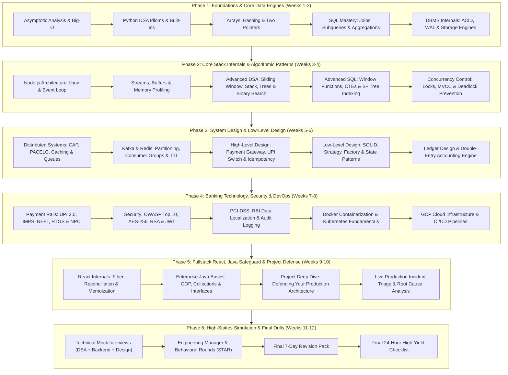

# Master Roadmap: IDFC FIRST Bank Developer Preparation
### Comprehensive Engineering Syllabus for 3+ Years Experience Candidate

---

## 🎯 Curriculum Philosophy & Target Standard

At IDFC FIRST Bank's Strategic Projects division, engineers build and maintain digital banking platforms handling millions of real-time transactions daily. An interview for a **3+ YoE Developer** evaluates not just syntax recall, but:
1. **Algorithmic Efficiency:** Writing clean, optimal O(N) or O(log N) code with precise complexity boundaries.
2. **Data Integrity:** Ensuring financial ledgers never experience race conditions, duplicate debits, or dirty reads.
3. **Backend Mastery:** Explaining how Node.js executes asynchronous I/O via libuv and how OS threads handle blocking system calls.
4. **System Architecture:** Designing distributed systems with guaranteed idempotency, graceful degradation, and audit compliance.
5. **Production Reasoning:** Defending technical decisions under active challenge from senior architects.

---

## 📅 Roadmap Phase Details

### Phase 1: Foundations, Python for DSA & Advanced SQL (Weeks 1–2)
* **Goal:** Establish a rock-solid algorithmic baseline in Python and master relational database operations.
* **Core Modules:**
  - [00-FOUNDATION/complexity-analysis.md](file:///home/bipin/Desktop/BankInterview/00-FOUNDATION/complexity-analysis.md): Worst, Average, Amortized analysis.
  - [01-PYTHON/python-fundamentals.md](file:///home/bipin/Desktop/BankInterview/01-PYTHON/python-fundamentals.md): Reference semantics, `collections.defaultdict`, `Counter`, `heapq`.
  - [02-DSA/arrays.md](file:///home/bipin/Desktop/BankInterview/02-DSA/arrays.md), [02-DSA/hashing.md](file:///home/bipin/Desktop/BankInterview/02-DSA/hashing.md), [02-DSA/two-pointers.md](file:///home/bipin/Desktop/BankInterview/02-DSA/two-pointers.md).
  - [05-SQL-DBMS/schema.sql](file:///home/bipin/Desktop/BankInterview/05-SQL-DBMS/schema.sql): Hands-on banking schema setup.
  - [05-SQL-DBMS/joins.md](file:///home/bipin/Desktop/BankInterview/05-SQL-DBMS/joins.md), [05-SQL-DBMS/subqueries.md](file:///home/bipin/Desktop/BankInterview/05-SQL-DBMS/subqueries.md).
* **Exit Milestone:**
  - Able to solve LeetCode medium array/hashing problems in Python within 25 minutes.
  - Able to write multi-table joins, aggregations, and subqueries on bank account/transaction tables without hesitation.

---

### Phase 2: Node.js Internals, Advanced DSA & DBMS Concurrency (Weeks 3–4)
* **Goal:** Elevate your primary stack (Node.js/Express) to senior architectural level and master database transaction internals.
* **Core Modules:**
  - [04-NODE-EXPRESS/event-loop.md](file:///home/bipin/Desktop/BankInterview/04-NODE-EXPRESS/event-loop.md): Timers, Pending I/O, Poll, Check (`setImmediate`), Close phases; `process.nextTick` vs Microtask queue.
  - [04-NODE-EXPRESS/streams.md](file:///home/bipin/Desktop/BankInterview/04-NODE-EXPRESS/streams.md): Backpressure, pipeline, streaming 100MB+ transaction CSVs.
  - [02-DSA/sliding-window.md](file:///home/bipin/Desktop/BankInterview/02-DSA/sliding-window.md), [02-DSA/stack-queue.md](file:///home/bipin/Desktop/BankInterview/02-DSA/stack-queue.md), [02-DSA/binary-search.md](file:///home/bipin/Desktop/BankInterview/02-DSA/binary-search.md).
  - [05-SQL-DBMS/window-functions.md](file:///home/bipin/Desktop/BankInterview/05-SQL-DBMS/window-functions.md): `ROW_NUMBER`, `DENSE_RANK`, `LEAD`, `LAG`, running balances.
  - [05-SQL-DBMS/acid.md](file:///home/bipin/Desktop/BankInterview/05-SQL-DBMS/acid.md), [05-SQL-DBMS/isolation-levels.md](file:///home/bipin/Desktop/BankInterview/05-SQL-DBMS/isolation-levels.md), [05-SQL-DBMS/locking.md](file:///home/bipin/Desktop/BankInterview/05-SQL-DBMS/locking.md): Preventing race conditions on balance updates using `SELECT ... FOR UPDATE`.
* **Exit Milestone:**
  - Can whiteboard the exact Node.js event loop phase execution and write custom backpressure-aware streams.
  - Can detect and fix dirty reads, non-repeatable reads, and phantom reads using appropriate isolation levels.

---

### Phase 3: System Design, Distributed Systems & Low-Level Design (Weeks 5–6)
* **Goal:** Master high-level and low-level system design for financial platforms.
* **Core Modules:**
  - [06-SYSTEM-DESIGN/system-design-fundamentals.md](file:///home/bipin/Desktop/BankInterview/06-SYSTEM-DESIGN/system-design-fundamentals.md): The 10-step financial system design template.
  - [06-SYSTEM-DESIGN/payment-system.md](file:///home/bipin/Desktop/BankInterview/06-SYSTEM-DESIGN/payment-system.md): Idempotency keys, two-phase commits vs Sagas, reconciliation.
  - [06-SYSTEM-DESIGN/rate-limiting.md](file:///home/bipin/Desktop/BankInterview/06-SYSTEM-DESIGN/rate-limiting.md): Token bucket with Redis.
  - [06-SYSTEM-DESIGN/kafka.md](file:///home/bipin/Desktop/BankInterview/06-SYSTEM-DESIGN/kafka.md): Partitioning by `account_id` to guarantee ordered ledger events.
  - [07-LOW-LEVEL-DESIGN/solid.md](file:///home/bipin/Desktop/BankInterview/07-LOW-LEVEL-DESIGN/solid.md), [07-LOW-LEVEL-DESIGN/payment-system.md](file:///home/bipin/Desktop/BankInterview/07-LOW-LEVEL-DESIGN/payment-system.md): Extensible Payment Processor using Strategy and Factory patterns.
* **Exit Milestone:**
  - Can design a complete Payment Gateway / Wallet Transfer system from scratch in 40 minutes.
  - Can implement SOLID-compliant class structures for financial workflows.

---

### Phase 4: Banking Technology, Application Security & DevOps (Weeks 7–8)
* **Goal:** Become completely fluent in Indian payment rails (UPI, IMPS, RTGS), security protocols, and cloud deployments.
* **Core Modules:**
  - [11-BANKING-FINTECH/upi.md](file:///home/bipin/Desktop/BankInterview/11-BANKING-FINTECH/upi.md): UPI 2.0, NPCI switch, PSP vs Issuer Bank, VPA resolution.
  - [11-BANKING-FINTECH/transaction-processing.md](file:///home/bipin/Desktop/BankInterview/11-BANKING-FINTECH/transaction-processing.md): Double-entry ledger accounting, reversal handling.
  - [08-SECURITY/authentication.md](file:///home/bipin/Desktop/BankInterview/08-SECURITY/authentication.md), [08-SECURITY/jwt.md](file:///home/bipin/Desktop/BankInterview/08-SECURITY/jwt.md), [08-SECURITY/aes.md](file:///home/bipin/Desktop/BankInterview/08-SECURITY/aes.md).
  - [08-SECURITY/banking-security.md](file:///home/bipin/Desktop/BankInterview/08-SECURITY/banking-security.md): PCI-DSS, RBI tokenization, defending against OWASP Top 10.
  - [09-DEVOPS-CLOUD/docker.md](file:///home/bipin/Desktop/BankInterview/09-DEVOPS-CLOUD/docker.md), [09-DEVOPS-CLOUD/kubernetes.md](file:///home/bipin/Desktop/BankInterview/09-DEVOPS-CLOUD/kubernetes.md), [09-DEVOPS-CLOUD/gcp.md](file:///home/bipin/Desktop/BankInterview/09-DEVOPS-CLOUD/gcp.md).
* **Exit Milestone:**
  - Able to explain end-to-end what happens when a user scans a BharatPe QR code and enters an mPIN.
  - Can containerize a Node.js microservice securely and describe its deployment on GCP GKE/Cloud Run.

---

### Phase 5: Fullstack Integration, Java Safeguard & Project Defense (Weeks 9–10)
* **Goal:** Connect your React experience with backend infrastructure, gain baseline Java confidence, and dissect your resume projects.
* **Core Modules:**
  - [10-REACT/react-fundamentals.md](file:///home/bipin/Desktop/BankInterview/10-REACT/react-fundamentals.md), [10-REACT/performance.md](file:///home/bipin/Desktop/BankInterview/10-REACT/performance.md): Virtual DOM, reconciliation, preventing unnecessary re-renders in heavy dashboards.
  - [16-JAVA/java-fundamentals.md](file:///home/bipin/Desktop/BankInterview/16-JAVA/java-fundamentals.md): Core OOP, ArrayList vs LinkedList, HashMap internals, interfaces.
  - [12-INTERVIEW/project-deep-dive.md](file:///home/bipin/Desktop/BankInterview/12-INTERVIEW/project-deep-dive.md): Deconstructing past projects: architecture, bottlenecks, tradeoffs.
* **Exit Milestone:**
  - Seamlessly answer questions spanning the full stack: React UI → Gateway → Node service → PostgreSQL → Kafka.
  - Speak comfortably about Java OOP concepts if tested by cross-stack interviewers.

---

### Phase 6: Mock Interviews, Question Banks & Behavioral Rounds (Weeks 11–12)
* **Goal:** Peak interview conditioning through timed mocks, rigorous follow-ups, and leadership alignment.
* **Core Modules:**
  - [13-MOCK-INTERVIEWS/mock-01.md](file:///home/bipin/Desktop/BankInterview/13-MOCK-INTERVIEWS/mock-01.md) to [final-mock.md](file:///home/bipin/Desktop/BankInterview/13-MOCK-INTERVIEWS/final-mock.md).
  - [12-INTERVIEW/idfc-question-bank.md](file:///home/bipin/Desktop/BankInterview/12-INTERVIEW/idfc-question-bank.md): 150+ categorized high-yield questions.
  - [12-INTERVIEW/behavioral.md](file:///home/bipin/Desktop/BankInterview/12-INTERVIEW/behavioral.md): Strategic Projects culture fit, conflict resolution, mentoring juniors.
  - [14-CHEATSHEETS/](file:///home/bipin/Desktop/BankInterview/14-CHEATSHEETS/): Last-minute revision sheets.
* **Exit Milestone:**
  - Consistent scoring above 8.5/10 across all mock interview dimensions.
  - Confident, polished communication adhering to: **Direct Answer → Explanation → Example → Tradeoff**.
