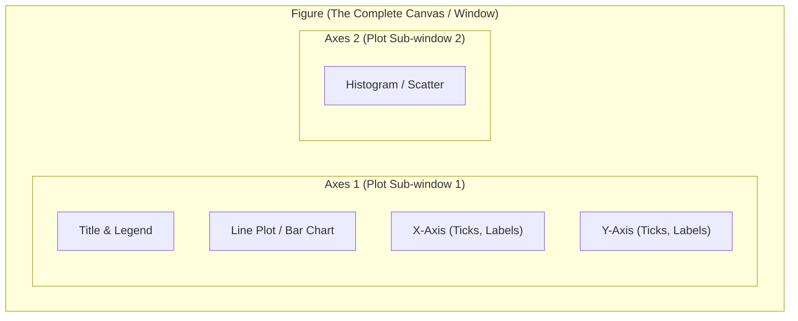

# 📊 Matplotlib: Data Visualization & Financial Plotting

## 1. What is Matplotlib & Why Does It Exist?

### Simple Language Mein:
> "Data ko tables ya numbers mein dekh kar human brain patterns quickly catch nahi kar pata. Agar fraud transactions spike ho rahe hain ya monthly card spending badh rahi hai, toh **Visual Charts** sabse tezi se insights dete hain.
> 
> **Matplotlib** Python ki foundational 2D plotting library hai. pandas ke internal visualization methods (`df.plot()`) aur Seaborn sabhi under the hood Matplotlib par hi chalte hain."

---

## 2. The Anatomy of a Figure: Figure vs Axes vs Axis



> [!IMPORTANT]
> ### 📇 Flashcard: Figure vs Axes
> - **Figure:** Complete image ya canvas (page size, background).
> - **Axes:** Actual graph ya plotting area (jisme x-axis, y-axis, lines, bars, title hote hain). Ek Figure mein multiple Axes (subplots) ho sakte hain!
> - **Axis:** Specific number line (X-axis horizontal ya Y-axis vertical jo ticks aur limits define karti hai).

---

## 3. Two Interfaces: Pyplot (Stateful) vs Object-Oriented API

### Approach A: Pyplot Interface (`plt.plot`)
*Matlab-style global state machine. Simple scripts ke liye theek hai, lekin complex subplots mein confusing hota hai:*
```python
import matplotlib.pyplot as plt

plt.plot([1, 2, 3], [10, 20, 25])
plt.title("Simple Line")
# plt.show()
```

### Approach B: Object-Oriented API (`fig, ax = plt.subplots()`) — RECOMMENDED!
*Explicitly Figure aur Axes objects banate hain. Production dashboards aur multi-panel charts ke liye industry standard hai:*
```python
fig, ax = plt.subplots(figsize=(8, 4)) # Width: 8 inches, Height: 4 inches
ax.plot([1, 2, 3], [10, 20, 25], color="darkred", marker="o", label="Daily Spend")
ax.set_title("IDFC Customer Spend Trend", fontsize=14, fontweight="bold")
ax.set_xlabel("Days")
ax.set_ylabel("Amount (₹)")
ax.legend()
ax.grid(True, linestyle="--", alpha=0.6)
# fig.savefig("spend_trend.png")
```

---

## 4. The 5 Essential Chart Types in Banking

```python
import matplotlib.pyplot as plt
import numpy as np

# Sample Data
categories = ["Food", "Shopping", "Travel", "Utilities", "Healthcare"]
spend = [18500, 42000, 12500, 8400, 15000]
months = ["Jan", "Feb", "Mar", "Apr", "May"]
monthly_inflow = [50000, 52000, 48000, 65000, 70000]
tx_amounts = np.random.exponential(scale=2500, size=500)

# Create 2x2 multi-panel figure
fig, axes = plt.subplots(2, 2, figsize=(12, 8))

# 1. Line Chart: Time-Series Trend
axes[0, 0].plot(months, monthly_inflow, marker="s", color="#9b1c1c", linewidth=2)
axes[0, 0].set_title("Monthly Salary Inflow Trend")
axes[0, 0].grid(True)

# 2. Bar Chart: Categorical Comparison
axes[0, 1].bar(categories, spend, color="#2b6cb0")
axes[0, 1].set_title("Spend by Merchant Category")
axes[0, 1].tick_params(axis="x", rotation=30)

# 3. Histogram: Distribution of Transaction Amounts
axes[1, 0].hist(tx_amounts, bins=25, color="#38a169", edgecolor="black")
axes[1, 0].set_title("Transaction Value Distribution")
axes[1, 0].set_xlabel("Amount (₹)")

# 4. Scatter Plot: Transaction Amount vs Fraud Risk Score
risk_scores = np.random.uniform(0, 100, 500)
axes[1, 1].scatter(tx_amounts, risk_scores, alpha=0.5, color="#d69e2e")
axes[1, 1].set_title("Amount vs Anomaly Risk Score")
axes[1, 1].set_xlabel("Amount")
axes[1, 1].set_ylabel("Risk (0-100)")

plt.tight_layout() # Prevents label overlapping!
# plt.savefig("dashboard.png")
```

---

## 5. Matplotlib Interview Question Bank (20 Questions)

1. **Figure aur Axes mein kya difference hai?**  
   *Answer:* Figure pura outer canvas/window hota hai; Axes actual plot area hota hai jisme data points, ticks, aur labels render hote hain.
2. **Why is the Object-Oriented API (`fig, ax = plt.subplots()`) preferred over `plt.plot()`?**  
   *Answer:* OO API explicit references deta hai, multiple subplots ko cleanly manage karta hai, aur global state bugs avoid karta hai.
3. **What is the purpose of `plt.tight_layout()`?**  
   *Answer:* Automatically adjusts subplots padding to prevent overlapping titles and axis labels.
4. **How do you save a chart as an image without showing a GUI popup window?**  
   *Answer:* `fig.savefig('chart.png', dpi=300, bbox_inches='tight')`.
5. **How do you run Matplotlib on a headless Linux server without a display/monitor?**  
   *Answer:* Use non-interactive backend before importing pyplot:
   ```python
   import matplotlib
   matplotlib.use('Agg')
   import matplotlib.pyplot as plt
   ```
6. **When should you use a Histogram vs a Bar Chart?**  
   *Answer:* Bar chart categorical discrete data compare karta hai (e.g., spending by category); Histogram continuous numerical data ki frequency distribution dikhata hai (e.g., frequency of amounts between ₹100 and ₹1,000).
7. **What is the difference between a Scatter plot and a Line plot?**
8. **How do you add annotations or callout text to highlight an outlier on a plot?**  
   *Answer:* `ax.annotate('Suspicious Spike!', xy=(x, y), xytext=(x+1, y+500), arrowprops=dict(facecolor='red'))`.
9. **How do you plot twin axes (e.g., primary Y-axis for Transaction Volume and secondary Y-axis for Fraud Percentage)?**  
   *Answer:* `ax2 = ax1.twinx()`.
10. **What parameter controls marker transparency in scatter plots to handle overplotting?**  
    *Answer:* `alpha` parameter (e.g., `alpha=0.3`).
11. **How do you customize X-axis date formatting in time-series plots?**  
    *Answer:* `import matplotlib.dates as mdates; ax.xaxis.set_major_formatter(mdates.DateFormatter('%b %Y'))`.
12. **How do you rotate tick labels so they don't overlap?**  
    *Answer:* `ax.tick_params(axis='x', rotation=45)` or `plt.xticks(rotation=45)`.
13. **How do you plot a horizontal bar chart?**  
    *Answer:* `ax.barh(categories, values)`.
14. **How do you change the color palette or style sheet in Matplotlib?**  
    *Answer:* `plt.style.use('seaborn-v0_8-whitegrid')` or `plt.style.use('ggplot')`.
15. **What is a Box Plot (`ax.boxplot()`) and what 5 summary metrics does it display?**  
    *Answer:* Minimum, 25th percentile (Q1), Median, 75th percentile (Q3), Maximum, and Outliers beyond 1.5 * IQR.
16. **How do you add a horizontal benchmark line across a chart?**  
    *Answer:* `ax.axhline(y=50000, color='red', linestyle='--')`.
17. **How do you control the resolution of saved image files?**  
    *Answer:* The `dpi` parameter in `savefig()` (e.g., `dpi=300` for publication/print quality).
18. **How do you close figures to prevent memory leaks in long-running services?**  
    *Answer:* `plt.close(fig)` or `plt.close('all')`. If you don't close figures in a loop, memory keeps accumulating in the GUI backend.
19. **How do you create a pie chart with percentage labels displayed?**  
    *Answer:* `ax.pie(values, labels=labels, autopct='%1.1f%%')`.
20. **How does pandas integrate with Matplotlib?**  
    *Answer:* `df.plot(kind='bar', ax=ax)` directly attaches pandas plot rendering onto existing Matplotlib Axes objects.
