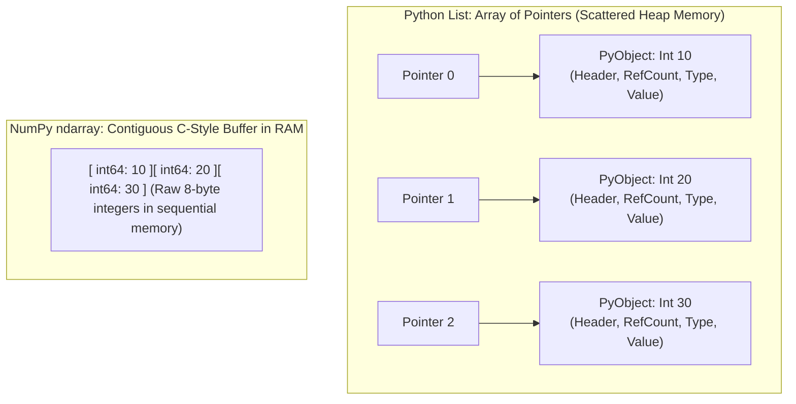
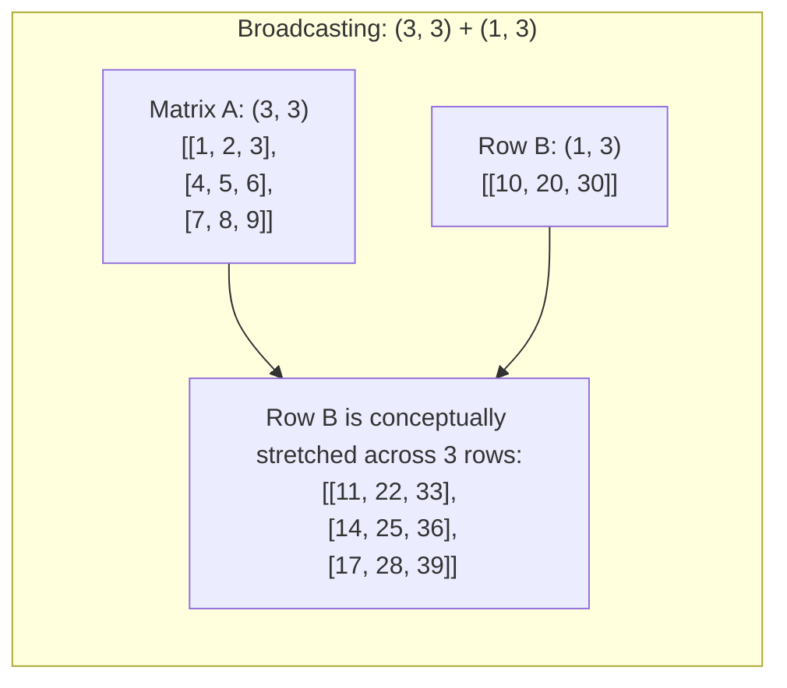

# 🔢 NumPy: Numerical Computing & Vectorized Operations

## 1. What is NumPy & Why Does It Exist?

### Simple Language Mein:
> "Python ke normal `list` mein agar hum 10 million numbers ka sum karein ya unhe 2 se multiply karein, toh Python ka loop bohot slow chalta hai kyunki Python har element ke liye type checking karta hai aur memory mein pointers follow karta hai.
> 
> **NumPy (Numerical Python)** C-language mein likhi hui library hai jo numerical data ko **contiguous block of memory** mein store karti hai aur CPU ke hardware instructions (**SIMD - Single Instruction Multiple Data**) use karke ek saath hazaron calculations karti hai bina kisi Python loop ke. Isi ko **Vectorization** kehte hain."

---

## 2. NumPy ndarray vs Python List



| Feature | Python Standard `list` | NumPy `ndarray` |
| :--- | :--- | :--- |
| **Memory Layout** | Pointers to individual heap objects | **Contiguous raw memory block** |
| **Data Types** | Heterogeneous (can mix `int`, `str`, `dict`) | **Homogeneous** (all elements share exact same `dtype`) |
| **Performance** | Slow (Type checking & pointer dereferencing) | **Blazing fast** (Compiled C code + CPU SIMD vectorization) |
| **Memory Size** | High overhead (~28 bytes per integer) | Minimal (8 bytes for `int64`, 4 bytes for `float32`) |
| **Operations** | `list * 2` duplicates list (`[1, 2] * 2 = [1, 2, 1, 2]`) | `arr * 2` multiplies every element (`[2, 4]`) |

---

## 3. Core Concepts: Dimensions, Shape, Size, Dtype & Axis

```python
import numpy as np

# 2D Array: Shape (2, 3) -> 2 rows, 3 columns
matrix = np.array([
    [10, 20, 30],
    [40, 50, 60]
], dtype=np.float64)

print("Shape:", matrix.shape)  # (2, 3)
print("Dimensions:", matrix.ndim) # 2 (2D array)
print("Total Elements (Size):", matrix.size) # 6
print("Data Type:", matrix.dtype) # float64
```

### The "Axis" Concept Demystified:
> "2D array mein:
> - **`axis=0`** hamesha **Rows ke across vertical direction** mein operate karta hai (Column-wise result deta hai).
> - **`axis=1`** hamesha **Columns ke across horizontal direction** mein operate karta hai (Row-wise result deta hai)."

```python
# Sum along axis=0 (Down the columns):
print(np.sum(matrix, axis=0)) # [10+40, 20+50, 30+60] -> [50., 70., 90.]

# Sum along axis=1 (Across the rows):
print(np.sum(matrix, axis=1)) # [10+20+30, 40+50+60] -> [60., 150.]
```

---

## 4. Creating NumPy Arrays

```python
# 1. Direct from list
a = np.array([1, 2, 3])

# 2. Zeros and Ones (Allocation without garbage data)
zeros = np.zeros((3, 4)) # 3 rows, 4 columns of 0.0
ones = np.ones((2, 3), dtype=np.int32) # 2x3 matrix of 1s

# 3. arange: Like range() but returns ndarray (start, stop, step)
seq = np.arange(10, 50, 5) # [10, 15, 20, 25, 30, 35, 40, 45]

# 4. linspace: Linear spacing (start, stop, num_points)
# Great for financial curves and probability distributions
curve = np.linspace(0.0, 1.0, 5) # [0.0, 0.25, 0.5, 0.75, 1.0]

# 5. Identity Matrix: Diagonal 1s, rest 0s
eye_matrix = np.eye(3) # 3x3 identity matrix
```

---

## 5. Array Operations: Reshaping, Slicing & Views vs Copies

### Slicing & The "View" Trap:
> "NumPy mein slice lene par data copy nahi hota; woh original array ka **View (Window)** hota hai. Agar view modify karoge, toh original array bhi change ho jayega!"

```python
arr = np.array([10, 20, 30, 40, 50])
view_slice = arr[1:4] # Elements: [20, 30, 40]
view_slice[0] = 999   # Modifying the view!
print(arr) # [10, 999, 30, 40, 50] -> ORIGINAL ARRAY MUTATED!

# Explicit Copy (Safe):
safe_copy = arr[1:4].copy()
safe_copy[0] = 777
print(arr[1]) # 999 (Original remains untouched)
```

### Reshaping & Flattening:
```python
orig = np.arange(12) # [0, 1, 2, ... 11]

# Reshape to 3x4 matrix
reshaped = orig.reshape(3, 4)

# Reshape with -1 (NumPy automatically calculates the remaining dimension!)
auto_reshaped = orig.reshape(2, -1) # Shape becomes (2, 6)

# Flattening: flatten() vs ravel()
# flatten() hamesha naya copy banata hai
flat_copy = reshaped.flatten()

# ravel() view return karne ki koshish karta hai (zero memory copy!)
flat_view = reshaped.ravel()
```

---

## 6. Vectorization: Why It Beats Python Loops by 50x

### Code Benchmark: Python Loop vs NumPy Vectorization
```python
import time

size = 5_000_000
py_list = list(range(size))
np_arr = np.arange(size)

# Test 1: Python Loop
start = time.time()
py_result = [x * 2 for x in py_list]
py_time = time.time() - start

# Test 2: NumPy Vectorization
start = time.time()
np_result = np_arr * 2
np_time = time.time() - start

print(f"Python List Loop: {py_time:.4f} seconds")
print(f"NumPy Vectorized: {np_time:.4f} seconds")
print(f"Speedup: {py_time / np_time:.1f}x FASTER!")
# Output: NumPy is typically 40x to 80x faster!
```

**Kyu fast hai?**
1. C-level loop runs inside CPU registers without Python bytecode overhead.
2. Hardware prefetching: Contiguous bytes sequentially load into L1/L2 cache without cache misses.
3. SIMD (AVX-512): Single CPU instruction multiplies 8 floating-point numbers in a single clock cycle.

---

## 7. Broadcasting Rules (The Most Asked NumPy Concept)

### Simple Language Mein:
> "Broadcasting ek aisa rule hai jiske through NumPy alag-alag shapes ke arrays par arithmetic operations perform karne deta hai bina memory mein extra copy banaye."



### The Two Strict Rules of Broadcasting:
Piche se (from trailing dimensions to leading dimensions) compare karo:
1. Dono dimensions **equal** honi chahiye, **OR**
2. Kisi ek dimension ka size **1** hona chahiye.
Agar dimension 1 hai, toh woh doosre array ke dimension se match karne ke liye virtual stretch (replicate) ho jata hai.

```python
# Example: Adding a scalar (Shape: ()) to a 2D matrix (Shape: (2, 2))
mat = np.array([[1, 2], [3, 4]])
result = mat + 10 # 10 broadcasts to [[10, 10], [10, 10]]
# Result: [[11, 12], [13, 14]]
```

---

## 8. Boolean Indexing (Filtering Data)

```python
# Banking Transaction Amounts:
transactions = np.array([250.0, 12000.0, 450.0, 95000.0, 3200.0, 78000.0])

# Step 1: Boolean mask create karo
mask = transactions >= 50000.0
print(mask) # [False, False, False,  True, False,  True]

# Step 2: Mask se filter karo
suspicious_high_txns = transactions[mask]
print(suspicious_high_txns) # [95000., 78000.]

# Compound filtering (& for AND, | for OR, ~ for NOT):
flagged = transactions[(transactions >= 1000) & (transactions <= 80000)]
```

---

## 9. NumPy Interview Question Bank (40+ Questions)

### Part A: 20 Conceptual Questions
1. **NumPy array aur Python list mein 3 fundamental differences kya hain?**  
   *Answer:* Contiguous vs pointer memory, homogeneous vs heterogeneous types, element-wise vectorized arithmetic vs repetition.
2. **NumPy ka `ndarray` internal structure kaisa hota hai?**  
   *Answer:* Ek data pointer (raw memory), `dtype`, `shape` tuple, aur `strides` tuple (bytes to step to reach next element along each dimension).
3. **What is a Strides tuple in NumPy?**  
   *Answer:* Har dimension mein agle element tak jump karne ke liye kitne bytes aage badhna hai. Example: Shape `(2, 3)` ke `int64` array ke strides `(24, 8)` hote hain.
4. **Difference between `np.copy()` and View?**
5. **What is Broadcasting and what are its two mathematical conditions?**
6. **What is Vectorization and why does it avoid the Global Interpreter Lock (GIL)?**
7. **Explain the difference between `axis=0` and `axis=1` in a 2D matrix.**
8. **What does `reshape(3, -1)` do?**
9. **Difference between `np.zeros()` and `np.empty()`?**  
   *Answer:* `zeros` memory ko 0 se initialize karta hai; `empty` uninitialized garbage RAM points return karta hai (slightly faster, but dangerous).
10. **Difference between `arr.flatten()` and `arr.ravel()`?**
11. **How does boolean indexing work under the hood?**
12. **Can a NumPy array contain multiple data types? What happens if you pass `[1, "IDFC", 3.5]`?**  
    *Answer:* Automatic type upcasting happens. Saare elements string (`<U21`) ban jayenge.
13. **What is SIMD and how does NumPy utilize it?**
14. **How do you find the memory footprint of an array?** (`arr.nbytes` or `arr.size * arr.itemsize`).
15. **What is the difference between `np.dot()` and `*` operator on two 2D arrays?**  
    *Answer:* `*` element-wise multiplication karta hai; `np.dot()` / `@` linear algebra matrix multiplication karta hai.
16. **How does `np.nan` behave in comparisons (`np.nan == np.nan`)?**  
    *Answer:* `False`! Always use `np.isnan(val)`.
17. **What is the purpose of `np.linspace()` versus `np.arange()`?**
18. **What is Fancy Indexing in NumPy?**
19. **How do you replace values in an array conditioned on a boolean predicate?** (`np.where(condition, x, y)`).
20. **Why is `np.sum(arr)` faster than Python's built-in `sum(arr)` on a NumPy array?**

### Part B: 10 Coding Questions
1. **Normalize Array:** Given a 1D array of account balances, scale them between 0 and 1: `(arr - arr.min()) / (arr.max() - arr.min())`.
2. **Find Indices of Outliers:** Return indices of transactions that are 3 standard deviations away from the mean: `np.where(np.abs(arr - np.mean(arr)) > 3 * np.std(arr))[0]`.
3. **Count Non-Zero Elements:** `np.count_nonzero(arr)`.
4. **Extract Diagonal Elements:** `np.diag(matrix)`.
5. **Clip Values (Upper and Lower bounds):** Restrict transaction amounts between ₹100 and ₹50,000: `np.clip(arr, 100, 50000)`.
6. **Reverse Array In-Place:** `arr[::-1]` (view) or `np.flip(arr)`.
7. **Find Most Frequent Value in Array:** `vals, counts = np.unique(arr, return_counts=True); vals[np.argmax(counts)]`.
8. **Replace all NaN with Mean:** `arr[np.isnan(arr)] = np.nanmean(arr)`.
9. **Matrix Multiplication:** `C = A @ B` or `np.matmul(A, B)`.
10. **Compute Moving / Rolling Average using convolution:** `np.convolve(arr, np.ones(window)/window, mode='valid')`.

### Part C: 10 Comparison Questions
1. `list.append()` vs `np.append()`? (Note: `np.append` creates a brand new array every time; never use it in a loop!).
2. `np.concatenate` vs `np.vstack` vs `np.hstack`?
3. In-place operation (`arr += 1`) vs new assignment (`arr = arr + 1`)?
4. `np.mean()` vs `np.nanmean()`?
5. `np.argmax()` vs `np.max()`?
6. Deep copy vs shallow view in multi-dimensional slicing?
7. Integer array indexing vs boolean mask indexing?
8. Memory footprint: 1,000,000 Python ints vs 1,000,000 `np.int32`? (~28MB vs 4MB).
9. Memory order: C-contiguous (row-major) vs Fortran-contiguous (column-major)?
10. `np.ascontiguousarray()` kab use karte hain?
