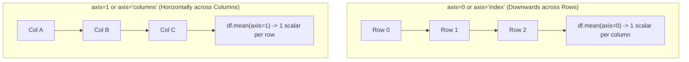
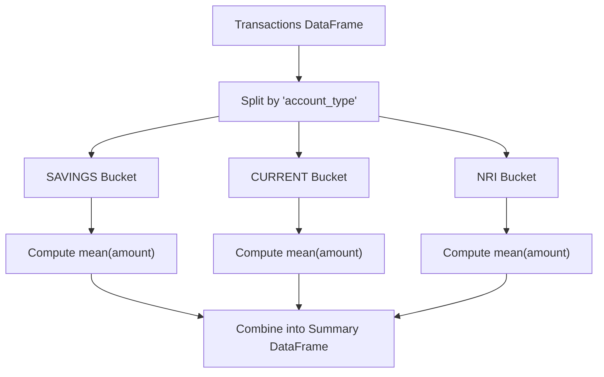

# 🐼 Complete pandas Mastery: Data School Q&A Curriculum (38 Videos)

> **Source Verification:** Structured directly from Kevin Markham's (Data School) renowned 38-video YouTube series: *"Easier data analysis in Python with pandas"* ([Playlist `PL5-da3qGB5ICCsgW1MxlZ0Hq8LL5U3u9y`](https://www.youtube.com/playlist?list=PL5-da3qGB5ICCsgW1MxlZ0Hq8LL5U3u9y)).
> Includes 100% topic coverage, banking/fintech production scenarios, Hinglish mental models, memory optimization, and IDFC FIRST Bank interview questions.

---

## 📋 Master Traceability Matrix (Videos 1 to 38)

| # | Video Title | Length | Concepts Covered | Curriculum Chapter |
| :---: | :--- | :---: | :--- | :---: |
| **1** | What is pandas? | 6:24 | Tabular data representation, 1D vs 2D, NumPy relationship | Chapter 1 |
| **2** | How do I read a tabular data file into pandas? | 8:54 | `read_csv()`, `sep`, `header`, `names`, `skiprows`, `nrows` | Chapter 1 |
| **3** | How do I select a pandas Series from a DataFrame? | 11:10 | Bracket vs dot notation, Series extraction, column concatenation | Chapter 1 |
| **4** | Why do some pandas commands end with parentheses (and others don't)? | 8:45 | Methods (actions) vs Attributes (state metadata) | Chapter 1 |
| **5** | How do I rename columns in a pandas DataFrame? | 9:36 | `rename(columns={...})`, `df.columns = [...]`, `str.replace()` | Chapter 2 |
| **6** | How do I remove columns from a pandas DataFrame? | 6:35 | `df.drop()`, `axis=1`, multi-column drop, row drop (`axis=0`) | Chapter 2 |
| **7** | How do I sort a pandas DataFrame or a Series? | 8:56 | `Series.sort_values()`, multi-column sort, ascending flags | Chapter 3 |
| **8** | How do I filter rows of a pandas DataFrame by column value? | 13:44 | Boolean indexing, masking, comparison operators | Chapter 3 |
| **9** | How do I apply multiple filter criteria to a pandas DataFrame? | 9:51 | Logical `&`, `|`, parentheses requirement, `.isin()` operator | Chapter 3 |
| **10** | Your pandas questions answered! (Part 1) | 9:06 | `usecols`, `nrows`, `iterrows` performance trap, `select_dtypes` | Chapter 3 |
| **11** | How do I use the "axis" parameter in pandas? | 8:33 | `axis=0` (down rows) vs `axis=1` (across columns), row/col stats | Chapter 2 |
| **12** | How do I use string methods in pandas? | 6:16 | `.str` accessor, `upper()`, `contains()`, `replace()`, regex | Chapter 4 |
| **13** | How do I change the data type of a pandas Series? | 7:28 | `astype()`, currency cleaning, `pd.to_numeric(errors='coerce')` | Chapter 5 |
| **14** | When should I use a "groupby" in pandas? | 8:24 | Split-Apply-Combine, aggregation functions, `.agg(['min', 'max'])` | Chapter 10 |
| **15** | How do I explore a pandas Series? | 9:50 | `describe()`, `value_counts(normalize=True)`, `nunique()`, `crosstab` | Chapter 6 |
| **16** | How do I handle missing values in pandas? | 14:27 | `isna()`, `dropna(how='any'|'all')`, `fillna()`, `bfill`/`ffill` | Chapter 7 |
| **17** | What do I need to know about the pandas index? (Part 1) | 13:36 | Index as identifier, selection anchor, alignment in math | Chapter 8 |
| **18** | What do I need to know about the pandas index? (Part 2) | 10:38 | Alignment mechanics (`s1 + s2`), `set_index()`, `reset_index()` | Chapter 8 |
| **19** | How do I select multiple rows and columns from a pandas DataFrame? | 21:46 | `loc` (labels, inclusive) vs `iloc` (integers, exclusive), `ix` deprecation | Chapter 9 |
| **20** | When should I use the "inplace" parameter in pandas? | 10:18 | `inplace=True` performance myth, chaining advantages | Chapter 9 |
| **21** | How do I make my pandas DataFrame smaller and faster? | 19:05 | `info(memory_usage='deep')`, `category` dtype, integer codes | Chapter 11 |
| **22** | How do I use pandas with scikit-learn to create Kaggle submissions? | 13:25 | Feature matrix `X`, target `y`, `.values`, test set alignment | Chapter 13 |
| **23** | More of your pandas questions answered! (Part 2) | 19:23 | `df.sample()`, `Series.interpolate()`, train/test splits | Chapter 7 & 15 |
| **24** | How do I create dummy variables in pandas? | 13:13 | `pd.get_dummies()`, `drop_first=True`, dummy variable trap | Chapter 13 |
| **25** | How do I work with dates and times in pandas? | 10:20 | `pd.to_datetime()`, `.dt` accessor, date filtering, timedeltas | Chapter 12 |
| **26** | How do I find and remove duplicate rows in pandas? | 9:47 | `duplicated(keep='first'|'last'|False)`, `drop_duplicates()` | Chapter 13 |
| **27** | How do I avoid a SettingWithCopyWarning in pandas? | 13:29 | Chained assignment vs `.loc`, Views vs Copies, `.copy()` fix | Chapter 9 |
| **28** | How do I change display options in pandas? | 14:55 | `pd.set_option()`, `max_rows`, `max_columns`, `precision` | Chapter 14 |
| **29** | How do I create a pandas DataFrame from another object? | 14:25 | Dict of lists, list of dicts, 2D NumPy array constructor | Chapter 14 |
| **30** | How do I apply a function to a pandas Series or DataFrame? | 17:57 | `Series.map()`, `Series.apply()`, `df.apply(axis=0|1)`, `df.map()` | Chapter 14 |
| **31** | **Bonus:** How do I use the MultiIndex in pandas? | 25:00 | Hierarchical indexing, `unstack()`, `stack()`, cross-section `.xs()` | Chapter 15 |
| **32** | **Bonus:** How do I merge DataFrames in pandas? | 21:48 | `pd.merge()`, inner/left/right/outer, `indicator=True`, `validate` | Chapter 15 |
| **33** | **Bonus:** 4 new time-saving tricks in pandas | 14:50 | `df.query()`, `df.select_dtypes()`, string methods in accessors | Chapter 15 |
| **34** | **Bonus:** 5 new changes in pandas you need to know about | 20:54 | Deprecations, copy-on-write, nullable integer dtypes | Chapter 9 & 15 |
| **35** | **Bonus:** My top 25 pandas tricks | 27:37 | `df.explode()`, `pd.cut()`, `pd.qcut()`, `Series.clip()`, `style` | Chapter 15 |
| **36** | **Bonus:** 21 more pandas tricks | 24:39 | `pd.read_clipboard()`, filtering with regex, profile inspection | Chapter 15 |
| **37** | **Bonus:** Data Science Best Practices with pandas (PyCon 2019) | 1:44:16 | Method chaining with `.pipe()`, avoiding `apply()` traps | Chapter 15 |
| **38** | **Bonus:** Your pandas questions answered! (Live Webcast) | 1:56:01 | Enterprise performance tuning, handling multi-GB ledgers | Chapter 15 |

---

## Chapter 1: Foundations, Ingestion & Inspection (Videos 1–4)

### 🧠 1. Core Architecture: Series vs DataFrame
A **Series** is a 1D labeled array capable of holding any data type. It is essentially a column of data accompanied by an explicit, immutable row label index.
A **DataFrame** is a 2D labeled tabular data structure with columns of potentially different types. You can conceptualize a DataFrame as a collection of Series objects that share a common index.

### 🗣️ Hinglish Mental Model
> "NumPy ko samjho raw C-style array: fast hai par labeled nahi hai. **pandas** uske upar ek intelligent metadata layer banata hai.
> 
> Series ek single column hai with row labels. Jab multiple Series ek hi index share karte hain, toh wo **DataFrame** ban jate hain (jaise SQL table ya Excel sheet)."

### 💻 Syntax & Reading Tabular Data
```python
import pandas as pd
import numpy as np

# Video 1 & 2: Reading delimited files
# Default read_csv assumes comma separation and row 0 as header
df_orders = pd.read_csv("data/chipotle.tsv", sep='\t')

# Reading file with NO header and custom column names
user_cols = ['user_id', 'age', 'gender', 'occupation', 'zip_code']
df_users = pd.read_csv("data/u.user", sep='|', header=None, names=user_cols)

# Ingestion Subsetting (Optimizing memory during read)
df_sample = pd.read_csv("data/u.user", sep='|', names=user_cols, usecols=['user_id', 'age'], nrows=50)
```

### 💻 Selecting Columns & Creating Features (Video 3)
```python
# Bracket notation (Universal & Recommended)
cities = df_orders['item_name']

# Dot notation (Convenient, BUT fails if column name has spaces or matches DataFrame methods)
cities = df_orders.item_name

# Creating a new combined column (MUST use bracket notation!)
df_orders['order_summary'] = df_orders['quantity'].astype(str) + "x " + df_orders['item_name']
```

### 🔍 Methods vs Attributes Rule (Video 4)
Why does `df.shape` have no parentheses, but `df.head()` does?
- **Attributes (No parentheses `()`):** Describe properties or state that the DataFrame *already has* stored in memory:
  `df.shape` (returns `(rows, cols)`), `df.dtypes` (data types), `df.columns` (headers), `df.index`.
- **Methods (Require parentheses `()`):** Action verbs that *perform an action, calculation, or transformation*:
  `df.head()` (slice top rows), `df.describe()` (compute summary statistics), `df.mean()` (aggregate).

### ⚠️ Common Traps
1. **Dot Notation for Assignment:** Writing `df.new_col = [1, 2, 3]` will NOT create a DataFrame column! It merely monkey-patches an attribute onto the Python object. Always use `df['new_col'] = ...`.
2. **Column Name Collisions:** If a column is named `'count'`, `df.count` accesses the built-in method `DataFrame.count()`, not your data!

### ❓ Interview Questions & Follow-ups
- **Q:** *"Why does pandas use a separate Series structure instead of standard 1D NumPy arrays?"*
  **A:** While a 1D NumPy array is homogenous and indexed purely by integer offsets, a pandas Series attaches a labeled index, supports heterogeneous data via object pointers, handles `NaN` missing values without crashing, and implements automatic alignment during arithmetic operations.
- **Follow-up:** *"What is the memory overhead of a pandas Series vs a NumPy array?"*
  **A:** A NumPy int64 array requires exactly 8 bytes per element in contiguous memory. A pandas Series stores the NumPy array plus an Index object (typically an `Index` or `RangeIndex` with hash map lookups), adding metadata overhead. For string columns, pandas historically stored pointers to Python string objects, incurring up to 5x-8x memory overhead compared to raw C char arrays.

---

## Chapter 2: Schema Manipulation, Renaming & Axis Mechanics (Videos 5, 6, 11)

### 🧠 Concept: Renaming & Dropping Dimensions
Modifying column headers and discarding unneeded rows or columns is the first step in financial ETL pipelines.
Understanding the `axis` parameter is fundamental: operations in pandas can execute vertically down rows (`axis=0` / `'index'`) or horizontally across columns (`axis=1` / `'columns'`).

### 🗣️ Hinglish Mental Model
> "`axis=0` ka matlab hai: **Rows ke along travel karo (Downwards)**. Jab aap `df.drop(0, axis=0)` karte ho, toh wo row 0 ko drop karta hai. Jab aap `df.mean(axis=0)` karte ho, toh wo saari rows ko collapse karke har column ka 1 average deta hai.
> 
> `axis=1` ka matlab hai: **Columns ke along travel karo (Horizontally)**. `df.drop('amount', axis=1)` column ko drop karta hai. `df.mean(axis=1)` har row ke liye horizontally columns ka average nikalta hai."



### 💻 Syntax & Code Examples (Videos 5, 6, 11)
```python
import pandas as pd

# Method 1: Selective rename via Dictionary (Safest)
df.rename(columns={'Txn Ref': 'txn_ref', 'Amt (INR)': 'amount'}, inplace=True)

# Method 2: Bulk column rename (Overwriting df.columns)
df.columns = ['txn_id', 'vpa', 'amount', 'timestamp', 'status']

# Method 3: Clean string headers with regex (Production Best Practice)
df.columns = df.columns.str.strip().str.lower().str.replace(' ', '_')

# Dropping columns (axis=1)
df.drop(['vpa', 'status'], axis=1, inplace=True)

# Dropping rows by label index (axis=0)
df.drop([0, 1, 5], axis=0, inplace=True)

# The Axis Invariant in Math:
df_financials = pd.DataFrame({
    'q1_profit': [100, 200],
    'q2_profit': [150, 250]
})
# Column-wise average (1 scalar per quarter across all branches):
quarterly_mean = df_financials.mean(axis=0) # or axis='index'

# Row-wise average (1 scalar per branch across both quarters):
branch_mean = df_financials.mean(axis=1)    # or axis='columns'
```

### ⚠️ Common Traps
- Forgetting `axis=1` when dropping columns: `df.drop('my_col')` defaults to `axis=0` and throws `KeyError: "['my_col'] not found in axis"` because pandas searched for a *row* labeled `'my_col'`.

---

## Chapter 3: Sorting, Boolean Filtering & Set Operations (Videos 7–10)

### 🧠 Concept: Boolean Indexing & Predicate Pushdown
Boolean indexing filters a DataFrame by passing a Series of `True`/`False` values matching the length of the DataFrame.

### 🗣️ Hinglish Mental Model
> "Boolean filtering SQL ke `WHERE` clause jaisa hai.
> 
> Python ka standard `and` / `or` pure object ki truth value dekhta hai, isliye pandas Series par fail ho jata hai (`ValueError: Truth value of Series is ambiguous`).
> Pandas mein hamesha bitwise `&` (AND) aur `|` (OR) use karo, aur **har individual condition ko brackets `(...)` mein wrap karna compulsory hai** kyunki Python mein bitwise operators ki precedence comparison operators (`>`, `==`) se higher hoti hai!"

### 💻 Syntax & Multi-Criteria Filtering
```python
# Video 7: Multi-column sorting
df.sort_values(by=['branch_id', 'amount'], ascending=[True, False], inplace=True)

# Video 8: Single Boolean Filter
high_value = df[df['amount'] >= 50000]

# Video 9: Multiple Filter Criteria (& and |)
# WRONG: df[df.amount >= 50000 and df.status == 'SUCCESS']  -> CRASHES!
# CORRECT:
flagged_txns = df[(df['amount'] >= 50000) & (df['status'] == 'FAILED')]

# Set Membership with .isin() (Cleaner and faster than multiple OR conditions)
top_metro_txns = df[df['city'].isin(['Mumbai', 'Bengaluru', 'Delhi', 'Chennai'])]

# Inverse filter (NOT in set via tilde ~ operator)
non_metro = df[~df['city'].isin(['Mumbai', 'Bengaluru', 'Delhi'])]
```

### 💻 Ingestion Performance & Memory Control (Video 10)
```python
# Reading only necessary columns drastically saves memory on multi-GB files
df_light = pd.read_csv("transactions_2026.csv", usecols=['txn_id', 'amount', 'status'], nrows=100000)

# Iteration Performance Trap:
# BAD (100x slower):
# for idx, row in df.iterrows(): ...
# GOOD (Vectorized):
df['tax'] = df['amount'] * 0.18
```

---

## Chapter 4: Vectorized String Operations (`.str` Accessor) (Video 12)

### 🧠 Concept: Vectorized String Processing
Python's standard string methods (`.upper()`, `.split()`) only work on individual string scalars. The `.str` accessor allows these methods to be applied element-wise across an entire pandas Series without manual Python `for` loops.

### 🗣️ Hinglish Mental Model
> "Agar aap `df['vpa'].upper()` likhoge toh error aayega kyunki Series par direct string method nahi hota.
> `.str` ek bridge hai jo Series ke har element par string method vectorize karke run karta hai: `df['vpa'].str.upper()`."

### 💻 Banking Examples & Pattern Extraction
```python
# Sample Banking Dataset
df = pd.DataFrame({
    'vpa': ['rohan@okhdfcbank', 'priya@icici', 'amit@idfcbank'],
    'narration': ['UPI/409210/Transfer to Sharma', 'NEFT/5512/Salary Oct', 'IMPS/9912/Vendor Bill'],
    'dirty_amount': [' INR 5,000.00 ', ' INR 12,450.50 ', ' INR 750.00 ']
})

# 1. Pattern Matching & Filtering
is_idfc = df['vpa'].str.contains('idfc', case=False)

# 2. String Splitting & Accessing Components
# Extract UPI PSP handle (the domain after '@')
df['psp_handle'] = df['vpa'].str.split('@').str[1] # .str[1] gets second element of each split list!

# 3. String Cleansing & Stripping
df['clean_amount'] = (
    df['dirty_amount']
    .str.replace('INR', '')
    .str.replace(',', '')
    .str.strip()
    .astype(float)
)
```

---

## Chapter 5: Data Types, Casting & Coercion (Video 13)

### 🧠 Concept: Dtype Casting & Error Coercion
Data imported from text or CSV files often defaults to `object` (string) due to dirty characters or corrupted rows. Converting to native numeric dtypes is mandatory before performing mathematical or statistical operations.

### 💻 Syntax & Error Coercion
```python
# Standard Type Casting
df['account_id'] = df['account_id'].astype(str) # Prevents treating IDs as math numbers
df['is_flagged'] = df['flag_code'].astype(bool)

# The Coercion Superpower: pd.to_numeric
# Suppose an amount column has dirty strings like 'UNKNOWN', 'ERROR', 'REFUND'
raw_amounts = pd.Series(['100.50', '250.00', 'CORRUPT_DATA', '450.75'])

# errors='coerce' turns unparseable values into NaN instead of crashing!
clean_amounts = pd.to_numeric(raw_amounts, errors='coerce')
# Result: [100.50, 250.00, NaN, 450.75]
```

---

## Chapter 6: Series Exploration & Univariate Analysis (Video 15)

### 🧠 Concept: Descriptive Statistics & Frequency Distributions
Univariate inspection allows rapid verification of value distributions, card fraud velocity, and categorical proportions.

### 💻 Syntax & Examples
```python
# Summary statistics for numeric Series (count, mean, std, min, 25%, 50%, 75%, max)
df['amount'].describe()

# Frequency counts of categorical column
channel_counts = df['channel'].value_counts()

# Proportional / Percentage breakdown (normalize=True)
channel_percentages = df['channel'].value_counts(normalize=True) * 100

# Include missing values in count
channel_counts_with_na = df['channel'].value_counts(dropna=False)

# Bivariate Contingency Table (Cross-Tabulation)
# Shows transaction count by Channel across Status in a 2D matrix
pd.crosstab(df['channel'], df['status'], margins=True)
```

---

## Chapter 7: Missing Data Detection, Filtration & Imputation (Video 16)

### 🧠 Concept: NaN Semantics & Imputation Strategies
In pandas, missing values are represented as `np.nan` (IEEE floating-point Not-a-Number) or `pd.NA`. Missing data must either be filtered out or mathematically imputed before machine learning ingestion or ledger calculation.

### 🗣️ Hinglish Mental Model
> "`df.dropna()` data ko delete karta hai, jabki `df.fillna()` missing values ko kisi sensible constant (mean, median, mode ya 'UNKNOWN') se replace karta hai.
> 
> Financial transaction ledgers mein kabhi bhi blind `mean` impute nahi karte, kyunki outliers data ko skew kar dete hain; **median** hamesha safer rehta hai."

### 💻 Syntax & Examples
```python
# 1. Detection
missing_per_column = df.isna().sum()
percentage_missing = df.isna().mean() * 100

# 2. Dropping
# Drop row if ANY column is NaN
df_clean = df.dropna(how='any')

# Drop row ONLY if ALL columns are NaN
df_clean = df.dropna(how='all')

# Drop row only if specific critical columns are NaN
df_clean = df.dropna(subset=['account_id', 'amount'], how='any')

# 3. Imputation
# Constant imputation
df['merchant_category'].fillna('UNCLASSIFIED', inplace=True)

# Skew-resistant statistical imputation
median_bal = df['balance'].median()
df['balance'].fillna(median_bal, inplace=True)

# Forward Fill (propagate last valid observation forward - common in stock tick data)
df['stock_price'].ffill(inplace=True)
```

---

## Chapter 8: The Pandas Index & Automatic Arithmetic Alignment (Videos 17–18)

### 🧠 Concept: The Index Invariant & Automatic Alignment
The index in pandas serves three critical functions:
1. **Identification:** Direct row identity independent of position.
2. **Selection:** Fast O(1) hash-based label lookups via `.loc`.
3. **Automatic Alignment:** When performing arithmetic operations between two Series (`s1 + s2`), pandas aligns data on **matching index labels**, NOT on integer position!

### 💻 Code: Proving Index Alignment
```python
# Series 1: Branch revenue in Jan
jan_rev = pd.Series([100, 200, 300], index=['Bengaluru', 'Mumbai', 'Delhi'])

# Series 2: Branch revenue in Feb (Note: different branch ordering and new branch!)
feb_rev = pd.Series([150, 250, 400], index=['Mumbai', 'Bengaluru', 'Hyderabad'])

total_rev = jan_rev + feb_rev
print(total_rev)
# Output:
# Bengaluru    450.0  (100 + 350 aligned!)
# Delhi          NaN  (Exists in Jan, missing in Feb -> NaN)
# Hyderabad      NaN  (Exists in Feb, missing in Jan -> NaN)
# Mumbai       350.0  (200 + 150 aligned!)
```

### 💻 Index Manipulation Syntax
```python
# Setting a column as index
df.set_index('account_id', inplace=True)

# Resetting index back to standard default 0, 1, 2... integer range
df.reset_index(inplace=True)
```

---

## Chapter 9: Selection Mastery (`loc`, `iloc`) & The SettingWithCopyWarning (Videos 19, 20, 27)

### 🧠 Concept: Label (`loc`) vs Position (`iloc`) & Views vs Copies
- **`df.loc[row_labels, col_labels]`:** Purely label-based. **Endpoint is INCLUSIVE!**
- **`df.iloc[row_positions, col_positions]`:** Purely 0-indexed integer position. **Endpoint is EXCLUSIVE!**

### 🗣️ Hinglish Mental Model: The SettingWithCopyWarning Trap
> "Sabse zyada pooche jaane wala interview bug!
> 
> Jab aap `df[df.amount > 5000]['status'] = 'FLAGGED'` likhte ho, toh pehle `df[df.amount > 5000]` ek subset return karta hai, aur fir `['status'] = ...` uspar write karta hai. Isko bolte hain **Chained Indexing**.
> 
> Pandas guarantee nahi de sakta ki wo intermediate subset underlying memory ka **VIEW** tha ya memory ki nayi **COPY**! Agar wo copy thi, toh original DataFrame update nahi hoga aur data silently corrupt ho jayega.
> 
> **Golden Fix:** Hamesha single-bracket `.loc` use karo: `df.loc[df.amount > 5000, 'status'] = 'FLAGGED'`. Aur agar intentionally slice banana hai, toh explicitly `.copy()` call karo!"

### 💻 Code: Correct vs Broken Assignment
```python
# ❌ DANGEROUS: Causes SettingWithCopyWarning
df[df['amount'] > 100000]['risk_tier'] = 'HIGH'

# ✅ CORRECT: Single-stage label assignment via .loc
df.loc[df['amount'] > 100000, 'risk_tier'] = 'HIGH'

# ✅ CORRECT: Explicit isolated copy
high_net_worth = df[df['balance'] > 5000000].copy()
high_net_worth['relationship_manager'] = 'Senior VP' # Completely safe!
```

---

## Chapter 10: Groupby & Aggregation Mastery (Split-Apply-Combine) (Video 14)

### 🧠 Concept: Split → Apply → Combine
1. **Split:** Divides the dataset into discrete buckets based on unique values in key columns.
2. **Apply:** Computes an aggregation (sum, mean, count) or transformation independently per bucket.
3. **Combine:** Merges results into a single consolidated output DataFrame.



### 💻 Advanced Syntax: Named Aggregations
```python
# Multi-column groupby with named aggregations (Cleanest Production Syntax)
branch_metrics = df.groupby(['branch_id', 'channel']).agg(
    total_volume=('amount', 'sum'),
    avg_ticket_size=('amount', 'mean'),
    txn_count=('txn_id', 'count'),
    max_single_txn=('amount', 'max')
).reset_index()
```

---

## Chapter 11: Memory Optimization & Categorical Dtypes (Video 21)

### 🧠 Concept: The `category` Dtype Mechanism
In Python, string columns (`object` dtype) store an array of 8-byte pointers where each pointer references an independent Python string object on the heap.
If a column with 10,000,000 transactions contains only 4 unique status values (`'SUCCESS'`, `'FAILED'`, `'PENDING'`, `'REVERSED'`), storing 10M separate string objects consumes hundreds of megabytes.

Converting to `category` creates an integer lookup array (e.g. `uint8` consuming 1 byte per row) pointing to a small 4-element array of strings, reducing memory footprint by **up to 85%-90%**!

### 💻 Memory Profiling & Optimization Code
```python
# Deep memory profiling (must pass memory_usage='deep' to measure string heaps)
print(df.info(memory_usage='deep'))

# Converting low-cardinality string columns to category
df['status'] = df['status'].astype('category')
df['channel'] = df['channel'].astype('category')

# Ordered Categorical (Enables mathematical comparison > and < on categories!)
risk_tiers = pd.CategoricalDtype(categories=['LOW', 'MEDIUM', 'HIGH', 'CRITICAL'], ordered=True)
df['risk_tier'] = df['risk_tier'].astype(risk_tiers)

# Now you can filter using inequality operators!
urgent_cases = df[df['risk_tier'] >= 'HIGH']
```

---

## Chapter 12: Dates, Times & Time Series Analytics (Video 25)

### 🧠 Concept: The `.dt` Datetime Accessor
Parsing dates into native `datetime64[ns]` enables high-performance component extraction, timestamp math, and time series resampling without manual `strptime` loops.

### 💻 Syntax & Examples
```python
# Parse string to datetime
df['created_at'] = pd.to_datetime(df['created_at'])

# Component extraction via .dt accessor
df['hour'] = df['created_at'].dt.hour
df['day_name'] = df['created_at'].dt.day_name()
df['is_weekend'] = df['created_at'].dt.dayofweek.isin([5, 6])

# Date filtering (String literals auto-convert)
recent_txns = df[df['created_at'] >= '2026-01-01']

# Time Difference / Latency Calculation
# Time elapsed between authorization and settlement
df['settlement_latency_sec'] = (df['settled_at'] - df['authorized_at']).dt.total_seconds()
```

---

## Chapter 13: Deduplication & Feature Engineering (Videos 24, 26)

### 🧠 Concept: Finding & Removing Duplicates & Dummy Variables
- **`duplicated(subset=[...], keep='first'|'last'|False)`:** Identifies duplicate records. Passing `keep=False` flags **all instances of duplicates**, allowing fraud analysts to audit duplicate payment requests.
- **`pd.get_dummies(df, drop_first=True)`:** Converts categorical variables into numeric binary indicators for statistical models and ML classifiers. `drop_first=True` avoids multicollinearity (the Dummy Variable Trap).

### 💻 Syntax & Code Examples
```python
# 1. Audit Duplicate Payments (keep=False marks all copies)
fraud_duplicates = df[df.duplicated(subset=['sender_acc', 'amount', 'vpa'], keep=False)]

# 2. Safe Deduplication
df.drop_duplicates(subset=['idempotency_key'], keep='first', inplace=True)

# 3. One-Hot Encoding for Machine Learning Credit Scoring
df_encoded = pd.get_dummies(df, columns=['account_type', 'employment_status'], drop_first=True)
```

---

## Chapter 14: Function Application & DataFrame Constructors (Videos 29, 30)

### 🧠 Concept: Function Application Matrix
- **`Series.map()`:** Best for mapping values using a dictionary or simple 1-to-1 conversion.
- **`Series.apply()`:** For custom complex transformation on each element of a Series.
- **`DataFrame.apply(axis=0|1)`:** Applies function across rows or columns.
- **`DataFrame.map()` (formerly `applymap`):** Applies function element-wise across every single cell in a DataFrame.

### 💻 Function Application Examples
```python
# 1. Series.map with dictionary (Ultra-fast categorical mapping)
tier_map = {'SAVINGS': 1, 'SALARY': 2, 'WEALTH': 3}
df['tier_code'] = df['account_type'].map(tier_map)

# 2. DataFrame.apply across rows (axis=1)
def calculate_risk_score(row):
    return (row['amount'] / 1000) * (2 if row['is_international'] else 1)

df['risk_score'] = df.apply(calculate_risk_score, axis=1)

# 3. DataFrame constructors from raw Python objects (Video 29)
# Constructor 1: Dictionary of lists
df1 = pd.DataFrame({'id': [1, 2], 'name': ['Aarav', 'Priya']})

# Constructor 2: List of dictionaries (Standard API JSON response)
api_payload = [{'id': 101, 'status': 'SUCCESS'}, {'id': 102, 'status': 'FAILED'}]
df2 = pd.DataFrame(api_payload)
```

---

## Chapter 15: MultiIndex, Merging & Top 46 Productivity Tricks (Videos 31–38)

### 🧠 Concept: MultiIndex Reshaping & Relational Integrity Joins
- **MultiIndex:** Hierarchical row and column labels. `unstack()` converts inner row levels into columns (pivoting), while `stack()` collapses columns into row levels.
- **`pd.merge()`:** Relational join engine.
  - `indicator=True`: Appends `_merge` column (`both`, `left_only`, `right_only`) to immediately audit missing ledger balances.
  - `validate='one_to_many'`: Validates relational schema constraints at runtime.

### 💻 MultiIndex & Merge Syntax
```python
# 1. MultiIndex via Groupby
multi_grouped = df.groupby(['branch_id', 'channel'])['amount'].sum()

# Reshaping: unstack() turns 'channel' index level into columns!
pivoted_table = multi_grouped.unstack()

# 2. Merging with Integrity Validation
merged_ledger = pd.merge(
    df_accounts, 
    df_transactions, 
    on='account_id', 
    how='left', 
    indicator=True,
    validate='one_to_many'
)
# Identify accounts with ZERO transactions:
inactive_accounts = merged_ledger[merged_ledger['_merge'] == 'left_only']
```

### 💻 Top 10 Power Tricks (Videos 33–38)
```python
# 1. Readable SQL-style querying
df_filtered = df.query('amount > 50000 and status == "SUCCESS"')

# 2. Exploding list-valued columns into individual rows
df_exploded = df.explode('transaction_tags')

# 3. Numerical Binning (Fixed Bins)
df['bracket'] = pd.cut(df['amount'], bins=[0, 1000, 25000, 100000], labels=['Micro', 'Retail', 'HNI'])

# 4. Quantile Binning (Equal Count Bins)
df['quartile'] = pd.qcut(df['amount'], q=4, labels=['Q1', 'Q2', 'Q3', 'Q4'])

# 5. Numerical Outlier Clipping
df['clipped_amount'] = df['amount'].clip(lower=100, upper=100000)

# 6. Read tabular data straight from operating system clipboard!
# df_clipboard = pd.read_clipboard()
```

---

## ⚡ Quick Revision: The 10 Golden pandas Rules for Interviews

1. **`loc` vs `iloc`:** `loc` is label-based (inclusive boundary); `iloc` is integer position (exclusive boundary).
2. **`axis` Parameter:** `axis=0` acts downwards across rows; `axis=1` acts horizontally across columns.
3. **Compound Filtering:** Use `&` and `|` with mandatory parentheses: `df[(df.a > 0) & (df.b == 1)]`.
4. **Prevent SettingWithCopyWarning:** Never chain assignments (`df[cond]['col'] = x`). Always use `df.loc[cond, 'col'] = x`.
5. **Memory Optimization:** Convert low-cardinality string columns to `category` dtype for 80%+ RAM reduction.
6. **Error Coercion:** Use `pd.to_numeric(df.col, errors='coerce')` to gracefully turn corrupt strings into `NaN`.
7. **Datetime Power:** Convert via `pd.to_datetime()` and extract components via `.dt` accessor (`.dt.hour`, `.dt.day_name()`).
8. **Deduplication Audits:** Use `df.duplicated(subset=[...], keep=False)` to view all conflicting transactions.
9. **Index Alignment:** Series arithmetic aligns on **index labels**, not array order. Mismatched labels produce `NaN`.
10. **Avoid `iterrows()`:** Vectorize calculations or use NumPy/`.groupby()`. Row-by-row iteration in Python is 50x-100x slower.\n