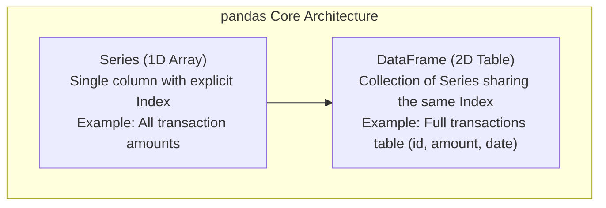
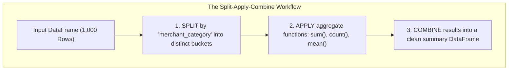

# 🐼 pandas: Tabular Data Analysis & Financial DataFrames

## 1. What is pandas & Why Does It Exist?

### Simple Language Mein:
> "Agar NumPy ek n-dimensional mathematical array hai, toh **pandas** Python ka Excel / SQL Table hai.
> 
> Real-world banking data messy hota hai: usme column names hote hain (`account_id`, `amount`), row labels hote hain, missing values hoti hain (`NULL` / `NaN`), aur date-times hote hain.
> 
> **pandas** tabular data (rows and columns) ko manipulate karne, clean karne, aggregate karne (`groupby`), aur SQL-style join karne ke liye de-facto industry standard library hai."

---

## 2. Core Data Structures: Series vs DataFrame



### 1. Creating DataFrames & Series
```python
import pandas as pd
import numpy as np

# 1. pd.Series: 1D labeled array
balances = pd.Series([45000, 12000, 95000], index=["Aarav", "Priya", "Rohan"], name="balance")
print(balances["Priya"]) # 12000

# 2. pd.DataFrame: 2D labeled table
data = {
    "account_id": [101, 102, 103],
    "customer": ["Aarav", "Priya", "Rohan"],
    "balance": [45000.0, 12000.0, 95000.0],
    "account_type": ["SAVINGS", "CURRENT", "SAVINGS"]
}
df = pd.DataFrame(data)
```

### 3. Loading Data From Different Sources
```python
# CSV
df_csv = pd.read_csv("01-PYTHON/transactions.csv")

# JSON
# df_json = pd.read_json("accounts.json")

# SQL Database (Direct connection via SQLAlchemy/sqlite3)
import sqlite3
conn = sqlite3.connect("banking.db")
df_sql = pd.read_sql_query("SELECT * FROM accounts WHERE status = 'ACTIVE'", conn)
conn.close()
```

---

## 3. Inspecting & Summarizing Data (First 60 Seconds in EDA)

```python
# Load sample dataset
df = pd.read_csv("01-PYTHON/transactions.csv")

# 1. Quick preview:
print(df.head(3)) # First 3 rows
print(df.tail(2)) # Last 2 rows

# 2. Dimensions & Memory:
print("Shape (Rows, Cols):", df.shape) # (1000, 8)
print("Columns:", df.columns.tolist())

# 3. Structural Health Check (Missing values + Dtypes):
df.info() # Displays non-null counts and memory usage

# 4. Statistical Summary (Mean, Min, 25%, 50%, 75%, Max for numerical columns):
print(df.describe())
```

---

## 4. Selecting Data: `loc` vs `iloc` (The Top Interview Trap!)

> [!IMPORTANT]
> ### 📇 Flashcard: `loc` vs `iloc`
> - **`df.loc[]`** $\implies$ **Label-based** selection (Row name / index label aur column name ke basis par select karta hai). End boundary is **inclusive**!
> - **`df.iloc[]`** $\implies$ **Integer-position based** selection (0-indexed integer position ke basis par select karta hai). End boundary is **exclusive**!

```python
# Selecting single column (Returns Series)
amounts = df["amount"]

# Selecting multiple columns (Returns DataFrame)
subset = df[["transaction_id", "amount", "status"]]

# loc vs iloc:
# Let's say index is 0, 1, 2...
# loc[row_label, col_label]
print(df.loc[0:2, ["customer_id", "amount"]]) # Returns rows labeled 0, 1, 2 (INCLUSIVE!)

# iloc[row_pos, col_pos]
print(df.iloc[0:2, 0:3]) # Returns rows at position 0, 1 (2 is EXCLUDED!)
```

---

## 5. Filtering Data (Boolean Masking)

```python
# 1. Single condition: High-value transactions
high_val = df[df["amount"] > 50000]

# 2. Multiple conditions: Use & (AND), | (OR), ~ (NOT) with parentheses ()!
# WARNING: 'and' / 'or' will throw a ValueError in pandas!
flagged_txns = df[
    (df["amount"] > 25000) & 
    (df["status"] == "FAILED") & 
    (df["merchant_category"] != "UTILITIES")
]

# 3. isin(): SQL 'IN' equivalent
metro_merchants = df[df["merchant_category"].isin(["FOOD", "TRAVEL"])]

# 4. query(): Readable string expressions
filtered_via_query = df.query("amount > 50000 and status == 'SUCCESS'")
```

---

## 6. Handling Missing Data (`NaN` / `None`)

```python
# 1. Detect missing values
print(df.isna().sum()) # Count of NaNs per column

# 2. Dropping missing data
# dropna(axis=0) drops rows; dropna(axis=1) drops columns
clean_df = df.dropna(subset=["amount"]) # Drop rows where amount is missing

# 3. Imputation strategies (Filling missing data):
# A. Fill with static constant:
df["merchant_category"] = df["merchant_category"].fillna("UNKNOWN")

# B. Impute with median/mean (Prevents skewing):
median_amount = df["amount"].median()
df["amount"] = df["amount"].fillna(median_amount)

# C. Forward Fill (ffill) & Backward Fill (bfill) - Great for stock prices & time-series!
# df["price"] = df["price"].ffill() # Takes previous known value
```

---

## 7. Data Cleaning & Transformations

```python
# 1. Removing Duplicates
df = df.drop_duplicates(subset=["transaction_id"], keep="first")

# 2. Type Casting (astype)
# Converting float IDs to integers or category types
df["account_id"] = df["account_id"].astype(str)

# 3. String Operations (.str accessor)
df["customer_id_clean"] = df["customer_id"].str.strip().str.upper()

# 4. DateTime Parsing
df["timestamp"] = pd.to_datetime(df["timestamp"])
df["year"] = df["timestamp"].dt.year
df["month"] = df["timestamp"].dt.month
df["day_name"] = df["timestamp"].dt.day_name()
df["hour"] = df["timestamp"].dt.hour

# 5. Renaming Columns
df = df.rename(columns={"timestamp": "txn_timestamp", "amount": "txn_amount"})
```

---

## 8. GroupBy: Split $\to$ Apply $\to$ Combine (HIGH PRIORITY)



```python
# 1. Total and average amount spent per merchant category
category_summary = df.groupby("merchant_category")["txn_amount"].agg(
    total_volume="sum",
    avg_ticket_size="mean",
    txn_count="count"
).reset_index()

print(category_summary.sort_values(by="total_volume", ascending=False))

# 2. Multi-Level GroupBy: Group by Customer and Transaction Status
cust_status = df.groupby(["customer_id", "status"])["txn_amount"].sum().unstack(fill_value=0)
# Displays customers as rows, status ('FAILED', 'SUCCESS') as columns!
```

---

## 9. Merging & Joining (SQL Joins in pandas)

```python
# Sample customer KYC DataFrame
customers_df = pd.DataFrame({
    "customer_id": ["CUST_101", "CUST_102", "CUST_103"],
    "kyc_status": ["VERIFIED", "VERIFIED", "PENDING"],
    "city": ["Bengaluru", "Mumbai", "Delhi"]
})

# 1. Inner Merge (SQL: INNER JOIN)
merged_inner = pd.merge(df, customers_df, on="customer_id", how="inner")

# 2. Left Merge (SQL: LEFT OUTER JOIN)
# Preserves all transactions even if customer KYC record is missing
merged_left = pd.merge(df, customers_df, on="customer_id", how="left")

# 3. Concatenation (SQL: UNION ALL)
# Binding two DataFrames vertically
# df_all = pd.concat([df_jan, df_feb], axis=0, ignore_index=True)
```

---

## 10. Pivot Tables

```python
# Pivot Table: Cross-tabulating Merchant Category vs Transaction Type
pivot = pd.pivot_table(
    df,
    values="txn_amount",
    index="merchant_category",
    columns="transaction_type",
    aggfunc=["sum", "count"],
    fill_value=0,
    margins=True # Adds 'All' Grand Total row & column!
)
print(pivot)
```

---

## 11. `apply()` vs `map()` vs Vectorization

```python
# 1. map(): Works on Series for element-wise replacement via dict
status_codes = {"SUCCESS": 1, "FAILED": 0, "PENDING": 2}
df["status_code"] = df["status"].map(status_codes)

# 2. apply(): Runs custom Python function row-by-row or col-by-col
# NOTE: Slower than vectorization because it invokes Python function N times!
def categorize_risk(amount):
    if amount > 50000:
        return "HIGH_RISK"
    elif amount > 10000:
        return "MEDIUM_RISK"
    return "LOW_RISK"

df["risk_tier"] = df["txn_amount"].apply(categorize_risk)

# 3. Vectorized Alternative using np.select (100x FASTER than .apply!):
conditions = [
    df["txn_amount"] > 50000,
    df["txn_amount"] > 10000
]
choices = ["HIGH_RISK", "MEDIUM_RISK"]
df["risk_tier_vectorized"] = np.select(conditions, choices, default="LOW_RISK")
```

---

## 12. Performance Optimization for Large Banking Datasets

1. **Avoid `for index, row in df.iterrows():`** Iterating rows manually is the single slowest anti-pattern in pandas. Always use vectorized operations or list comprehensions.
2. **Use Categorical Dtypes (`astype('category')`):** If a column has few unique strings (e.g., `status` has only 3 values: `SUCCESS`, `FAILED`, `PENDING`), converting to `category` saves up to **80% RAM**.
   ```python
   df["status"] = df["status"].astype("category")
   ```
3. **Chunking Huge CSV Files (Processing 10GB in 500MB RAM):**
   ```python
   chunk_size = 50000
   total_volume = 0
   for chunk in pd.read_csv("10gb_transactions.csv", chunksize=chunk_size):
       total_volume += chunk["amount"].sum()
   ```

---

## 13. pandas Interview Question Bank (40 Questions)

1. **Difference between `loc` and `iloc`?** (Label-based inclusive vs integer-position exclusive).
2. **What is the difference between a pandas Series and a 1D NumPy array?** (Series has an explicit index, handles heterogeneous missing types, and provides alignment).
3. **How does pandas represent missing data in numerical columns vs string columns?** (`np.nan` / `float64` historically, `pd.NA` in nullable dtypes).
4. **Explain the Split-Apply-Combine paradigm in `groupby()`.**
5. **Difference between `df.dropna()` and `df.fillna()`?**
6. **What is the difference between `merge()` and `concat()`?**
7. **How do you perform a SQL `LEFT JOIN` in pandas?** (`pd.merge(df1, df2, on='key', how='left')`).
8. **Why is `apply()` generally slower than vectorized operations?** (Runs Python bytecode per row, losing C-level SIMD benefits).
9. **How do you optimize memory usage of an object/string column?** (Convert to `category` dtype).
10. **How do you read a 20GB CSV file in pandas on a laptop with 8GB RAM?** (Using `chunksize` parameter in `pd.read_csv`).
11. **Difference between `sort_values()` and `sort_index()`?**
12. **How does `df.duplicated()` work and how do you keep the last duplicate?** (`keep='last'`).
13. **What does `reset_index()` do after a `groupby` aggregation?** (Converts grouping keys from index back into regular columns).
14. **How do you filter rows based on multiple conditions? Why can't we use `and` / `or`?** (Must use bitwise `&` and `|` with parentheses because Python's boolean short-circuiting evaluates the whole Series as truthy/falsy).
15. **What is the difference between `df.isnull()` and `df.isna()`?** (They are identical aliases in pandas).
16. **How do you convert a string column to datetime?** (`pd.to_datetime(col, format=...)`).
17. **How do you calculate a rolling 7-day average of transactions?** (`df['amount'].rolling(window=7).mean()`).
18. **Difference between `unstack()` and `stack()`?**
19. **What is a MultiIndex in pandas?**
20. **How do you export a cleaned DataFrame directly to a SQL database table?** (`df.to_sql(name='clean_txns', con=engine, if_exists='append', index=False)`).
21. **How do you rename specific columns in a DataFrame?** (`df.rename(columns={'old': 'new'})`).
22. **What is `value_counts()` and what does `normalize=True` do?** (Returns frequency counts; `normalize=True` returns relative proportions/percentages).
23. **Difference between `transform()` and `apply()` in `groupby`?** (`transform()` returns a Series with the same shape as the original DataFrame, ideal for calculating customer percentage contributions; `apply()` aggregates/reduces dimensions).
24. **How do you find the percentage of missing values in each column?** (`df.isna().mean() * 100`).
25. **How do you replace outliers in a DataFrame?** (`np.clip()` or condition masking).
26. **What is `melt()` in pandas?** (Opposite of pivot: unpivots a DataFrame from wide format to long format).
27. **Difference between `Series.map()` and `Series.apply()`?**
28. **How do you select rows where a string column contains a substring?** (`df['col'].str.contains('IDFC', case=False, na=False)`).
29. **What does `inplace=True` do and why is it deprecated / discouraged in modern pandas?** (Doesn't guarantee zero copy under the hood; method chaining is cleaner).
30. **How do you handle timezone-aware datetime columns in pandas?** (`.dt.tz_localize()` and `.dt.tz_convert('Asia/Kolkata')`).
31. **How do you find the top 5 transactions by amount per customer?** (`df.groupby('cust_id').apply(lambda x: x.nlargest(5, 'amount'))`).
32. **What is `crosstab()`?** (Cross-tabulation of two factor columns, specialized frequency pivot).
33. **Difference between `copy(deep=True)` and `copy(deep=False)` in pandas?**
34. **How do you set a custom index in a DataFrame?** (`df.set_index('account_id')`).
35. **What does `df.select_dtypes(include=[np.number])` do?** (Selects only numeric columns).
36. **How do you merge two DataFrames on different column names?** (`pd.merge(df1, df2, left_on='from_acc', right_on='acc_id')`).
37. **What is the difference between `cumsum()` and `cumprod()`?**
38. **How do you sample 10% of rows randomly from a large DataFrame?** (`df.sample(frac=0.10, random_state=42)`).
39. **How do you compute correlation between columns?** (`df.corr()`).
40. **How does pandas handle categorical encoding for machine learning or reporting?** (`pd.get_dummies(df, columns=['category'])`).
