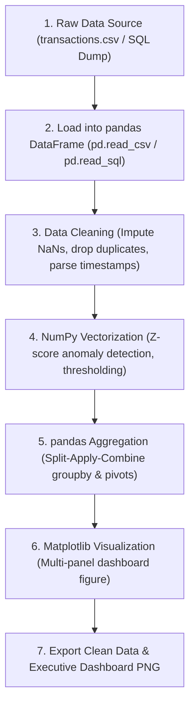

# 🚀 The Complete Python Data Analysis Workflow: NumPy $\to$ pandas $\to$ Matplotlib

## 1. The Real-World Engineering Pipeline
In production banking backends and analytics microservices, raw transactional data often flows from database queries, CSV dumps, or message queues into an analytical pipeline:



---

## 2. Step-by-Step Code Walkthrough (Banking Transaction Analytics)

### Step 1: Load Data into pandas
```python
import pandas as pd
import numpy as np
import matplotlib.pyplot as plt

df = pd.read_csv("01-PYTHON/transactions.csv")
print(f"Loaded {len(df)} transactions. Shape: {df.shape}")
```

### Step 2: Clean and Impute Missing Values
```python
# Check missing counts
print(df.isna().sum())

# Impute numerical missing amounts with the median to avoid skewing:
median_amount = df["amount"].median()
df["amount"] = df["amount"].fillna(median_amount)

# Impute categorical missing values:
df["merchant_category"] = df["merchant_category"].fillna("UNKNOWN")

# Convert timestamp strings to true pandas DateTime:
df["timestamp"] = pd.to_datetime(df["timestamp"])
df["date"] = df["timestamp"].dt.date
```

### Step 3: Beginner Analytics (Key KPI Summary)
```python
total_volume = df["amount"].sum()
avg_ticket = df["amount"].mean()
max_txn = df["amount"].max()
status_counts = df["status"].value_counts()

print(f"Total Settled: ₹{total_volume:,.2f}")
print(f"Avg Ticket: ₹{avg_ticket:,.2f}")
print(f"Status Distribution:\n{status_counts}")
```

### Step 4: Intermediate Analytics (GroupBy Spend by Category)
```python
category_summary = df.groupby("merchant_category").agg(
    volume=("amount", "sum"),
    txn_count=("transaction_id", "count"),
    avg_ticket=("amount", "mean")
).sort_values("volume", ascending=False)

print(category_summary)
```

### Step 5: Advanced Anomaly Detection Using NumPy Vectorization
```python
# Statistical Outlier Detection: Z-Score > 3 (Mean + 3 * StdDev)
mean_val = np.mean(df["amount"])
std_val = np.std(df["amount"])
anomaly_cutoff = mean_val + (3 * std_val)

# Vectorized boolean mask
anomalies = df[df["amount"] > anomaly_cutoff]
print(f"Anomaly Cutoff: > ₹{anomaly_cutoff:,.2f}")
print(f"Flagged Suspicious Transactions: {len(anomalies)}")
```

### Step 6: Visual Dashboard Generation with Matplotlib OO API
```python
fig, axes = plt.subplots(2, 2, figsize=(14, 9))
fig.suptitle("IDFC FIRST Bank — Transaction Health Dashboard", fontsize=16, fontweight="bold", color="#9b1c1c")

# 1. Daily Volume Trend (Line Chart)
daily = df.groupby("date")["amount"].sum()
axes[0, 0].plot(daily.index, daily.values, color="#9b1c1c", linewidth=2)
axes[0, 0].set_title("Daily Transaction Volume (₹)")
axes[0, 0].grid(True, linestyle="--", alpha=0.5)

# 2. Category Spend (Bar Chart)
axes[0, 1].bar(category_summary.index, category_summary["volume"] / 1000, color="#2b6cb0")
axes[0, 1].set_title("Volume by Category (₹ '000)")
axes[0, 1].tick_params(axis="x", rotation=30)

# 3. Success vs Failure (Pie Chart)
axes[1, 0].pie(status_counts.values, labels=status_counts.index, autopct="%1.1f%%", colors=["#38a169", "#e53e3e", "#dd6b20"])
axes[1, 0].set_title("Transaction Status Ratio")

# 4. Distribution with Anomaly Cutoff (Histogram)
axes[1, 1].hist(df["amount"], bins=30, color="#4a5568", edgecolor="white")
axes[1, 1].axvline(anomaly_cutoff, color="red", linestyle="--", label=f"Anomaly (>₹{int(anomaly_cutoff):,})")
axes[1, 1].set_title("Transaction Amount Distribution")
axes[1, 1].legend()

plt.tight_layout()
fig.savefig("01-PYTHON/banking_analytics_dashboard.png", dpi=300)
plt.close(fig)
```

---

## 3. How to Run the Live Pipeline
You can run this full pipeline anytime directly in your terminal:
```bash
python3 01-PYTHON/banking-analytics-project.py
```
It loads [01-PYTHON/transactions.csv](file:///home/bipin/Desktop/BankInterview/01-PYTHON/transactions.csv), computes all analytics, and updates [01-PYTHON/banking_analytics_dashboard.png](file:///home/bipin/Desktop/BankInterview/01-PYTHON/banking_analytics_dashboard.png).
