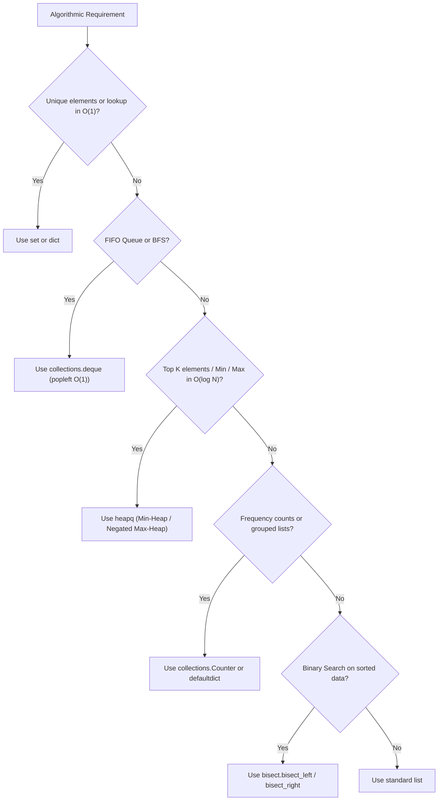

# Python for Coding Interviews & DSA Mastery

## 1. Why This Matters
Coding interviews mein speed aur clean code sabse zyada count hota hai. Python ki standard library mein aisi built-in data structures hain (`deque`, `heapq`, `Counter`, `defaultdict`, `bisect`) jo aapko 50 lines ka boilerplate likhne ke bajaye 2 lines mein optimal logic implement karne deti hain. 
Lekin agar aapko inka internal time complexity aur edge cases nahi pata (jaise `list.pop(0)` ka $O(N)$ hona), toh interviewer aapko complexity round mein disqualify kar dega.

---

## 2. Python DSA Decision Tree: "Kab Kya Use Karein?"



---

## 3. Data Structure Deep-Dive & Complexity Matrix

### 1. `list` — Dynamic Array
* **When to use:** Index-based access, sequential scans, stacks (LIFO via `append()` and `pop()`).
* **Under the hood:** Contiguous array of pointers (`PyObject**`). Over-allocates capacity geometrically.

| Method | Time Complexity | Notes & Gotchas |
| :--- | :---: | :--- |
| `arr[i]` | $O(1)$ | Direct pointer arithmetic in memory |
| `arr.append(x)` | $O(1)$ amortized | Geometric resizing |
| `arr.pop()` | $O(1)$ | Pops from end (Stack LIFO) |
| `arr.pop(0)` | **$O(N)$ (DANGEROUS)** | Shifts all $N-1$ pointers left in RAM! |
| `arr.insert(0, x)`| **$O(N)$** | Shifts all elements right |
| `x in arr` | $O(N)$ | Linear scan |

### 2. `collections.deque` — Double-Ended Queue
* **When to use:** BFS (Breadth-First Search), Sliding Window Maximum, FIFO queues.
* **Under the hood:** Doubly-linked list of 64-element block buffers.

```python
from collections import deque

queue = deque([10, 20, 30])
queue.append(40)         # O(1) Push Right
queue.appendleft(0)      # O(1) Push Left
first = queue.popleft()  # O(1) Pop Left (NEVER use list.pop(0)!)
last = queue.pop()       # O(1) Pop Right
```

### 3. `heapq` — Priority Queue (Min-Heap)
* **When to use:** "Top K frequent elements", "Kth largest element", "Median of a data stream", Dijkstra's algorithm.
* **Under the hood:** Binary Min-Heap implemented over a standard Python list. Smallest element is always at `heap[0]`.

```python
import heapq

# Min-Heap (Default)
min_heap = []
heapq.heappush(min_heap, 25) # O(log N)
heapq.heappush(min_heap, 5)
heapq.heappush(min_heap, 50)
smallest = heapq.heappop(min_heap) # 5 in O(log N)

# Max-Heap Pattern: Negate values upon push and pop!
max_heap = []
heapq.heappush(max_heap, -25)
heapq.heappush(max_heap, -5)
heapq.heappush(max_heap, -50)
largest = -heapq.heappop(max_heap) # 50

# In-Place Heapify: Converts an existing list into a heap in O(N) linear time!
nums = [15, 3, 20, 1, 9]
heapq.heapify(nums) # O(N) time (Faster than pushing N times O(N log N)!)
```

### 4. `collections.Counter` & `collections.defaultdict`
* **When to use:** Character counts, anagrams, grouping items by key without `KeyError`.

```python
from collections import Counter, defaultdict

# 1. Counter: Instant frequency map
counts = Counter("idfcfirstbank")
print(counts["i"])           # 2
print(counts.most_common(2)) # [('i', 2), ('f', 1)]

# 2. defaultdict: Eliminates 'if key not in dict' boilerplate
# Graph adjacency list representation:
adj_list = defaultdict(list)
edges = [(1, 2), (1, 3), (2, 4)]
for u, v in edges:
    adj_list[u].append(v)
# adj_list[1] -> [2, 3]; adj_list[5] -> [] (No KeyError!)
```

### 5. `bisect` — Binary Search Module
* **When to use:** Finding insertion point in sorted arrays, range query boundaries in $O(\log N)$.

```python
import bisect

sorted_rates = [3.5, 5.0, 7.25, 8.5, 9.1]

# bisect_left: First index where val can be inserted maintaining sort order (>= val)
idx_left = bisect.bisect_left(sorted_rates, 7.25) # Index 2

# bisect_right: Index after any existing equal elements (> val)
idx_right = bisect.bisect_right(sorted_rates, 7.25) # Index 3
```

---

## 4. Custom Sorting & Comparator Keys

In technical interviews, sorting complex objects or breaking ties is very common:

```python
# Problem: Sort transactions by:
# 1. Status: 'FAILED' first, then 'PENDING', then 'SUCCESS'
# 2. Amount: Descending (Higher amounts first)
# 3. Reference ID: Ascending (Lexicographical)

transactions = [
    {"ref": "TX1", "amount": 5000, "status": "SUCCESS"},
    {"ref": "TX2", "amount": 12000, "status": "FAILED"},
    {"ref": "TX3", "amount": 8000, "status": "FAILED"},
    {"ref": "TX4", "amount": 5000, "status": "SUCCESS"},
]

status_priority = {"FAILED": 0, "PENDING": 1, "SUCCESS": 2}

# Custom key function returning a tuple:
sorted_txns = sorted(
    transactions,
    key=lambda x: (status_priority[x["status"]], -x["amount"], x["ref"])
)
# Result: TX2 (12k FAILED), then TX3 (8k FAILED), then TX1 (5k SUCCESS), then TX4
```

---

## 5. Recursion, BFS & DFS Templates in Python

### 1. BFS Template (Iterative with `deque`)
```python
def bfs_shortest_path(graph, start, target):
    queue = deque([(start, 0)]) # (node, distance)
    visited = {start}

    while queue:
        node, dist = queue.popleft() # O(1)
        if node == target:
            return dist

        for neighbor in graph[node]:
            if neighbor not in visited:
                visited.add(neighbor)
                queue.append((neighbor, dist + 1))
                
    return -1 # Target unreachable
```

### 2. DFS Template (Recursive with Visited Set)
```python
def dfs_traversal(graph, node, visited=None):
    if visited is None:
        visited = set()
        
    visited.add(node)
    # Process current node
    for neighbor in graph[node]:
        if neighbor not in visited:
            dfs_traversal(graph, neighbor, visited)
            
    return visited
```

---

## 6. Top 5 Python DSA Interview Traps
1. **Using `list.pop(0)` in BFS:** Turns $O(V + E)$ into quadratic $O(V^2)$ because each pop shifts entire list memory. Always use `collections.deque.popleft()`.
2. **Mutating list while iterating:** `for x in arr: if condition: arr.remove(x)` skips elements because indices shift dynamically. Create a new list via comprehension or iterate backwards.
3. **Using 2D lists with multiplication:** `matrix = [[0] * 3] * 3` creates 3 references to the **same single row**! Modifying `matrix[0][0] = 1` mutates all 3 rows. Always use: `matrix = [[0] * cols for _ in range(rows)]`.
4. **Neglecting recursion depth limit:** Python default recursion depth is 1,000. In deep graph/tree problems, `sys.setrecursionlimit(200000)` is required or convert recursion to iterative stack.
5. **Float comparison precision:** `0.1 + 0.2 == 0.3` evaluates to `False`. Use `math.isclose(a, b)` for floating-point equality.
