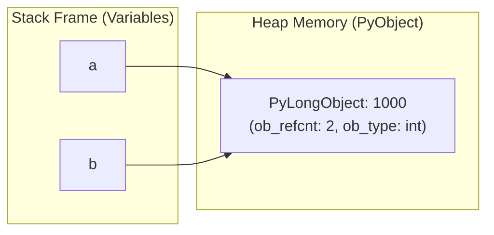

# Python Fundamentals & Idiomatic Interview Patterns

## 1. Why This Matters
While your production background is in Node.js and TypeScript, using Python for Data Structures & Algorithms (DSA) is a major advantage in technical interviews. Python's concise syntax minimizes boilerplate, allowing you to focus on logic and edge cases. However, interviewers will quickly detect whether you understand Python's internal memory model (pass-by-assignment, object references, mutability, hash table dynamics) or are simply treating it like untyped pseudocode.

---

## 2. Prerequisites
- Basic understanding of variables, functions, and control flow in any language.
- Familiarity with arrays and key-value dictionaries.

---

## 3. Concept

### Python Memory Model: Variables are Pointers, Objects are Tagged
In Python, variables are not memory addresses containing data directly. Variables are **names pointing to heap-allocated PyObject structs**.



- **Immutable Types:** `int`, `float`, `str`, `tuple`, `frozenset`, `bytes`. Modifying an immutable type creates a *new* object on the heap.
- **Mutable Types:** `list`, `dict`, `set`, `bytearray`. Modifying a mutable object updates its contents in-place.

---

## 4. Simple Example: Mutability & Default Arguments Trap

```python
# The classic mutable default argument trap
def append_transaction(tx_id: str, batch: list = []) -> list:
    batch.append(tx_id)
    return batch

# WRONG BEHAVIOR:
print(append_transaction("TX1")) # ['TX1']
print(append_transaction("TX2")) # ['TX1', 'TX2'] - The default list was created ONCE at function definition!

# CORRECT IDIOMATIC PYTHON:
def append_transaction_safe(tx_id: str, batch: list | None = None) -> list:
    if batch is None:
        batch = []
    batch.append(tx_id)
    return batch
```

---

## 5. Real-World Example: Banking Transaction Batch Aggregator
Using `collections.defaultdict` and `collections.Counter` to process thousands of incoming payment events without defensive `if key not in dict:` boilerplate.

```python
from collections import defaultdict, Counter
from typing import List, Dict

def analyze_transaction_batch(transactions: List[Dict]) -> Dict:
    """
    Groups transactions by account_id and calculates total spend and failure count.
    Complexity: O(N) Time, O(U) Space where U is unique accounts.
    """
    account_spend = defaultdict(float)
    channel_frequency = Counter()
    failed_attempts = defaultdict(int)

    for tx in transactions:
        acc = tx["account_id"]
        channel = tx["channel"]
        amount = tx["amount"]
        status = tx["status"]

        channel_frequency[channel] += 1
        
        if status == "SUCCESS":
            account_spend[acc] += amount
        elif status == "FAILED":
            failed_attempts[acc] += 1

    return {
        "spend_by_account": dict(account_spend),
        "popular_channels": channel_frequency.most_common(3),
        "flagged_accounts": [acc for acc, count in failed_attempts.items() if count >= 3]
    }
```

---

## 6. Code: Essential Built-in Modules for Interviews

```python
# 1. Heap Queue (Min-Heap by default)
import heapq
min_heap = []
heapq.heappush(min_heap, 15)
heapq.heappush(min_heap, 5)
heapq.heappush(min_heap, 30)
smallest = heapq.heappop(min_heap) # 5

# Max-Heap idiom: Negate values
max_heap = []
heapq.heappush(max_heap, -15)
largest = -heapq.heappop(max_heap) # 15

# 2. Deque (Double-ended queue with O(1) pops and appends at both ends)
from collections import deque
queue = deque([1, 2, 3])
queue.append(4)        # O(1)
queue.appendleft(0)    # O(1)
first = queue.popleft() # O(1) - regular list.pop(0) is O(N)!

# 3. Bisect (Binary Search module)
import bisect
sorted_arr = [10, 20, 30, 40, 50]
idx = bisect.bisect_left(sorted_arr, 30) # 2 (Index where 30 exists or belongs)
```

---

## 7. How It Works Internally

### Python Dictionaries & Hash Tables
1. **Compact Dicts (Python 3.6+):** Standard Python dicts preserve insertion order. CPython uses two arrays:
   - `indices`: Sparse hash table storing indexes into the entries table.
   - `entries`: Dense array storing `[hash, key_ptr, value_ptr]`.
2. **Collision Resolution:** CPython uses **open addressing with pseudo-random probing**:
   $$j = ((5 \times j) + 1 + \text{perturb}) \pmod{\text{capacity}}$$
   This avoids primary clustering while keeping lookups $O(1)$ amortized.
3. **Resizing:** When the load factor exceeds $\frac{2}{3}$, the hash table doubles its capacity.

---

## 8. Common Mistakes
1. **Using `list.pop(0)` Instead of `collections.deque`:** In Python `list.pop(0)` shifts all $N-1$ elements to the left, taking $O(N)$ time. In BFS algorithms, this turns an $O(V + E)$ traversal into $O(V^2)$! Always use `deque.popleft()`.
2. **Shallow Copy vs Deep Copy:** `list.copy()` or `arr[:]` only copies the outer container. If the list contains nested lists or objects, mutating a nested element affects the copy. Use `copy.deepcopy()` when copying multidimensional matrices.
3. **Comparing Identity with Equality:** `is` checks memory address (`id(a) == id(b)`), while `==` checks value equality (`a.__eq__(b)`). Always use `==` for values, and reserve `is` for singletons like `None` (`if val is None:`).

---

## 9. Performance / Complexity Matrix

| Operation | Python List | Python Deque | Python Dict / Set |
| :--- | :---: | :---: | :---: |
| **Append / Push Right** | $O(1)$ amortized | $O(1)$ | $O(1)$ |
| **Append / Push Left** | $O(N)$ | $O(1)$ | N/A |
| **Pop Right** | $O(1)$ | $O(1)$ | N/A |
| **Pop Left** | $O(N)$ (Shifts memory) | $O(1)$ | N/A |
| **Lookup by Index** | $O(1)$ | $O(N)$ | N/A |
| **Lookup by Key / Value** | $O(N)$ (Linear scan) | $O(N)$ | $O(1)$ average |
| **Delete by Key** | $O(N)$ | $O(N)$ | $O(1)$ average |

---

## 10. Interview Questions (Easy $\to$ Medium $\to$ Hard)

### Easy
- **Q:** How are arguments passed in Python: pass-by-value or pass-by-reference? Explain what happens when a list is passed into a function and modified.

### Medium
- **Q:** What is the difference between `list.sort()` and `sorted(list)` in Python in terms of in-place mutation, return value, and space complexity?

### Hard
- **Q:** Explain Python's Global Interpreter Lock (GIL). If Python has a GIL, how can a high-throughput backend service handle concurrent network requests or CPU-intensive tasks?

---

## 11. Follow-up Questions from Interviewer
- *"Why does Python use Timsort for its built-in sorting, and what makes Timsort run in $O(N)$ time on real-world datasets?"*
- *"If you need to sort a list of bank accounts by balance descending, but break ties by account opening date ascending, how do you express that with a lambda key function?"*

---

## 12. Model Answer: Pass-by-Assignment & Mutability

> **Interviewer:** *"Is Python pass-by-value or pass-by-reference? What happens if I modify an input argument inside a function?"*
> 
> **Model Answer:**
> "Python is neither traditional pass-by-value nor pass-by-reference; it uses **pass-by-object-reference** (or pass-by-assignment).
> 
> When you pass a variable into a function, the parameter binds to the exact same object reference in memory as the caller.
> 
> - If the object is **mutable** (such as a `list` or `dict`) and you perform an in-place mutation like `arr.append(5)`, the caller sees that change because both references point to the same underlying heap object.
> - However, if you reassign the variable name itself inside the function (`arr = [1, 2, 3]`), you merely rebind the local name to a new object; the caller's reference remains unchanged.
> - If the object is **immutable** (such as an integer or string), any modification operation (`x += 1`) instantiates a new object and rebinds the local name, leaving the caller's object untouched."

---

## 13. Practical Exercise: Custom Multi-Key Sorting
Write a function that sorts bank transactions by:
1. Amount descending
2. Transaction date ascending (break ties)

```python
transactions = [
    {"id": "TX1", "amount": 5000, "date": "2026-03-02"},
    {"id": "TX2", "amount": 12000, "date": "2026-03-01"},
    {"id": "TX3", "amount": 5000, "date": "2026-03-01"},
]

# Solution:
# Since date is a string in YYYY-MM-DD format, normal string comparison works ascending.
# Amount is negated for descending order.
sorted_txs = sorted(transactions, key=lambda x: (-x["amount"], x["date"]))
print(sorted_txs)
# Output: TX2 (12000), then TX3 (5000, 2026-03-01), then TX1 (5000, 2026-03-02)
```

---

## 14. Quick Revision
- Python variables are reference pointers to heap objects.
- Mutable default arguments (`def f(x=[])`) persist across invocations; always default to `None`.
- Always use `collections.deque` for queues/BFS to avoid $O(N)$ `pop(0)` memory shifts.
- `collections.defaultdict` eliminates key-existence boilerplate.
- Heapq implements a min-heap; negate values to simulate a max-heap.

---

## 15. Interview Checklist
- [ ] Can explain pass-by-assignment with diagrams.
- [ ] Knows when to use `deque` vs `list`.
- [ ] Can use `Counter`, `defaultdict`, and `heapq` effortlessly.
- [ ] Understands open addressing and collision resolution in Python dicts.
- [ ] Knows how to write custom comparator keys using lambdas and tuples.
