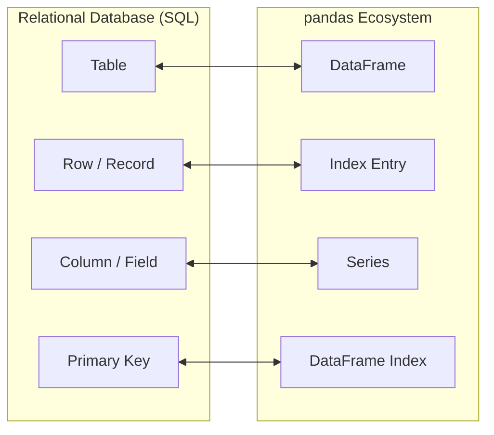

# 🔀 SQL ↔ pandas Rosetta Stone: Translating SQL Knowledge to pandas

## 1. Why This Matters
Aapka SQL background already solid hai. Nayi syntax zero se yaad karne ke bajaye, agar aap **SQL queries ko direct pandas operations se map** kar loge, toh aap 1 ghante ke andar pandas mein expert level analysis likhne lagoge!

---

## 2. The Core Conceptual Mapping



---

## 3. Clause-by-Clause Translation Table

### 1. `SELECT` (Column Projection)

#### SQL
```sql
SELECT transaction_id, amount 
FROM transactions;

SELECT DISTINCT merchant_category 
FROM transactions;
```

#### pandas
```python
# Select columns
df[["transaction_id", "amount"]]

# DISTINCT
df["merchant_category"].unique() # or df[["merchant_category"]].drop_duplicates()
```

---

### 2. `WHERE` (Filtering & Predicates)

#### SQL
```sql
SELECT * FROM transactions 
WHERE amount > 10000 AND status = 'SUCCESS';

SELECT * FROM transactions 
WHERE merchant_category IN ('FOOD', 'TRAVEL');

SELECT * FROM transactions 
WHERE merchant_category IS NULL;
```

#### pandas
```python
# Multiple conditions (& for AND, | for OR, ~ for NOT)
df[(df["amount"] > 10000) & (df["status"] == "SUCCESS")]

# IN condition (isin)
df[df["merchant_category"].isin(["FOOD", "TRAVEL"])]

# IS NULL / IS NOT NULL
df[df["merchant_category"].isna()]
df[df["merchant_category"].notna()]
```

---

### 3. `ORDER BY` & `LIMIT` (Sorting & Pagination)

#### SQL
```sql
SELECT * FROM transactions 
ORDER BY amount DESC, timestamp ASC 
LIMIT 10 OFFSET 20;
```

#### pandas
```python
# sort_values()
df.sort_values(
    by=["amount", "timestamp"], 
    ascending=[False, True]
).iloc[20:30] # Limit 10 Offset 20
```

---

### 4. `GROUP BY` & `HAVING` (Aggregations)

#### SQL
```sql
SELECT 
    merchant_category,
    COUNT(*) AS total_txns,
    SUM(amount) AS total_spend,
    AVG(amount) AS avg_spend
FROM transactions
GROUP BY merchant_category
HAVING SUM(amount) > 100000;
```

#### pandas
```python
# groupby() + agg()
category_summary = df.groupby("merchant_category").agg(
    total_txns=("amount", "count"),
    total_spend=("amount", "sum"),
    avg_spend=("amount", "mean")
).reset_index()

# HAVING clause filter:
category_summary[category_summary["total_spend"] > 100000]
```

---

### 5. `JOIN` (Relational Merging)

#### SQL
```sql
-- INNER JOIN
SELECT t.*, c.first_name, c.phone
FROM transactions t
INNER JOIN customers c ON t.customer_id = c.customer_id;

-- LEFT OUTER JOIN
SELECT t.*, c.first_name
FROM transactions t
LEFT JOIN customers c ON t.customer_id = c.customer_id;
```

#### pandas
```python
# INNER JOIN
pd.merge(transactions_df, customers_df, on="customer_id", how="inner")

# LEFT JOIN
pd.merge(transactions_df, customers_df, on="customer_id", how="left")

# RIGHT JOIN: how='right'
# FULL OUTER JOIN: how='outer'
```

---

### 6. `UNION ALL` & `UNION` (Vertical Concatenation)

#### SQL
```sql
SELECT * FROM transactions_jan
UNION ALL
SELECT * FROM transactions_feb;
```

#### pandas
```python
# UNION ALL
pd.concat([jan_df, feb_df], axis=0, ignore_index=True)

# UNION (with deduplication)
pd.concat([jan_df, feb_df], axis=0, ignore_index=True).drop_duplicates()
```

---

### 7. Window Functions (`OVER (PARTITION BY ... ORDER BY ...)`)

#### SQL Running Balance
```sql
SELECT 
    transaction_id,
    account_id,
    amount,
    SUM(amount) OVER (
        PARTITION BY account_id 
        ORDER BY timestamp
    ) AS running_balance
FROM transactions;
```

#### pandas Equivalent
```python
# Groupby + cumsum()
df["running_balance"] = df.sort_values("timestamp").groupby("account_id")["amount"].cumsum()
```

#### SQL Ranking (`ROW_NUMBER()` / `DENSE_RANK()`)
```sql
SELECT 
    *,
    DENSE_RANK() OVER (
        PARTITION BY customer_id 
        ORDER BY amount DESC
    ) AS rank_in_customer
FROM transactions;
```

#### pandas Equivalent
```python
# rank(method='dense')
df["rank_in_customer"] = df.groupby("customer_id")["amount"].rank(
    method="dense", 
    ascending=False
)
```

#### SQL `LAG()` / `LEAD()` (Previous / Next row)
```sql
SELECT 
    account_id,
    amount,
    LAG(amount, 1) OVER (PARTITION BY account_id ORDER BY timestamp) AS prev_amount
FROM transactions;
```

#### pandas Equivalent
```python
# shift(1) for LAG, shift(-1) for LEAD
df["prev_amount"] = df.sort_values("timestamp").groupby("account_id")["amount"].shift(1)
```

---

### 8. `CASE WHEN` (Conditional Column Assignment)

#### SQL
```sql
SELECT 
    transaction_id,
    amount,
    CASE 
        WHEN amount >= 50000 THEN 'HIGH'
        WHEN amount >= 10000 THEN 'MEDIUM'
        ELSE 'LOW'
    END AS risk_category
FROM transactions;
```

#### pandas (Vectorized with `np.select`)
```python
import numpy as np

conditions = [
    df["amount"] >= 50000,
    df["amount"] >= 10000
]
choices = ["HIGH", "MEDIUM"]

df["risk_category"] = np.select(conditions, choices, default="LOW")
```

---

## 4. Quick Summary Checklist for Interviews
- `SELECT col` ⟹ `df['col']` or `df[['a', 'b']]`
- `WHERE` ⟹ `df[(df['col'] > x) & (df['col2'] == y)]`
- `GROUP BY` ⟹ `df.groupby('col').agg(...)`
- `HAVING` ⟹ filter the aggregated DataFrame output
- `JOIN` ⟹ `pd.merge(df1, df2, on='key', how='inner|left|outer')`
- `UNION ALL` ⟹ `pd.concat([df1, df2], axis=0)`
- `SUM() OVER(PARTITION BY ...)` ⟹ `df.groupby('col')['val'].cumsum()`
- `CASE WHEN` ⟹ `np.select(conditions, choices, default=...)`
