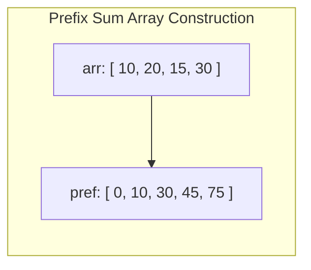

# Array Patterns, In-Place Manipulation & Prefix Sums

## 1. Why This Matters
Arrays form the backbone of memory management and algorithmic screening at IDFC FIRST Bank. In live coding interviews, array problems test your ability to avoid auxiliary allocations, identify prefix accumulations, manipulate boundaries without off-by-one errors, and optimize brute-force $O(N^2)$ loops into $O(N)$ linear scans.

---

## 2. Prerequisites
- Familiarity with zero-indexed array indexing and contiguous memory buffers.
- Understanding of time vs space complexity trade-offs.

---

## 3. Concept

### Key Array Algorithmic Patterns
1. **Prefix Sum (Cumulative Sum):** Precomputing running totals allows any range sum query `sum(arr[i...j])` to be answered in $O(1)$ time via `prefix[j+1] - prefix[i]`.
2. **In-Place Two Pointers / Swapping:** Modifying array values without creating auxiliary lists, maintaining $O(1)$ extra space.
3. **Dutch National Flag (Three-Way Partitioning):** Partitioning an array around pivot values in a single linear pass.



$$\text{RangeSum}(i, j) = \text{pref}[j+1] - \text{pref}[i]$$

---

## 4. Simple Example: In-Place Removal of Duplicates

```python
def remove_duplicates_sorted(nums: list[int]) -> int:
    """
    Removes duplicates in-place from a sorted array.
    Returns the count of unique elements.
    Complexity: O(N) Time, O(1) Auxiliary Space.
    """
    if not nums:
        return 0
    
    write_ptr = 1
    for read_ptr in range(1, len(nums)):
        if nums[read_ptr] != nums[read_ptr - 1]:
            nums[write_ptr] = nums[read_ptr]
            write_ptr += 1
            
    return write_ptr
```

---

## 5. Real-World Banking Example: Daily Transaction Range Sum Engine
A core banking ledger receives thousands of audit requests: *"What was the total volume transacted between timestamp $T_1$ and $T_2$?"*
- Re-summing transactions on each query is $O(N)$ per request, overloading the database under high concurrency.
- By maintaining an hourly or daily **Prefix Sum Ledger**, the balance query computes in $O(1)$ instant time via a simple subtraction.

---

## 6. Code: Product of Array Except Self ($O(N)$ Time, $O(1)$ Extra Space)

### Problem Statement
Given an integer array `nums`, return an array `answer` such that `answer[i]` is equal to the product of all the elements of `nums` except `nums[i]`. You must solve it **without using the division operation** and in $O(N)$ time.

### Clarifying Questions
1. *Can elements be zero or negative?* Yes, zeroes are explicitly allowed.
2. *Can the product overflow a standard 32-bit integer?* Yes, in Python integers have arbitrary precision, but in languages like Java/C++, 64-bit integers (`long`) must be used.
3. *Does the output array count toward auxiliary space?* No, output space is excluded from auxiliary space analysis.

### Brute-Force Approach
For every index $i$, iterate through the rest of the array with a nested loop and calculate the product.
- **Time Complexity:** $O(N^2)$
- **Space Complexity:** $O(1)$

### Optimized Approach: Prefix and Suffix Running Products
Instead of recomputing products repeatedly, notice that:
$$\text{product except } i = (\text{product of elements to the left of } i) \times (\text{product of elements to the right of } i)$$

```python
def product_except_self(nums: list[int]) -> list[int]:
    n = len(nums)
    output = [1] * n

    # Step 1: Compute prefix products in-place in output array
    prefix = 1
    for i in range(n):
        output[i] = prefix
        prefix *= nums[i]

    # Step 2: Traverse backwards and multiply by running suffix product
    suffix = 1
    for i in range(n - 1, -1, -1):
        output[i] *= suffix
        suffix *= nums[i]

    return output

# Test
print(product_except_self([1, 2, 3, 4])) # [24, 12, 8, 6]
print(product_except_self([-1, 1, 0, -3, 3])) # [0, 0, 9, 0, 0]
```

- **Time Complexity:** $O(N)$ (Two passes of length $N$).
- **Space Complexity:** $O(1)$ auxiliary space (only scalar `prefix` and `suffix` trackers).
- **Edge Cases:** Array with a single zero, multiple zeroes (where all outputs become zero), all negative numbers.

---

## 7. How It Works Internally: Memory Layout & Cache Locality
Arrays in RAM are stored in a contiguous block of virtual memory. When the CPU executes `output[i] = prefix`, hardware prefetchers load a **cache line** (typically 64 bytes) into L1/L2 cache.
- Forward and backward sequential scans have **$100\%$ spatial locality**, meaning almost zero cache misses.
- If this were implemented using a linked list or pointer-heavy tree, each node access would require an unpredictable memory hop, causing severe cache line stalls.

---

## 8. Common Mistakes
1. **Division by Zero:** Attempting to solve *Product of Array Except Self* by calculating the total product and dividing by `nums[i]` crashes when `nums[i] == 0`.
2. **Off-by-One in Prefix Sums:** Creating a prefix array of size $N$ instead of $N+1$. Using size $N+1$ with `prefix[0] = 0` eliminates messy `if i == 0:` boundary checks.
3. **Modifying Array While Iterating:** Mutating an array with `.pop()` or `.insert()` during a `for x in arr:` loop alters the iteration index, leading to skipped elements.

---

## 9. Performance / Complexity Matrix

| Problem / Technique | Brute Force | Optimized Time | Auxiliary Space |
| :--- | :---: | :---: | :---: |
| **Prefix Sum Range Query** | $O(N)$ per query | $O(1)$ per query ($O(N)$ precompute) | $O(N)$ |
| **Product Except Self** | $O(N^2)$ | $O(N)$ | $O(1)$ |
| **Remove Duplicates In-Place** | $O(N^2)$ | $O(N)$ | $O(1)$ |
| **Rotate Array by K steps** | $O(N \times K)$ | $O(N)$ (Triple reverse) | $O(1)$ |

---

## 10. Interview Questions (Easy $\to$ Medium $\to$ Hard)

### Easy
- **Q:** How do you reverse an array in-place without using extra memory?

### Medium
- **Q:** Given an unsorted array of integers containing positive and negative numbers, find the contiguous subarray which has the largest sum (Kadane's Algorithm).

### Hard
- **Q:** Given an array representing stock prices across consecutive trading ticks, find the maximum profit you can achieve with at most two transactions.

---

## 11. Follow-up Questions from Interviewer
- *"In Kadane's algorithm, what happens if all numbers in the array are negative? How do you ensure your code doesn't mistakenly return 0?"*
- *"Can you modify your range sum query to handle dynamic in-place updates in $O(\log N)$ time? (Segment Tree / Fenwick Tree)"*

---

## 12. Model Answer: Kadane's Algorithm ($O(N)$ Maximum Subarray)

> **Interviewer:** *"Explain how Kadane's algorithm works and prove its optimality."*
> 
> **Model Answer:**
> "Kadane's algorithm uses dynamic programming with state reduction to find the maximum sum contiguous subarray in $O(N)$ time and $O(1)$ auxiliary space.
> 
> At each index $i$, we make a local decision:
> Is it better to extend the existing contiguous subarray ending at $i-1$, or start a brand new subarray beginning at $i$?
> 
> The recurrence relation is:
> $$\text{current\_max} = \max(\text{nums}[i], \text{current\_max} + \text{nums}[i])$$
> 
> If `current_max` ever becomes negative, adding it to the next element would strictly decrease that element's potential sum. Therefore, we discard the negative running sum and restart at the current element.
> 
> To properly handle arrays containing all negative numbers (e.g., `[-5, -2, -8]`), we initialize `max_so_far` and `current_max` to `nums[0]` rather than `0`. This guarantees we return the least negative number ($-2$) rather than an invalid empty subarray."

```python
def max_sub_array(nums: list[int]) -> int:
    current_max = nums[0]
    global_max = nums[0]
    for num in nums[1:]:
        current_max = max(num, current_max + num)
        global_max = max(global_max, current_max)
    return global_max
```

---

## 13. Practical Exercise
Implement the **Rotate Array by $K$ Steps** in-place in $O(N)$ time and $O(1)$ space using the 3-step array reversal technique:
1. Reverse entire array.
2. Reverse first $K$ elements.
3. Reverse remaining $N - K$ elements.

*(Ensure $K = K \pmod N$ handles cases where $K \ge N$).*

---

## 14. Quick Revision
- Prefix sum: $\text{sum}(i, j) = \text{pref}[j+1] - \text{pref}[i]$.
- In-place two pointers: read pointer scans ahead, write pointer retains valid output.
- Kadane's: $\text{local} = \max(\text{num}, \text{local} + \text{num})$.
- In-place reversal eliminates auxiliary space for rotation problems.

---

## 15. Interview Checklist
- [ ] Writes Kadane's algorithm correctly for all-negative inputs.
- [ ] Solves Product Except Self without division.
- [ ] Understands why $N+1$ sized prefix arrays prevent boundary condition bugs.
- [ ] Explains cache line prefetching benefits of contiguous memory.
