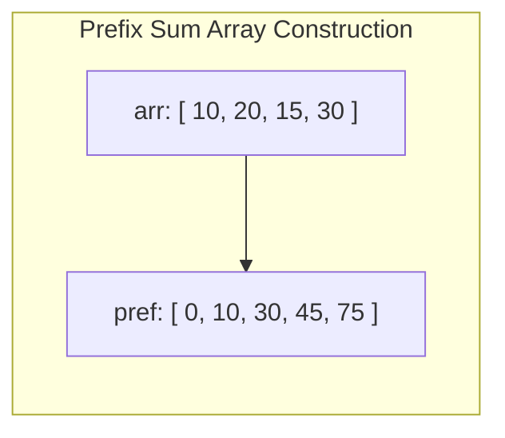

# Array Patterns, In-Place Manipulation & Prefix Sums

## 1. Why This Matters
Arrays form the backbone of memory management and algorithmic screening at IDFC FIRST Bank. In live coding interviews, array problems test your ability to avoid auxiliary allocations, identify prefix accumulations, manipulate boundaries without off-by-one errors, and optimize brute-force O(N²) loops into O(N) linear scans.

---

## 2. Prerequisites
- Familiarity with zero-indexed array indexing and contiguous memory buffers.
- Understanding of time vs space complexity trade-offs.

---

## 3. Concept

### Key Array Algorithmic Patterns
1. **Prefix Sum (Cumulative Sum):** Precomputing running totals allows any range sum query `sum(arr[i...j])` to be answered in O(1) time via `prefix[j+1] - prefix[i]`.
2. **In-Place Two Pointers / Swapping:** Modifying array values without creating auxiliary lists, maintaining O(1) extra space.
3. **Dutch National Flag (Three-Way Partitioning):** Partitioning an array around pivot values in a single linear pass.



RangeSum(i, j) = pref[j+1] - pref[i]

---

## 4. Simple Example: In-Place Removal of Duplicates

```python
def remove_duplicates_sorted(nums: list[int]) -> int:
    """
    Removes duplicates in-place from a sorted array.
    Returns the count of unique elements.
    Complexity: O(N) Time, O(1) Auxiliary Space.
    """
    if not nums:
        return 0
    
    write_ptr = 1
    for read_ptr in range(1, len(nums)):
        if nums[read_ptr] != nums[read_ptr - 1]:
            nums[write_ptr] = nums[read_ptr]
            write_ptr += 1
            
    return write_ptr
```

---

## 5. Real-World Banking Example: Daily Transaction Range Sum Engine
A core banking ledger receives thousands of audit requests: *"What was the total volume transacted between timestamp T₁ and T₂?"*
- Re-summing transactions on each query is O(N) per request, overloading the database under high concurrency.
- By maintaining an hourly or daily **Prefix Sum Ledger**, the balance query computes in O(1) instant time via a simple subtraction.

---

## 6. Code: Product of Array Except Self (O(N) Time, O(1) Extra Space)

### Problem Statement
Given an integer array `nums`, return an array `answer` such that `answer[i]` is equal to the product of all the elements of `nums` except `nums[i]`. You must solve it **without using the division operation** and in O(N) time.

### Clarifying Questions
1. *Can elements be zero or negative?* Yes, zeroes are explicitly allowed.
2. *Can the product overflow a standard 32-bit integer?* Yes, in Python integers have arbitrary precision, but in languages like Java/C++, 64-bit integers (`long`) must be used.
3. *Does the output array count toward auxiliary space?* No, output space is excluded from auxiliary space analysis.

### Brute-Force Approach
For every index i, iterate through the rest of the array with a nested loop and calculate the product.
- **Time Complexity:** O(N²)
- **Space Complexity:** O(1)

### Optimized Approach: Prefix and Suffix Running Products
Instead of recomputing products repeatedly, notice that:
product except  i = (product of elements to the left of  i) * (product of elements to the right of  i)

```python
def product_except_self(nums: list[int]) -> list[int]:
    n = len(nums)
    output = [1] * n

    # Step 1: Compute prefix products in-place in output array
    prefix = 1
    for i in range(n):
        output[i] = prefix
        prefix *= nums[i]

    # Step 2: Traverse backwards and multiply by running suffix product
    suffix = 1
    for i in range(n - 1, -1, -1):
        output[i] *= suffix
        suffix *= nums[i]

    return output

# Test
print(product_except_self([1, 2, 3, 4])) # [24, 12, 8, 6]
print(product_except_self([-1, 1, 0, -3, 3])) # [0, 0, 9, 0, 0]
```

- **Time Complexity:** O(N) (Two passes of length N).
- **Space Complexity:** O(1) auxiliary space (only scalar `prefix` and `suffix` trackers).
- **Edge Cases:** Array with a single zero, multiple zeroes (where all outputs become zero), all negative numbers.

---

## 7. How It Works Internally: Memory Layout & Cache Locality
Arrays in RAM are stored in a contiguous block of virtual memory. When the CPU executes `output[i] = prefix`, hardware prefetchers load a **cache line** (typically 64 bytes) into L1/L2 cache.
- Forward and backward sequential scans have **100% spatial locality**, meaning almost zero cache misses.
- If this were implemented using a linked list or pointer-heavy tree, each node access would require an unpredictable memory hop, causing severe cache line stalls.

---

## 8. Common Mistakes
1. **Division by Zero:** Attempting to solve *Product of Array Except Self* by calculating the total product and dividing by `nums[i]` crashes when `nums[i] == 0`.
2. **Off-by-One in Prefix Sums:** Creating a prefix array of size N instead of N+1. Using size N+1 with `prefix[0] = 0` eliminates messy `if i == 0:` boundary checks.
3. **Modifying Array While Iterating:** Mutating an array with `.pop()` or `.insert()` during a `for x in arr:` loop alters the iteration index, leading to skipped elements.

---

## 9. Performance / Complexity Matrix

| Problem / Technique | Brute Force | Optimized Time | Auxiliary Space |
| :--- | :---: | :---: | :---: |
| **Prefix Sum Range Query** | O(N) per query | O(1) per query (O(N) precompute) | O(N) |
| **Product Except Self** | O(N²) | O(N) | O(1) |
| **Remove Duplicates In-Place** | O(N²) | O(N) | O(1) |
| **Rotate Array by K steps** | O(N * K) | O(N) (Triple reverse) | O(1) |

---

## 10. Interview Questions (Easy → Medium → Hard)

### 🟢 Easy Question: In-Place Array Reversal
**Q:** How do you reverse an array in-place without allocating any extra auxiliary memory?

**Complete Answer:**
Use a two-pointer converging approach. Initialize a `left` pointer at index 0 and a `right` pointer at index `len(arr) - 1`. While `left < right`, swap `arr[left]` and `arr[right]`, then increment `left` and decrement `right`.

```python
def reverse_array_inplace(arr: list[int]) -> None:
    """Reverses an array in-place.
    Time Complexity: O(N) — N/2 swaps.
    Auxiliary Space: O(1) — purely scalar pointer manipulation.
    """
    left, right = 0, len(arr) - 1
    while left < right:
        arr[left], arr[right] = arr[right], arr[left]
        left += 1
        right -= 1

# Verification
nums = [10, 20, 30, 40, 50]
reverse_array_inplace(nums)
assert nums == [50, 40, 30, 20, 10]
```

---

### 🟠 Medium Question: Maximum Subarray Sum (Kadane's Algorithm)
**Q:** Given an unsorted array of integers containing positive and negative numbers, find the contiguous subarray which has the largest sum. Extend this to return the starting and ending indices of the subarray.

**Complete Answer:**
Kadane's algorithm uses dynamic programming with state reduction:
- At each index `i`, we decide whether to extend the previous subarray (`current_max + nums[i]`) or start fresh from `nums[i]`.
- If `current_max` drops below zero, keeping it hurts future sums; we reset and start fresh.
- To track indices, update `start_idx` whenever a new subarray starts.

```python
def max_sub_array_with_indices(nums: list[int]) -> tuple[int, int, int]:
    """Returns (max_sum, start_index, end_index).
    Time Complexity: O(N) single pass.
    Auxiliary Space: O(1).
    """
    global_max = nums[0]
    current_max = nums[0]
    start = end = temp_start = 0

    for i in range(1, len(nums)):
        if nums[i] > current_max + nums[i]:
            current_max = nums[i]
            temp_start = i
        else:
            current_max += nums[i]

        if current_max > global_max:
            global_max = current_max
            start = temp_start
            end = i

    return global_max, start, end

# Verification
max_sum, s, e = max_sub_array_with_indices([-2, 1, -3, 4, -1, 2, 1, -5, 4])
assert (max_sum, s, e) == (6, 3, 6) # Subarray [4, -1, 2, 1] sum = 6
```

---

### 🔴 Hard Question: Best Time to Buy and Sell Stock III (At Most 2 Transactions)
**Q:** Given an array representing daily stock prices, find the maximum profit you can achieve with at most **two transactions**. You may not engage in multiple transactions concurrently (you must sell before you buy again).

**Complete Answer:**
Solve this in **O(N) time and O(1) auxiliary space** using a 4-state dynamic programming state machine:
- `buy1`: The effective cost of the first purchase (minimize cash spent: `min(buy1, price)`).
- `sell1`: The maximum profit after the first sale (`max(sell1, price - buy1)`).
- `buy2`: The effective cost of the second purchase reinvesting first-sale profit (`min(buy2, price - sell1)`).
- `sell2`: The maximum cumulative profit after the second sale (`max(sell2, price - buy2)`).

```python
def max_profit_two_transactions(prices: list[int]) -> int:
    """Computes max profit with at most two buy-sell transactions.
    Time Complexity: O(N) single pass.
    Auxiliary Space: O(1) across 4 scalar state registers.
    """
    if not prices:
        return 0

    buy1 = buy2 = float('inf')
    sell1 = sell2 = 0

    for price in prices:
        buy1 = min(buy1, price)
        sell1 = max(sell1, price - buy1)
        buy2 = min(buy2, price - sell1) # Reinvest profit from transaction 1
        sell2 = max(sell2, price - buy2)

    return sell2

# Verification
assert max_profit_two_transactions([3, 3, 5, 0, 0, 3, 1, 4]) == 6 # Buy at 0, sell at 3; buy at 1, sell at 4
assert max_profit_two_transactions([1, 2, 3, 4, 5]) == 4          # Single transaction buy at 1, sell at 5
assert max_profit_two_transactions([7, 6, 4, 3, 1]) == 0          # Downward trend, 0 profit
```

---

## 11. Follow-up Questions from Interviewer with Complete Answers

### 🎤 Follow-up 1
**Interviewer:** *"In Kadane's algorithm, what happens if all numbers in the array are negative? How do you ensure your code doesn't mistakenly return 0?"*

**Complete Answer:**
- **The Bug:** If you initialize `global_max = 0` and `current_max = 0`, then for an array of all negative numbers like `[-5, -2, -9]`, the algorithm will discard every negative element and return `0`. But `0` corresponds to an empty subarray, which violates the constraint of returning a non-empty contiguous subarray.
- **The Mathematical Fix:** Initialize both `global_max` and `current_max` strictly to `nums[0]`. In the loop, iterate from index 1.
- **Why It Works:**
  - For `[-5, -2, -9]`:
    - Index 0: `current_max = -5`, `global_max = -5`.
    - Index 1: `current_max = max(-2, -5 + (-2)) = max(-2, -7) = -2`. `global_max = max(-5, -2) = -2`.
    - Index 2: `current_max = max(-9, -2 + (-9)) = max(-9, -11) = -9`. `global_max = max(-2, -9) = -2`.
  - The algorithm mathematically returns `-2` (the least negative element), which is the exact optimal single-element subarray.

---

### 🎤 Follow-up 2
**Interviewer:** *"Can you modify your range sum query to handle dynamic in-place updates in O(log N) time? Why doesn't a standard prefix sum array work?"*

**Complete Answer:**
- **Why Prefix Sum Array Fails for Dynamic Updates:**
  - A static prefix sum array computes range sums in `O(1)` time.
  - However, when a single element `arr[k]` is updated, all subsequent prefix values `prefix[k+1] ... prefix[N]` must be recomputed! This takes **O(N) time per point update**. In a high-frequency banking trading ledger with 50,000 updates/sec, `O(N)` updates will cause total system collapse.
- **The Optimal Solution: Binary Indexed Tree (Fenwick Tree):**
  - A Fenwick Tree maintains partial cumulative sums using powers of 2 via the bitwise low-bit formula: `lowbit(i) = i & (-i)`.
  - **Point Update `arr[k] += delta`:** Takes **O(log N)** time by traversing up the tree: `idx += idx & (-idx)`.
  - **Prefix Query `sum(1...k)`:** Takes **O(log N)** time by peeling off the lowest set bits: `idx -= idx & (-idx)`.
  - **Range Query `sum(L...R)`:** `query(R) - query(L - 1)` in **O(log N)** time.
  - **Auxiliary Space:** **O(N)**.

```python
class FenwickTree:
    """Binary Indexed Tree supporting O(log N) point updates and O(log N) range queries."""
    def __init__(self, size: int):
        self.size = size
        self.tree = [0] * (size + 1) # 1-indexed

    def update(self, index: int, delta: int) -> None:
        """Adds delta to element at 1-based index in O(log N) time."""
        while index <= self.size:
            self.tree[index] += delta
            index += index & (-index) # Add lowest set bit

    def query_prefix(self, index: int) -> int:
        """Returns cumulative sum from 1 to index in O(log N) time."""
        total = 0
        while index > 0:
            total += self.tree[index]
            index -= index & (-index) # Strip lowest set bit
        return total

    def query_range(self, left: int, right: int) -> int:
        """Returns range sum from left to right in O(log N) time."""
        return self.query_prefix(right) - self.query_prefix(left - 1)

# Verification: Banking Balance Ledger with dynamic transactions
ft = FenwickTree(5)
initial_balances = [100, 250, 75, 400, 50]
for idx, bal in enumerate(initial_balances, 1):
    ft.update(idx, bal)

# Query range accounts 2 to 4: 250 + 75 + 400 = 725
assert ft.query_range(2, 4) == 725

# Dynamic deposit: Account 3 receives +125 INR in O(log N)
ft.update(3, 125)
assert ft.query_range(2, 4) == 850 # Instant updated range sum
```

---

## 13. Practical Exercise
Implement the **Rotate Array by K Steps** in-place in O(N) time and O(1) space using the 3-step array reversal technique:
1. Reverse entire array.
2. Reverse first K elements.
3. Reverse remaining N - K elements.

*(Ensure K = K mod N handles cases where K ≥ N).*

---

## 14. Quick Revision
- Prefix sum: sum(i, j) = pref[j+1] - pref[i].
- In-place two pointers: read pointer scans ahead, write pointer retains valid output.
- Kadane's: local = max(num, local + num).
- In-place reversal eliminates auxiliary space for rotation problems.

---

## 15. Interview Checklist
- [ ] Writes Kadane's algorithm correctly for all-negative inputs.
- [ ] Solves Product Except Self without division.
- [ ] Understands why N+1 sized prefix arrays prevent boundary condition bugs.
- [ ] Explains cache line prefetching benefits of contiguous memory.
