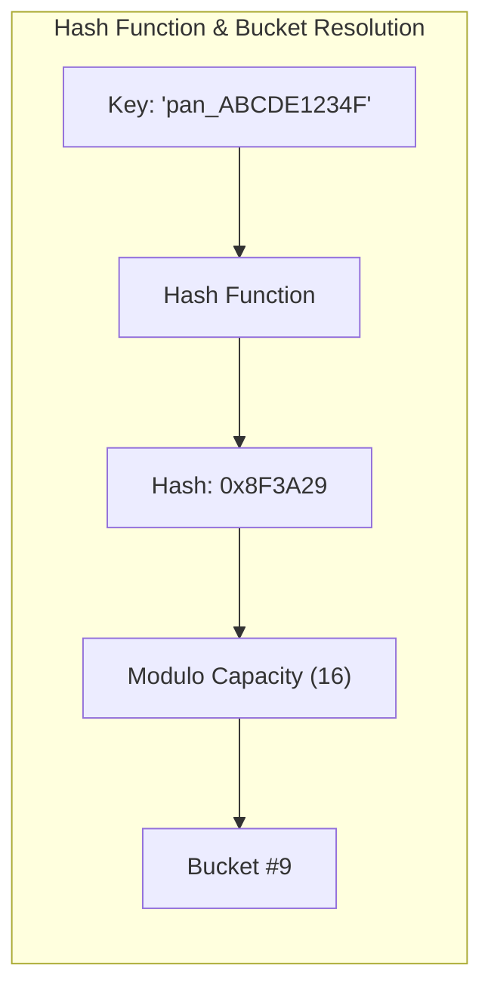

# Hashing Patterns, Hash Tables & Frequency Counting

## 1. Why This Matters
Hash tables are the most ubiquitous data structure in modern backend engineering. At IDFC FIRST Bank, hash maps power distributed session caching, idempotency tracking, fraud velocity checks, and fast in-memory record matching. In coding interviews, recognizing that an $O(N^2)$ brute-force lookup can be converted into an $O(N)$ linear time algorithm using a hash map or hash set is the single most frequent optimization pattern.

---

## 2. Prerequisites
- Understanding of key-value associations.
- Basic knowledge of hash functions and bucket indexing.

---

## 3. Concept

### Hash Map Fundamentals
A hash table maps keys to values by passing the key through a **hash function** to compute an integer hash code, which is then mapped to an internal bucket index using modulo arithmetic:
$$\text{bucket\_index} = \text{hash}(\text{key}) \pmod{\text{capacity}}$$



### Collision Resolution Strategies
1. **Separate Chaining:** Each bucket stores a linked list (or balanced red-black tree, as in Java 8+ `HashMap`) of key-value pairs that hash to the same bucket.
2. **Open Addressing (Linear/Quadratic/Pseudo-random Probing):** All entries reside directly within the bucket array. If a collision occurs, the algorithm systematically probes adjacent or pseudo-random indices until an empty slot is found (used by Python dictionaries).

---

## 4. Simple Example: Two Sum ($O(N)$ Time, $O(N)$ Space)

```python
def two_sum(nums: list[int], target: int) -> list[int]:
    """
    Finds indices of two numbers that add up to target.
    Complexity: O(N) Time, O(N) Space.
    """
    seen = {} # value -> index
    for i, num in enumerate(nums):
        complement = target - num
        if complement in seen:
            return [seen[complement], i]
        seen[num] = i
    return []
```

---

## 5. Real-World Banking Example: Real-Time Fraud Velocity Detection
During a flash sale, card fraud detection rules require checking: *"Has this card transacted more than 3 times in the past 60 seconds?"*
- Scanning the relational transactions table each time would overwhelm the database with disk I/O.
- By maintaining an in-memory hash table (or Redis sorted set / hash), the system can record timestamped attempts by `card_id` and check velocity thresholds in sub-millisecond $O(1)$ time.

---

## 6. Code: Subarray Sum Equals K (Prefix Sum + Hash Map)

### Problem Statement
Given an array of integers `nums` and an integer `k`, return the total number of continuous subarrays whose sum equals to `k`.

### Clarifying Questions
1. *Can elements be negative?* Yes! Because numbers can be negative, a sliding window **cannot** be used because the running sum does not increase monotonically.
2. *Can the array be empty?* Assume $1 \le \text{len} \le 20,000$.

### Intuition: Prefix Sum Complement
Let $\text{pref}[i]$ be the sum of elements from index $0$ to $i$.
A subarray from $j$ to $i$ has sum equal to $k$ if and only if:
$$\text{pref}[i] - \text{pref}[j-1] = k \iff \text{pref}[j-1] = \text{pref}[i] - k$$

By storing the frequency of all previous prefix sums in a hash map, we can instantly look up how many times $\text{pref}[i] - k$ has appeared.

```python
from collections import defaultdict

def subarray_sum_k(nums: list[int], k: int) -> int:
    prefix_counts = defaultdict(int)
    prefix_counts[0] = 1 # Base case: a prefix sum of 0 has occurred once
    
    running_sum = 0
    total_subarrays = 0

    for num in nums:
        running_sum += num
        # Check how many prior prefixes satisfy: running_sum - prior_prefix = k
        complement = running_sum - k
        if complement in prefix_counts:
            total_subarrays += prefix_counts[complement]
            
        prefix_counts[running_sum] += 1

    return total_subarrays

# Test cases
print(subarray_sum_k([1, 1, 1], 2))         # 2 ([1,1] at index 0..1 and 1..2)
print(subarray_sum_k([1, -1, 0], 0))        # 3 ([1,-1], [0], [1,-1,0])
print(subarray_sum_k([3, 4, 7, 2, -3, 1, 4, 2], 7)) # 4
```

- **Time Complexity:** $O(N)$ single pass.
- **Space Complexity:** $O(N)$ to store prefix frequencies in the hash map.
- **Edge Cases:** Array with zeroes, negative numbers, $k = 0$, single element matching $k$.

---

## 7. How It Works Internally: The Hash Collision Vulnerability (HashDoS)
If an attacker knows the hashing algorithm used by an application server (e.g., standard SipHash or MurmurHash without a random seed), they can send thousands of HTTP POST parameters designed to produce identical bucket indices.
- When thousands of keys collide in the same bucket, lookup complexity degrades from $O(1)$ to $O(N)$.
- The server CPU spikes to $100\%$ parsing a single malicious request. Modern runtimes (Node.js/V8, Python 3.4+) randomize the hash seed (`PYTHONHASHSEED`) on startup to prevent HashDoS attacks.

---

## 8. Common Mistakes
1. **Forgetting the Base Case `prefix_counts[0] = 1`:** In prefix sum hashing problems, omitting `prefix_counts[0] = 1` causes the algorithm to miss any valid subarray that begins at index $0$!
2. **Using Mutable Keys in Hash Maps:** Keys in a hash map must be immutable (hashable). In Python, lists cannot be keys (`TypeError: unhashable type: 'list'`); use a `tuple` instead.
3. **Assuming Hash Maps are Ordered Across All Languages:** While Python 3.7+ and JavaScript maintain insertion order, standard hash maps in C++ (`std::unordered_map`) or Go maps do not guarantee order. Never rely on order unless language-guaranteed.

---

## 9. Performance / Complexity Matrix

| Problem / Technique | Brute Force Time | Hash Map Optimized Time | Auxiliary Space |
| :--- | :---: | :---: | :---: |
| **Two Sum** | $O(N^2)$ | $O(N)$ | $O(N)$ |
| **Subarray Sum Equals K** | $O(N^2)$ | $O(N)$ | $O(N)$ |
| **Group Anagrams** | $O(N \cdot K \log K)$ | $O(N \cdot K)$ (Character count key) | $O(N \cdot K)$ |
| **Longest Consecutive Sequence** | $O(N \log N)$ (Sort) | $O(N)$ (Hash Set) | $O(N)$ |

---

## 10. Interview Questions (Easy $\to$ Medium $\to$ Hard)

### Easy
- **Q:** How does a Hash Set differ from a Hash Map under the hood?

### Medium
- **Q:** Given an unsorted array of integers, find the length of the longest consecutive elements sequence in $O(N)$ time.

### Hard
- **Q:** Design an in-memory Key-Value store with `set(key, val)`, `get(key)`, `delete(key)`, and `getRandomKey()` all operating in strictly $O(1)$ worst-case or average time.

---

## 11. Follow-up Questions from Interviewer
- *"In the $O(1)$ Key-Value store with `getRandomKey()`, why is a hash map alone insufficient, and why must you combine a dynamic array with a hash map?"*
- *"How does Java 8's HashMap handle high collision buckets differently than Python's open-addressing dictionary?"*

---

## 12. Model Answer: Longest Consecutive Sequence in $O(N)$ Time

> **Interviewer:** *"Given `[100, 4, 200, 1, 3, 2]`, how do you find the longest consecutive sequence (`[1, 2, 3, 4]` $\to$ length 4) in $O(N)$ without sorting?"*
> 
> **Model Answer:**
> "Sorting takes $O(N \log N)$, so we must use a Hash Set for $O(1)$ lookups.
> 
> The core insight is identifying the **start of a sequence**. A number $x$ can only be the start of a streak if $x - 1$ is NOT present in the set.
> 
> 1. Insert all numbers into a Python `set`.
> 2. Iterate through each number in the set. If $x - 1 \in \text{set}$, we skip it because it is part of an existing streak that will be counted from its true beginning.
> 3. If $x - 1 \notin \text{set}$, we have found the sequence origin. We then enter an inner `while` loop checking for $x+1, x+2, \dots$ until the streak breaks.
> 
> Although there is a nested `while` loop, each number is visited at most twice: once during the set iteration, and at most once during a streak expansion. Therefore, the total time complexity is strictly $O(N)$, with $O(N)$ auxiliary space for the set."

```python
def longest_consecutive(nums: list[int]) -> int:
    num_set = set(nums)
    longest_streak = 0

    for num in num_set:
        # Check if num is the start of a streak
        if num - 1 not in num_set:
            current_num = num
            current_streak = 1

            while current_num + 1 in num_set:
                current_num += 1
                current_streak += 1

            longest_streak = max(longest_streak, current_streak)

    return longest_streak
```

---

## 13. Practical Exercise
Implement **Group Anagrams** without sorting strings (using a 26-element tuple of character frequencies as the hash key) to achieve $O(N \cdot K)$ time complexity where $N$ is word count and $K$ is max word length.

---

## 14. Quick Revision
- Hash map lookup/insert is $O(1)$ average, $O(N)$ worst-case during severe collisions.
- Subarray sum problems with negative numbers require Prefix Sum + Hash Map.
- Keys must be immutable; mutable keys corrupt bucket invariants.
- Python uses open addressing; Java uses separate chaining (converting linked list to red-black tree when bucket size exceeds 8).

---

## 15. Interview Checklist
- [ ] Remembers `prefix_counts[0] = 1` for prefix sum hashing problems.
- [ ] Understands why sliding window fails when negative numbers are present.
- [ ] Can explain how to combine an array and a hash map for $O(1)$ random access deletion.
- [ ] Explains hash seed randomization to mitigate HashDoS.
