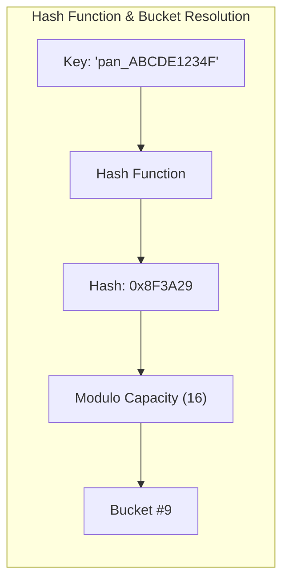

# Hashing Patterns, Hash Tables & Frequency Counting

## 1. Why This Matters
Hash tables are the most ubiquitous data structure in modern backend engineering. At IDFC FIRST Bank, hash maps power distributed session caching, idempotency tracking, fraud velocity checks, and fast in-memory record matching. In coding interviews, recognizing that an O(N²) brute-force lookup can be converted into an O(N) linear time algorithm using a hash map or hash set is the single most frequent optimization pattern.

---

## 2. Prerequisites
- Understanding of key-value associations.
- Basic knowledge of hash functions and bucket indexing.

---

## 3. Concept

### Hash Map Fundamentals
A hash table maps keys to values by passing the key through a **hash function** to compute an integer hash code, which is then mapped to an internal bucket index using modulo arithmetic:
bucket_index = hash(key) mod capacity



### Collision Resolution Strategies
1. **Separate Chaining:** Each bucket stores a linked list (or balanced red-black tree, as in Java 8+ `HashMap`) of key-value pairs that hash to the same bucket.
2. **Open Addressing (Linear/Quadratic/Pseudo-random Probing):** All entries reside directly within the bucket array. If a collision occurs, the algorithm systematically probes adjacent or pseudo-random indices until an empty slot is found (used by Python dictionaries).

---

## 4. Simple Example: Two Sum (O(N) Time, O(N) Space)

```python
def two_sum(nums: list[int], target: int) -> list[int]:
    """
    Finds indices of two numbers that add up to target.
    Complexity: O(N) Time, O(N) Space.
    """
    seen = {} # value -> index
    for i, num in enumerate(nums):
        complement = target - num
        if complement in seen:
            return [seen[complement], i]
        seen[num] = i
    return []
```

---

## 5. Real-World Banking Example: Real-Time Fraud Velocity Detection
During a flash sale, card fraud detection rules require checking: *"Has this card transacted more than 3 times in the past 60 seconds?"*
- Scanning the relational transactions table each time would overwhelm the database with disk I/O.
- By maintaining an in-memory hash table (or Redis sorted set / hash), the system can record timestamped attempts by `card_id` and check velocity thresholds in sub-millisecond O(1) time.

---

## 6. Code: Subarray Sum Equals K (Prefix Sum + Hash Map)

### Problem Statement
Given an array of integers `nums` and an integer `k`, return the total number of continuous subarrays whose sum equals to `k`.

### Clarifying Questions
1. *Can elements be negative?* Yes! Because numbers can be negative, a sliding window **cannot** be used because the running sum does not increase monotonically.
2. *Can the array be empty?* Assume 1 ≤ len ≤ 20,000.

### Intuition: Prefix Sum Complement
Let pref[i] be the sum of elements from index 0 to i.
A subarray from j to i has sum equal to k if and only if:
pref[i] - pref[j-1] = k iff pref[j-1] = pref[i] - k

By storing the frequency of all previous prefix sums in a hash map, we can instantly look up how many times pref[i] - k has appeared.

```python
from collections import defaultdict

def subarray_sum_k(nums: list[int], k: int) -> int:
    prefix_counts = defaultdict(int)
    prefix_counts[0] = 1 # Base case: a prefix sum of 0 has occurred once
    
    running_sum = 0
    total_subarrays = 0

    for num in nums:
        running_sum += num
        # Check how many prior prefixes satisfy: running_sum - prior_prefix = k
        complement = running_sum - k
        if complement in prefix_counts:
            total_subarrays += prefix_counts[complement]
            
        prefix_counts[running_sum] += 1

    return total_subarrays

# Test cases
print(subarray_sum_k([1, 1, 1], 2))         # 2 ([1,1] at index 0..1 and 1..2)
print(subarray_sum_k([1, -1, 0], 0))        # 3 ([1,-1], [0], [1,-1,0])
print(subarray_sum_k([3, 4, 7, 2, -3, 1, 4, 2], 7)) # 4
```

- **Time Complexity:** O(N) single pass.
- **Space Complexity:** O(N) to store prefix frequencies in the hash map.
- **Edge Cases:** Array with zeroes, negative numbers, k = 0, single element matching k.

---

## 7. How It Works Internally: The Hash Collision Vulnerability (HashDoS)
If an attacker knows the hashing algorithm used by an application server (e.g., standard SipHash or MurmurHash without a random seed), they can send thousands of HTTP POST parameters designed to produce identical bucket indices.
- When thousands of keys collide in the same bucket, lookup complexity degrades from O(1) to O(N).
- The server CPU spikes to 100% parsing a single malicious request. Modern runtimes (Node.js/V8, Python 3.4+) randomize the hash seed (`PYTHONHASHSEED`) on startup to prevent HashDoS attacks.

---

## 8. Common Mistakes
1. **Forgetting the Base Case `prefix_counts[0] = 1`:** In prefix sum hashing problems, omitting `prefix_counts[0] = 1` causes the algorithm to miss any valid subarray that begins at index 0!
2. **Using Mutable Keys in Hash Maps:** Keys in a hash map must be immutable (hashable). In Python, lists cannot be keys (`TypeError: unhashable type: 'list'`); use a `tuple` instead.
3. **Assuming Hash Maps are Ordered Across All Languages:** While Python 3.7+ and JavaScript maintain insertion order, standard hash maps in C++ (`std::unordered_map`) or Go maps do not guarantee order. Never rely on order unless language-guaranteed.

---

## 9. Performance / Complexity Matrix

| Problem / Technique | Brute Force Time | Hash Map Optimized Time | Auxiliary Space |
| :--- | :---: | :---: | :---: |
| **Two Sum** | O(N²) | O(N) | O(N) |
| **Subarray Sum Equals K** | O(N²) | O(N) | O(N) |
| **Group Anagrams** | O(N * K log K) | O(N * K) (Character count key) | O(N * K) |
| **Longest Consecutive Sequence** | O(N log N) (Sort) | O(N) (Hash Set) | O(N) |

---

### 🟢 Easy Question: Hash Set vs Hash Map Internals
**Q:** How does a Hash Set differ from a Hash Map under the hood in Python and Java, and why can't a mutable list be used as a key?

**Complete Answer:**
1. **Under the Hood Architecture:**
   - In Java, `HashSet<E>` is literally a wrapper around an internal `HashMap<E, Object>` instance where every element `e` is inserted as `map.put(e, DUMMY_OBJECT)`.
   - In Python, `set` and `dict` share nearly identical CPython internal hash table implementations (open addressing with quadratic/perturbation probing), but a `set` stores only `setentry` structs containing `{hash, key}` without allocating space for value pointers, saving approximately 33% memory compared to `dict`.
2. **Why Mutable Keys Corrupt the Hash Table:**
   - When a key is inserted, its bucket index is computed as: `bucket = hash(key) mod capacity`.
   - If the key were mutable (like a Python `list`) and modified after insertion, its `hash(key)` would change!
   - When you subsequently call `key in map`, the engine recomputes `hash(key) mod capacity`, lands on a completely different bucket, and returns `False` or raises an internal exception. The original entry is now permanently orphaned in memory.
   - Therefore, languages enforce that keys must implement an immutable `__hash__()` and `__eq__()` protocol.

---

### 🟠 Medium Question: Longest Consecutive Sequence in O(N) Time
**Q:** Given an unsorted array of integers, find the length of the longest consecutive elements sequence in strictly `O(N)` time without sorting.

**Complete Answer:**
Sorting takes `O(N log N)`, so we must use a Hash Set for `O(1)` lookups.
1. Insert all numbers into a Python `set`.
2. A number `x` is the start of a streak if and only if `x - 1` is NOT in the set.
3. If `x - 1 in num_set`, skip it immediately (it will be counted from its true origin).
4. If `x - 1 not in num_set`, run a `while` loop checking `x + 1, x + 2, ...`.
5. Each number is visited at most twice. Total time is strictly `O(N)`.

```python
def longest_consecutive(nums: list[int]) -> int:
    """Finds longest consecutive elements sequence in O(N) time.
    Auxiliary Space: O(N) for the hash set.
    """
    num_set = set(nums)
    longest_streak = 0

    for num in num_set:
        # Only start counting if num is the beginning of a streak
        if num - 1 not in num_set:
            current_num = num
            current_streak = 1

            while current_num + 1 in num_set:
                current_num += 1
                current_streak += 1

            longest_streak = max(longest_streak, current_streak)

    return longest_streak

# Verification
assert longest_consecutive([100, 4, 200, 1, 3, 2]) == 4 # [1, 2, 3, 4]
assert longest_consecutive([0, 3, 7, 2, 5, 8, 4, 6, 0, 1]) == 9
assert longest_consecutive([]) == 0
```

---

### 🔴 Hard Question: Design an O(1) Key-Value Store with `getRandomKey()`
**Q:** Design a data structure supporting `insert(val)`, `remove(val)`, and `getRandom()` all executing in strictly **O(1) average time**.

**Complete Answer:**
- **The Challenge:**
  - A Hash Map provides O(1) `insert` and `remove`, but picking a random element uniformly requires O(N) iteration or random bucket sampling with non-deterministic tombstones.
  - An Array provides O(1) `getRandom` via `arr[random.randint(0, len - 1)]`, but removing an arbitrary element takes O(N) due to element shifting.
- **The Hybrid Solution (Map + Array with Swap-to-End Deletion):**
  - Use a dynamic array `self.values` to store items contiguously.
  - Use a hash map `self.indices` mapping `val -> array_index`.
  - **O(1) Deletion:**
    1. Look up `idx = self.indices[val]`.
    2. Swap `self.values[idx]` with `self.values[-1]` (the last element).
    3. Update `self.indices[last_val] = idx`.
    4. Call `self.values.pop()` and `del self.indices[val]`. Both operations are strictly O(1)!

```python
import random

class RandomizedSet:
    """Data structure with O(1) insert, remove, and uniform getRandom."""
    def __init__(self):
        self.indices: dict[int, int] = {}
        self.values: list[int] = []

    def insert(self, val: int) -> bool:
        if val in self.indices:
            return False
        self.indices[val] = len(self.values)
        self.values.append(val)
        return True

    def remove(self, val: int) -> bool:
        if val not in self.indices:
            return False
        # Swap with last element to avoid O(N) shift
        idx_to_remove = self.indices[val]
        last_val = self.values[-1]

        self.values[idx_to_remove] = last_val
        self.indices[last_val] = idx_to_remove

        # Evict last element
        self.values.pop()
        del self.indices[val]
        return True

    def getRandom(self) -> int:
        return random.choice(self.values)

# Verification
rs = RandomizedSet()
assert rs.insert(10) == True
assert rs.insert(20) == True
assert rs.insert(10) == False # Already exists
assert rs.remove(10) == True
assert rs.getRandom() == 20
```

---

## 11. Follow-up Questions from Interviewer with Complete Answers

### 🎤 Follow-up 1
**Interviewer:** *"In the O(1) RandomizedSet, why is a hash map alone mathematically insufficient to achieve uniform random sampling in O(1) time?"*

**Complete Answer:**
- **Non-Contiguous Bucket Layout:**
  - A hash map's internal buffer contains allocated capacity (e.g., 64 buckets) where only a fraction of buckets contain active keys, and others contain `EMPTY` or `DUMMY`/tombstone markers.
  - If you generate a random integer `rand_idx = random(0, capacity - 1)`:
    - If `bucket[rand_idx]` is empty or a tombstone, you must probe linearly or re-roll until a valid key is found (rejection sampling).
    - As the load factor drops (e.g., after many deletions where tombstones dominate), the expected number of re-rolls diverges, destroying the deterministic O(1) bound.
  - Converting hash map keys to an array (`list(map.keys())`) takes **O(N) time and O(N) auxiliary memory**.
- **The Invariant:** Uniform random selection in guaranteed O(1) time mathematically requires a **dense, contiguous memory array of size K** where every index `0 <= idx < K` maps to an active element with probability exactly `1 / K`.

---

### 🎤 Follow-up 2
**Interviewer:** *"How does Java 8's HashMap handle high collision buckets differently than Python's open-addressing dictionary? What are the security and performance implications?"*

**Complete Answer:**
1. **Collision Resolution Mechanisms:**
   - **Java 8 (Separate Chaining with Treeification):**
     - Each hash table bucket starts as a singly linked list (`Node<K,V>`).
     - If multiple keys collide in the same bucket, entries are appended to the linked list.
     - **Treeification:** When the number of collisions in a single bucket reaches **8** (TREEIFY_THRESHOLD) and total table capacity is at least 64, Java converts that linked list into a balanced **Red-Black Tree (`TreeNode<K,V>`)**!
     - When bucket entries drop to 6 (UNTREEIFY_THRESHOLD), it converts back to a linked list.
     - **Worst-Case Lookup Time:** Guaranteed **O(log N)** even if an attacker attempts a HashDoS collision attack!
   - **Python 3.7+ (Compact Open Addressing):**
     - Python does not use separate chaining or trees. All entries reside directly in a dense array.
     - In the event of a collision, Python computes secondary probe locations using a pseudo-random perturbation formula: `probe = ((5 * probe) + 1 + (hash >> 5)) mod capacity`.
     - **Worst-Case Lookup Time:** If all keys collide, lookup degrades to **O(N)**.
2. **Security Implications (HashDoS Defense):**
   - Because Python's worst-case is O(N), Python relies on **hash seed randomization** (`PYTHONHASHSEED`). At startup, CPython initializes a random 128-bit secret seed for SipHash-13/24, making it mathematically impossible for an attacker to precompute colliding strings.
   - Java provides defensive algorithmic resilience via Red-Black Trees (O(log N)), so even if collisions are forced, the JVM CPU does not saturate.


---

## 13. Practical Exercise
Implement **Group Anagrams** without sorting strings (using a 26-element tuple of character frequencies as the hash key) to achieve O(N * K) time complexity where N is word count and K is max word length.

---

## 14. Quick Revision
- Hash map lookup/insert is O(1) average, O(N) worst-case during severe collisions.
- Subarray sum problems with negative numbers require Prefix Sum + Hash Map.
- Keys must be immutable; mutable keys corrupt bucket invariants.
- Python uses open addressing; Java uses separate chaining (converting linked list to red-black tree when bucket size exceeds 8).

---

## 15. Interview Checklist
- [ ] Remembers `prefix_counts[0] = 1` for prefix sum hashing problems.
- [ ] Understands why sliding window fails when negative numbers are present.
- [ ] Can explain how to combine an array and a hash map for O(1) random access deletion.
- [ ] Explains hash seed randomization to mitigate HashDoS.
