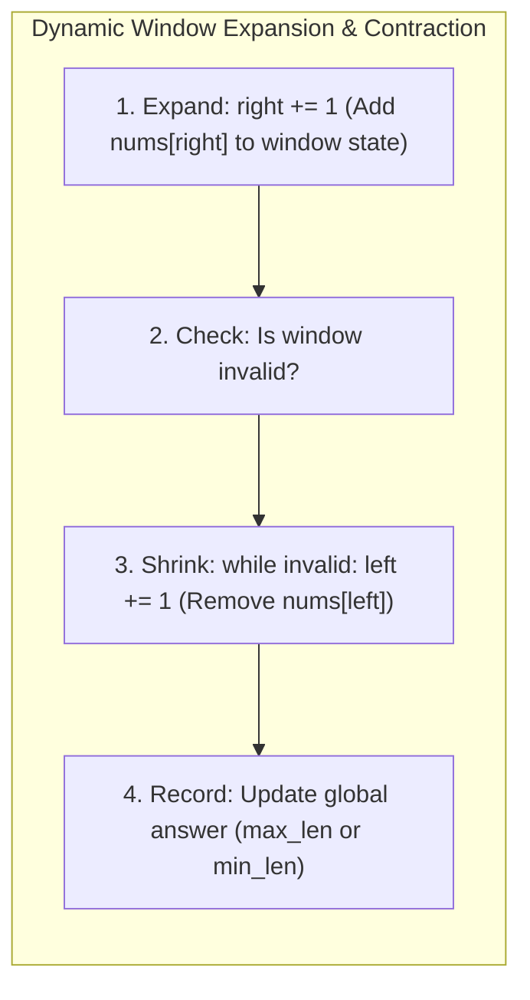

# Sliding Window Algorithmic Patterns

## 1. Why This Matters
Sliding window algorithms are among the most frequently tested algorithmic techniques at IDFC FIRST Bank and across the FinTech industry. They appear in problems involving contiguous subarrays, string substrings, rolling rate limiters, burst traffic detection, and streaming transaction analytics. The sliding window reduces $O(N^2)$ brute-force window evaluations into optimal $O(N)$ linear time.

---

## 2. Prerequisites
- Two-pointer basics.
- Hash map and hash set frequency tracking.

---

## 3. Concept

### Types of Sliding Windows
1. **Fixed-Size Window:** The window length $K$ is constant. As the right pointer advances, the left pointer advances simultaneously (`left = right - K + 1`), adding the incoming element and removing the outgoing element in $O(1)$.
2. **Dynamic / Variable-Size Window:** The window expands by advancing the `right` pointer to satisfy an invariant, and contracts by advancing the `left` pointer when the invariant is violated (e.g., finding the shortest or longest subarray meeting a condition).



---

## 4. Simple Example: Maximum Sum Subarray of Fixed Size K

```python
def max_sub_array_fixed(nums: list[int], k: int) -> int:
    """
    Finds maximum sum of any contiguous subarray of size k.
    Complexity: O(N) Time, O(1) Space.
    """
    if len(nums) < k:
        return 0

    # Initial window sum
    window_sum = sum(nums[:k])
    max_sum = window_sum

    # Slide window
    for right in range(k, len(nums)):
        window_sum += nums[right] - nums[right - k] # Add incoming, subtract outgoing
        max_sum = max(max_sum, window_sum)

    return max_sum
```

---

## 5. Real-World Banking Example: Rolling Rate Limiter & Transaction Spikes
To prevent card testing attacks, an API gateway monitors incoming payment attempts: *"Has a merchant terminal initiated more than 100 requests in any rolling 60-second window?"*
- A sliding window tracks request timestamps. As time moves forward, timestamps older than 60 seconds expire from the left edge of the window, maintaining continuous real-time throughput metrics without resetting on artificial minute boundaries.

---

## 6. Code: Longest Substring Without Repeating Characters

### Problem Statement
Given a string `s`, find the length of the **longest substring** without repeating characters.

### Clarifying Questions
1. *What characters can the string contain?* English letters, digits, symbols, and spaces.
2. *Can the input be empty?* Yes, empty string returns 0.

### Brute Force Approach
Check every possible substring ($O(N^2)$), and for each check whether all characters are unique using a set ($O(N)$).
- **Time Complexity:** $O(N^3)$
- **Space Complexity:** $O(\min(N, M))$ where $M$ is alphabet size.

### Optimized Approach: Dynamic Sliding Window with Last Seen Index Map
Instead of shrinking the window one character at a time, store the **most recent index** where each character was seen. When a duplicate character is encountered, jump `left` directly past the previous instance of that character:
$$\text{left} = \max(\text{left}, \text{last\_seen}[\text{char}] + 1)$$

```python
def length_of_longest_substring(s: str) -> int:
    last_seen = {} # char -> index
    left = 0
    max_len = 0

    for right, char in enumerate(s):
        # If char was seen and is within the current window
        if char in last_seen and last_seen[char] >= left:
            left = last_seen[char] + 1
            
        last_seen[char] = right
        max_len = max(max_len, right - left + 1)

    return max_len

# Test cases
print(length_of_longest_substring("abcabcbb")) # 3 ("abc")
print(length_of_longest_substring("bbbbb"))    # 1 ("b")
print(length_of_longest_substring("pwwkew"))   # 3 ("wke")
print(length_of_longest_substring(""))         # 0
```

- **Time Complexity:** $O(N)$ (Each character is processed at most once by `right`).
- **Space Complexity:** $O(\min(N, M))$ where $M$ is the character set size (e.g., 128 for ASCII).
- **Edge Cases:** Empty string, string with all unique characters, string with identical characters, strings with spaces and punctuation.

---

## 7. How It Works Internally: Amortized Analysis of Sliding Windows
Junior engineers often mistakenly evaluate dynamic sliding windows as $O(N^2)$ because they see a `while` loop nested inside a `for` loop:

```python
for right in range(n):
    while window_is_invalid():
        left += 1
```

**Why it is strictly $O(N)$ Amortized:**
- The `right` pointer increments exactly $N$ times.
- The `left` pointer only ever moves forward; it *never* decrements or resets.
- Therefore, across the entire execution of the algorithm, `left` increments at most $N$ times.
- Total pointer operations $= N + N = 2N \implies O(N)$ time.

---

## 8. Common Mistakes
1. **Forgetting `last_seen[char] >= left`:** In the index jump optimization, if a character was seen at index 1, but `left` has already advanced to index 5, forgetting this check pulls `left` *backwards*, corrupting the window!
2. **Incorrect Window Size Calculation:** Window length is always $\text{right} - \text{left} + 1$ (inclusive), not $\text{right} - \text{left}$.
3. **Attempting Sliding Window on Negative Number Arrays:** Finding a subarray summing to $K$ cannot use a sliding window when negative numbers are present, because expanding the window can *decrease* the sum.

---

## 9. Performance / Complexity Matrix

| Problem | Naive Time | Sliding Window Time | Auxiliary Space |
| :--- | :---: | :---: | :---: |
| **Max Sum Subarray of Size K** | $O(N \cdot K)$ | $O(N)$ | $O(1)$ |
| **Longest Substring Without Repeating Characters** | $O(N^3)$ | $O(N)$ | $O(M)$ |
| **Minimum Size Subarray Sum** | $O(N^2)$ | $O(N)$ | $O(1)$ |
| **Sliding Window Maximum** | $O(N \cdot K)$ | $O(N)$ (Monotonic Deque) | $O(K)$ |

---

## 10. Interview Questions (Easy $\to$ Medium $\to$ Hard)

### Easy
- **Q:** Explain how a fixed-size sliding window updates its running sum in $O(1)$ time.

### Medium
- **Q:** Given an array of positive integers `nums` and a positive integer `target`, find the minimal length of a contiguous subarray of which the sum is greater than or equal to `target`. If there is no such subarray, return 0.

### Hard
- **Q:** You are given an array of integers `nums`, there is a sliding window of size `k` which is moving from the very left of the array to the very right. Return the max sliding window. Solve it in $O(N)$ time using a Monotonic Deque.

---

## 11. Follow-up Questions from Interviewer
- *"In the Monotonic Deque solution for Sliding Window Maximum, why do we store indices in the deque rather than values?"*
  *(Answer: Storing indices allows us to verify whether the oldest element has fallen out of the sliding window: `deque[0] <= right - k`).*
- *"How does a leaky bucket rate limiter algorithm differ conceptually from a sliding window log rate limiter?"*

---

## 12. Model Answer: Minimum Size Subarray Sum

> **Interviewer:** *"Walk me through how you solve Minimum Size Subarray Sum in $O(N)$."*
> 
> **Model Answer:**
> "Because all numbers in `nums` are strictly positive, the cumulative sum within a window increases monotonically as we expand `right`, and decreases monotonically as we shrink `left`. This satisfies the sliding window property.
> 
> 1. We maintain a running `current_sum` and initialize `min_len = infinity`.
> 2. We expand the window by adding `nums[right]` to `current_sum`.
> 3. Once `current_sum >= target`, we attempt to minimize the window: while `current_sum >= target`, we update `min_len = min(min_len, right - left + 1)`, subtract `nums[left]` from `current_sum`, and increment `left`.
> 4. Because each element enters the window once via `right` and leaves at most once via `left`, the total operations are bounded by $2N$. Time complexity is strictly $O(N)$, and auxiliary space is $O(1)$."

```python
def min_sub_array_len(target: int, nums: list[int]) -> int:
    left = 0
    current_sum = 0
    min_len = float("inf")

    for right in range(len(nums)):
        current_sum += nums[right]

        while current_sum >= target:
            min_len = min(min_len, right - left + 1)
            current_sum -= nums[left]
            left += 1

    return min_len if min_len != float("inf") else 0
```

---

## 13. Practical Exercise
Implement **Sliding Window Maximum** in $O(N)$ using Python's `collections.deque`:
Maintain a deque of indices where values are strictly in descending order. Before appending `right`, pop all smaller elements from the back of the deque. Pop the front element if its index is $\le \text{right} - k$.

---

## 14. Quick Revision
- Fixed window: `window_sum += incoming - outgoing`.
- Dynamic window: expand with `right`, shrink with `left` while condition holds.
- Complexity is $O(N)$ amortized because each element is visited at most twice.
- Window size $= \text{right} - \text{left} + 1$.
- Negative numbers invalidate sliding window monotonicity; use Prefix Sum + Hash Map instead.

---

## 15. Interview Checklist
- [ ] Writes Longest Substring Without Repeating Characters with index jumps.
- [ ] Proves $O(N)$ amortized complexity for nested while loop.
- [ ] Remembers that sliding window requires positive numbers for sum thresholds.
- [ ] Understands Monotonic Deque for Sliding Window Maximum.
