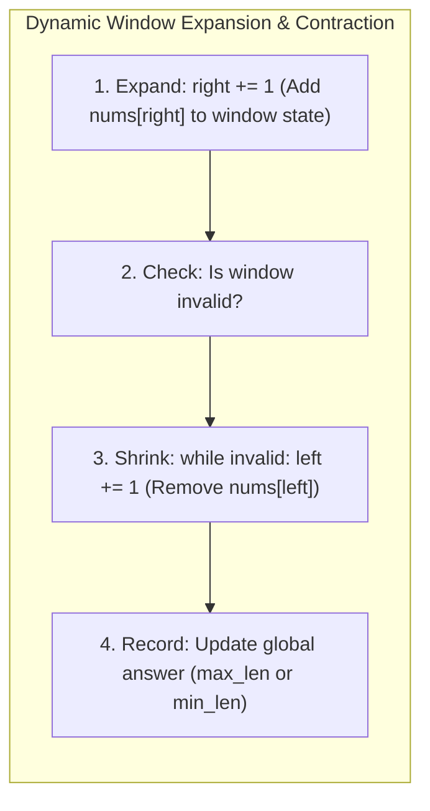

# Sliding Window Algorithmic Patterns

## 1. Why This Matters
Sliding window algorithms are among the most frequently tested algorithmic techniques at IDFC FIRST Bank and across the FinTech industry. They appear in problems involving contiguous subarrays, string substrings, rolling rate limiters, burst traffic detection, and streaming transaction analytics. The sliding window reduces O(N²) brute-force window evaluations into optimal O(N) linear time.

---

## 2. Prerequisites
- Two-pointer basics.
- Hash map and hash set frequency tracking.

---

## 3. Concept

### Types of Sliding Windows
1. **Fixed-Size Window:** The window length K is constant. As the right pointer advances, the left pointer advances simultaneously (`left = right - K + 1`), adding the incoming element and removing the outgoing element in O(1).
2. **Dynamic / Variable-Size Window:** The window expands by advancing the `right` pointer to satisfy an invariant, and contracts by advancing the `left` pointer when the invariant is violated (e.g., finding the shortest or longest subarray meeting a condition).



---

## 4. Simple Example: Maximum Sum Subarray of Fixed Size K

```python
def max_sub_array_fixed(nums: list[int], k: int) -> int:
    """
    Finds maximum sum of any contiguous subarray of size k.
    Complexity: O(N) Time, O(1) Space.
    """
    if len(nums) < k:
        return 0

    # Initial window sum
    window_sum = sum(nums[:k])
    max_sum = window_sum

    # Slide window
    for right in range(k, len(nums)):
        window_sum += nums[right] - nums[right - k] # Add incoming, subtract outgoing
        max_sum = max(max_sum, window_sum)

    return max_sum
```

---

## 5. Real-World Banking Example: Rolling Rate Limiter & Transaction Spikes
To prevent card testing attacks, an API gateway monitors incoming payment attempts: *"Has a merchant terminal initiated more than 100 requests in any rolling 60-second window?"*
- A sliding window tracks request timestamps. As time moves forward, timestamps older than 60 seconds expire from the left edge of the window, maintaining continuous real-time throughput metrics without resetting on artificial minute boundaries.

---

## 6. Code: Longest Substring Without Repeating Characters

### Problem Statement
Given a string `s`, find the length of the **longest substring** without repeating characters.

### Clarifying Questions
1. *What characters can the string contain?* English letters, digits, symbols, and spaces.
2. *Can the input be empty?* Yes, empty string returns 0.

### Brute Force Approach
Check every possible substring (O(N²)), and for each check whether all characters are unique using a set (O(N)).
- **Time Complexity:** O(N³)
- **Space Complexity:** O(min(N, M)) where M is alphabet size.

### Optimized Approach: Dynamic Sliding Window with Last Seen Index Map
Instead of shrinking the window one character at a time, store the **most recent index** where each character was seen. When a duplicate character is encountered, jump `left` directly past the previous instance of that character:
left = max(left, last_seen[char] + 1)

```python
def length_of_longest_substring(s: str) -> int:
    last_seen = {} # char -> index
    left = 0
    max_len = 0

    for right, char in enumerate(s):
        # If char was seen and is within the current window
        if char in last_seen and last_seen[char] >= left:
            left = last_seen[char] + 1
            
        last_seen[char] = right
        max_len = max(max_len, right - left + 1)

    return max_len

# Test cases
print(length_of_longest_substring("abcabcbb")) # 3 ("abc")
print(length_of_longest_substring("bbbbb"))    # 1 ("b")
print(length_of_longest_substring("pwwkew"))   # 3 ("wke")
print(length_of_longest_substring(""))         # 0
```

- **Time Complexity:** O(N) (Each character is processed at most once by `right`).
- **Space Complexity:** O(min(N, M)) where M is the character set size (e.g., 128 for ASCII).
- **Edge Cases:** Empty string, string with all unique characters, string with identical characters, strings with spaces and punctuation.

---

## 7. How It Works Internally: Amortized Analysis of Sliding Windows
Junior engineers often mistakenly evaluate dynamic sliding windows as O(N²) because they see a `while` loop nested inside a `for` loop:

```python
for right in range(n):
    while window_is_invalid():
        left += 1
```

**Why it is strictly O(N) Amortized:**
- The `right` pointer increments exactly N times.
- The `left` pointer only ever moves forward; it *never* decrements or resets.
- Therefore, across the entire execution of the algorithm, `left` increments at most N times.
- Total pointer operations = N + N = 2N ⟹ O(N) time.

---

## 8. Common Mistakes
1. **Forgetting `last_seen[char] >= left`:** In the index jump optimization, if a character was seen at index 1, but `left` has already advanced to index 5, forgetting this check pulls `left` *backwards*, corrupting the window!
2. **Incorrect Window Size Calculation:** Window length is always right - left + 1 (inclusive), not right - left.
3. **Attempting Sliding Window on Negative Number Arrays:** Finding a subarray summing to K cannot use a sliding window when negative numbers are present, because expanding the window can *decrease* the sum.

---

## 9. Performance / Complexity Matrix

| Problem | Naive Time | Sliding Window Time | Auxiliary Space |
| :--- | :---: | :---: | :---: |
| **Max Sum Subarray of Size K** | O(N * K) | O(N) | O(1) |
| **Longest Substring Without Repeating Characters** | O(N³) | O(N) | O(M) |
| **Minimum Size Subarray Sum** | O(N²) | O(N) | O(1) |
| **Sliding Window Maximum** | O(N * K) | O(N) (Monotonic Deque) | O(K) |

---

### 🟢 Easy Question: Fixed-Size Window Running Sum
**Q:** Explain how a fixed-size sliding window of size `K` calculates the maximum sum of any contiguous subarray in `O(N)` time and `O(1)` auxiliary space.

**Complete Answer:**
Rather than re-summing `K` elements in `O(K)` at every step (which would be `O(N * K)`), compute the sum of the first `K` elements once. Then slide the window from `i = K` to `N - 1`: add the incoming element `arr[i]` and subtract the outgoing element `arr[i - K]`. Each update is strictly `O(1)`.

```python
def max_sub_array_of_size_k(k: int, arr: list[int]) -> int:
    """Computes maximum subarray sum of fixed window size k.
    Time Complexity: O(N).
    Auxiliary Space: O(1).
    """
    if len(arr) < k:
        return 0

    window_sum = sum(arr[:k])
    max_sum = window_sum

    for i in range(k, len(arr)):
        window_sum += arr[i] - arr[i - k] # O(1) state delta
        max_sum = max(max_sum, window_sum)

    return max_sum

# Verification
assert max_sub_array_of_size_k(3, [2, 1, 5, 1, 3, 2]) == 9 # [5, 1, 3] = 9
```

---

### 🟠 Medium Question: Minimum Size Subarray Sum
**Q:** Given an array of positive integers `nums` and a positive integer `target`, find the minimal length of a contiguous subarray of which the sum is greater than or equal to `target`. If there is no such subarray, return 0.

**Complete Answer:**
Because all numbers in `nums` are strictly positive, the cumulative sum within a window increases monotonically as we expand `right`, and decreases monotonically as we shrink `left`.
1. Expand window: add `nums[right]` to `current_sum`.
2. While `current_sum >= target`, record candidate length `right - left + 1`, subtract `nums[left]`, and increment `left`.
3. Each index is visited at most twice (once by `right`, once by `left`).

```python
def min_sub_array_len(target: int, nums: list[int]) -> int:
    """Finds minimum length subarray with sum >= target.
    Time Complexity: O(N) amortized.
    Auxiliary Space: O(1).
    """
    left = 0
    current_sum = 0
    min_len = float("inf")

    for right in range(len(nums)):
        current_sum += nums[right]

        while current_sum >= target:
            min_len = min(min_len, right - left + 1)
            current_sum -= nums[left]
            left += 1

    return min_len if min_len != float("inf") else 0

# Verification
assert min_sub_array_len(7, [2, 3, 1, 2, 4, 3]) == 2 # [4, 3] length 2
assert min_sub_array_len(11, [1, 1, 1, 1, 1]) == 0
```

---

### 🔴 Hard Question: Sliding Window Maximum via Monotonic Deque
**Q:** Given an integer array `nums` and a sliding window of size `k` moving from left to right, return the maximum element in each window. Solve in strictly **O(N) time** and **O(k) space**.

**Complete Answer:**
A naive scan takes `O(N * k)`. A max-heap takes `O(N log k)`. To achieve strictly `O(N)`, use a **Monotonic Deque** storing array *indices*:
- Maintain elements in strictly decreasing order of their values (`deque[0]` is always the largest element in the current window).
- For each new element `nums[i]`:
  1. Remove expired elements from the front: `while q and q[0] <= i - k: q.popleft()`.
  2. Maintain monotonic invariant from the back: `while q and nums[q[-1]] <= nums[i]: q.pop()`.
  3. Append `i` to the back.
  4. Once `i >= k - 1`, the maximum of the current window is `nums[q[0]]`.

```python
from collections import deque

def max_sliding_window(nums: list[int], k: int) -> list[int]:
    """Finds maximum value in each sliding window of size k in O(N) time."""
    q = deque() # Stores indices
    result = []

    for i in range(len(nums)):
        # 1. Remove indices outside current window
        if q and q[0] <= i - k:
            q.popleft()

        # 2. Maintain decreasing monotonic order
        while q and nums[q[-1]] <= nums[i]:
            q.pop()

        # 3. Add current element index
        q.append(i)

        # 4. Record current window maximum
        if i >= k - 1:
            result.append(nums[q[0]])

    return result

# Verification
assert max_sliding_window([1, 3, -1, -3, 5, 3, 6, 7], 3) == [3, 3, 5, 5, 6, 7]
assert max_sliding_window([1], 1) == [1]
```

---

## 11. Follow-up Questions from Interviewer with Complete Answers

### 🎤 Follow-up 1
**Interviewer:** *"In the Monotonic Deque solution for Sliding Window Maximum, why do we store indices in the deque rather than values?"*

**Complete Answer:**
- **Boundary Verification:** If we stored values in the deque, we would have no way to determine whether the front element (`deque[0]`) has physically fallen outside the sliding window when duplicate values exist in the array.
- **Example:** Suppose `nums = [3, 3, 3, 1]`, `k = 2`.
  - Storing values: we cannot differentiate whether the `3` at the front of the deque belongs to index 0 (which has expired at `i = 2`) or index 1 (which is still active).
  - Storing indices: the condition `q[0] <= i - k` deterministically checks whether the element's index has expired. We access the actual value in O(1) via `nums[q[0]]`.
- **Amortized Proof:** Every index enters the deque exactly once and is evicted at most once (either from the front when it expires, or from the back when surpassed by a larger number). Total operations across N elements are bounded by `2N = O(N)`.

---

### 🎤 Follow-up 2
**Interviewer:** *"How does a Leaky Bucket rate limiter differ from a Sliding Window Log rate limiter in banking payment gateways? How do you implement Sliding Window Log using Redis?"*

**Complete Answer:**
1. **Algorithmic Comparison:**
   - **Leaky Bucket:** Requests enter a buffer and leak out at a strictly constant rate (e.g., exactly 100 txns/sec to the core banking switch). Smooths out bursty traffic, but adds queuing latency during bursts.
   - **Token Bucket:** Tokens are replenished at a constant rate up to capacity. Allows immediate processing of short traffic bursts up to the token limit.
   - **Sliding Window Log:** Records each transaction timestamp in a sliding time window (e.g., last 60 seconds). Provides exact mathematical rate limiting without boundary-edge burst vulnerabilities (unlike Fixed Window Counter).
2. **Redis Implementation of Sliding Window Log:**
   - Use a **Redis Sorted Set (ZSET)** where `key = f"rate_limit:{vpa_id}"`, `score = current_unix_timestamp_ms`, and `member = transaction_uuid`.
   - In a single atomic Lua script:
     1. Remove timestamps older than `now - window_size_ms`: `ZREMRANGEBYSCORE key 0 (now - window_size_ms)`.
     2. Count current elements in window: `current_count = ZCARD key`.
     3. If `current_count < limit`:
        - `ZADD key now uuid`.
        - `EXPIRE key window_seconds`.
        - Return 1 (Allow).
     4. Else:
        - Return 0 (Block / HTTP 429 Too Many Requests).

```python
import time

def simulate_sliding_window_rate_limiter(requests_log: list[float], limit: int, window_sec: float) -> list[bool]:
    """Simulates sliding window log rate limiter."""
    allowed = []
    active_window = []

    for req_time in requests_log:
        # Evict timestamps older than window boundary
        cutoff = req_time - window_sec
        active_window = [t for t in active_window if t > cutoff]

        if len(active_window) < limit:
            active_window.append(req_time)
            allowed.append(True)
        else:
            allowed.append(False)

    return allowed

# Verification: Limit 3 requests per 5.0 seconds
req_times = [1.0, 2.0, 3.0, 4.0, 7.0] # at t=4.0, 4th request within 5s is rejected
assert simulate_sliding_window_rate_limiter(req_times, 3, 5.0) == [True, True, True, False, True]
```

---

## 13. Practical Exercise
Implement **Sliding Window Maximum** in O(N) using Python's `collections.deque`:
Maintain a deque of indices where values are strictly in descending order. Before appending `right`, pop all smaller elements from the back of the deque. Pop the front element if its index is ≤ right - k.

---

## 14. Quick Revision
- Fixed window: `window_sum += incoming - outgoing`.
- Dynamic window: expand with `right`, shrink with `left` while condition holds.
- Complexity is O(N) amortized because each element is visited at most twice.
- Window size = right - left + 1.
- Negative numbers invalidate sliding window monotonicity; use Prefix Sum + Hash Map instead.

---

## 15. Interview Checklist
- [ ] Writes Longest Substring Without Repeating Characters with index jumps.
- [ ] Proves O(N) amortized complexity for nested while loop.
- [ ] Remembers that sliding window requires positive numbers for sum thresholds.
- [ ] Understands Monotonic Deque for Sliding Window Maximum.
