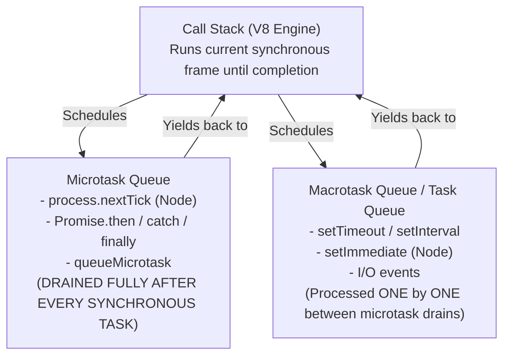

# JavaScript Event Loop, V8 Call Stack & Microtask Scheduling

## 1. Why This Matters
While Node.js integrates libuv for operating system interactions, JavaScript itself relies on the **V8 Engine** for memory management, the call stack, and microtask scheduling. In IDFC FIRST Bank technical interviews, senior engineers test whether you can predict the exact asynchronous execution sequence of complex nested Promises, async/await blocks, and microtasks, and understand how the browser and Node runtime environments manage non-blocking concurrency.

---

## 2. Prerequisites
- JavaScript execution contexts, call stack, and hoisting.
- Promises, `then()` chaining, and `async/await` syntax.

---

## 3. Concept

### The JavaScript Concurrency Model
JavaScript is a **single-threaded non-blocking** language with a run-to-completion model. A single Call Stack can only execute one statement at any instant. Asynchronous operations do not execute in parallel on the call stack; their callbacks are queued and deferred.



---

## 4. Simple Example: The Microtask Priority Queue

```javascript
console.log('A');

setTimeout(() => {
    console.log('B');
}, 0);

Promise.resolve()
    .then(() => {
        console.log('C');
        return Promise.resolve('D');
    })
    .then((val) => {
        console.log(val);
    });

console.log('E');

/*
Output:
A
E
C
D
B
*/
```

---

## 5. Real-World Banking Example: Atomic Transaction State Transition
In a banking frontend or Node API gateway handling fund transfers, updating UI state or dispatching background analytics must not interrupt transactional balance verification:
- State validation and atomic balance checks run synchronously or via **microtasks** (`queueMicrotask` / `Promise`), ensuring they finish *before* the browser repaints the DOM or before the network macrotask queue yields to lower-priority I/O.

---

## 6. Code: Tricky Interview Async/Await Execution Order

```javascript
async function async1() {
    console.log('async1 start');
    await async2();
    console.log('async1 end'); // Scheduled into Microtask Queue!
}

async function async2() {
    console.log('async2');
}

console.log('script start');

setTimeout(() => {
    console.log('setTimeout');
}, 0);

async1();

new Promise((resolve) => {
    console.log('promise constructor');
    resolve();
}).then(() => {
    console.log('promise then');
});

console.log('script end');

/*
Complete Output Sequence:
1. script start
2. async1 start
3. async2
4. promise constructor
5. script end
6. async1 end
7. promise then
8. setTimeout
*/
```

---

## 7. How It Works Internally: Async/Await Desugaring

Under the hood, `async/await` is syntactic sugar built on top of **Generators** and **Promises**. When V8 encounters:

```javascript
async function foo() {
    console.log('Before');
    await bar();
    console.log('After');
}
```

V8 conceptually desugars this into:

```javascript
function foo() {
    console.log('Before');
    return Promise.resolve(bar()).then(() => {
        console.log('After');
    });
}
```

- When `await bar()` is called, `bar()` executes synchronously until its first asynchronous suspension point.
- The remaining body of `foo()` is wrapped inside an implicit `.then()` handler and pushed into the **Promise Microtask Queue**.
- The execution context of `foo` is suspended, popping off the call stack and allowing the rest of the synchronous script to continue running.

---

## 8. Common Mistakes
1. **Believing Promise Executor Functions are Asynchronous:**
   ```javascript
   new Promise((resolve) => {
       console.log('Sync!'); // This runs SYNCHRONOUSLY and IMMEDIATELY!
       resolve();
   });
   ```
   Only the callbacks attached via `.then()`, `.catch()`, or `.finally()` are scheduled asynchronously into the microtask queue.
2. **Causing Starvation with Infinite Microtasks:**
   ```javascript
   function infiniteMicrotasks() {
       Promise.resolve().then(infiniteMicrotasks);
   }
   infiniteMicrotasks();
   // The engine will NEVER execute setTimeout or render UI frames!
   ```
   Because the microtask queue must be completely emptied before any macrotask (like `setTimeout` or UI rendering) is processed, an infinite microtask chain permanently locks the thread.

---

## 9. Performance / Complexity Matrix

| Task Type | Queue | Processing Frequency | Starves Event Loop if Infinite? |
| :--- | :--- | :--- | :---: |
| **`Promise.then()`** | Microtask | Drained completely before next macrotask | **YES** |
| **`queueMicrotask()`** | Microtask | Drained completely before next macrotask | **YES** |
| **`process.nextTick()`** | Process Microtask | Highest priority; drains before Promises | **YES** |
| **`setTimeout()`** | Macrotask | One task per loop tick | No (allows microtasks in between) |
| **`setImmediate()`** | Macrotask | One task per loop tick (Check phase) | No |

---

## 10. Interview Questions (Easy → Medium → Hard)

### Easy
- **Q:** What is the difference between a microtask and a macrotask in JavaScript? Give two examples of each.

### Medium
- **Q:** Why does `new Promise((resolve) => { console.log('1'); resolve(); })` log `'1'` before code that appears after the Promise declaration?

### Hard
- **Q:** Explain what happens when an unhandled Promise rejection occurs in Node.js. How has the runtime behavior evolved from Node.js 14 to Node.js 16+, and what is the effect on process termination?

---

## 11. Follow-up Questions from Interviewer
- *"In a browser, when does UI rendering (RequestAnimationFrame / DOM repaint) occur relative to microtasks and macrotasks?"*
  *(Answer: Rendering occurs after the microtask queue has completely drained, but before the next macrotask is dequeued).*
- *"What is `queueMicrotask()` and when should a developer use it instead of `Promise.resolve().then()`?"*

---

## 12. Model Answer: Microtask Queue Starvation

> **Interviewer:** *"If you have a recurring task that needs to run continuously, why should you schedule it with `setImmediate` or `setTimeout` rather than recursive `Promise.then`?"*
> 
> **Model Answer:**
> "The JavaScript runtime enforces a strict rule: **the Microtask Queue must be 100% empty before the event loop can advance to any subsequent Macrotask or I/O phase**.
> 
> If a recurring task reschedules itself via `Promise.resolve().then()`, new microtasks are continuously appended to the microtask queue faster than or equal to the rate they are consumed.
> 
> Because the microtask queue never empties:
> 1. Timers (`setTimeout`) never fire.
> 2. Network I/O events cannot be processed.
> 3. In the browser, layout and painting steps are starved, freezing the user interface entirely.
> 
> By scheduling recursive operations using `setImmediate` (in Node) or `setTimeout` (in the browser), the callback is placed in the **Macrotask Queue**. The event loop executes *one* macrotask, allows microtasks, I/O polling, and UI rendering to breathe, and preserves runtime responsiveness."

---

## 13. Practical Exercise
Run this code in Node.js and predict whether `console.log('Timer fired')` will ever execute:

```javascript
let counter = 0;

setTimeout(() => {
    console.log('Timer fired!');
}, 50);

function scheduleNext() {
    if (counter++ < 1000000) {
        queueMicrotask(scheduleNext);
    }
}

scheduleNext();
// Notice: The 50ms timer is delayed until all 1,000,000 microtasks finish!
```

---

## 14. Quick Revision
- Synchronous call stack code runs first to completion.
- Microtasks (`Promise`, `queueMicrotask`) execute immediately when the call stack clears.
- Macrotasks (`setTimeout`, `I/O`) execute one at a time between microtask queue flushes.
- Promise constructors run synchronously; only `.then()` handlers are deferred.
- Infinite microtask recursion starves timers, I/O, and rendering.

---

## 15. Interview Checklist
- [ ] Correctly traces nested `async/await` and Promise code output.
- [ ] Explains how `async/await` desugars into Promises and generator continuations.
- [ ] Understands the starvation risk of recursive microtasks.
- [ ] Explains when DOM rendering occurs relative to the task queues.
