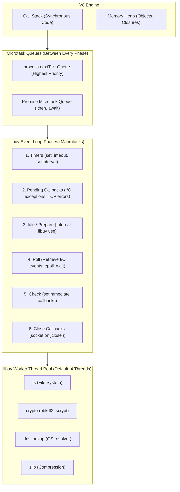

# Node.js Event Loop, libuv & Concurrency Internals

## 1. Why This Matters
As a 3+ YoE developer whose strongest professional background is in Node.js and Express, this is your primary architectural superpower. At IDFC FIRST Bank's Strategic Projects, Node.js microservices act as high-throughput API gateways and orchestrators for core banking services. An interviewer will not ask basic definition questions; they will grill you on:
- Exactly how the **libuv event loop phases** operate in C++.
- The precise priority difference between `process.nextTick()` and the V8 Promise Microtask Queue.
- Where and how blocking operations (DNS lookups, `fs`, `crypto`) run on the **libuv worker thread pool**.
- How CPU-bound tasks cause **event loop lag**, spiking the p99 latency of financial API endpoints.

---

## 2. Prerequisites
- Familiarity with asynchronous JavaScript, Callbacks, Promises, and `async/await`.
- Understanding of the single-threaded JavaScript execution model in Google V8.

---

## 3. Concept

### Architecture Overview
Node.js consists of:
1. **V8 Engine:** Compiles and executes JavaScript code, manages the Call Stack and Memory Heap.
2. **libuv (C library):** Provides the cross-platform Event Loop, non-blocking asynchronous I/O (via OS primitives like `epoll` on Linux, `kqueue` on macOS, `IOCP` on Windows), and a 4-thread worker pool (`UV_THREADPOOL_SIZE`).



---

## 4. Simple Example: Predicting Execution Order

```javascript
// Guess the exact order before reading the solution
console.log('1. Sync Start');

setTimeout(() => {
    console.log('2. setTimeout 0');
}, 0);

setImmediate(() => {
    console.log('3. setImmediate');
});

Promise.resolve().then(() => {
    console.log('4. Promise Microtask');
});

process.nextTick(() => {
    console.log('5. process.nextTick');
});

console.log('6. Sync End');

/*
Output Order:
1. Sync Start
6. Sync End
5. process.nextTick       (Microtask - nextTick queue executes immediately after sync code)
4. Promise Microtask      (Microtask - Promise queue executes after nextTick queue)
2. setTimeout 0           (Timers phase)
3. setImmediate           (Check phase)
*/
```

---

## 5. Real-World Banking Example: The Event Loop Lag Outage
In a banking microservice generating account statement PDFs:
- An engineer uses a synchronous encryption loop or large JSON parse (`JSON.parse(hugePayload)`) on the main thread.
- While the CPU core executes the 800ms parsing loop, the **Call Stack is completely blocked**.
- Incoming UPI webhook confirmations cannot enter the Poll phase; their TCP sockets time out.
- Client applications experience cascading 504 Gateway Timeouts, even though the database is healthy.

**Architectural Fix:** Offload CPU-heavy encryption or PDF generation to **Worker Threads** (`worker_threads`) or a dedicated asynchronous background worker (BullMQ / RabbitMQ), keeping the event loop idle to process fast I/O requests.

---

## 6. Code: Verifying `setImmediate` vs `setTimeout` Inside I/O Cycle

```javascript
const fs = require('fs');

fs.readFile(__filename, () => {
    // We are now inside the Poll phase callback of an I/O cycle!
    console.log('--- Inside I/O Callback (Poll Phase) ---');

    setTimeout(() => {
        console.log('1. setTimeout (Timers Phase - next loop tick)');
    }, 0);

    setImmediate(() => {
        console.log('2. setImmediate (Check Phase - runs FIRST!)');
    });

    process.nextTick(() => {
        console.log('0. process.nextTick (Runs immediately after this callback)');
    });
});

/*
Guaranteed Output Inside I/O Cycle:
--- Inside I/O Callback (Poll Phase) ---
0. process.nextTick
2. setImmediate (Check Phase - runs FIRST!)
1. setTimeout (Timers Phase - next loop tick)
*/
```

> **Crucial Interview Insight:** In the main module scope, `setTimeout(..., 0)` vs `setImmediate` is non-deterministic (depends on process startup clock jitter). But **inside an I/O callback, `setImmediate` is 100% guaranteed to run before `setTimeout`** because the event loop moves directly from the **Poll phase** to the **Check phase**!

---

## 7. How It Works Internally

### 1. libuv Event Loop Loop Iteration (C++ Pseudo-Code)
```c
while (r == 0 && loop->stop_flag == 0) {
    uv__update_time(loop);
    uv__run_timers(loop);        // 1. Timers Phase
    uv__run_pending(loop);       // 2. Pending I/O callbacks
    uv__run_idle(loop);
    uv__run_prepare(loop);
    uv__io_poll(loop, timeout);  // 4. Poll Phase (blocks waiting for epoll)
    uv__run_check(loop);         // 5. Check Phase (setImmediate)
    uv__run_closing_handles(loop);// 6. Close callbacks
}
```

### 2. The Poll Phase Mechanics
When the loop enters the **Poll phase**:
1. It calculates how long it should block waiting for I/O:
   - If there are `setImmediate` callbacks scheduled, timeout is `0` (advances immediately to Check phase).
   - If there are timers scheduled, timeout is `timer_due_time - current_time`.
   - If no timers exist, it blocks indefinitely waiting for incoming socket/file events.
2. Once events arrive via `epoll_wait()`, it executes their callbacks.

### 3. Microtask Drain Rules (Node.js 11+)
In Node.js 11+, the microtask queue is drained **immediately after every single callback** executes, matching browser behavior, rather than waiting for the entire phase queue to finish.

---

## 8. Common Mistakes
1. **Believing `setTimeout(fn, 0)` Runs in Exactly 0 Milliseconds:** The minimum timer resolution in libuv and OS kernels is typically 1ms. If the event loop is busy, it may run after 50ms.
2. **Confusing `process.nextTick()` with `setImmediate()`:**
   - `process.nextTick()` is **not** part of the libuv event loop. It belongs to the Node.js process microtask queue and runs immediately after the current operation finishes, before the event loop continues. Recursive `process.nextTick()` starves the event loop entirely!
   - `setImmediate()` runs during the libuv **Check phase**.
3. **Believing All Async Node.js Operations Use the Thread Pool:** Network I/O (`http`, `https`, `net`, `tls`) does **NOT** use the 4-thread pool! Network sockets use native OS kernel async notifications (`epoll`/`kqueue`). The thread pool is reserved for `fs`, `crypto`, `zlib`, and `dns.lookup`.

---

## 9. Performance / Complexity Matrix

| Operation | Execution Mechanism | Blocks Main Event Loop? | Thread Pool Usage? |
| :--- | :--- | :---: | :---: |
| **Incoming HTTP Request** | OS kernel `epoll` / non-blocking | No | No (OS native) |
| **`crypto.pbkdf2`** | libuv worker thread | No (Async API) | Yes (Consumes 1 thread) |
| **`fs.readFile`** | libuv worker thread | No (Async API) | Yes (Consumes 1 thread) |
| **`JSON.parse(100MB)`** | V8 Call Stack (Synchronous) | **YES (FREEZES SERVER)** | No |
| **RegExp with Catastrophic Backtracking** | V8 Call Stack | **YES (CPU SPIKE)** | No |

---

## 10. Interview Questions (Easy $\to$ Medium $\to$ Hard)

### Easy
- **Q:** Is Node.js completely single-threaded? Explain what parts are single-threaded and what parts are multi-threaded.

### Medium
- **Q:** What is the difference between `process.nextTick()` and `setImmediate()`? Why can recursive `process.nextTick()` freeze an application while recursive `setImmediate()` does not?

### Hard
- **Q:** A Node.js backend handles 5,000 requests/sec for lightweight database lookups. An engineer adds an async password hashing call using `bcrypt.hash()` or `crypto.pbkdf2()` with default settings on login. Suddenly, database request latencies explode across all endpoints. Explain why this happens under the hood and how to fix it.

---

## 11. Follow-up Questions from Interviewer
- *"What is `UV_THREADPOOL_SIZE` and what is its default value? What are the dangers of increasing it to 128?"*
  *(Answer: Default is 4, max is 1024. Increasing it too high causes severe OS thread context-switching overhead and memory thrashing on multicore CPUs).*
- *"What is the difference between `dns.lookup` and `dns.resolve` in Node.js?"*
  *(Answer: `dns.lookup` calls the synchronous OS `getaddrinfo(3)` system call, using a libuv worker thread! `dns.resolve` uses asynchronous c-ares network queries, bypassing the thread pool entirely).*

---

## 12. Model Answer: libuv Thread Pool Starvation Under Crypto Load

> **Interviewer:** *"Why did adding async password hashing cause unrelated database queries and file reads to stall in our Node.js microservice?"*
> 
> **Model Answer:**
> "While JavaScript executes on a single thread, Node.js offloads specific operations—namely `fs`, `crypto`, `zlib`, and `dns.lookup`—to the **libuv worker thread pool**, which has a default size of **4 threads**.
> 
> When multiple concurrent login requests arrive, each `crypto.pbkdf2` or `bcrypt` call acquires one of the 4 worker threads for CPU-intensive key derivation (taking perhaps 80–100ms per hash).
> 
> If 4 hashing tasks are active simultaneously, the thread pool is **completely saturated**.
> 
> When an incoming database request requires an internal file system read, or DNS resolution (`dns.lookup`), or TLS certificate validation, those tasks are queued in the libuv thread pool queue waiting for a free worker. Even though the main V8 event loop is idle, I/O tasks are blocked in the worker queue, causing response latencies to spike across unrelated endpoints.
> 
> **Solution:**
> 1. Increase `UV_THREADPOOL_SIZE` on startup (e.g., `process.env.UV_THREADPOOL_SIZE = Math.min(128, os.cpus().length * 2)`).
> 2. Offload CPU-bound authentication hashing to dedicated authentication microservices or worker threads (`worker_threads`), preventing crypto workloads from competing with core I/O."

---

## 13. Practical Exercise
Create and execute a script that proves `UV_THREADPOOL_SIZE = 4` by launching 6 concurrent `crypto.pbkdf2` calls and measuring the execution timestamps:

```javascript
// threadpool_test.js
const crypto = require('crypto');
const start = Date.now();

function hashPassword(id) {
    crypto.pbkdf2('secret_password', 'salt', 100000, 64, 'sha512', () => {
        console.log(`Task ${id} completed in ${Date.now() - start}ms`);
    });
}

for (let i = 1; i <= 6; i++) {
    hashPassword(i);
}

// Notice that Tasks 1-4 finish almost simultaneously, while Tasks 5-6 finish ~2x later!
```

---

## 14. Quick Revision
- V8 handles JS execution; libuv handles OS event loop & thread pool.
- Event loop phases: Timers $\to$ Pending $\to$ Poll $\to$ Check $\to$ Close.
- Microtasks (`nextTick`, `Promise`) run *immediately* after the active stack frame empties, before the next event loop phase.
- Network sockets do **not** use the thread pool (`epoll` handles non-blocking socket notifications).
- Thread pool size default is 4; handles `fs`, `crypto`, `zlib`, and `dns.lookup`.

---

## 15. Interview Checklist
- [ ] Can draw the libuv event loop phase diagram from memory.
- [ ] Explains `process.nextTick` vs `setImmediate` with precision.
- [ ] Understands why `setImmediate` runs before `setTimeout` inside an I/O callback.
- [ ] Explains why network I/O does not consume libuv worker threads.
- [ ] Identifies thread pool starvation and knows how to configure `UV_THREADPOOL_SIZE`.
