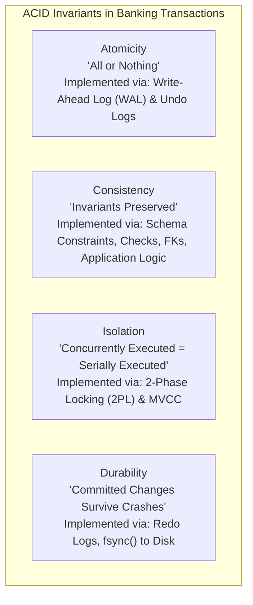
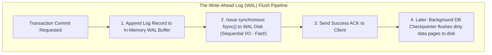

# ACID Properties & Database Transaction Internals

## 1. Why This Matters
If you remember only one database concept for IDFC FIRST Bank, let it be **ACID**. In banking systems, transactions represent real money. If a server loses power halfway through a ₹10,000 transfer, or two concurrent ATM withdrawals deduct from the same ₹5,000 balance simultaneously, the bank faces direct financial loss and regulatory sanctions from the Reserve Bank of India (RBI). In a 3+ YoE interview, you must explain not just what the acronym stands for, but the **internal physical mechanisms** (Write-Ahead Logging, Two-Phase Locking, Multi-Version Concurrency Control) that guarantee each property.

---

## 2. Prerequisites
- Basic relational CRUD operations.
- Understanding of volatile memory (RAM) vs non-volatile storage (SSD/HDD).

---

## 3. Concept

### The Four Pillars of ACID



1. **Atomicity:** A transaction is an indivisible unit of work. If any statement fails (or the node crashes), all previously executed statements within that transaction are rolled back completely.
2. **Consistency:** A transaction brings the database from one valid state to another, satisfying all declared invariants (`CHECK (balance >= 0)`, foreign keys, uniqueness, and business rules like Σ debits = Σ credits).
3. **Isolation:** Concurrent execution of transactions yields the same state that would be obtained if transactions were executed serially one after the other.
4. **Durability:** Once a transaction commits, its effects are permanent and will not be lost, even in the event of an immediate total power failure.

---

## 4. Simple Example: Classic Banking Transfer

```sql
BEGIN TRANSACTION;

-- Step 1: Deduct from Sender
UPDATE accounts 
SET balance = balance - 5000.00 
WHERE account_id = 101 AND balance >= 5000.00;

-- Step 2: Credit to Receiver
UPDATE accounts 
SET balance = balance + 5000.00 
WHERE account_id = 103;

-- Step 3: Record in Transaction Ledger
INSERT INTO transactions (transaction_reference, from_account_id, to_account_id, amount, transaction_type, payment_channel, status)
VALUES ('TXN-MANUAL-001', 101, 103, 5000.00, 'TRANSFER', 'IMPS', 'SUCCESS');

COMMIT;
```

---

## 5. Real-World Banking Example: Power Failure Mid-Transfer
Imagine the server CPU dies between Step 1 (debit) and Step 2 (credit):
- **Without ACID Atomicity:** Account 101 has lost ₹5,000, but Account 103 never received it. ₹5,000 has vanished into thin air.
- **With ACID Atomicity (via WAL Undo):** Upon reboot, the database crash recovery process scans the Write-Ahead Log. It sees that transaction `TXN-MANUAL-001` has no corresponding `COMMIT` record. The engine uses the **Undo Log** to restore Account 101's balance to its pre-debit amount before accepting any new incoming client connections.

---

## 6. Code: Robust Transaction Handling in Node.js / Express

```javascript
const { Pool } = require('pg');
const pool = new Pool();

async function transferFunds(fromAccountId, toAccountId, amount, idempotencyKey) {
    const client = await pool.connect();

    try {
        await client.query('BEGIN');

        // 1. Check & Lock Sender Account (Pessimistic Locking)
        const senderRes = await client.query(
            'SELECT balance FROM accounts WHERE account_id = $1 FOR UPDATE',
            [fromAccountId]
        );

        if (senderRes.rows.length === 0) {
            throw new Error('Sender account not found');
        }

        const currentBalance = parseFloat(senderRes.rows[0].balance);
        if (currentBalance < amount) {
            throw new Error('Insufficient funds');
        }

        // 2. Debit Sender
        await client.query(
            'UPDATE accounts SET balance = balance - $1 WHERE account_id = $2',
            [amount, fromAccountId]
        );

        // 3. Credit Receiver
        await client.query(
            'UPDATE accounts SET balance = balance + $1 WHERE account_id = $2',
            [amount, toAccountId]
        );

        // 4. Record Ledger Entry
        await client.query(
            `INSERT INTO transactions 
             (transaction_reference, from_account_id, to_account_id, amount, transaction_type, payment_channel, status)
             VALUES ($1, $2, $3, $4, 'TRANSFER', 'UPI', 'SUCCESS')`,
            [idempotencyKey, fromAccountId, toAccountId, amount]
        );

        // Commit all changes atomically
        await client.query('COMMIT');
        return { success: true, message: 'Transfer completed successfully' };

    } catch (error) {
        // Rollback on ANY failure
        await client.query('ROLLBACK');
        console.error('Transaction aborted and rolled back:', error.message);
        throw error;
    } finally {
        // Crucial: Always release client back to connection pool
        client.release();
    }
}
```

---

## 7. How It Works Internally: Write-Ahead Logging (WAL) & ARIES Recovery

### Why Databases Do Not Write Directly to Data Pages on Disk
Modifying a table requires writing to random 8KB/16KB data pages across the disk. Doing random disk I/O on every commit would choke throughput to single-digit transactions per second.



### The WAL Invariant
> **No modified data page (dirty page) is EVER written to non-volatile storage until the corresponding log records describing the change have been flushed to disk (`fsync`).**

### Crash Recovery: The ARIES Protocol
When a database reboots after an abrupt power loss, it performs 3 phases:
1. **Analysis Phase:** Identifies all dirty pages in buffer pool and all active (uncommitted) transactions at the time of the crash.
2. **Redo Phase:** Replays all log records up to the crash point, restoring the database to the exact state it was in before the failure (repeating history).
3. **Undo Phase:** Reverses the changes of all transactions that were active but had not committed when the crash occurred, restoring complete atomicity.

---

## 8. Common Mistakes
1. **Forgetting `client.release()` in `finally`:** If an error occurs and the connection is not released, database connection pools exhaust rapidly, resulting in cascading server outages.
2. **Long-Running Business Logic Inside Transactions:** Calling an external HTTP API (like an SMS gateway or partner payment switch) *inside* an open SQL transaction holds locks for seconds, causing deadlocks and blocking unrelated users. **Rule: Never make external network I/O calls inside a database transaction.**
3. **Assuming `COMMIT` is Asynchronous by Default:** Disabling `fsync` (`synchronous_commit = off`) improves write speed dramatically, but breaks Durability: committed transactions can be lost upon power failure.

---

## 9. Performance / Complexity Matrix

| Property | Implementation Mechanism | Performance Overhead |
| :--- | :--- | :--- |
| **Atomicity** | Undo logs / WAL append | Minimal sequential write overhead |
| **Consistency** | Constraints & Foreign Key checks | O(log N) index lookups on insert/update |
| **Isolation** | Locking / MVCC snapshots | Concurrency contention, lock waits |
| **Durability** | Sequential `fsync()` to WAL | Constrained by disk IOPs (mitigated by group commit) |

---

### 🟢 Easy Question: ACID Properties Defined
**Q:** What does ACID stand for? Define each property with a single authoritative sentence and its concrete database enforcement mechanism.

**Complete Answer:**
1. **Atomicity ("All or Nothing"):**
   - *Definition:* Either all operations within a transaction succeed and are committed, or the entire transaction is aborted and any partial modifications are completely rolled back.
   - *Mechanism:* Enforced via Undo Logs (MySQL InnoDB) or MVCC transaction status bitmaps and Write-Ahead Log (PostgreSQL).
2. **Consistency ("Valid State to Valid State"):**
   - *Definition:* A transaction can only transition the database from one valid state to another, preserving all declared schema constraints, foreign keys, unique indexes, and banking financial invariants (e.g., `Σ debits = Σ credits`).
   - *Mechanism:* Enforced via database engine constraint validators (Primary Keys, Foreign Keys, `CHECK` constraints, triggers) and application double-entry balance rules.
3. **Isolation ("Independent Execution"):**
   - *Definition:* Concurrent transactions execute without interfering with one another; the intermediate, uncommitted modifications of one transaction remain invisible to other concurrent transactions.
   - *Mechanism:* Enforced via Multi-Version Concurrency Control (MVCC) snapshots, row-level locks, and table intention locks.
4. **Durability ("Permanent Survival"):**
   - *Definition:* Once a transaction commits and the application receives a success acknowledgment, its changes survive all subsequent hardware failures, operating system crashes, or power outages.
   - *Mechanism:* Enforced by sequentially flushing log records to non-volatile disk storage via the synchronous OS `fsync()` system call before acknowledging the commit (Write-Ahead Logging).

---

### 🟠 Medium Question: How Write-Ahead Logging (WAL) Guarantees Durability
**Q:** Explain how Write-Ahead Logging (WAL) allows a database to guarantee Durability without immediately flushing entire data pages to disk. What is the ARIES recovery protocol?

**Complete Answer:**
1. **The Performance Problem of Direct Page Flushing:**
   - Database tables are stored as fixed-size pages (8 KB in PostgreSQL, 16 KB in MySQL InnoDB).
   - If an update changes a single 4-byte integer in a customer record, flushing the entire 8 KB page to disk requires a **random I/O write**.
   - With hundreds of concurrent transactions touching scattered accounts, random disk writes would saturate storage controller IOPS immediately, cratering throughput to double digits.
2. **The WAL Solution:**
   - When data is modified, changes are applied to the in-memory **Buffer Pool** in RAM (marking the page as a "dirty page").
   - A compact, append-only log record describing the delta (e.g., `"Txn 402: Account 101 balance decremented from 5000 to 4900"`) is written to the **WAL Buffer**.
   - On `COMMIT`, only the WAL buffer is flushed sequentially to disk via `fsync()`. Because sequential write throughput is 100x to 1000x faster than random I/O, commit latency is negligible (sub-millisecond).
   - Dirty pages remain in RAM and are lazily flushed in large, sorted batches to disk by background checkpointer threads.
3. **Crash Recovery via the ARIES Protocol:**
   If power is cut while dirty pages are still in RAM, the engine boots into ARIES recovery:
   - **Phase 1 (Analysis):** Scans the WAL forward from the last checkpoint to identify active transactions that never committed and all dirty pages.
   - **Phase 2 (Redo / "Repeating History"):** Scans the WAL forward and reapplies all logged operations (including those of uncommitted transactions) to restore the buffer pool to the exact state at the microsecond of the crash.
   - **Phase 3 (Undo):** Scans the WAL backward and rolls back the changes of all transactions that were active without a committed record, restoring strict atomicity.

---

### 🔴 Hard Question: Concurrent Balance Deduction Race Condition
**Q:** If two concurrent transactions execute `BEGIN ... UPDATE accounts SET balance = balance - 100 WHERE account_id = 1 ... COMMIT` at the default `READ COMMITTED` isolation level, can a race condition allow the balance to go negative? Walk through the exact row-level locking behavior.

**Complete Answer:**
- **The Detailed Row-Locking Sequence:**
  1. Transaction 1 begins and issues `UPDATE ... WHERE account_id = 1`. The engine acquires an **exclusive row-level write lock (X-lock)** on account 1.
  2. Transaction 2 begins concurrently and issues `UPDATE ... WHERE account_id = 1`. Because an X-lock is already held by Txn 1, Txn 2 enters a **lock wait state** and blocks.
  3. Txn 1 completes its subtraction (e.g., initial balance 100 becomes 0) and issues `COMMIT`. Txn 1 releases the X-lock.
  4. Txn 2 immediately wakes up. At `READ COMMITTED` isolation, the database engine uses **Read Committed Row Re-evaluation**:
     - It fetches the newly committed version of row 1 (where balance is now 0).
     - It re-evaluates the query: `UPDATE accounts SET balance = balance - 100 WHERE account_id = 1`.
     - Because the `WHERE` clause only checked `account_id = 1` (which is still true!), it computes `balance = 0 - 100 = -100`!
     - Txn 2 commits. The balance is now **-100 INR**!
- **The Production Remediation:**
  To guarantee positive balances under high concurrency without requiring heavy `SERIALIZABLE` isolation:
  1. **Atomic Guard Condition in `WHERE` Clause:**
     ```sql
     UPDATE accounts 
     SET balance = balance - 100 
     WHERE account_id = 1 AND balance >= 100;
     ```
     When Txn 2 wakes up and re-evaluates the `WHERE` clause, `balance >= 100` evaluates to `FALSE` (0 >= 100 is False).
     The row is not updated (`ROW_COUNT() = 0`). The application detects zero rows updated and returns an `"Insufficient Funds"` error.
  2. **Database Schema Invariant:**
     Always enforce a defensive table constraint:
     ```sql
     ALTER TABLE accounts ADD CONSTRAINT chk_positive_balance CHECK (balance >= 0);
     ```
     Even if buggy code forgets the `WHERE` clause guard, the engine aborts the transaction before committing.

---

## 11. Follow-up Questions from Interviewer with Complete Answers

### 🎤 Follow-up 1
**Interviewer:** *"What is Group Commit in PostgreSQL/MySQL InnoDB, and how does it prevent disk I/O bottlenecks during peak transaction bursts?"*

**Complete Answer:**
1. **The Disk Sync Bottleneck:**
   - Every individual transaction `COMMIT` requires calling the OS system call `fsync()` to ensure the WAL buffer is physically flushed from OS disk cache to the non-volatile drive.
   - An `fsync()` call blocks the thread until the drive controller sends hardware ACK (1 to 5 ms on mechanical drives; 0.1 to 0.3 ms on enterprise NVMe).
   - If 10,000 requests arrive per second and each demands an immediate, dedicated `fsync()`, the storage controller saturates, queueing commits and stalling the application.
2. **The Group Commit Optimization:**
   - When transaction T₁ requests a commit, the engine designates T₁'s thread as the **group leader**.
   - While the group leader prepares the write, dozens of other transactions (T₂, T₃, ..., T₅₀) also finish and request commits.
   - Instead of issuing 50 separate `fsync()` calls, the engine appends all 50 commit records into a single contiguous disk buffer.
   - The group leader executes **a single batched `fsync()` call** that commits all 50 transactions simultaneously!
   - The group leader wakes up the follower threads and all 50 transactions receive their commit acknowledgments in parallel.
   - **Throughput Multiplier:** Scales transaction commit throughput by 10x to 50x during peak traffic spikes (e.g., Diwali or month-end payroll processing).

---

### 🎤 Follow-up 2
**Interviewer:** *"What is the difference between a Local Transaction and a Distributed Transaction across two microservices? Why can't we use standard ACID transactions across microservices, and how does the Saga Pattern solve it?"*

**Complete Answer:**
1. **Local vs Distributed Transactions:**
   - **Local Transaction:** Operates within a single database instance. The database engine controls all locks, buffers, and WAL locally, guaranteeing strict ACID.
   - **Distributed Transaction:** Spans two or more separate databases (e.g., Core Banking Account Service DB and Fraud Detection Service DB).
2. **Why ACID Cannot Scale Across Microservices (The 2PC Problem):**
   - The traditional solution was **Two-Phase Commit (2PC)** coordinated by a transaction manager.
   - *Failure Mode:* 2PC is a **synchronous blocking protocol**. If the coordinator or any participating service crashes during the commit phase, all participating databases hold row locks indefinitely.
   - *Microservice Antipattern:* Violates service autonomy. If Service B is slow, Service A's database connection pools freeze.
3. **The Modern FinTech Solution: The Saga Pattern:**
   - Breaks the distributed transaction into a sequence of **local ACID transactions** coordinated via asynchronous messaging (Apache Kafka):
     1. Account Service locally debits ₹5,000 from customer account (Local ACID). Publishes `FundsDebited` event.
     2. NPCI Switch Gateway receives event, transmits to beneficiary bank (Local ACID).
   - **Handling Failures (Compensating Transactions):**
     If the beneficiary bank rejects the transfer, the Saga orchestrator issues a **compensating transaction** to Account Service:
     `Credit ₹5,000 back to customer account with reason: 'Transfer Reversed'`.
   - The system achieves **Eventual Consistency** without holding distributed locks.

---

## 13. Practical Exercise
Verify SQLite transactional rollback on `banking.db`:

```bash
sqlite3 banking.db
```

```sql
BEGIN TRANSACTION;
-- Simulate a debit
UPDATE accounts SET balance = balance - 5000 WHERE account_id = 101;
-- Inspect balance (it is decremented)
SELECT account_id, balance FROM accounts WHERE account_id = 101;
-- Abort transaction
ROLLBACK;
-- Verify balance has been restored!
SELECT account_id, balance FROM accounts WHERE account_id = 101;
```

---

## 14. Quick Revision
- Atomicity: All or nothing, managed by WAL undo logs.
- Consistency: Business rules & constraints preserved.
- Isolation: Concurrent transactions don't interfere.
- Durability: Committed transactions survive crashes via `fsync` to sequential WAL.
- ARIES recovery: Analysis → Redo → Undo.
- Never place external HTTP network calls inside open database transactions.

---

## 15. Interview Checklist
- [ ] Can articulate the physical mechanism for each of the 4 ACID letters.
- [ ] Understands why WAL uses sequential I/O while data pages use random I/O.
- [ ] Knows the 3 phases of ARIES recovery.
- [ ] Explains why connection pool client release must always reside in a `finally` block.
