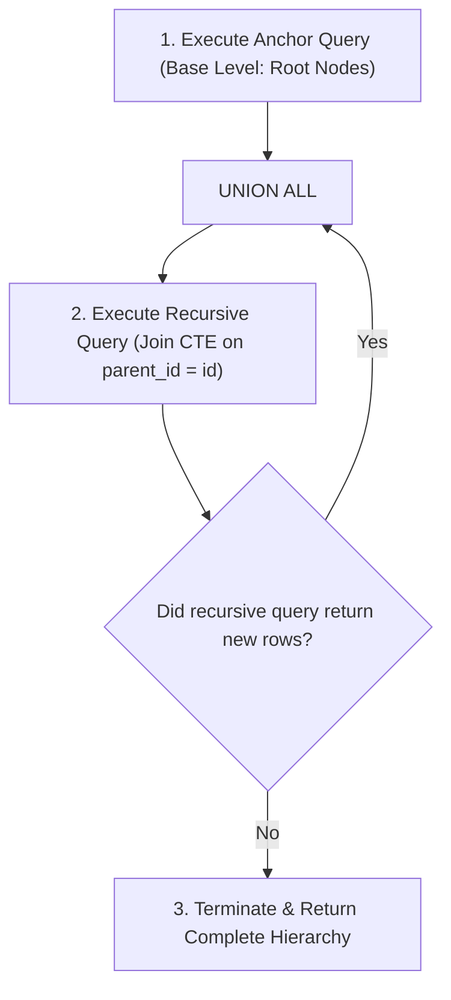

# Common Table Expressions (CTEs) & Recursive CTEs

## 1. Why This Matters
In enterprise banking applications, SQL queries can quickly become unmaintainable when multiple levels of business logic, filtering, and window calculations are chained together. At IDFC FIRST Bank, developers use **Common Table Expressions (CTEs)** to construct clean, modular data pipelines. In technical interviews, writing a clean recursive CTE (to traverse hierarchical corporate accounts, branch networks, or generate continuous date ranges for financial reporting) signals senior-level SQL mastery.

---

## 2. Prerequisites
- Basic SQL queries and Subqueries.
- Set operations (`UNION` vs `UNION ALL`).

---

## 3. Concept

### What is a Common Table Expression?
A **CTE** is a temporary, named result set that exists only within the execution scope of a single SQL statement (`SELECT`, `INSERT`, `UPDATE`, or `DELETE`). It acts like an in-memory view defined inline.

```sql
WITH CTE_Name AS (
    -- Anchor or Subquery logic
    SELECT column1, column2 FROM table_name WHERE condition
)
SELECT * FROM CTE_Name;
```

### Recursive CTEs
A **Recursive CTE** references itself. It consists of three parts:
1. **Anchor Member:** The initial query that forms the base result set (e.g., top-level root branch).
2. **Recursive Member:** A query that joins the CTE back to the underlying table, executed repeatedly until it returns no new rows.
3. **`UNION ALL` Operator:** Glues the anchor and recursive iterations together.



---

## 4. Simple Example: Standard CTE vs Subquery Readability

```sql
-- Standard CTE: Modular and readable
WITH HighValueTransfers AS (
    SELECT transaction_id, from_account_id, amount
    FROM transactions
    WHERE amount >= 50000.00 AND status = 'SUCCESS'
)
SELECT from_account_id, COUNT(*) AS large_transfer_count, SUM(amount) AS total_volume
FROM HighValueTransfers
GROUP BY from_account_id;
```

---

## 5. Real-World Banking Example: Generating Missing Dates for Continuous Cash Flow
Financial charts require showing daily balances even on days with **zero transactions**. If a query only groups by `transactions.created_at`, days without transactions are skipped entirely!
Using a **Recursive CTE**, we generate a complete date calendar and `LEFT JOIN` it against transactions:

```sql
-- Generate all dates in March 2026 and display daily transaction volume
WITH RECURSIVE DateCalendar AS (
    -- Anchor: Start Date
    SELECT DATE('2026-03-01') AS calendar_date
    UNION ALL
    -- Recursive Step: Add 1 day until End Date
    SELECT DATE(calendar_date, '+1 day')
    FROM DateCalendar
    WHERE calendar_date < '2026-03-15'
)
SELECT 
    d.calendar_date,
    COUNT(t.transaction_id) AS total_transactions,
    COALESCE(SUM(t.amount), 0.00) AS total_volume
FROM DateCalendar d
LEFT JOIN transactions t ON DATE(t.created_at) = d.calendar_date AND t.status = 'SUCCESS'
GROUP BY d.calendar_date
ORDER BY d.calendar_date;
```

---

## 6. Code: Corporate Hierarchy Traversal Using Recursive CTE
Suppose a commercial banking customer has parent corporate entities, subsidiaries, and division accounts:

```sql
-- Conceptual schema:
-- corporate_entities (entity_id, entity_name, parent_entity_id)

WITH RECURSIVE EntityHierarchy AS (
    -- Anchor: Find the root parent company (e.g., entity_id = 1)
    SELECT entity_id, entity_name, parent_entity_id, 0 AS hierarchy_level
    FROM corporate_entities
    WHERE entity_id = 1

    UNION ALL

    -- Recursive Member: Find all child subsidiaries
    SELECT c.entity_id, c.entity_name, c.parent_entity_id, eh.hierarchy_level + 1
    FROM corporate_entities c
    INNER JOIN EntityHierarchy eh ON c.parent_entity_id = eh.entity_id
)
SELECT * FROM EntityHierarchy
ORDER BY hierarchy_level, entity_name;
```

---

## 7. How It Works Internally: CTE Materialization Fences (PostgreSQL 12+)

### Optimization Fence History
- In older database versions (PostgreSQL < 12), CTEs acted as **strict optimization fences**. The database computed the CTE once, materialized it in memory (or spilled to temporary disk), and prevented the optimizer from pushing outer `WHERE` predicates into the CTE.
- In modern engines (PostgreSQL 12+, MySQL 8+, SQLite 3.35+), CTEs are **inlined** by default. The optimizer treats a CTE as a subquery, allowing predicate pushdown.
- **Controlling Materialization:**
  ```sql
  -- Force materialization (prevent re-evaluation if expensive):
  WITH ExpensiveCalc AS MATERIALIZED (...)
  
  -- Force inlining (allow index predicate pushdown):
  WITH InlinedFilter AS NOT MATERIALIZED (...)
  ```

---

## 8. Common Mistakes
1. **Infinite Loops in Recursive CTEs:** Forgetting a termination condition in the `WHERE` clause of the recursive member causes an infinite recursion loop, terminating only when the database hits `max_recursion_depth` (default 100 in SQL Server, 1000 in MySQL).
2. **Using `UNION` Instead of `UNION ALL` in Recursive CTEs:** In recursive definitions, standard SQL requires `UNION ALL`. Using `UNION` forces expensive deduplication sorting across each recursive step.
3. **Overusing CTEs for Trivial Lookups:** Defining 10 trivial one-line CTEs when a clean join or where clause suffices adds parsing overhead and reduces query clarity.

---

## 9. Performance / Complexity Matrix

| Technique | Execution Model | Memory Impact |
| :--- | :--- | :--- |
| **Inlined CTE (Default)** | Blended into outer query plan | O(1) extra memory (streaming) |
| **Materialized CTE** | Computed once and cached in RAM | O(K) where K is CTE row count |
| **Recursive CTE** | Breadth-First loop over working table | O(depth * breadth) |
| **Deeply Nested Subqueries** | Hard to read; optimizer rewrites | Equivalent to inlined CTE |

---

## 10. Interview Questions (Easy → Medium → Hard)

### Easy
- **Q:** What is a Common Table Expression (CTE) and how does it differ from a database View?

### Medium
- **Q:** What is the difference between `UNION` and `UNION ALL` inside a recursive CTE?

### Hard
- **Q:** Explain what an "Optimization Fence" was in early PostgreSQL versions regarding CTEs. When would you explicitly use `AS MATERIALIZED` versus `AS NOT MATERIALIZED` in modern database engines?

---

## 11. Follow-up Questions from Interviewer
- *"If your recursive CTE hierarchy has a circular reference (e.g., Entity A is parent of B, but B is marked as parent of A), how do you prevent an infinite recursion crash?"*
  *(Answer: Track an array or path string of visited IDs: `WHERE c.entity_id != ALL(eh.visited_path)`).*

---

## 12. Model Answer: Preventing Infinite Recursive Loops

> **Interviewer:** *"How do you detect and prevent cycles during a recursive hierarchy traversal in SQL?"*
> 
> **Model Answer:**
> "To prevent infinite recursion caused by corrupted circular data (such as Account A owning Account B, which owns Account A), we maintain an **ancestry path array** inside the CTE.
> 
> 1. In the Anchor query, we initialize an array containing the root ID: `ARRAY[entity_id] AS path`.
> 2. In the Recursive query, before joining a child row, we verify that the child's `entity_id` is NOT already in `path`:
>    ```sql
>    WHERE c.entity_id != ALL(eh.path)
>    ```
> 3. We append the child's ID to the path: `path || c.entity_id`.
> 4. If a cycle occurs, the `WHERE` condition evaluates to false, gracefully terminating the branch without crashing the database server."

---

## 13. Practical Exercise (Run on `banking.db`)
Execute the recursive date calendar query on `banking.db` to verify your environment supports recursive CTEs:

```bash
sqlite3 banking.db
```

```sql
WITH RECURSIVE DateCalendar AS (
    SELECT DATE('2026-03-01') AS calendar_date
    UNION ALL
    SELECT DATE(calendar_date, '+1 day')
    FROM DateCalendar
    WHERE calendar_date < '2026-03-07'
)
SELECT * FROM DateCalendar;
```

---

## 14. Quick Revision
- CTEs are defined using `WITH ... AS (...)`.
- Unlike Views, CTEs exist only for the duration of the query.
- Recursive CTEs require an Anchor, `UNION ALL`, and a Recursive Member that joins back to the CTE.
- Modern engines inline CTEs; use `MATERIALIZED` only when reusing an expensive subquery multiple times.
- Prevent recursive cycles by tracking a visited path array.

---

## 15. Interview Checklist
- [ ] Understands the three components of a recursive CTE.
- [ ] Knows how to generate missing date sequences for financial reporting.
- [ ] Explains `UNION ALL` efficiency over `UNION` in recursion.
- [ ] Explains CTE inlining vs optimization fences.
