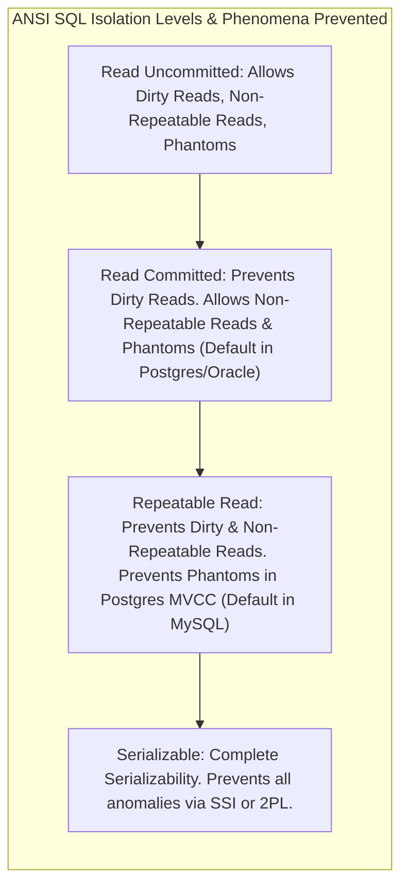
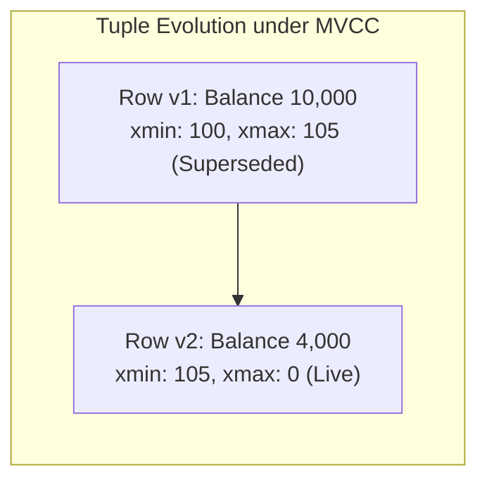

# Database Isolation Levels, Read Phenomena & MVCC

## 1. Why This Matters
In banking applications, isolation level configuration is the difference between an engine processing 20,000 transactions/sec safely and an engine losing money to race conditions or deadlocking into complete paralysis. In technical interviews for IDFC FIRST Bank, interviewers will ask you to define the three classical read phenomena (Dirty Read, Non-Repeatable Read, Phantom Read) and explain how modern relational engines (PostgreSQL, MySQL InnoDB) use **Multi-Version Concurrency Control (MVCC)** rather than pure lock-based isolation.

---

## 2. Prerequisites
- ACID properties (specifically Isolation).
- Basic transactional syntax (`BEGIN`, `COMMIT`, `ROLLBACK`).

---

## 3. Concept

### The 3 Classical Read Phenomena
1. **Dirty Read:** Transaction T₁ modifies a row. Transaction T₂ reads the uncommitted row. If T₁ subsequently aborts (`ROLLBACK`), T₂ has read data that technically never existed in the database.
2. **Non-Repeatable Read (Fuzzy Read):** Transaction T₁ reads a row. Transaction T₂ modifies or deletes that row and commits. If T₁ re-reads the row, it sees a *different value* or finds the row gone.
3. **Phantom Read:** Transaction T₁ executes a range query (e.g., `WHERE balance > 50000`). Transaction T₂ inserts a *new row* matching that predicate and commits. When T₁ executes the exact same query again, a "phantom" new row appears.



---

## 4. Simple Example: Dirty Read Danger

```text
Time   Transaction 1 (Debiting Account A)        Transaction 2 (Loan Eligibility Checker)
-----------------------------------------------------------------------------------------
t1     BEGIN;
t2     UPDATE accounts SET balance = 5000000 
       WHERE account_id = 101; -- Temporary ledger stage
t3                                               BEGIN;
t4                                               SELECT balance FROM accounts WHERE account_id = 101;
                                                 -- Reads uncommitted 5,000,000! Approves loan!
t5     ROLLBACK; -- Oops! Invalid wire transfer!
t6                                               COMMIT;
```

---

## 5. Real-World Banking Example: The Lost Update Anomaly
Suppose Account 101 has a balance of ₹10,000.
Two ATM withdrawals of ₹6,000 are attempted at the exact same millisecond:

```text
Transaction A (ATM 1)                  Transaction B (ATM 2)
---------------------------------------------------------------------
1. SELECT balance (reads 10,000)
2.                                     1. SELECT balance (reads 10,000)
3. App calculates: 10,000 - 6,000 = 4,000
4.                                     2. App calculates: 10,000 - 6,000 = 4,000
5. UPDATE balance = 4,000              
6. COMMIT                               
7.                                     3. UPDATE balance = 4,000
8.                                     4. COMMIT
```

- **Result:** Both customers received ₹6,000 cash (₹12,000 total dispensed), but the balance in the database is ₹4,000 instead of ₹-2,000 or rejecting the second withdrawal!
- **Why it happened:** In standard `READ COMMITTED`, readers do not block writers, and writers do not block readers.
- **The Fix:** Pessimistic locking (`SELECT ... FOR UPDATE`) or atomic SQL decrement (`UPDATE accounts SET balance = balance - 6000 WHERE balance >= 6000`).

---

## 6. Code: Configuring Isolation Levels in PostgreSQL / Node.js

```javascript
const { Pool } = require('pg');
const pool = new Pool();

async function runSerializableAudit() {
    const client = await pool.connect();
    try {
        // Set transaction isolation to SERIALIZABLE
        await client.query('BEGIN ISOLATION LEVEL SERIALIZABLE');

        const highNetWorthTally = await client.query(
            'SELECT COUNT(*), SUM(balance) FROM accounts WHERE balance >= 100000'
        );

        // Perform reporting calculations...

        await client.query('COMMIT');
    } catch (err) {
        // Under SERIALIZABLE, concurrent conflicts throw serialization_failure (error code 40001)
        if (err.code === '40001') {
            console.warn('Serialization failure detected! Retry transaction.');
        }
        await client.query('ROLLBACK');
    } finally {
        client.release();
    }
}
```

---

## 7. How It Works Internally: Multi-Version Concurrency Control (MVCC)

Modern relational engines avoid locking tables for read queries by maintaining multiple physical versions of each row.

### PostgreSQL Row Tuple Headers: `xmin` and `xmax`
Every physical row tuple contains hidden system attributes:
- `xmin`: The transaction ID (XID) that inserted this row version.
- `xmax`: The transaction ID (XID) that deleted or updated (superseded) this row version (0 if active).



### Snapshot Isolation
- When Transaction T runs a query, the engine captures a **Read Snapshot** containing:
  - Active transaction IDs that have not yet committed.
  - The highest committed transaction ID.
- **Rule:** Readers never block writers, and writers never block readers! When a write occurs, a new row version is appended, and the old version remains visible to concurrent snapshots.
- **Vacuuming:** The PostgreSQL `VACUUM` background daemon cleans up obsolete row versions (dead tuples) once no active transaction snapshot needs them.

---

## 8. Common Mistakes
1. **Assuming `READ COMMITTED` Prevents Lost Updates:** `READ COMMITTED` ensures you only read committed data, but it does **not** prevent another transaction from overwriting your change if you read, calculate in application memory, and write back.
2. **Not Handling Serialization Failures (Error 40001):** When using `SERIALIZABLE` isolation, the database will abort transactions that exhibit non-serializable interleaving. **Any application using Serializable isolation MUST implement exponential backoff retry loops!**
3. **Leaving Transactions Open in Repeatable Read:** In PostgreSQL, long-running transactions at `REPEATABLE READ` prevent `VACUUM` from removing dead tuples, leading to severe **table bloat** and memory exhaustion.

---

## 9. Performance / Complexity Matrix

| Isolation Level | Dirty Read | Non-Repeatable Read | Phantom Read | Concurrency Throughput |
| :--- | :---: | :---: | :---: | :---: |
| **Read Uncommitted** | Possible | Possible | Possible | Maximum |
| **Read Committed** | **Prevented** | Possible | Possible | Very High (Industry Standard) |
| **Repeatable Read** | **Prevented** | **Prevented** | Prevented in Postgres | High |
| **Serializable** | **Prevented** | **Prevented** | **Prevented** | Lowest (High abort/retry rate) |

---

## 10. Interview Questions (Easy → Medium → Hard)

### Easy
- **Q:** What is a Dirty Read and which isolation level is the minimum required to prevent it?

### Medium
- **Q:** Explain the difference between a Non-Repeatable Read and a Phantom Read. Give a concrete banking example of each.

### Hard
- **Q:** How does Serializable Snapshot Isolation (SSI) in PostgreSQL detect serialization anomalies without taking coarse table-level read locks?

---

## 11. Follow-up Questions from Interviewer
- *"Why does MySQL InnoDB default to `REPEATABLE READ` while PostgreSQL and Oracle default to `READ COMMITTED`?"*
  *(Answer: Historically, MySQL replication relied on statement-based binary logging (`binlog`), which required Repeatable Read with next-key locks to prevent replica state drift).*
- *"What is a Write Skew anomaly, and why can it occur under Repeatable Read but not under Serializable?"*

---

## 12. Model Answer: Write Skew Under Repeatable Read

> **Interviewer:** *"Can you explain the Write Skew anomaly and why Repeatable Read cannot prevent it?"*
> 
> **Model Answer:**
> "The **Write Skew** anomaly occurs when two concurrent transactions read overlapping data sets, make decisions based on what they read, and write to *disjoint* rows, violating a global business constraint.
> 
> **Banking Example: Combined Minimum Balance Constraint:**
> - Rule: A customer can hold Account A and Account B, provided their *combined* balance remains ≥ ₹1,000.
> - Currently: Account A has ₹800, Account B has ₹800 (Total = ₹1,600).
> - Transaction 1 attempts to withdraw ₹700 from Account A. It reads both accounts (sum = ₹1,600 ≥ 1,000), approves the debit, and updates Account A to ₹100.
> - Concurrently, Transaction 2 attempts to withdraw ₹700 from Account B. Under `REPEATABLE READ`, its snapshot sees Account A = ₹800 and Account B = ₹800 (sum = ₹1,600), approves the debit, and updates Account B to ₹100.
> - Both transactions commit because they modified *different* rows (no row-level lock conflict!).
> - Final state: Account A = ₹100, Account B = ₹100 (Total = ₹200). The global invariant is violated!
> 
> To prevent Write Skew, the system must either use `SERIALIZABLE` isolation (where dependency tracking detects the cycle) or explicitly lock both rows using `SELECT ... FOR UPDATE`."

---

## 13. Practical Exercise
Inspect isolation level support in SQLite or PostgreSQL:

```bash
sqlite3 banking.db
```

```sql
-- SQLite supports READ UNCOMMITTED and SERIALIZABLE
PRAGMA read_uncommitted = 0; -- Default: Full Serializable transaction isolation
```

---

## 14. Quick Revision
- Dirty Read: Reading uncommitted data.
- Non-Repeatable Read: Row value changes between two reads in the same transaction.
- Phantom Read: New rows appear matching a range predicate.
- ANSI levels: Read Uncommitted → Read Committed → Repeatable Read → Serializable.
- MVCC ensures readers never block writers and writers never block readers.
- Write Skew is possible in Repeatable Read; requires Serializable or explicit locking.

---

## 15. Interview Checklist
- [ ] Clearly distinguishes Non-Repeatable Read from Phantom Read.
- [ ] Explains `xmin` / `xmax` and MVCC snapshots.
- [ ] Understands the Lost Update problem and explains 2 ways to prevent it.
- [ ] Can articulate the Write Skew scenario and why Repeatable Read fails to stop it.
