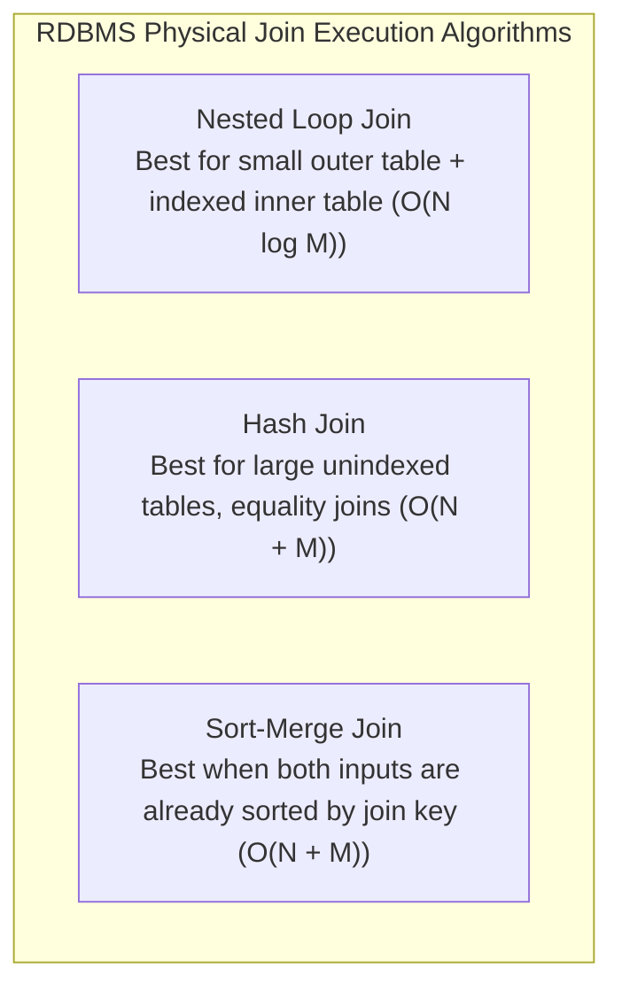

# Advanced SQL Joins & Relational Join Algorithms

## 1. Why This Matters
At IDFC FIRST Bank, database normalization splits customer PII, account ledgers, KYC statuses, and debit card records across separate tables to prevent update anomalies. Generating a customer's unified statement, detecting AML fraud networks, or routing funds requires multi-table joins. Senior technical interviewers will grill you on how database query planners choose between **Nested Loop Joins**, **Hash Joins**, and **Merge Joins**, and how missing indexes degrade join throughput.

---

## 2. Prerequisites
- Relational keys (Primary Key, Foreign Key).
- Basic SQL syntax (`SELECT ... FROM ... WHERE ...`).

---

## 3. Concept

### Types of SQL Joins
- **INNER JOIN:** Returns records where the join predicate matches in *both* tables.
- **LEFT (OUTER) JOIN:** Returns *all* rows from the left table and matched rows from the right table. Unmatched right columns evaluate to `NULL`.
- **RIGHT (OUTER) JOIN:** Returns all rows from the right table and matched rows from the left.
- **FULL OUTER JOIN:** Returns rows when there is a match in either left or right table.
- **CROSS JOIN:** Produces the Cartesian product ($N \times M$ rows).
- **SELF JOIN:** Joins a table to itself (used for hierarchical data, manager-employee structures, or transaction matching).



---

## 4. Simple Example: INNER vs LEFT JOIN

```sql
-- INNER JOIN: Only customers who have at least one account
SELECT c.customer_id, c.first_name, a.account_number
FROM customers c
INNER JOIN accounts a ON c.customer_id = a.customer_id;

-- LEFT JOIN: All customers, including newly registered customers with no accounts yet
SELECT c.customer_id, c.first_name, a.account_number
FROM customers c
LEFT JOIN accounts a ON c.customer_id = a.customer_id;
```

---

## 5. Real-World Banking Example: Detecting Unfunded Accounts & Dormant Customers
A customer onboarding compliance officer needs a report of all customers whose KYC is verified, but who have either zero accounts or whose accounts hold zero total balance.

```sql
SELECT 
    c.customer_id,
    c.first_name || ' ' || c.last_name AS customer_name,
    c.phone,
    COUNT(a.account_id) AS total_accounts,
    COALESCE(SUM(a.balance), 0.00) AS total_liquidity
FROM customers c
LEFT JOIN accounts a ON c.customer_id = a.customer_id
WHERE c.kyc_status = 'VERIFIED'
GROUP BY c.customer_id, c.first_name, c.last_name, c.phone
HAVING COUNT(a.account_id) = 0 OR SUM(a.balance) = 0.00;
```

---

## 6. Code: Multi-Table Financial Ledger Join with Self-Join

```sql
-- Comprehensive Transaction Audit: Sender details, Receiver details, and Card info
SELECT 
    t.transaction_reference,
    t.created_at,
    t.amount,
    t.payment_channel,
    -- Sender Information
    sender_cust.first_name || ' ' || sender_cust.last_name AS sender_name,
    sender_acc.account_number AS sender_account,
    -- Receiver Information
    receiver_cust.first_name || ' ' || receiver_cust.last_name AS receiver_name,
    receiver_acc.account_number AS receiver_account
FROM transactions t
LEFT JOIN accounts sender_acc ON t.from_account_id = sender_acc.account_id
LEFT JOIN customers sender_cust ON sender_acc.customer_id = sender_cust.customer_id
LEFT JOIN accounts receiver_acc ON t.to_account_id = receiver_acc.account_id
LEFT JOIN customers receiver_cust ON receiver_acc.customer_id = receiver_cust.customer_id
WHERE t.status = 'SUCCESS'
ORDER BY t.created_at DESC;
```

---

## 7. How It Works Internally: Physical Join Algorithms

### 1. Nested Loop Join
- The engine loops over the outer table row by row, and for each row looks up matching keys in the inner table.
- If the inner table join column has a B-Tree index, complexity is $O(N \log M)$. If unindexed, it degrades to quadratic $O(N \times M)$ Cartesian scans.

### 2. Hash Join
- The query planner picks the smaller table (build input) and builds an in-memory hash table on the join key.
- It then scans the larger table (probe input) once, hashing each key and probing the in-memory hash table for matches.
- **Complexity:** $O(N + M)$ time.
- **Memory footprint:** If the build table exceeds database working memory (`work_mem` in PostgreSQL), the engine spills hash partitions to disk (Grace Hash Join), causing dramatic I/O slowdowns.

### 3. Sort-Merge Join
- Both tables are sorted by the join key (or scanned in order via existing B-Tree indexes).
- Two pointers walk both streams simultaneously, merging matches in a single pass.
- **Complexity:** $O(N \log N + M \log M)$ if unsorted, but $O(N + M)$ if pre-indexed.

---

## 8. Common Mistakes
1. **Filtering the Right Table in the `WHERE` Clause Instead of the `ON` Clause in a `LEFT JOIN`:**
   ```sql
   -- WRONG: Accidentally converts the LEFT JOIN into an INNER JOIN!
   SELECT c.customer_id, a.balance
   FROM customers c
   LEFT JOIN accounts a ON c.customer_id = a.customer_id
   WHERE a.status = 'ACTIVE'; -- Filters out NULL rows where customer had no accounts!

   -- CORRECT: Keep filter in the ON predicate to preserve customers with no accounts
   SELECT c.customer_id, a.balance
   FROM customers c
   LEFT JOIN accounts a ON c.customer_id = a.customer_id AND a.status = 'ACTIVE';
   ```
2. **Missing `COALESCE` with `SUM()` in Outer Joins:** `SUM(NULL)` returns `NULL`, not `0.00`. Always wrap aggregate expressions in `COALESCE(SUM(balance), 0)`.
3. **Unintended Cartesian Products:** Forgetting the `ON` condition creates a `CROSS JOIN`, multiplying rows exponentially and crashing database memory.

---

## 9. Performance / Complexity Matrix

| Join Type / Algorithm | Best Scenario | Time Complexity | Memory Requirements |
| :--- | :--- | :---: | :---: |
| **Nested Loop (Indexed)** | Small outer table, indexed inner key | $O(N \log M)$ | $O(1)$ |
| **Nested Loop (Unindexed)** | Very small tables only | $O(N \times M)$ | $O(1)$ |
| **Hash Join** | Large unindexed tables, equality joins | $O(N + M)$ | $O(M)$ (`work_mem`) |
| **Sort-Merge Join** | Both inputs already sorted on join key | $O(N + M)$ | $O(1)$ |

---

## 10. Interview Questions (Easy $\to$ Medium $\to$ Hard)

### Easy
- **Q:** What is the difference between an `INNER JOIN` and a `LEFT JOIN`?

### Medium
- **Q:** How does putting a filter condition in the `ON` clause differ from putting it in the `WHERE` clause during a `LEFT JOIN`?

### Hard
- **Q:** You observe a query joining `transactions` (100M rows) and `accounts` (10M rows) suddenly slowing down from 200ms to 45 seconds after a traffic surge. `EXPLAIN` shows the planner shifted from a Hash Join to a disk-based external merge join. Why did this happen, and how do you fix it?

---

## 11. Follow-up Questions from Interviewer
- *"What is `work_mem` in PostgreSQL, and what happens when a Hash Join's hash table exceeds `work_mem`?"*
- *"Can a Hash Join be used for non-equality joins like `ON a.date >= b.start_date AND a.date <= b.end_date`?"* *(Answer: No! Hash tables require exact equality for bucket hashing; range joins must use Nested Loop or Merge Joins).*

---

## 12. Model Answer: Hash Join Memory Spilling & Remediation

> **Interviewer:** *"Why would a join query suddenly slow down by orders of magnitude when table size grows slightly?"*
> 
> **Model Answer:**
> "The most common culprit in production relational databases (like PostgreSQL) is **hash table memory spilling**.
> 
> During an in-memory Hash Join, the optimizer loads the smaller table's join keys into RAM bounded by the session parameter `work_mem`.
> 
> If the build table size exceeds `work_mem`, the database can no longer perform a one-pass in-memory hash join. It falls back to a **multi-batch hybrid hash join** (or external sort-merge join), writing intermediate buckets to temporary disk files. Disk I/O is three orders of magnitude slower than RAM, causing the sudden latency cliff from 200ms to 45 seconds.
> 
> **Remediation Strategy:**
> 1. Increase `work_mem` for the specific reporting session or service role (`SET work_mem = '128MB';`).
> 2. Ensure foreign key columns have B-Tree indexes so the planner can consider an index-nested loop join if only a filtered subset is needed.
> 3. Filter the build table early before joining (predicate pushdown)."

---

## 13. Practical Exercise (Run on `banking.db`)
Execute the following query to find any customers who have transactions where they sent money to themselves across their own different accounts:

```sql
SELECT 
    c.customer_id,
    c.first_name || ' ' || c.last_name AS customer_name,
    t.transaction_reference,
    t.amount,
    from_acc.account_number AS debited_account,
    to_acc.account_number AS credited_account
FROM transactions t
JOIN accounts from_acc ON t.from_account_id = from_acc.account_id
JOIN accounts to_acc ON t.to_account_id = to_acc.account_id
JOIN customers c ON from_acc.customer_id = c.customer_id
WHERE from_acc.customer_id = to_acc.customer_id
  AND from_acc.account_id != to_acc.account_id;
```

---

## 14. Quick Revision
- `INNER JOIN` keeps only matching rows; `LEFT JOIN` keeps all left rows and fills right mismatches with `NULL`.
- In `LEFT JOIN`, right table conditions in `WHERE` negate the outer join, turning it into an `INNER JOIN`.
- Physical joins: Nested Loop (indexed small sets), Hash Join (large unsorted sets, equality only), Sort-Merge Join (sorted inputs).
- Non-equality joins cannot use Hash Joins.

---

## 15. Interview Checklist
- [ ] Understands the difference between `ON` and `WHERE` filtering in outer joins.
- [ ] Can name and contrast Nested Loop, Hash Join, and Sort-Merge Join.
- [ ] Knows that Hash Joins require equality predicates (`=`).
- [ ] Explains `work_mem` and disk spill during hash joins.
