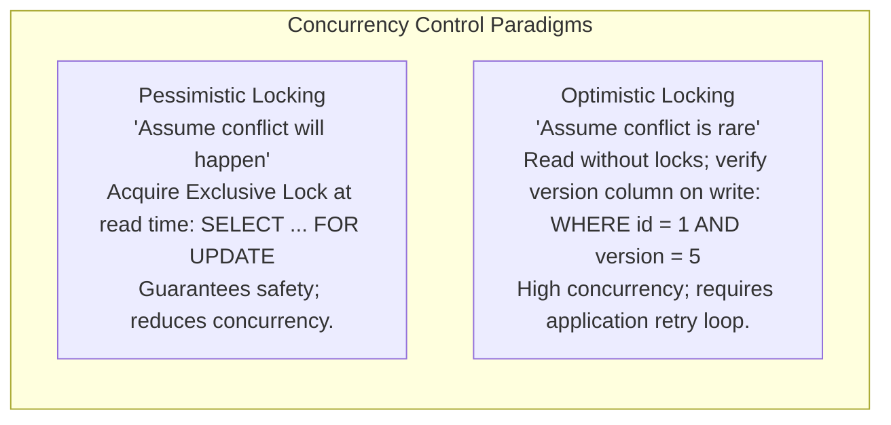
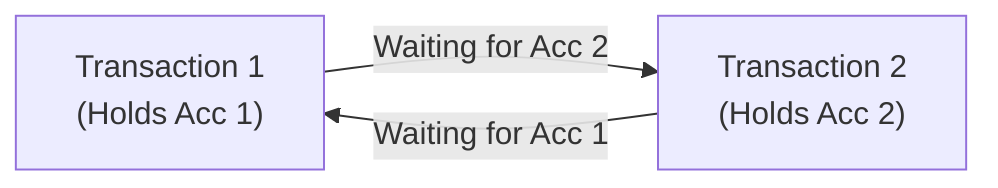

# Database Locking, Pessimistic vs Optimistic Concurrency & Deadlocks

## 1. Why This Matters
In banking transactions at IDFC FIRST Bank, multiple payment channels (UPI, ATM, Netbanking, POS terminals) may concurrently attempt to debit from or credit to the exact same customer account. If concurrency control is misconfigured:
- A customer with ₹1,000 can withdraw ₹1,000 simultaneously from two devices (double spending).
- Two cross-transfers (A → B and B → A) can lock each other's accounts, freezing the database into a **deadlock**.
In your interview, you will be expected to contrast **Pessimistic Locking** vs **Optimistic Locking**, explain the exact SQL syntax for each, and explain how databases detect and resolve deadlocks.

---

## 2. Prerequisites
- ACID properties (specifically Isolation and Atomicity).
- Basic transactional syntax (`BEGIN`, `COMMIT`, `ROLLBACK`).

---

## 3. Concept

### Lock Modes
1. **Shared Lock (S-Lock / Read Lock):** Multiple transactions can hold shared locks on the same row concurrently for reading (`SELECT ... FOR SHARE`). Writers are blocked until all S-locks are released.
2. **Exclusive Lock (X-Lock / Write Lock):** Only one transaction can hold an X-lock on a row (`SELECT ... FOR UPDATE` or `UPDATE` / `DELETE`). All other readers and writers are blocked.



---

## 4. Simple Example: Pessimistic vs Optimistic Update

```sql
-- 1. Pessimistic Locking (SELECT ... FOR UPDATE)
BEGIN;
SELECT balance FROM accounts WHERE account_id = 101 FOR UPDATE;
-- Balance is now locked; any concurrent transaction attempting to read or write this row BLOCKS!
UPDATE accounts SET balance = balance - 500 WHERE account_id = 101;
COMMIT;

-- 2. Optimistic Locking (Version Column)
-- Step A: Application reads without locking:
SELECT balance, version FROM accounts WHERE account_id = 101; -- Suppose balance = 1000, version = 1

-- Step B: Application updates only if version has NOT changed:
UPDATE accounts 
SET balance = balance - 500, version = version + 1
WHERE account_id = 101 AND version = 1;
-- If rows affected == 0, another transaction updated first! Abort and retry.
```

---

## 5. Real-World Banking Example: The Cross-Transfer Deadlock
Customer 1 transfers ₹5,000 to Customer 2, while Customer 2 concurrently transfers ₹3,000 to Customer 1:

```text
Transaction 1 (User 1 -> User 2)          Transaction 2 (User 2 -> User 1)
----------------------------------------------------------------------------------
t1: Locks Account 1 (X-Lock acquired)
t2:                                        Locks Account 2 (X-Lock acquired)
t3: Requests Lock on Account 2 (WAITS...)
t4:                                        Requests Lock on Account 1 (WAITS...)
----------------------------------------------------------------------------------
DEADLOCK! Neither transaction can proceed!
```



---

## 6. Code: Production-Grade Optimistic Locking with Retry in Node.js

```javascript
async function debitAccountOptimistic(accountId, debitAmount, maxRetries = 3) {
    for (let attempt = 1; attempt <= maxRetries; attempt++) {
        const client = await pool.connect();
        try {
            // 1. Read current state without locking
            const res = await client.query(
                'SELECT balance, version FROM accounts WHERE account_id = $1',
                [accountId]
            );

            if (res.rows.length === 0) throw new Error('Account not found');

            const currentBalance = parseFloat(res.rows[0].balance);
            const currentVersion = parseInt(res.rows[0].version);

            if (currentBalance < debitAmount) {
                throw new Error('Insufficient funds');
            }

            // 2. Attempt update conditioned on version match
            const updateRes = await client.query(
                `UPDATE accounts 
                 SET balance = balance - $1, version = version + 1 
                 WHERE account_id = $2 AND version = $3`,
                [debitAmount, accountId, currentVersion]
            );

            // If affected rows == 1, update succeeded!
            if (updateRes.rowCount === 1) {
                return { success: true, newBalance: currentBalance - debitAmount };
            }

            // Version mismatch: another transaction committed first
            console.warn(`Version conflict on account ${accountId}. Retrying (${attempt}/${maxRetries})...`);
            await new Promise((r) => setTimeout(r, Math.random() * 50 * attempt)); // Jittered backoff

        } finally {
            client.release();
        }
    }
    throw new Error('Transaction failed after maximum retries due to high concurrency');
}
```

---

## 7. How It Works Internally: Deadlock Detection & Wait-For Graphs

### The Lock Manager & Wait-For Graph (WFG)
The database engine maintains a directed graph in shared memory:
- **Nodes:** Active transactions.
- **Edges:** Directed from transaction T_A to transaction T_B if T_A is waiting for a lock held by T_B.

### Deadlock Detection Daemon
1. A background thread runs at regular intervals (e.g., `deadlock_timeout = 1s` in PostgreSQL).
2. It executes **Tarjan's strongly connected components algorithm** or **Depth-First Search (DFS)** to detect cycles in the Wait-For Graph.
3. If a cycle is detected, the engine breaks the deadlock by selecting a **victim transaction** (typically the transaction with the fewest modified rows or lowest cost to abort), terminates it with error `40P01` (`deadlock_detected`), and rolls it back, allowing the other transaction to complete.

---

## 8. Common Mistakes
1. **Inconsistent Lock Ordering Across Services:**
   ```text
   Service A locks: Account A, then Account B
   Service B locks: Account B, then Account A
   ```
   **Golden Rule:** Always acquire locks in a globally deterministic order (e.g., sort account IDs ascending before locking: `account_id_min` first, then `account_id_max`). This makes cycles in the Wait-For Graph mathematically impossible!
2. **Locking Rows During Long Third-Party API Calls:** If your code locks a bank account row, calls an external SMS gateway or third-party bank verification API (which hangs for 5 seconds), all other operations on that account queue up, exhausting pool connections.
3. **Using `SELECT ... FOR UPDATE` Without `SKIP LOCKED` or `NOWAIT` for Task Queues:**
   In message processing tables, concurrent workers trying to fetch tasks with `FOR UPDATE` will pile up behind worker 1. Use `SELECT ... FOR UPDATE SKIP LOCKED` to allow workers to grab distinct rows concurrently.

---

## 9. Performance / Complexity Matrix

| Strategy | Read Overhead | Write Overhead | Best Used When |
| :--- | :--- | :--- | :--- |
| **Pessimistic (`FOR UPDATE`)** | High (Acquires exclusive lock) | High (Contention blocks readers) | High contention, high probability of collision (e.g., flash sales, single balance updates). |
| **Optimistic (Version Key)** | Zero (Standard MVCC read) | Low (Single conditional write) | Low-to-moderate contention, mostly reads. |
| **Deterministic Ordering** | Zero | Zero | Eliminates deadlocks completely in multi-entity transfers. |

---

### 🟢 Easy Question: Shared Lock (S) vs Exclusive Lock (X)
**Q:** What is the fundamental difference between a Shared Lock and an Exclusive Lock? Provide their compatibility matrix and SQL examples.

**Complete Answer:**
1. **Lock Definitions:**
   - **Shared Lock (S-Lock / Read Lock):** Acquired when reading data without mutating it. Multiple transactions can hold concurrent shared locks on the same row.
   - **Exclusive Lock (X-Lock / Write Lock):** Acquired when modifying data (`INSERT`, `UPDATE`, `DELETE`) or explicitly reserving a row (`FOR UPDATE`). Only ONE transaction can hold an exclusive lock on a row at any given moment; all other readers and writers are blocked.
2. **Lock Compatibility Matrix:**
   | Requested \ Held | None | Shared (S) | Exclusive (X) |
   | :--- | :---: | :---: | :---: |
   | **Shared (S)** | Granted | Granted (Compatible) | Blocked (Wait) |
   | **Exclusive (X)**| Granted | Blocked (Wait) | Blocked (Wait) |
3. **Explicit SQL Syntax:**
   ```sql
   -- Acquires Shared Lock (allows other transactions to read, prevents writes)
   SELECT * FROM accounts WHERE account_id = 101 FOR SHARE;

   -- Acquires Exclusive Lock (blocks all other transactions from reading with lock or writing)
   SELECT * FROM accounts WHERE account_id = 101 FOR UPDATE;
   ```
4. **Intent Locks at Table Level:**
   - When an engine locks a row, it first acquires an **Intent Shared (IS)** or **Intent Exclusive (IX)** lock on the parent table. This allows a table-level operation (like `ALTER TABLE` or `LOCK TABLE`) to instantly check whether any child rows are locked in O(1) time without scanning millions of individual row locks.

---

### 🟠 Medium Question: Pessimistic vs Optimistic Locking in Banking Architecture
**Q:** Compare Pessimistic Locking vs Optimistic Locking. In what banking scenarios would you choose one over the other?

**Complete Answer:**
1. **Mechanics Comparison:**
   - **Pessimistic Locking (`SELECT ... FOR UPDATE`):**
     - Assumes conflicts *will* happen. The transaction locks the row before reading its state and holds the exclusive lock until `COMMIT` or `ROLLBACK`.
     - *Advantage:* Guaranteed consistency; zero failed writes or rollback retries.
     - *Disadvantage:* High lock contention; other transactions block in connection pools, reducing system throughput.
   - **Optimistic Locking (Version Column):**
     - Assumes conflicts are *rare*. Reads without locks via MVCC. When writing, checks if the version has changed:
       ```sql
       UPDATE accounts 
       SET balance = balance - 500, version = version + 1 
       WHERE account_id = :id AND version = :read_version;
       ```
     - *Advantage:* Zero database locks; high throughput; ideal for distributed reads.
     - *Disadvantage:* If another transaction committed first, rows affected = 0. The application must roll back and retry.
2. **Banking Architectural Decision Matrix:**
   - **Use Pessimistic Locking for:** Core Ledger Balance Deductions and UPI Fund Transfers. When 100 concurrent payments hit a merchant account, optimistic retry loops will burn CPU and network cycles repeatedly failing. A pessimistic queue on the ledger row serializes payments cleanly.
   - **Use Optimistic Locking for:** Customer Profile Updates, KYC Document Verification, and Loan Application Workflows. Here, users take minutes to fill forms; holding a database lock during user think-time would exhaust DB connection pools.

---

### 🔴 Hard Question: Deadlock-Free Fund Transfers via Deterministic Lock Ordering
**Q:** If User A transfers money to User B, and User B simultaneously transfers money to User A, how do you mathematically guarantee that no database deadlock will ever occur?

**Complete Answer:**
- **Root Cause of Transfer Deadlocks:**
  - Txn 1 (A → B): Locks Account A, then attempts to lock Account B.
  - Txn 2 (B → A): Locks Account B, then attempts to lock Account A.
  - Both transactions now wait for each other, creating a circular cycle in the Wait-For Graph (Deadlock `40P01`).
- **The Solution: Deterministic Resource Ordering:**
  - Coffman's condition for deadlocks requires **Circular Wait**. To eliminate circular wait mathematically, enforce a strict global partial order on lock acquisitions:
    `first_id = min(acc_from, acc_to)`
    `second_id = max(acc_from, acc_to)`
  - Both transactions are forced to acquire locks in ascending order of `account_id`.
  - Txn 1 and Txn 2 will both contend for `min(A, B)` *first*. The winner proceeds to lock `max(A, B)`, while the loser waits before acquiring any lock. A circular cycle is mathematically impossible!

```python
import psycopg2

def execute_deadlock_free_transfer(conn, from_acc: int, to_acc: int, amount: float):
    """Executes a dual-account ledger transfer guaranteed to never deadlock."""
    # Step 1: Enforce deterministic ascending lock order
    first_lock_id = min(from_acc, to_acc)
    second_lock_id = max(from_acc, to_acc)

    with conn.cursor() as cur:
        # Step 2: Acquire row locks deterministically
        cur.execute(
            "SELECT account_id, balance FROM accounts WHERE account_id = %s FOR UPDATE;",
            (first_lock_id,)
        )
        cur.execute(
            "SELECT account_id, balance FROM accounts WHERE account_id = %s FOR UPDATE;",
            (second_lock_id,)
        )

        # Step 3: Verify source balance
        cur.execute("SELECT balance FROM accounts WHERE account_id = %s;", (from_acc,))
        current_bal = cur.fetchone()[0]
        if current_bal < amount:
            conn.rollback()
            raise ValueError("Insufficient Funds")

        # Step 4: Perform atomic balance adjustments
        cur.execute("UPDATE accounts SET balance = balance - %s WHERE account_id = %s;", (amount, from_acc))
        cur.execute("UPDATE accounts SET balance = balance + %s WHERE account_id = %s;", (amount, to_acc))

        # Step 5: Record double-entry ledger audit row
        cur.execute(
            "INSERT INTO ledger_entries (from_acc, to_acc, amount, status) VALUES (%s, %s, %s, 'SUCCESS');",
            (from_acc, to_acc, amount)
        )
        conn.commit()
```

---

## 11. Follow-up Questions from Interviewer with Complete Answers

### 🎤 Follow-up 1
**Interviewer:** *"What is the difference between `SELECT ... FOR UPDATE NOWAIT` and `SELECT ... FOR UPDATE SKIP LOCKED`? When would you use each in a high-throughput banking system?"*

**Complete Answer:**
1. **`NOWAIT` (Fail Fast):**
   - If the requested row is currently locked by another transaction, `NOWAIT` immediately aborts the query and raises an error (`55P03: could not obtain lock on row in relation...`).
   - **Banking Use Case:** High-frequency customer card swiping or ATM withdrawals. Rather than letting the payment gateway connection hang for 10 seconds waiting on a locked row (which exhausts application thread pools), the system fails immediately with a clean error (`"Concurrent transaction in progress; please retry"`).
2. **`SKIP LOCKED` (High-Concurrency Work Queues):**
   - If the requested row is locked, `SKIP LOCKED` does not wait and does not throw an error: it silently skips the locked row and returns the first available *unlocked* row matching the `WHERE` condition.
   - **Banking Use Case:** Distributed asynchronous payment dispatchers (e.g. processing 10,000 pending NEFT/RTGS settlement batches).
     ```sql
     -- 10 worker microservices run this concurrently with 0% lock contention:
     BEGIN;
     SELECT payment_id, amount, beneficiary_ifsc
     FROM pending_payments
     WHERE status = 'PENDING'
     ORDER BY priority DESC, created_at ASC
     LIMIT 1
     FOR UPDATE SKIP LOCKED;
     
     -- Process payment with external clearing house...
     UPDATE pending_payments SET status = 'PROCESSING' WHERE payment_id = :id;
     COMMIT;
     ```
   - Each worker grabs a distinct, non-overlapping batch with zero contention and zero deadlocks.

---

### 🎤 Follow-up 2
**Interviewer:** *"How does Two-Phase Locking (2PL) differ from Two-Phase Commit (2PC)? Why are their names so similar but their architectural purposes completely different?"*

**Complete Answer:**
- **The Core Distinction:**
  - **2PL (Two-Phase Locking):** A **single-node concurrency control protocol** ensuring serializability across concurrent transactions within a single database engine.
  - **2PC (Two-Phase Commit):** A **distributed consensus protocol** ensuring atomicity across multiple distinct network nodes or heterogeneous databases (Distributed Transactions).
- **2PL Breakdown:**
  - **Growing Phase:** A transaction may acquire locks, but cannot release any lock.
  - **Shrinking Phase:** A transaction may release locks, but cannot acquire any new locks.
  - **Strict 2PL (SS2PL):** Prevents cascading aborts by holding all exclusive locks until `COMMIT`/`ROLLBACK`. All major RDBMS (PostgreSQL, MySQL InnoDB, Oracle) implement Strict 2PL.
- **2PC Breakdown:**
  - **Prepare Phase (Voting):** The coordinator asks all participating resource managers (e.g., Bank DB and Fraud Service DB): *"Can you commit txn X?"* Participants execute local operations, write prepare records to WAL, and reply `VOTE_COMMIT` or `VOTE_ABORT`.
  - **Commit Phase:** If all vote yes, coordinator writes `COMMIT` to disk and commands participants to commit. If any votes no, coordinator broadcasts `ABORT`.
- **Architectural Trade-off in FinTech:**
---

## 13. Practical Exercise
Inspect the schema version column on `banking.db`:

```bash
sqlite3 banking.db
```

```sql
-- Notice that the accounts table created in schema.sql already contains a version column!
SELECT account_id, account_number, balance, version FROM accounts;

-- Test an optimistic update:
UPDATE accounts 
SET balance = balance - 100, version = version + 1 
WHERE account_id = 101 AND version = 1;

-- Verify row count was 1 and version is now 2:
SELECT account_id, balance, version FROM accounts WHERE account_id = 101;
```

---

## 14. Quick Revision
- Shared lock (Read) allows multiple readers; Exclusive lock (Write) allows only 1 transaction.
- Pessimistic: locks early (`FOR UPDATE`); Optimistic: checks version on commit (`WHERE version = v`).
- Deadlocks require 4 Coffman conditions: Mutual Exclusion, Hold and Wait, No Preemption, Circular Wait.
- Sort entity IDs before locking to guarantee deadlock-free execution.
- `SKIP LOCKED` enables scalable distributed worker queues without lock contention.

---

## 15. Interview Checklist
- [ ] Clearly articulates the tradeoffs between Pessimistic and Optimistic locking.
- [ ] Writes the exact SQL for an optimistic version check.
- [ ] Explains deterministic lock ordering to eliminate transfer deadlocks.
- [ ] Explains `SELECT ... FOR UPDATE SKIP LOCKED` for task queues.
