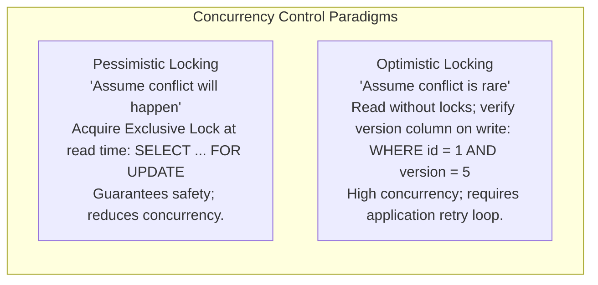
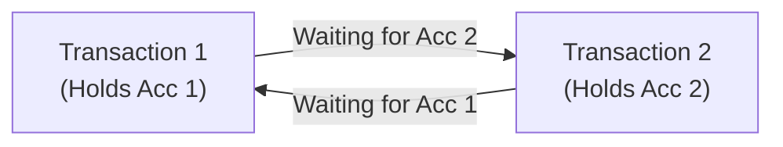

# Database Locking, Pessimistic vs Optimistic Concurrency & Deadlocks

## 1. Why This Matters
In banking transactions at IDFC FIRST Bank, multiple payment channels (UPI, ATM, Netbanking, POS terminals) may concurrently attempt to debit from or credit to the exact same customer account. If concurrency control is misconfigured:
- A customer with ₹1,000 can withdraw ₹1,000 simultaneously from two devices (double spending).
- Two cross-transfers (A $\to$ B and B $\to$ A) can lock each other's accounts, freezing the database into a **deadlock**.
In your interview, you will be expected to contrast **Pessimistic Locking** vs **Optimistic Locking**, explain the exact SQL syntax for each, and explain how databases detect and resolve deadlocks.

---

## 2. Prerequisites
- ACID properties (specifically Isolation and Atomicity).
- Basic transactional syntax (`BEGIN`, `COMMIT`, `ROLLBACK`).

---

## 3. Concept

### Lock Modes
1. **Shared Lock (S-Lock / Read Lock):** Multiple transactions can hold shared locks on the same row concurrently for reading (`SELECT ... FOR SHARE`). Writers are blocked until all S-locks are released.
2. **Exclusive Lock (X-Lock / Write Lock):** Only one transaction can hold an X-lock on a row (`SELECT ... FOR UPDATE` or `UPDATE` / `DELETE`). All other readers and writers are blocked.



---

## 4. Simple Example: Pessimistic vs Optimistic Update

```sql
-- 1. Pessimistic Locking (SELECT ... FOR UPDATE)
BEGIN;
SELECT balance FROM accounts WHERE account_id = 101 FOR UPDATE;
-- Balance is now locked; any concurrent transaction attempting to read or write this row BLOCKS!
UPDATE accounts SET balance = balance - 500 WHERE account_id = 101;
COMMIT;

-- 2. Optimistic Locking (Version Column)
-- Step A: Application reads without locking:
SELECT balance, version FROM accounts WHERE account_id = 101; -- Suppose balance = 1000, version = 1

-- Step B: Application updates only if version has NOT changed:
UPDATE accounts 
SET balance = balance - 500, version = version + 1
WHERE account_id = 101 AND version = 1;
-- If rows affected == 0, another transaction updated first! Abort and retry.
```

---

## 5. Real-World Banking Example: The Cross-Transfer Deadlock
Customer 1 transfers ₹5,000 to Customer 2, while Customer 2 concurrently transfers ₹3,000 to Customer 1:

```text
Transaction 1 (User 1 -> User 2)          Transaction 2 (User 2 -> User 1)
----------------------------------------------------------------------------------
t1: Locks Account 1 (X-Lock acquired)
t2:                                        Locks Account 2 (X-Lock acquired)
t3: Requests Lock on Account 2 (WAITS...)
t4:                                        Requests Lock on Account 1 (WAITS...)
----------------------------------------------------------------------------------
DEADLOCK! Neither transaction can proceed!
```



---

## 6. Code: Production-Grade Optimistic Locking with Retry in Node.js

```javascript
async function debitAccountOptimistic(accountId, debitAmount, maxRetries = 3) {
    for (let attempt = 1; attempt <= maxRetries; attempt++) {
        const client = await pool.connect();
        try {
            // 1. Read current state without locking
            const res = await client.query(
                'SELECT balance, version FROM accounts WHERE account_id = $1',
                [accountId]
            );

            if (res.rows.length === 0) throw new Error('Account not found');

            const currentBalance = parseFloat(res.rows[0].balance);
            const currentVersion = parseInt(res.rows[0].version);

            if (currentBalance < debitAmount) {
                throw new Error('Insufficient funds');
            }

            // 2. Attempt update conditioned on version match
            const updateRes = await client.query(
                `UPDATE accounts 
                 SET balance = balance - $1, version = version + 1 
                 WHERE account_id = $2 AND version = $3`,
                [debitAmount, accountId, currentVersion]
            );

            // If affected rows == 1, update succeeded!
            if (updateRes.rowCount === 1) {
                return { success: true, newBalance: currentBalance - debitAmount };
            }

            // Version mismatch: another transaction committed first
            console.warn(`Version conflict on account ${accountId}. Retrying (${attempt}/${maxRetries})...`);
            await new Promise((r) => setTimeout(r, Math.random() * 50 * attempt)); // Jittered backoff

        } finally {
            client.release();
        }
    }
    throw new Error('Transaction failed after maximum retries due to high concurrency');
}
```

---

## 7. How It Works Internally: Deadlock Detection & Wait-For Graphs

### The Lock Manager & Wait-For Graph (WFG)
The database engine maintains a directed graph in shared memory:
- **Nodes:** Active transactions.
- **Edges:** Directed from transaction $T_A$ to transaction $T_B$ if $T_A$ is waiting for a lock held by $T_B$.

### Deadlock Detection Daemon
1. A background thread runs at regular intervals (e.g., `deadlock_timeout = 1s` in PostgreSQL).
2. It executes **Tarjan's strongly connected components algorithm** or **Depth-First Search (DFS)** to detect cycles in the Wait-For Graph.
3. If a cycle is detected, the engine breaks the deadlock by selecting a **victim transaction** (typically the transaction with the fewest modified rows or lowest cost to abort), terminates it with error `40P01` (`deadlock_detected`), and rolls it back, allowing the other transaction to complete.

---

## 8. Common Mistakes
1. **Inconsistent Lock Ordering Across Services:**
   ```text
   Service A locks: Account A, then Account B
   Service B locks: Account B, then Account A
   ```
   **Golden Rule:** Always acquire locks in a globally deterministic order (e.g., sort account IDs ascending before locking: `account_id_min` first, then `account_id_max`). This makes cycles in the Wait-For Graph mathematically impossible!
2. **Locking Rows During Long Third-Party API Calls:** If your code locks a bank account row, calls an external SMS gateway or third-party bank verification API (which hangs for 5 seconds), all other operations on that account queue up, exhausting pool connections.
3. **Using `SELECT ... FOR UPDATE` Without `SKIP LOCKED` or `NOWAIT` for Task Queues:**
   In message processing tables, concurrent workers trying to fetch tasks with `FOR UPDATE` will pile up behind worker 1. Use `SELECT ... FOR UPDATE SKIP LOCKED` to allow workers to grab distinct rows concurrently.

---

## 9. Performance / Complexity Matrix

| Strategy | Read Overhead | Write Overhead | Best Used When |
| :--- | :--- | :--- | :--- |
| **Pessimistic (`FOR UPDATE`)** | High (Acquires exclusive lock) | High (Contention blocks readers) | High contention, high probability of collision (e.g., flash sales, single balance updates). |
| **Optimistic (Version Key)** | Zero (Standard MVCC read) | Low (Single conditional write) | Low-to-moderate contention, mostly reads. |
| **Deterministic Ordering** | Zero | Zero | Eliminates deadlocks completely in multi-entity transfers. |

---

## 10. Interview Questions (Easy $\to$ Medium $\to$ Hard)

### Easy
- **Q:** What is the difference between a Shared Lock and an Exclusive Lock?

### Medium
- **Q:** Compare Pessimistic Locking vs Optimistic Locking. When would you choose one over the other in a banking architecture?

### Hard
- **Q:** How do you guarantee that a fund transfer between Account A and Account B will never produce a database deadlock, regardless of how many concurrent transfers are executing in reverse directions?

---

## 11. Follow-up Questions from Interviewer
- *"What is the difference between `SELECT ... FOR UPDATE NOWAIT` and `SELECT ... FOR UPDATE SKIP LOCKED`?"*
  *(Answer: `NOWAIT` throws an immediate error if the row is already locked by another transaction. `SKIP LOCKED` bypasses locked rows and returns the first available unlocked rows, making it ideal for distributed worker job queues).*
- *"How does two-phase locking (2PL) differ from two-phase commit (2PC)?"*
  *(Answer: 2PL is a concurrency control protocol to guarantee serializability within a single database node by acquiring all locks before releasing any. 2PC is a distributed consensus protocol to coordinate atomic commit across multiple distinct database nodes).*

---

## 12. Model Answer: Deterministic Lock Ordering to Prevent Deadlocks

> **Interviewer:** *"If User A transfers money to User B, and User B simultaneously transfers money to User A, how do you prevent deadlocks at the code level?"*
> 
> **Model Answer:**
> "A deadlock occurs because both transactions acquire locks on their source accounts first and then attempt to lock their target accounts in opposite order, creating a circular wait in the database Wait-For Graph.
> 
> To eliminate deadlocks with mathematical certainty, we enforce **Deterministic Resource Ordering**:
> 
> 1. Before executing the `BEGIN` block, the application sorts the two account IDs numerically:
>    $$\text{first\_lock\_id} = \min(\text{accA}, \text{accB}), \quad \text{second\_lock\_id} = \max(\text{accA}, \text{accB})$$
> 2. Both transactions are forced to acquire row-level locks strictly in ascending ID order:
>    ```sql
>    SELECT balance FROM accounts WHERE account_id = :first_lock_id FOR UPDATE;
>    SELECT balance FROM accounts WHERE account_id = :second_lock_id FOR UPDATE;
>    ```
> 3. Because both transactions attempt to acquire the lock on the smaller account ID first, one transaction will acquire it and the other will wait *before holding any locks on the second account*.
> 4. Since a transaction never holds a higher resource while waiting for a lower resource, **circular wait condition #4 of Coffman's deadlock criteria is broken**, making deadlocks impossible."

---

## 13. Practical Exercise
Inspect the schema version column on `banking.db`:

```bash
sqlite3 banking.db
```

```sql
-- Notice that the accounts table created in schema.sql already contains a version column!
SELECT account_id, account_number, balance, version FROM accounts;

-- Test an optimistic update:
UPDATE accounts 
SET balance = balance - 100, version = version + 1 
WHERE account_id = 101 AND version = 1;

-- Verify row count was 1 and version is now 2:
SELECT account_id, balance, version FROM accounts WHERE account_id = 101;
```

---

## 14. Quick Revision
- Shared lock (Read) allows multiple readers; Exclusive lock (Write) allows only 1 transaction.
- Pessimistic: locks early (`FOR UPDATE`); Optimistic: checks version on commit (`WHERE version = v`).
- Deadlocks require 4 Coffman conditions: Mutual Exclusion, Hold and Wait, No Preemption, Circular Wait.
- Sort entity IDs before locking to guarantee deadlock-free execution.
- `SKIP LOCKED` enables scalable distributed worker queues without lock contention.

---

## 15. Interview Checklist
- [ ] Clearly articulates the tradeoffs between Pessimistic and Optimistic locking.
- [ ] Writes the exact SQL for an optimistic version check.
- [ ] Explains deterministic lock ordering to eliminate transfer deadlocks.
- [ ] Explains `SELECT ... FOR UPDATE SKIP LOCKED` for task queues.
