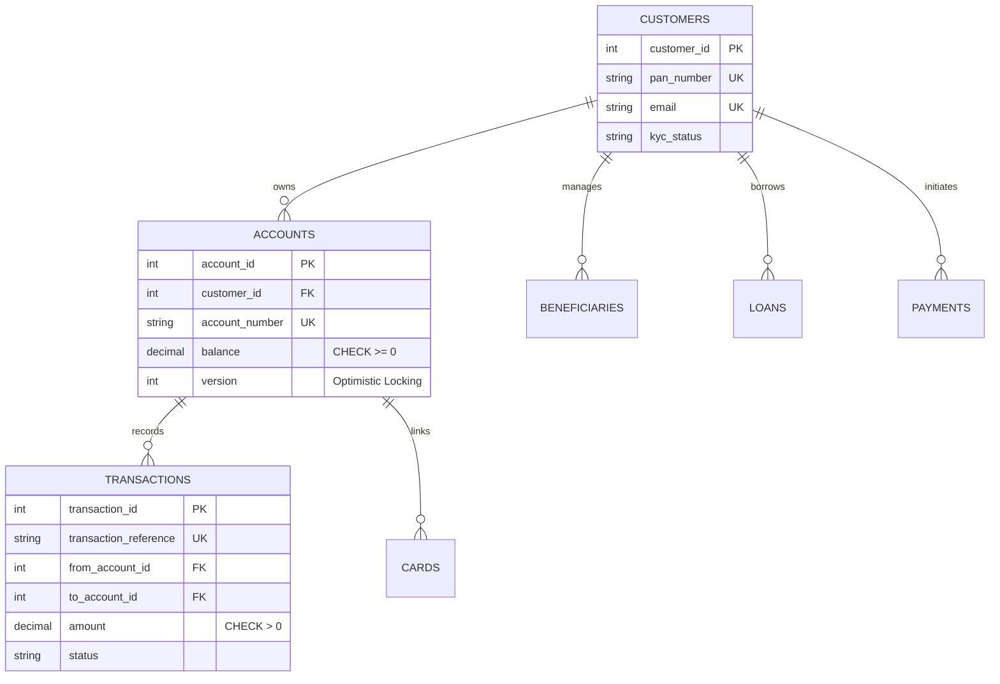
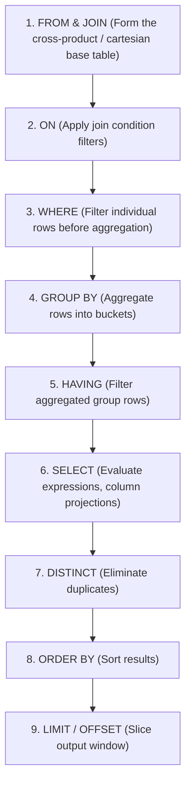

# SQL Fundamentals & Relational Data Modeling for Banking

## 1. Why This Matters
In banking systems like IDFC FIRST Bank, relational databases are the source of truth for accounts, balances, regulatory audit trails, and ledgers. Unlike web startups that can tolerate eventual consistency or lost metrics, a banking system cannot lose a single rupee or permit duplicate debits. 3+ YoE interviewers test whether you truly understand relational integrity constraints, DDL/DML semantics, schema design trade-offs, and query execution fundamentals.

---

## 2. Prerequisites
- Basic understanding of relational tables (rows, columns, schemas).
- Familiarity with SQL syntax (`SELECT`, `INSERT`, `UPDATE`, `DELETE`).

---

## 3. Concept

### Relational Integrity Constraints
1. **Primary Key (PK):** Uniquely identifies each record; implies `NOT NULL` and `UNIQUE`. In transactional banking, auto-incrementing integers or sequential UUIDv7 are preferred over random UUIDv4 for clustered index insertion efficiency.
2. **Foreign Key (FK):** Enforces referential integrity between child and parent tables (`ON DELETE RESTRICT` prevents orphaned accounts if a customer record is deleted).
3. **Check Constraints (`CHECK`):** Enforces domain validation at the database layer (e.g., `CHECK (balance >= 0.00)` prevents overdraft below zero at the storage engine level, regardless of application bugs).
4. **Unique Constraints (`UNIQUE`):** Enforces non-duplication (e.g., PAN numbers, account numbers, idempotency keys).



---

## 4. Simple Example: Creating and Querying Bank Accounts

```sql
-- Creating an account with strict constraints
CREATE TABLE accounts_demo (
    account_id INTEGER PRIMARY KEY AUTOINCREMENT,
    customer_id INTEGER NOT NULL,
    account_type VARCHAR(20) CHECK (account_type IN ('SAVINGS', 'CURRENT')),
    balance DECIMAL(15, 2) NOT NULL DEFAULT 0.00 CHECK (balance >= 0.00),
    created_at TIMESTAMP DEFAULT CURRENT_TIMESTAMP
);

-- Safe balance increment
UPDATE accounts_demo
SET balance = balance + 500.00
WHERE account_id = 101;
```

---

## 5. Real-World Banking Example: Atomic Fund Transfer Invariant
When ₹1,000 is transferred from Account A to Account B:
1. Account A balance must be $\ge 1000$ (enforced by application check + DB constraint `CHECK (balance >= 0.00)`).
2. The debit and credit must occur in a single atomic transaction.
3. If Account A tries to go negative, the database aborts with a constraint violation error, rolling back the debit and ensuring money cannot be created or destroyed.

---

## 6. Code: Essential DQL Queries on `banking.db`

```sql
-- 1. High-Value Active Savings Accounts with Customer Details
SELECT 
    c.customer_id,
    c.first_name || ' ' || c.last_name AS full_name,
    c.phone,
    a.account_number,
    a.balance
FROM customers c
INNER JOIN accounts a ON c.customer_id = a.customer_id
WHERE a.account_type = 'SAVINGS'
  AND a.status = 'ACTIVE'
  AND a.balance >= 50000.00
ORDER BY a.balance DESC;

-- 2. Aggregating Total Inflow vs Outflow Across Channels
SELECT 
    payment_channel,
    COUNT(*) AS total_transactions,
    SUM(CASE WHEN transaction_type = 'DEPOSIT' THEN amount ELSE 0 END) AS total_deposited,
    SUM(CASE WHEN transaction_type IN ('WITHDRAWAL', 'TRANSFER') THEN amount ELSE 0 END) AS total_outflow
FROM transactions
WHERE status = 'SUCCESS'
GROUP BY payment_channel
ORDER BY total_transactions DESC;
```

---

## 7. How It Works Internally: The SQL Execution Order
When you write a SQL query, the database parses and executes clauses in a logical order that is very different from the written order:



> **Why this matters in interviews:** You cannot use column aliases created in `SELECT` inside the `WHERE` clause because `WHERE` executes before `SELECT`.

---

## 8. Common Mistakes
1. **Using `WHERE` Instead of `HAVING` for Aggregates:** `WHERE SUM(amount) > 1000` throws a syntax error. Aggregated expressions must be filtered in `HAVING`.
2. **Float/Double for Currency:** Never use `FLOAT` or `DOUBLE` for monetary balances. Floating-point binary representation produces IEEE 754 precision errors (e.g., $0.1 + 0.2 = 0.30000000000000004$). Always use `DECIMAL(15, 2)` or `NUMERIC`, or store balances as integer paise/cents.
3. **Missing Foreign Key Indexes:** Relational engines do NOT automatically index foreign key columns in child tables. Without an index on `transactions(from_account_id)`, every join or cascade operation forces a full sequential table scan!

---

## 9. Performance / Complexity Matrix

| Clause / Operation | Complexity Without Index | Complexity With B-Tree Index |
| :--- | :---: | :---: |
| **Lookup by Primary Key** | $O(\log N)$ (Clustered) | $O(\log N)$ |
| **Filter by Indexed Column (`WHERE status = 'ACTIVE'`)** | $O(N)$ (Sequential Scan) | $O(\log N + K)$ (Index Range Scan) |
| **Join on Foreign Key (`JOIN accounts ON ...`)** | $O(N \times M)$ (Nested Loop) | $O(N \log M)$ (Index Scan) or $O(N+M)$ (Hash Join) |
| **GROUP BY without Index** | $O(N \log N)$ (Sort-based) or $O(N)$ (Hash-based aggregation) | $O(N)$ (Index ordered traversal) |
| **ORDER BY on Indexed Column** | $O(N \log N)$ (Sort in TempDB/Memory) | $O(1)$ (Direct B-Tree index scan) |

---

## 10. Interview Questions (Easy $\to$ Medium $\to$ Hard)

### Easy
- **Q:** What is the difference between `WHERE` and `HAVING` clauses? Give an example where one works and the other fails.

### Medium
- **Q:** Explain why storing monetary values as `FLOAT` is unacceptable in banking. What exact data type should be used in PostgreSQL/MySQL and why?

### Hard
- **Q:** In a high-concurrency payment table with 500 million rows, an application runs `SELECT COUNT(*) FROM transactions WHERE customer_id = 101`. The query takes 4 seconds. How would you diagnose, explain, and optimize this query?

---

## 11. Follow-up Questions from Interviewer
- *"If you add an index on `(customer_id, created_at)`, does the order of columns in the composite index matter for queries filtering by `created_at` alone?"*
- *"What is a Write-Ahead Log (WAL), and how does it ensure durability before data pages are written to disk?"*

---

## 12. Model Answer: Diagnosing & Optimizing Query Execution

> **Interviewer:** *"A query filtering transactions by `customer_id` is slow in production. Walk me through how you investigate and resolve it."*
> 
> **Model Answer:**
> "First, I inspect the query execution plan using `EXPLAIN ANALYZE` to check whether the optimizer is performing a **Sequential Table Scan** or an **Index Scan**.
> 
> In a 500M row table, if `customer_id` is unindexed, the engine scans every single data page from disk, consuming massive I/O.
> 
> To resolve this:
> 1. I create a B+ Tree index on `transactions(customer_id)`.
> 2. If the query frequently fetches the most recent transactions for a customer (`ORDER BY created_at DESC LIMIT 10`), a single-column index still requires a post-fetch sort. I would replace it with a **composite index** on `(customer_id, created_at DESC)`.
> 3. By following the **leftmost prefix rule**, the B+ tree seeks directly to `customer_id = 101` and traverses the index in already-sorted chronological order, executing in sub-millisecond $O(\log N + K)$ time without any in-memory sort or full table scan."

---

## 13. Practical Exercise (Run on `banking.db`)
Open your terminal and run the following queries on `banking.db`:

```bash
sqlite3 banking.db
```

```sql
-- 1. Find all customers who have both a SAVINGS and a SALARY account:
SELECT c.customer_id, c.first_name, c.last_name
FROM customers c
JOIN accounts a ON c.customer_id = a.customer_id
WHERE a.account_type IN ('SAVINGS', 'SALARY')
GROUP BY c.customer_id, c.first_name, c.last_name
HAVING COUNT(DISTINCT a.account_type) = 2;

-- 2. Find the top branch by total deposited balance:
SELECT branch_code, SUM(balance) AS total_branch_liquidity
FROM accounts
GROUP BY branch_code
ORDER BY total_branch_liquidity DESC
LIMIT 1;
```

---

## 14. Quick Revision
- Primary Key = `UNIQUE` + `NOT NULL`.
- Foreign Keys require explicit indexes in child tables for join performance.
- Logical Execution Order: `FROM` $\to$ `WHERE` $\to$ `GROUP BY` $\to$ `HAVING` $\to$ `SELECT` $\to$ `ORDER BY` $\to$ `LIMIT`.
- Always store monetary amounts in `DECIMAL(p, s)` or integer smallest currency units (paise/cents).
- `CHECK (balance >= 0.00)` guards against race-condition overdrafts.

---

## 15. Interview Checklist
- [ ] Can recite the SQL logical execution pipeline from memory.
- [ ] Understands why `WHERE` cannot evaluate aggregate functions.
- [ ] Explains `FLOAT` precision pitfalls with binary IEEE 754 floating-point arithmetic.
- [ ] Understands sequential scan vs index range scan.
- [ ] Can write grouping, having, and conditional aggregation queries without syntax errors.
