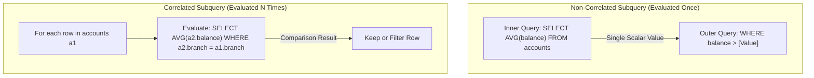

# SQL Subqueries, Correlated Execution & EXISTS vs IN

## 1. Why This Matters
Subqueries appear frequently in technical screenings and production query tuning at IDFC FIRST Bank. A poorly constructed subquery can transform an $O(N)$ linear query into an $O(N^2)$ correlated loop executed for every row in a multi-million-row financial ledger. Understanding the difference between scalar subqueries, correlated subqueries, and why `EXISTS` is safer and faster than `IN` when dealing with `NULL` values is a crucial differentiator for a 3+ YoE developer.

---

## 2. Prerequisites
- Basic SQL syntax (`SELECT`, `WHERE`, `GROUP BY`).
- Relational joins and Cartesian concepts.

---

## 3. Concept

### Taxonomy of Subqueries
1. **Scalar Subquery:** Returns a single value (1 row, 1 column). Can be used anywhere an expression is expected (e.g., `SELECT`, `WHERE`).
2. **Multi-Row Subquery:** Returns multiple rows (1 column). Evaluated with set operators (`IN`, `NOT IN`, `ANY`, `ALL`).
3. **Correlated Subquery:** References columns from the outer query. It cannot be evaluated independently; the database engine conceptually evaluates the inner query *once for every candidate row* produced by the outer query.
4. **Non-Correlated Subquery:** Independent of the outer query. Evaluated once, and its result is cached and reused.



---

## 4. Simple Example: Scalar vs Correlated Subquery

```sql
-- Non-Correlated Scalar: Accounts with balance above the overall bank average
SELECT account_number, balance
FROM accounts
WHERE balance > (SELECT AVG(balance) FROM accounts);

-- Correlated: Accounts with balance above their own branch's average
SELECT a1.account_number, a1.branch_code, a1.balance
FROM accounts a1
WHERE a1.balance > (
    SELECT AVG(a2.balance)
    FROM accounts a2
    WHERE a2.branch_code = a1.branch_code
);
```

---

## 5. Real-World Banking Example: Finding Customers with High Fraud Risk
Flag customers who have initiated more than 2 failed transactions in the last 24 hours using `EXISTS`:

```sql
SELECT c.customer_id, c.first_name, c.last_name, c.phone
FROM customers c
WHERE EXISTS (
    SELECT 1
    FROM transactions t
    JOIN accounts a ON t.from_account_id = a.account_id
    WHERE a.customer_id = c.customer_id
      AND t.status = 'FAILED'
      AND t.created_at >= DATETIME('now', '-1 day')
    GROUP BY a.customer_id
    HAVING COUNT(*) >= 2
);
```

---

## 6. Code: Complex Subquery Optimization on `banking.db`

```sql
-- 1. Unlinked Accounts: Customers who have never performed any transactions
-- Optimized using NOT EXISTS
SELECT c.customer_id, c.first_name, c.email
FROM customers c
WHERE NOT EXISTS (
    SELECT 1
    FROM accounts a
    JOIN transactions t ON (t.from_account_id = a.account_id OR t.to_account_id = a.account_id)
    WHERE a.customer_id = c.customer_id
);

-- 2. Finding the single largest transaction for each account
SELECT t1.from_account_id, t1.transaction_reference, t1.amount
FROM transactions t1
WHERE t1.amount = (
    SELECT MAX(t2.amount)
    FROM transactions t2
    WHERE t2.from_account_id = t1.from_account_id
);
```

---

## 7. How It Works Internally: EXISTS vs IN & The Three-Valued Logic Trap

### Why `NOT IN` Fails with NULLs
In SQL, boolean logic is three-valued: `TRUE`, `FALSE`, and `UNKNOWN` (represented by `NULL`).
When you run:
```sql
SELECT * FROM customers 
WHERE customer_id NOT IN (SELECT customer_id FROM accounts);
```
If the subquery returns even a single row with `NULL`, the condition evaluates to:
$$\text{customer\_id} \ne 1 \text{ AND } \text{customer\_id} \ne 2 \text{ AND } \text{customer\_id} \ne \text{NULL}$$
Because `x != NULL` is `UNKNOWN`, the entire `AND` conjunction evaluates to `UNKNOWN`, and the query returns **zero rows**, silently masking all valid results!

### Why `EXISTS` is Superior
`EXISTS` tests for the existence of at least one matching row. It short-circuits to `TRUE` the moment the engine finds the first matching row without scanning remaining pages, and it is completely immune to `NULL` column values.

---

## 8. Common Mistakes
1. **Writing `SELECT *` inside `EXISTS`:** While modern optimizers rewrite `EXISTS (SELECT * ...)` to `EXISTS (SELECT 1 ...)`, always write `SELECT 1` as standard senior engineering practice to signal that no column data projection is needed.
2. **Accidental $O(N^2)$ Correlated Subqueries in `SELECT` Lists:**
   ```sql
   -- BAD: Runs an index scan or table scan on transactions for every row in customers
   SELECT 
       c.customer_id,
       (SELECT COUNT(*) FROM transactions t 
        JOIN accounts a ON t.from_account_id = a.account_id 
        WHERE a.customer_id = c.customer_id) AS tx_count
   FROM customers c;

   -- GOOD: Rewrite as a single LEFT JOIN with GROUP BY (O(N + M))
   SELECT c.customer_id, COUNT(t.transaction_id) AS tx_count
   FROM customers c
   LEFT JOIN accounts a ON c.customer_id = a.customer_id
   LEFT JOIN transactions t ON a.account_id = t.from_account_id
   GROUP BY c.customer_id;
   ```

---

## 9. Performance / Complexity Matrix

| Technique | Execution Complexity | Optimizer Capability |
| :--- | :---: | :--- |
| **Non-Correlated Subquery** | $O(N + M)$ | Easily cached or transformed into a Hash/Merge Join |
| **Correlated Subquery (Indexed)** | $O(N \log M)$ | Evaluated via indexed nested loop |
| **Correlated Subquery (Unindexed)** | $O(N \times M)$ | Devastating full table scan per outer row |
| **`EXISTS` with Index** | $O(\log M)$ per row | Short-circuits on first row match |
| **Subquery Rewritten to `JOIN`** | $O(N + M)$ | Fully parallelizable, enables Hash Joins |

---

## 10. Interview Questions (Easy $\to$ Medium $\to$ Hard)

### Easy
- **Q:** What is the difference between a correlated subquery and a non-correlated subquery?

### Medium
- **Q:** Why can `NOT IN (SELECT col FROM ...)` return an empty set if the inner query contains `NULL` values? How does `NOT EXISTS` prevent this?

### Hard
- **Q:** How do modern database query optimizers perform **Subquery Unnesting** (decorrelation), and when does decorrelation fail, forcing the engine into a row-by-row loop?

---

## 11. Follow-up Questions from Interviewer
- *"If you write a correlated subquery in the `WHERE` clause, does the database literally execute the subquery for every outer row?"*
  *(Answer: Not necessarily! Modern RDBMS optimizers attempt subquery unnesting to transform correlated subqueries into semi-joins or anti-joins. However, if aggregate functions or `LIMIT` clauses prevent unnesting, it falls back to row-by-row nested loop execution).*
- *"How does a Common Table Expression (CTE) compare to a derived subquery in PostgreSQL 12+ vs older versions?"*

---

## 12. Model Answer: Subquery Unnesting & Semi-Joins

> **Interviewer:** *"Can you explain what a Semi-Join is and how the optimizer uses it for `EXISTS` subqueries?"*
> 
> **Model Answer:**
> "A **Semi-Join** is an internal relational operator used by query engines to evaluate `WHERE EXISTS (subquery)` or `WHERE x IN (subquery)`.
> 
> Unlike a standard `INNER JOIN` which multiplies rows when the right table has multiple matches, a Semi-Join returns each row from the outer table at most once, immediately stopping the probe on the inner table as soon as the first match is encountered.
> 
> Through a process called **Subquery Unnesting**, the query optimizer lifts the subquery into the main query plan and executes it as a Hash Semi-Join or Merge Semi-Join. This avoids the theoretical $O(N \times M)$ row-by-row execution and achieves optimal $O(N + M)$ performance without application developers needing to manually rewrite the query."

---

## 13. Practical Exercise (Run on `banking.db`)
Execute a query to find all accounts whose balance is strictly above the average balance of all accounts within their own account type (`SAVINGS` vs `CURRENT` vs `SALARY`):

```sql
SELECT a1.account_number, a1.account_type, a1.balance, ROUND(avg_table.avg_bal, 2) AS category_avg
FROM accounts a1
JOIN (
    SELECT account_type, AVG(balance) AS avg_bal
    FROM accounts
    GROUP BY account_type
) avg_table ON a1.account_type = avg_table.account_type
WHERE a1.balance > avg_table.avg_bal;
```

---

## 14. Quick Revision
- Non-correlated subqueries evaluate once; correlated subqueries depend on the outer row.
- `NOT IN` fails silently when `NULL` values exist due to three-valued logic.
- Always prefer `EXISTS` / `NOT EXISTS` or outer joins over `IN` / `NOT IN`.
- Semi-joins return outer rows without duplicate row inflation.
- Avoid correlated subqueries inside `SELECT` projection lists.

---

## 15. Interview Checklist
- [ ] Understands the three-valued logic trap of `NOT IN` with `NULL`.
- [ ] Can explain how an optimizer short-circuits `EXISTS`.
- [ ] Understands subquery unnesting into semi-joins.
- [ ] Can rewrite a correlated scalar subquery into a join with `GROUP BY`.
