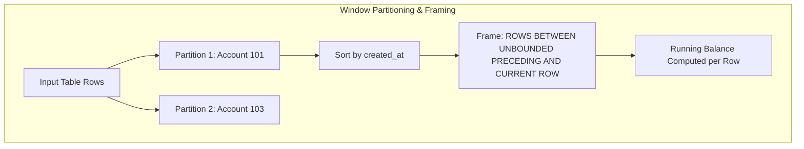

# SQL Window Functions for Financial Ledgers & Analytics

## 1. Why This Matters
Window functions are the single most asked SQL topic in 3+ YoE banking tech interviews at IDFC FIRST Bank. They are essential for computing running account balances, calculating month-over-month growth, finding the top $N$ transactions per customer, and detecting fraud velocity spikes without collapsing rows into a single summary line like `GROUP BY`.

---

## 2. Prerequisites
- Basic SQL aggregations (`SUM`, `COUNT`, `AVG`).
- Understanding of the `ORDER BY` clause.

---

## 3. Concept

### Window Function Anatomy
Unlike `GROUP BY`, which collapses multiple rows into a single aggregated row, a **Window Function** computes a calculation across a set of table rows that are related to the current row, while **retaining the identity of every single individual row**.

$$\text{FUNCTION}() \text{ OVER } (\text{PARTITION BY } \text{col1} \text{ ORDER BY } \text{col2 } [\text{ROWS/RANGE FRAME}])$$



### Key Window Function Categories
1. **Ranking Functions:**
   - `ROW_NUMBER()`: Unique sequential integer ($1, 2, 3, 4$). Ties get distinct numbers arbitrarily.
   - `RANK()`: Sequential integer, but ties receive the same rank, and subsequent ranks are skipped ($1, 2, 2, 4$).
   - `DENSE_RANK()`: Sequential integer; ties receive the same rank, and subsequent ranks are **not** skipped ($1, 2, 2, 3$).
2. **Value / Navigation Functions:**
   - `LAG(col, offset)`: Accesses data from a previous row within the partition without a self-join.
   - `LEAD(col, offset)`: Accesses data from a subsequent row within the partition.
3. **Aggregate Window Functions:**
   - `SUM() OVER (...)`, `AVG() OVER (...)`, `COUNT() OVER (...)`.

---

## 4. Simple Example: ROW_NUMBER vs RANK vs DENSE_RANK

```sql
SELECT 
    customer_id,
    amount,
    ROW_NUMBER() OVER (ORDER BY amount DESC) AS row_num,
    RANK() OVER (ORDER BY amount DESC) AS rnk,
    DENSE_RANK() OVER (ORDER BY amount DESC) AS dense_rnk
FROM transactions;
```

---

## 5. Real-World Banking Example: Real-Time Account Statement with Running Balance
Generating an official bank account statement showing each transaction along with the cumulative running balance:

```sql
SELECT 
    transaction_id,
    from_account_id AS account_id,
    created_at,
    transaction_type,
    amount,
    -- Subtract withdrawals/transfers, add deposits
    SUM(CASE 
        WHEN transaction_type = 'DEPOSIT' THEN amount 
        ELSE -amount 
    END) OVER (
        PARTITION BY from_account_id 
        ORDER BY created_at 
        ROWS BETWEEN UNBOUNDED PRECEDING AND CURRENT ROW
    ) AS running_balance
FROM transactions
WHERE status = 'SUCCESS'
ORDER BY from_account_id, created_at;
```

---

## 6. Code: Top 2 Transactions per Customer Using CTE & DENSE_RANK

```sql
WITH RankedTransactions AS (
    SELECT 
        c.customer_id,
        c.first_name || ' ' || c.last_name AS customer_name,
        t.transaction_reference,
        t.amount,
        t.payment_channel,
        t.created_at,
        DENSE_RANK() OVER (
            PARTITION BY c.customer_id 
            ORDER BY t.amount DESC
        ) AS rank_by_amount
    FROM customers c
    JOIN accounts a ON c.customer_id = a.customer_id
    JOIN transactions t ON a.account_id = t.from_account_id
    WHERE t.status = 'SUCCESS'
)
SELECT *
FROM RankedTransactions
WHERE rank_by_amount <= 2
ORDER BY customer_id, rank_by_amount;
```

---

## 7. How It Works Internally: Window Frames & Default Framing Pitfall

### The Default Framing Trap
When you specify `ORDER BY` inside `OVER ()` without an explicit frame clause:
$$\text{DEFAULT FRAME} = \text{RANGE BETWEEN UNBOUNDED PRECEDING AND CURRENT ROW}$$

- **`RANGE` vs `ROWS`:**
  - `ROWS` counts physical rows (e.g., exactly 1 preceding row).
  - `RANGE` treats all rows with **identical order values as peers**, buffering and summing them all together!
  - In large transaction tables, `RANGE` forces the database engine to check for peer duplicates, which prevents index streaming and significantly slows down execution.
  - **Senior Practice:** Always specify `ROWS BETWEEN UNBOUNDED PRECEDING AND CURRENT ROW` for deterministic running totals and maximum performance.

---

## 8. Common Mistakes
1. **Attempting to Filter Window Functions in the `WHERE` Clause:**
   ```sql
   -- SYNTAX ERROR: Window functions are NOT allowed in WHERE!
   SELECT account_id, amount, ROW_NUMBER() OVER (ORDER BY amount DESC) as rn
   FROM transactions
   WHERE ROW_NUMBER() OVER (ORDER BY amount DESC) <= 3;
   ```
   *Reason:* In the SQL logical execution pipeline, `WHERE` is evaluated at Step 3, whereas Window Functions are computed during the `SELECT` evaluation at Step 6. You must wrap the window query inside a **Common Table Expression (CTE)** or derived subquery to filter on its output.
2. **Confusing `RANK()` with `DENSE_RANK()`:** If an interviewer asks for the "top 3 salaries" or "top 3 transaction amounts", using `RANK()` can return ranks `1, 2, 2, 4`—accidentally omitting the 3rd highest value! Always use `DENSE_RANK()`.

---

## 9. Performance / Complexity Matrix

| Window Function | Required Sort | Memory Buffer Type | Complexity |
| :--- | :--- | :--- | :---: |
| **`ROW_NUMBER()`** | `ORDER BY` column | Streaming (Scalar counter) | $O(N \log N)$ (or $O(N)$ with index) |
| **`DENSE_RANK()`** | `ORDER BY` column | Scalar peer comparator | $O(N \log N)$ |
| **`LAG()` / `LEAD()`** | `ORDER BY` column | Sliding offset ring buffer | $O(N \log N)$ |
| **`SUM() OVER (ROWS...)`**| `ORDER BY` column | Cumulative running accumulator | $O(N \log N)$ |
| **`SUM() OVER (RANGE...)`**| `ORDER BY` column | Multi-row peer buffer | Slower than `ROWS` |

---

## 10. Interview Questions (Easy $\to$ Medium $\to$ Hard)

### Easy
- **Q:** What is the difference between `RANK()`, `DENSE_RANK()`, and `ROW_NUMBER()`?

### Medium
- **Q:** How do you find the second highest transaction amount per branch without using `LIMIT` or `OFFSET`?

### Hard
- **Q:** In a banking ledger, write a SQL query using `LAG()` to identify accounts that have made 3 or more consecutive transactions where each transaction amount was strictly greater than the preceding transaction.

---

## 11. Follow-up Questions from Interviewer
- *"Why can't window functions be used in the `HAVING` clause?"*
  *(Answer: `HAVING` filters group rows produced in Step 5; window functions execute on projected rows in Step 6).*
- *"How does a database physically execute `PARTITION BY`? Does it always sort the dataset?"*
  *(Answer: Yes, the optimizer typically executes a WindowAgg node after sorting the input by the partition and order keys, unless a composite B-Tree index already matches the partition + order column prefix).*

---

## 12. Model Answer: Detecting Inactive Lulls with `LAG()`

> **Interviewer:** *"How would you use window functions to calculate the number of days elapsed between a customer's consecutive debit transactions?"*
> 
> **Model Answer:**
> "We use the `LAG()` navigation window function partitioned by the customer's account and ordered chronologically by transaction timestamp.
> 
> 1. In a CTE, we project `LAG(created_at, 1) OVER (PARTITION BY from_account_id ORDER BY created_at)` to fetch the timestamp of the immediately preceding transaction for that account.
> 2. We compute the difference between `created_at` and `previous_tx_time` using database date-time subtraction (e.g., `JULIANDAY(created_at) - JULIANDAY(previous_tx_time)` in SQLite or `EXTRACT(DAY FROM created_at - prev_time)` in PostgreSQL).
> 3. For the first transaction in an account's history, `LAG()` returns `NULL`, which we handle using `COALESCE` or by filtering out initial baseline records."

```sql
WITH TxIntervals AS (
    SELECT 
        from_account_id,
        transaction_reference,
        amount,
        created_at,
        LAG(created_at, 1) OVER (
            PARTITION BY from_account_id 
            ORDER BY created_at
        ) AS prev_created_at
    FROM transactions
    WHERE status = 'SUCCESS'
)
SELECT 
    from_account_id,
    transaction_reference,
    created_at,
    prev_created_at,
    ROUND((JULIANDAY(created_at) - JULIANDAY(prev_created_at)) * 24 * 60, 2) AS minutes_since_last_tx
FROM TxIntervals
WHERE prev_created_at IS NOT NULL;
```

---

## 13. Practical Exercise (Run on `banking.db`)
Execute the running balance query on `banking.db`:

```bash
sqlite3 banking.db
```

```sql
SELECT 
    t.transaction_reference,
    t.from_account_id,
    t.amount,
    t.created_at,
    SUM(t.amount) OVER (
        PARTITION BY t.from_account_id 
        ORDER BY t.created_at 
        ROWS BETWEEN UNBOUNDED PRECEDING AND CURRENT ROW
    ) AS cumulative_spent
FROM transactions t
WHERE t.from_account_id IS NOT NULL;
```

---

## 14. Quick Revision
- Window functions retain row identity; `GROUP BY` collapses rows.
- Syntax: `FUNCTION() OVER (PARTITION BY ... ORDER BY ... [FRAME])`.
- `ROW_NUMBER` (unique integers), `RANK` (skips ties), `DENSE_RANK` (no skipped ties).
- Never use window functions in `WHERE` directly; wrap them in a CTE.
- Explicitly use `ROWS BETWEEN UNBOUNDED PRECEDING AND CURRENT ROW` to avoid default `RANGE` peer comparison overhead.

---

## 15. Interview Checklist
- [ ] Clearly explains `ROW_NUMBER` vs `RANK` vs `DENSE_RANK` with numerical examples.
- [ ] Understands why window functions cannot be placed in `WHERE` or `HAVING`.
- [ ] Can write running total queries with correct frame definitions.
- [ ] Can use `LAG()` and `LEAD()` for time-series gap analysis.
