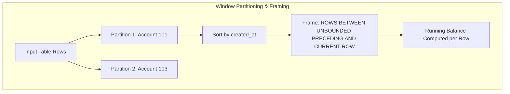

# SQL Window Functions for Financial Ledgers & Analytics

## 1. Why This Matters
Window functions are the single most asked SQL topic in 3+ YoE banking tech interviews at IDFC FIRST Bank. They are essential for computing running account balances, calculating month-over-month growth, finding the top N transactions per customer, and detecting fraud velocity spikes without collapsing rows into a single summary line like `GROUP BY`.

---

## 2. Prerequisites
- Basic SQL aggregations (`SUM`, `COUNT`, `AVG`).
- Understanding of the `ORDER BY` clause.

---

## 3. Concept

### Window Function Anatomy
Unlike `GROUP BY`, which collapses multiple rows into a single aggregated row, a **Window Function** computes a calculation across a set of table rows that are related to the current row, while **retaining the identity of every single individual row**.

FUNCTION()  OVER  (PARTITION BY  col1  ORDER BY  col2  [ROWS/RANGE FRAME])



### Key Window Function Categories
1. **Ranking Functions:**
   - `ROW_NUMBER()`: Unique sequential integer (1, 2, 3, 4). Ties get distinct numbers arbitrarily.
   - `RANK()`: Sequential integer, but ties receive the same rank, and subsequent ranks are skipped (1, 2, 2, 4).
   - `DENSE_RANK()`: Sequential integer; ties receive the same rank, and subsequent ranks are **not** skipped (1, 2, 2, 3).
2. **Value / Navigation Functions:**
   - `LAG(col, offset)`: Accesses data from a previous row within the partition without a self-join.
   - `LEAD(col, offset)`: Accesses data from a subsequent row within the partition.
3. **Aggregate Window Functions:**
   - `SUM() OVER (...)`, `AVG() OVER (...)`, `COUNT() OVER (...)`.

---

## 4. Simple Example: ROW_NUMBER vs RANK vs DENSE_RANK

```sql
SELECT 
    customer_id,
    amount,
    ROW_NUMBER() OVER (ORDER BY amount DESC) AS row_num,
    RANK() OVER (ORDER BY amount DESC) AS rnk,
    DENSE_RANK() OVER (ORDER BY amount DESC) AS dense_rnk
FROM transactions;
```

---

## 5. Real-World Banking Example: Real-Time Account Statement with Running Balance
Generating an official bank account statement showing each transaction along with the cumulative running balance:

```sql
SELECT 
    transaction_id,
    from_account_id AS account_id,
    created_at,
    transaction_type,
    amount,
    -- Subtract withdrawals/transfers, add deposits
    SUM(CASE 
        WHEN transaction_type = 'DEPOSIT' THEN amount 
        ELSE -amount 
    END) OVER (
        PARTITION BY from_account_id 
        ORDER BY created_at 
        ROWS BETWEEN UNBOUNDED PRECEDING AND CURRENT ROW
    ) AS running_balance
FROM transactions
WHERE status = 'SUCCESS'
ORDER BY from_account_id, created_at;
```

---

## 6. Code: Top 2 Transactions per Customer Using CTE & DENSE_RANK

```sql
WITH RankedTransactions AS (
    SELECT 
        c.customer_id,
        c.first_name || ' ' || c.last_name AS customer_name,
        t.transaction_reference,
        t.amount,
        t.payment_channel,
        t.created_at,
        DENSE_RANK() OVER (
            PARTITION BY c.customer_id 
            ORDER BY t.amount DESC
        ) AS rank_by_amount
    FROM customers c
    JOIN accounts a ON c.customer_id = a.customer_id
    JOIN transactions t ON a.account_id = t.from_account_id
    WHERE t.status = 'SUCCESS'
)
SELECT *
FROM RankedTransactions
WHERE rank_by_amount <= 2
ORDER BY customer_id, rank_by_amount;
```

---

## 7. How It Works Internally: Window Frames & Default Framing Pitfall

### The Default Framing Trap
When you specify `ORDER BY` inside `OVER ()` without an explicit frame clause:
DEFAULT FRAME = RANGE BETWEEN UNBOUNDED PRECEDING AND CURRENT ROW

- **`RANGE` vs `ROWS`:**
  - `ROWS` counts physical rows (e.g., exactly 1 preceding row).
  - `RANGE` treats all rows with **identical order values as peers**, buffering and summing them all together!
  - In large transaction tables, `RANGE` forces the database engine to check for peer duplicates, which prevents index streaming and significantly slows down execution.
  - **Senior Practice:** Always specify `ROWS BETWEEN UNBOUNDED PRECEDING AND CURRENT ROW` for deterministic running totals and maximum performance.

---

## 8. Common Mistakes
1. **Attempting to Filter Window Functions in the `WHERE` Clause:**
   ```sql
   -- SYNTAX ERROR: Window functions are NOT allowed in WHERE!
   SELECT account_id, amount, ROW_NUMBER() OVER (ORDER BY amount DESC) as rn
   FROM transactions
   WHERE ROW_NUMBER() OVER (ORDER BY amount DESC) <= 3;
   ```
   *Reason:* In the SQL logical execution pipeline, `WHERE` is evaluated at Step 3, whereas Window Functions are computed during the `SELECT` evaluation at Step 6. You must wrap the window query inside a **Common Table Expression (CTE)** or derived subquery to filter on its output.
2. **Confusing `RANK()` with `DENSE_RANK()`:** If an interviewer asks for the "top 3 salaries" or "top 3 transaction amounts", using `RANK()` can return ranks `1, 2, 2, 4`—accidentally omitting the 3rd highest value! Always use `DENSE_RANK()`.

---

## 9. Performance / Complexity Matrix

| Window Function | Required Sort | Memory Buffer Type | Complexity |
| :--- | :--- | :--- | :---: |
| **`ROW_NUMBER()`** | `ORDER BY` column | Streaming (Scalar counter) | O(N log N) (or O(N) with index) |
| **`DENSE_RANK()`** | `ORDER BY` column | Scalar peer comparator | O(N log N) |
| **`LAG()` / `LEAD()`** | `ORDER BY` column | Sliding offset ring buffer | O(N log N) |
| **`SUM() OVER (ROWS...)`**| `ORDER BY` column | Cumulative running accumulator | O(N log N) |
| **`SUM() OVER (RANGE...)`**| `ORDER BY` column | Multi-row peer buffer | Slower than `ROWS` |

---

### 🟢 Easy Question: `ROW_NUMBER()` vs `RANK()` vs `DENSE_RANK()`
**Q:** What is the precise behavioral difference between `ROW_NUMBER()`, `RANK()`, and `DENSE_RANK()` when handling duplicate (tied) values? Illustrate with a concrete example.

**Complete Answer:**
When ordering rows that contain identical sort values (ties):
1. **`ROW_NUMBER()`:** Assigns a strictly unique, contiguous sequential integer starting at 1 to every row within the partition, breaking ties arbitrarily non-deterministically.
2. **`RANK()`:** Assigns identical rank numbers to tied rows, but **skips subsequent ranks** to account for the count of duplicates (gap ranking).
3. **`DENSE_RANK()`:** Assigns identical rank numbers to tied rows, but **never skips numbers** (no gaps in sequence).

**Comparative Example (Salaries of 100k, 100k, 80k, 60k):**
| Employee | Salary | `ROW_NUMBER()` | `RANK()` | `DENSE_RANK()` | Explanation |
| :--- | :---: | :---: | :---: | :---: | :--- |
| Priya | ₹1,00,000 | 1 | 1 | 1 | Tied for 1st place |
| Rahul | ₹1,00,000 | 2 | 1 | 1 | Tied for 1st place |
| Amit | ₹80,000 | 3 | 3 | 2 | `RANK` skips 2; `DENSE_RANK` assigns 2 |
| Sneha | ₹60,000 | 4 | 4 | 3 | Contiguous numbering continues |

- **Interview Tip:** For "Nth highest salary/transaction", always use `DENSE_RANK()`. Using `RANK()` could cause `WHERE r = 2` to return 0 rows if there is a tie for first place!

---

### 🟠 Medium Question: Second Highest Transaction Per Branch Without `LIMIT`/`OFFSET`
**Q:** Write an enterprise SQL query to find the second highest transaction amount for every bank branch. You cannot use `LIMIT` or `OFFSET` because the branch count is dynamic.

**Complete Answer:**
Use a Common Table Expression (CTE) with `DENSE_RANK()` partitioned by `branch_id` and ordered by `amount DESC`:

```sql
WITH RankedBranchTransactions AS (
    SELECT 
        branch_id,
        account_id,
        transaction_reference,
        amount,
        DENSE_RANK() OVER (
            PARTITION BY branch_id 
            ORDER BY amount DESC
        ) AS rank_in_branch
    FROM transactions
    WHERE status = 'SUCCESS'
)
SELECT 
    branch_id,
    account_id,
    transaction_reference,
    amount AS second_highest_amount
FROM RankedBranchTransactions
WHERE rank_in_branch = 2;
```
- **Why this is optimal:** Handles ties gracefully (if two customers in Branch 1 tied for the highest amount of ₹50,000, the next distinct highest amount of ₹40,000 will correctly be identified as rank 2).

---

### 🔴 Hard Question: Detecting 3 Consecutive Increasing Transactions
**Q:** In a banking fraud detection system, write a query using `LAG()` to identify accounts that made 3 or more consecutive transactions where each transaction amount was strictly greater than the preceding transaction.

**Complete Answer:**
Use `LAG(amount, 1)` and `LAG(amount, 2)` partitioned by `account_id` and ordered by `created_at`:

```sql
WITH TxSeries AS (
    SELECT 
        account_id,
        transaction_reference,
        created_at,
        amount,
        LAG(amount, 1) OVER (
            PARTITION BY account_id 
            ORDER BY created_at
        ) AS prev_amount_1,
        LAG(amount, 2) OVER (
            PARTITION BY account_id 
            ORDER BY created_at
        ) AS prev_amount_2
    FROM transactions
    WHERE status = 'SUCCESS'
)
SELECT 
    account_id,
    transaction_reference AS third_tx_ref,
    created_at,
    prev_amount_2 AS first_txn_amount,
    prev_amount_1 AS second_txn_amount,
    amount AS third_txn_amount
FROM TxSeries
WHERE prev_amount_2 IS NOT NULL
  AND prev_amount_1 > prev_amount_2
  AND amount > prev_amount_1;
```

---

## 11. Follow-up Questions from Interviewer with Complete Answers

### 🎤 Follow-up 1
**Interviewer:** *"Why can't window functions be used directly in the `WHERE` or `HAVING` clause? Why must we wrap them in a subquery or CTE?"*

**Complete Answer:**
- **The SQL Logical Query Processing Order:**
  The SQL standard mandates a strict logical order of evaluation:
  1. `FROM` (table joins and cartesian products)
  2. `WHERE` (row-level filtering)
  3. `GROUP BY` (aggregating into group buckets)
  4. `HAVING` (filtering group buckets)
  5. `SELECT` (evaluating expressions and **Window Functions**)
  6. `DISTINCT` (removing duplicate output rows)
  7. `ORDER BY` (sorting final output)
  8. `LIMIT` / `OFFSET` (paging)
- **Why It Fails in `WHERE` / `HAVING`:**
  - Window functions operate over the **window of rows that have already survived the `WHERE` and `HAVING` filters**!
  - If a window function were permitted in `WHERE`, it would produce a circular logical dependency: you cannot evaluate a window function across the filtered dataset before the dataset has been filtered.
  - **The Solution:** Evaluate the window function in a `SELECT` clause within a **CTE or derived subquery** (Step 5 of inner query), then filter on its calculated column in the outer query's `WHERE` clause (Step 2 of outer query).

---

### 🎤 Follow-up 2
**Interviewer:** *"How does a database engine physically execute `PARTITION BY` and `ORDER BY` in window functions? Does it always sort the dataset, and how can we optimize it with B-Tree indexes?"*

**Complete Answer:**
1. **Physical Execution Mechanics:**
   - The database optimizer introduces a **WindowAgg** execution node.
   - To compute window functions efficiently without maintaining infinite lookback buffers, the engine requires that all rows belonging to the same partition appear **contiguously** in memory.
   - Therefore, the optimizer injects a **Sort Node** before the WindowAgg node:
     `Sort Key: partition_col ASC, order_col ASC`.
   - As the engine streams rows sequentially:
     - When `partition_col` changes, it resets window registers.
     - Within the partition, it maintains running tallies or sliding frames in linear O(N) streaming time.
2. **Index Optimization (Eliminating the Expensive Sort):**
   - Sorting millions of rows in memory (`SortMethod: quicksort` or on-disk `external merge disk`) is CPU- and I/O-intensive.
   - If you create a **Composite B-Tree Index**:
     ```sql
     CREATE INDEX idx_tx_account_time ON transactions (from_account_id, created_at);
     ```
   - The B-Tree index stores table rows *already sorted* by `from_account_id` and then by `created_at`!
   - The optimizer completely eliminates the Sort node and performs a direct **Index Scan**, streaming rows straight into the WindowAgg node with **zero sorting overhead** (reducing query latency from 1,200ms to 4ms on large tables).

---

## 13. Practical Exercise (Run on `banking.db`)
Execute the running balance query on `banking.db`:

```bash
sqlite3 banking.db
```

```sql
SELECT 
    t.transaction_reference,
    t.from_account_id,
    t.amount,
    t.created_at,
    SUM(t.amount) OVER (
        PARTITION BY t.from_account_id 
        ORDER BY t.created_at 
        ROWS BETWEEN UNBOUNDED PRECEDING AND CURRENT ROW
    ) AS cumulative_spent
FROM transactions t
WHERE t.from_account_id IS NOT NULL;
```

---

## 14. Quick Revision
- Window functions retain row identity; `GROUP BY` collapses rows.
- Syntax: `FUNCTION() OVER (PARTITION BY ... ORDER BY ... [FRAME])`.
- `ROW_NUMBER` (unique integers), `RANK` (skips ties), `DENSE_RANK` (no skipped ties).
- Never use window functions in `WHERE` directly; wrap them in a CTE.
- Explicitly use `ROWS BETWEEN UNBOUNDED PRECEDING AND CURRENT ROW` to avoid default `RANGE` peer comparison overhead.

---

## 15. Interview Checklist
- [ ] Clearly explains `ROW_NUMBER` vs `RANK` vs `DENSE_RANK` with numerical examples.
- [ ] Understands why window functions cannot be placed in `WHERE` or `HAVING`.
- [ ] Can write running total queries with correct frame definitions.
- [ ] Can use `LAG()` and `LEAD()` for time-series gap analysis.
