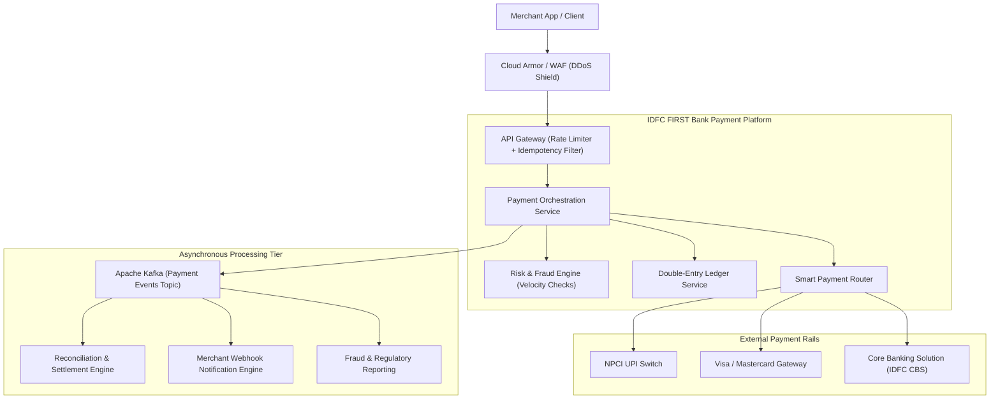
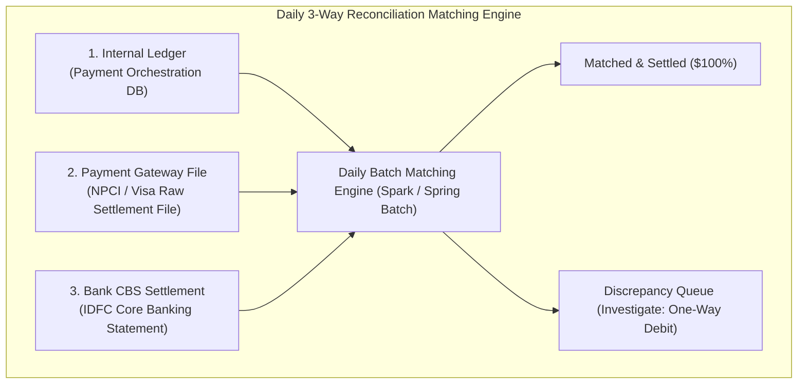

# System Design: High-Throughput Payment Switch & Settlement Engine

## 1. Why This Matters
Designing a Payment System is the quintessential System Design interview question at IDFC FIRST Bank. The Strategic Projects team builds payment gateways, card switches, and UPI acquiring engines. An interviewer will push you deep into every architectural layer: from HTTP idempotency keys at the API gateway down to double-entry ledger database tables, Kafka dead-letter queues, and end-of-day bank reconciliation.

---

## 2. Prerequisites
- [06-SYSTEM-DESIGN/system-design-fundamentals.md](file:///home/bipin/Desktop/BankInterview/06-SYSTEM-DESIGN/system-design-fundamentals.md)
- [11-BANKING-FINTECH/transaction-processing.md](file:///home/bipin/Desktop/BankInterview/11-BANKING-FINTECH/transaction-processing.md)
- Relational ACID transactions and distributed Sagas.

---

## 3. Concept: The Payment System Architecture



---

## 4. Requirements & Scale Estimation

### Functional Requirements
1. **Execute Payment:** Merchant/User submits payment request with payment method (Card, UPI, Netbanking).
2. **Idempotency:** Guarantee that network retries or duplicate button clicks never cause duplicate debits.
3. **Ledger Integrity:** Maintain immutable double-entry records for all financial events.
4. **Reconciliation:** Match internal transaction state with daily settlement clearing files from NPCI/Visa.

### Non-Functional Requirements
- **Consistency:** Strict consistency for balance deductions; zero double-spending.
- **Throughput:** Handle 5,000 peak TPS with < 1.5s p99 latency.
- **Availability:** 99.999% (Five Nines).
- **Security:** PCI-DSS Level 1 compliant; zero raw card data in application logs.

---

## 5. API Design & Data Schema

### Core API Endpoint
```http
POST /v1/payments/charges
Headers:
  Content-Type: application/json
  Authorization: Bearer <api_key>
  X-Idempotency-Key: <uuid_v4>

Request Body:
{
  "amount": 250000,           // In smallest currency unit (2500.00 INR = 250000 paise)
  "currency": "INR",
  "customer_id": "cust_89123",
  "payment_method": {
    "type": "UPI",
    "vpa": "aarav@idfcbank"
  },
  "metadata": {
    "order_id": "ORD_991823"
  }
}
```

### Relational Database Schema (PostgreSQL)

```sql
-- Payments Table (Order state machine)
CREATE TABLE payments (
    payment_id VARCHAR(36) PRIMARY KEY,
    idempotency_key VARCHAR(64) UNIQUE NOT NULL,
    customer_id VARCHAR(36) NOT NULL,
    amount BIGINT NOT NULL CHECK (amount > 0), -- Stored in paise
    currency VARCHAR(3) NOT NULL DEFAULT 'INR',
    status VARCHAR(20) NOT NULL CHECK (status IN ('CREATED', 'INITIATED', 'SUCCESS', 'FAILED', 'REFUNDED')),
    payment_channel VARCHAR(20) NOT NULL,
    created_at TIMESTAMP WITH TIME ZONE DEFAULT CURRENT_TIMESTAMP,
    updated_at TIMESTAMP WITH TIME ZONE DEFAULT CURRENT_TIMESTAMP
);

-- Ledger Entries (Double-Entry Bookkeeping)
CREATE TABLE ledger_entries (
    entry_id BIGSERIAL PRIMARY KEY,
    payment_id VARCHAR(36) NOT NULL,
    account_id VARCHAR(36) NOT NULL,
    direction VARCHAR(6) NOT NULL CHECK (direction IN ('DEBIT', 'CREDIT')),
    amount BIGINT NOT NULL CHECK (amount > 0),
    created_at TIMESTAMP WITH TIME ZONE DEFAULT CURRENT_TIMESTAMP,
    FOREIGN KEY (payment_id) REFERENCES payments(payment_id)
);

CREATE INDEX idx_payments_idempotency ON payments(idempotency_key);
CREATE INDEX idx_ledger_account ON ledger_entries(account_id, created_at);
```

---

## 6. Code: Payment State Machine & Idempotency Transition in Node.js

```javascript
const PaymentStatus = {
    CREATED: 'CREATED',
    INITIATED: 'INITIATED',
    SUCCESS: 'SUCCESS',
    FAILED: 'FAILED'
};

class PaymentStateMachine {
    static isValidTransition(current, next) {
        const allowed = {
            [PaymentStatus.CREATED]: [PaymentStatus.INITIATED, PaymentStatus.FAILED],
            [PaymentStatus.INITIATED]: [PaymentStatus.SUCCESS, PaymentStatus.FAILED],
            [PaymentStatus.SUCCESS]: [], // Terminal state
            [PaymentStatus.FAILED]: []   // Terminal state
        };
        return allowed[current]?.includes(next) || false;
    }
}

async function updatePaymentStatus(paymentId, fromStatus, toStatus, dbClient) {
    if (!PaymentStateMachine.isValidTransition(fromStatus, toStatus)) {
        throw new Error(`Invalid state transition from ${fromStatus} to ${toStatus}`);
    }

    // Atomic conditional status update
    const result = await dbClient.query(
        `UPDATE payments 
         SET status = $1, updated_at = NOW() 
         WHERE payment_id = $2 AND status = $3`,
        [toStatus, paymentId, fromStatus]
    );

    if (result.rowCount === 0) {
        throw new Error('Concurrent state transition conflict. Aborting.');
    }
}
```

---

## 7. How It Works Internally: The 3-Way Reconciliation Engine



### Reconciliation Workflow:
1. Every night at 02:00 AM, the bank receives **Clearing and Settlement raw files** (e.g., NPCI `EOD_SETTLEMENT.txt`).
2. A distributed batch processor (Apache Spark or Spring Batch) parses the millions of records.
3. For every transaction reference, it checks:
   - Did the internal ledger record `SUCCESS`?
   - Did NPCI confirm `SUCCESS`?
   - Did the inter-bank nodal settlement credit the bank's clearing account?
4. Any mismatch triggers automated correction workflows (e.g., auto-reversals or credit adjustments) in accordance with RBI timelines.

---

## 8. Common Mistakes
1. **Storing Currency in Decimals/Floats:** Floats create IEEE rounding errors. Always store currency as **64-bit integer paise/cents** (`amount: 50000` = ₹500.00).
2. **Synchronous Webhooks:** Making synchronous HTTP calls to merchant webhooks inside the payment processing request blocks worker threads. Always push webhook events to **Kafka** and let dedicated asynchronous workers dispatch them with exponential backoff.
3. **Omitting Distributed Locking for Balances:** If two payments hit the same account concurrently, failing to lock or verify versions causes balance double-spending.

---

## 9. Performance / Complexity Matrix

| Layer | Technology | Latency | Scalability Strategy |
| :--- | :--- | :---: | :--- |
| **Idempotency Gate** | Redis `SET NX` | < 2ms | Sharded Redis Cluster |
| **Payment Router** | Node.js Microservice | < 15ms | Horizontal Pod Autoscaling (HPA) |
| **Transaction DB** | PostgreSQL Multi-AZ | < 25ms | Partitioned by Date / Sharded by Customer ID |
| **Asynchronous Bus** | Apache Kafka | < 10ms | Partitioned by `customer_id` for in-order events |

---

## 10. Interview Questions (Easy → Medium → Hard)

### Easy
- **Q:** Why should monetary amounts be stored as integers (e.g., paise) rather than floating-point numbers in a payment database?

### Medium
- **Q:** How do you guarantee that a merchant webhook notification is reliably delivered even if the merchant's server is down for 6 hours?

### Hard
- **Q:** A payment switch experiences a network split while waiting for a response from NPCI. The client is waiting on an open HTTP connection. How should the switch handle the client response, the pending database record, and subsequent reconciliation?

---

## 11. Follow-up Questions from Interviewer
- *"What is the Dead Letter Queue (DLQ) strategy for failed webhook delivery retries?"*
  *(Answer: Retry with exponential backoff: 5s, 30s, 5m, 30m, 2h. After max retries, move to DLQ and trigger email alert to merchant technical contact).*
- *"How do you partition a Kafka topic for payment events to ensure in-order processing of transactions for a single account?"*
  *(Answer: Use `account_id` as the Kafka message partition key. Kafka guarantees strict chronological order within a single partition).*

---

## 12. Model Answer: Network Split During Payment Gateway Call

> **Interviewer:** *"If the payment service sends a debit request to the external banking switch, but the connection times out before receiving a response, what do you return to the user?"*
> 
> **Model Answer:**
> "When an external payment switch call times out, the transaction is in an **IN-DOUBT / PENDING** state. We must NEVER assume failure and refund, nor assume success and fulfill the order.
> 
> 1. **Immediate API Response:** We return HTTP 202 Accepted with status `PENDING` and the transaction reference to the client, displaying a 'Payment Processing' state.
> 2. **Active Status Polling:** A background worker immediately initiates **Status Inquiry APIs** to the external switch at 5s, 15s, and 30s intervals using the unique RRN.
> 3. **Terminal State Resolution:** If the switch confirms the debit succeeded, we transition the payment to `SUCCESS`, write double-entry ledger records, and dispatch a webhook. If confirmed failed, we transition to `FAILED`.
> 4. **Nightly Reconciliation Fallback:** If the status inquiry remains unresponsive, the transaction remains `PENDING` until the nightly settlement file resolves it with 100% finality."

---

## 13. Practical Exercise
Draw the high-level architecture diagram of a Payment Gateway on a whiteboard or paper, ensuring you include: API Gateway, Redis Idempotency Cache, Payment Orchestrator, PostgreSQL Ledger DB, Kafka Event Stream, and the Reconciliation Batch Worker.

---

## 14. Quick Revision
- Currency amounts must always be stored in smallest units (integer paise).
- Idempotency middleware intercepts requests via `X-Idempotency-Key` and Redis `SET NX`.
- Ledger entries are immutable: every transfer creates balanced Debits and Credits.
- Sagas coordinate distributed transaction steps with compensating reversals.
- End-of-day reconciliation guarantees that internal ledgers match bank switch clearing files.

---

## 15. Interview Checklist
- [ ] Draws the complete payment flow architecture confidently.
- [ ] Defines the relational schema with double-entry ledger entries.
- [ ] Explains the state machine transitions and prevents race conditions.
- [ ] Explains 3-way reconciliation against NPCI/Visa clearing files.
