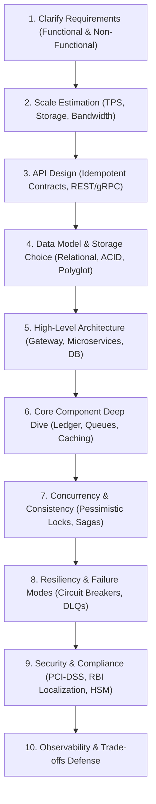
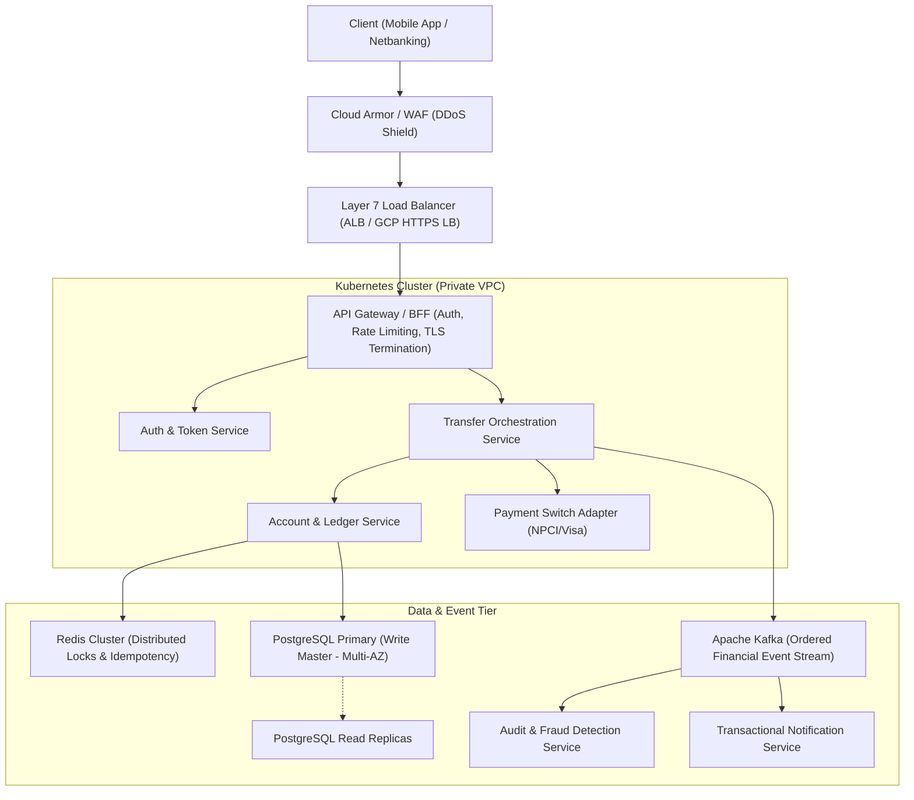

# Financial System Design Fundamentals & The 10-Step Interview Framework

## 1. Why This Matters
For a **Developer with 3+ years experience** applying to IDFC FIRST Bank's Strategic Projects, the System Design round is often the primary filter separating junior coders from true backend engineers. In this round, the interviewer provides an intentionally vague prompt (e.g., *"Design a UPI Payment Switch"* or *"Design a High-Throughput Transaction Ledger"*). They evaluate whether you panic, jump immediately to drawing boxes, or systematically guide the interview through requirements, scale calculations, data consistency, idempotency, and failure mitigation.

---

## 2. Prerequisites
- Client-server architecture, HTTP/HTTPS, REST, and gRPC.
- Relational databases (PostgreSQL/MySQL), NoSQL, Caching (Redis), and Message Brokers (Kafka/RabbitMQ).
- Basic networking: DNS, Load Balancers (L4 vs L7), Reverse Proxies.

---

## 3. Concept: The 10-Step Banking System Design Framework



### Step 1: Clarify Requirements
Never start drawing architecture without locking down scope:
- **Functional Requirements:** What must the system do? (e.g., User initiates transfer, funds are debited from A and credited to B, audit trail recorded, notifications dispatched).
- **Non-Functional Requirements:**
  - **Availability vs Consistency (CAP):** Banking systems are **CP systems** (Consistency & Partition Tolerance over Availability). Money cannot be double-spent.
  - **Latency SLA:** < 500ms for p99 API response.
  - **Durability:** Zero data loss; 100% auditability.

### Step 2: Scale & Capacity Estimation
- **Traffic:** Peak Transactions Per Second (TPS). Example: 10,000 TPS peak during Diwali sales.
- **Storage:** 10,000  txns/sec * 86,400  sec/day ≈ 864 million txns/day.
  At 500 bytes per ledger record: ≈ 432 GB/day ⟹ ≈ 150 TB/year.
  *Architectural Conclusion:* Single database node will fail; requires horizontal sharding by `account_id` and cold-data archival to object storage (Cloud Storage / S3).

---

## 4. Simple Example: Back-of-the-Envelope Calculation Template

```text
Scale Template for IDFC Systems:
- Daily Active Users (DAU): 10 Million
- Average transactions per user per day: 2
- Total daily transactions: 20 Million
- Average TPS = 20M / 86,400 ≈ 230 TPS
- Peak TPS (5x multiplier for festival bursts): 230 * 5 ≈ 1,150 TPS
- Storage per record: ~1 KB (PII, tokens, signatures, audit data)
- Daily storage: 20M * 1 KB = 20 GB/day
- 5-Year Regulatory Archive: 20 GB * 365 * 5 ≈ 36.5 TB
```

---

## 5. Real-World Banking Example: The High-Level Architecture



---

## 6. Code: Distributed Token Bucket Rate Limiter with Redis Lua Script

```lua
-- token_bucket.lua
-- Atomically checks and decrements available tokens in Redis
local key = KEYS[1]
local capacity = tonumber(ARGV[1])
local refill_rate = tonumber(ARGV[2]) -- tokens per second
local now = tonumber(ARGV[3])
local requested = tonumber(ARGV[4])

-- Get bucket state: [tokens, last_refreshed_timestamp]
local data = redis.call("HMGET", key, "tokens", "last_updated")
local tokens = tonumber(data[1])
local last_updated = tonumber(data[2])

if not tokens then
    tokens = capacity
    last_updated = now
else
    local delta = math.max(0, now - last_updated)
    tokens = math.min(capacity, tokens + delta * refill_rate)
    last_updated = now
end

if tokens >= requested then
    tokens = tokens - requested
    redis.call("HMSET", key, "tokens", tokens, "last_updated", last_updated)
    redis.call("EXPIRE", key, 3600)
    return 1 -- Allowed
else
    return 0 -- Rejected (HTTP 429 Too Many Requests)
end
```

---

## 7. How It Works Internally: CAP & PACELC Theorems in Banking
- **CAP Theorem:** In the presence of a network partition (P), a distributed system must choose between Consistency (C) and Availability (A). Banking systems choose **Consistency**: if the primary database partition cannot communicate with the secondary node, writes must reject rather than accept divergent balances.
- **PACELC Theorem:** Extends CAP: If there is a Partition (P), trade off Availability (A) and Consistency (C); **Else (E)**, trade off Latency (L) and Consistency (C). In normal operations, banking switches accept higher write latency (synchronous replica replication) to guarantee strict serializable consistency.

---

## 8. Common Mistakes
1. **Dumping Technology Names Without Justification:** Saying *"I will use Kafka and Cassandra because they are scalable"* fails an interview. State *why*: *"I select Kafka for the event stream because it provides partitioned, strictly ordered event logs per `account_id` and consumer group replayability."*
2. **Ignoring Single Points of Failure (SPOF):** Forgetting to declare database read replicas, multi-AZ active-passive failover, or multi-region disaster recovery (RPO and RTO).
3. **Omitting Financial Idempotency & Reconciliation:** In a banking system design, if you do not mention idempotency keys and end-of-day reconciliation with NPCI/Visa, your design is incomplete.

---

## 9. Performance / Complexity Matrix

| Component | Technology Choice | Latency SLA | Availability Target |
| :--- | :--- | :---: | :---: |
| **API Gateway** | Kong / Envoy / Express Gateway | < 10ms | 99.99% |
| **Distributed Cache** | Redis Cluster (In-Memory) | < 2ms | 99.95% |
| **Event Stream** | Apache Kafka | < 15ms | 99.99% |
| **Core Relational DB** | PostgreSQL Multi-AZ with WAL | < 25ms | 99.999% (Five Nines) |
| **Audit Log Store** | OpenSearch / GCP Cloud Storage | Async | 99.999999999% (11 Nines) |

---

## 10. Interview Questions (Easy → Medium → Hard)

### Easy
- **Q:** What is the difference between horizontal scaling and vertical scaling?

### Medium
- **Q:** Explain how you choose between Redis and Memcached for caching banking session states.

### Hard
- **Q:** Design a distributed ledger that handles 50,000 transactions per second across 100 million accounts while preventing hot-spotting on high-volume merchant accounts (e.g., Amazon or Swiggy receiving 5,000 credits/sec).

---

## 11. Follow-up Questions from Interviewer
- *"If a merchant account receives 5,000 transfers per second, row-level locking on that single merchant `account_id` will serialize and bottleneck the entire database. How do you solve hot-spot account write contention?"*
  *(Answer: Sharded balance accounts / Bank Sub-accounts: Split the merchant's balance into 50 sub-accounts in the database. Inbound credits randomly distribute across sub-accounts without locking contention; total balance is the sum of sub-accounts).*
- *"What is the difference between RPO (Recovery Point Objective) and RTO (Recovery Time Objective) in disaster recovery planning?"*

---

## 12. Model Answer: PACELC & Synchronous DB Replication in FinTech

> **Interviewer:** *"Why don't we use asynchronous database replication for the primary financial ledger?"*
> 
> **Model Answer:**
> "In high-throughput web systems, asynchronous database replication is standard because it maximizes write throughput by allowing the primary node to acknowledge commits before replicas receive the WAL stream.
> 
> However, in a banking ledger governed by the **PACELC theorem (PC/EC)**, asynchronous replication introduces the risk of data loss:
> - If the primary database crashes before WAL records are replicated to the standby replica, the promoted replica suffers from **unreplicated transactions**.
> - In a banking system, that loss represents money that was debited from a customer or credited to a merchant that has permanently vanished from the failover node (a catastrophic non-zero **Recovery Point Objective (RPO)**).
> 
> Therefore, core banking ledgers mandate **Semi-Synchronous or Synchronous Multi-AZ Replication** (such as PostgreSQL with `synchronous_commit = on` and at least one synchronous standby). The primary blocks until at least one independent replica has flushed the WAL to disk, guaranteeing zero data loss (RPO = 0) in the event of an automated primary node failover."

---

## 13. Practical Exercise
Review the 10-step template and practice driving a 5-minute verbal walkthrough of designing a **High-Priority OTP Notification Engine** (SMS, WhatsApp, Push) that must deliver OTPs within 3 seconds.

---

## 14. Quick Revision
- Follow the 10-step framework: Requirements → Scale → API → Data → Architecture → Deep Dive → Consistency → Failure → Security → Observability.
- Banking systems are CP systems (Consistency > Availability).
- Shard databases by `account_id` or `customer_id` to distribute load evenly.
- Mitigate hot merchant accounts using distributed sub-account balance sharding.
- Synchronous WAL replication guarantees zero financial data loss (RPO = 0).

---

## 15. Interview Checklist
- [ ] Memorizes the 10-step system design sequence.
- [ ] Confidently calculates Peak TPS, Storage, and Memory requirements.
- [ ] Explains CAP and PACELC in the context of banking consistency.
- [ ] Solves the merchant hot-spot account contention bottleneck.
