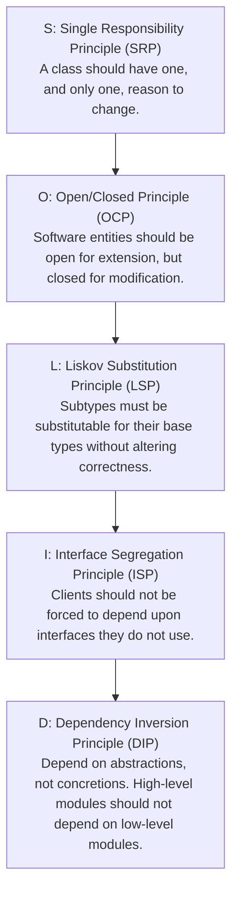

# SOLID Principles in Banking Architecture (TypeScript / Node.js)

## 1. Why This Matters
In Low-Level Design (LLD) and machine coding interview rounds at IDFC FIRST Bank, interviewers evaluate whether your code is maintainable, extensible, and decoupled. Sprawling 500-line controller functions packed with nested `if/else` checks for payment methods indicate junior-level code. Demonstrating mastery of **SOLID principles** by designing clean, decoupled financial interfaces and services proves you can architect robust production systems and mentor junior developers.

---

## 2. Prerequisites
- Object-Oriented Programming (Classes, Interfaces, Inheritance, Polymorphism).
- TypeScript or modern JavaScript ES6 classes.

---

## 3. Concept: The 5 SOLID Principles



---

## 4. Single Responsibility Principle (SRP)

### Violation: The God Class
```typescript
// BAD: Violates SRP! Handles balance logic, PDF generation, email, AND database calls.
class BankAccountService {
    async processWithdrawal(accountId: string, amount: number) {
        // 1. Deduct balance in DB
        // 2. Format PDF receipt
        // 3. Send email to customer via SMTP
    }
}
```

### Clean Architecture (Adhering to SRP):
Split into distinct services with single responsibilities:
1. `AccountRepository`: Database operations and locking.
2. `TransactionProcessor`: Business rule validation and debit execution.
3. `NotificationService`: Dispatches SMS/Email alerts asynchronously.
4. `ReceiptGenerator`: Formats statement documents.

---

## 5. Open/Closed Principle (OCP)

### Real-World Example: Adding New Payment Channels (UPI, IMPS, Card)
Instead of modifying a giant `switch` statement every time IDFC FIRST Bank launches a new payment rail:

```typescript
// 1. Define the abstraction
interface PaymentGateway {
    processPayment(amount: number, metadata: Record<string, any>): Promise<PaymentResult>;
}

// 2. Concrete implementations (Open for extension)
class UpiPaymentGateway implements PaymentGateway {
    async processPayment(amount: number, meta: any): Promise<PaymentResult> {
        console.log(`Routing ₹${amount} via NPCI UPI Switch to VPA: ${meta.vpa}`);
        return { success: true, reference: 'UPI-99128' };
    }
}

class CardPaymentGateway implements PaymentGateway {
    async processPayment(amount: number, meta: any): Promise<PaymentResult> {
        console.log(`Authorizing ₹${amount} via Visa/Mastercard Switch`);
        return { success: true, reference: 'CARD-44129' };
    }
}

class NetbankingGateway implements PaymentGateway {
    async processPayment(amount: number, meta: any): Promise<PaymentResult> {
        console.log(`Initiating Netbanking session with bank: ${meta.bankCode}`);
        return { success: true, reference: 'NB-11203' };
    }
}

// 3. Payment Processor (Closed for modification)
class PaymentProcessor {
    private gateways = new Map<string, PaymentGateway>();

    registerGateway(channel: string, gateway: PaymentGateway) {
        this.gateways.set(channel, gateway);
    }

    async execute(channel: string, amount: number, meta: any) {
        const gateway = this.gateways.get(channel);
        if (!gateway) throw new Error(`Unsupported payment channel: ${channel}`);
        return gateway.processPayment(amount, meta);
    }
}
```

> **Why this wins interviews:** When product managers introduce a new rail (e.g., "CBDC / Digital Rupee"), we write a new class `CbdcGateway implements PaymentGateway` and register it. **We do not touch or risk breaking existing UPI or Card code!**

---

## 6. Liskov Substitution Principle (LSP)

### Classic Banking Pitfall: Fixed Deposit vs Savings Account
If a subclass breaks assumptions made about the parent class, it violates LSP:

```typescript
// BAD: Violates LSP
class BankAccount {
    withdraw(amount: number) {
        // Debits funds
    }
}

class FixedDepositAccount extends BankAccount {
    override withdraw(amount: number) {
        // BREAKS LSP: Throws runtime exception because FDs cannot be withdrawn on demand!
        throw new Error("Cannot withdraw from a Fixed Deposit before maturity!");
    }
}
```

### The LSP-Compliant Hierarchy:
Segregate capabilities into separate hierarchies:

```typescript
// GOOD: LSP Compliant
interface Account {
    readonly accountId: string;
    getBalance(): number;
}

interface WithdrawableAccount extends Account {
    withdraw(amount: number): Promise<void>;
}

class SavingsAccount implements WithdrawableAccount {
    readonly accountId: string;
    async withdraw(amount: number) { /* Allowed */ }
    getBalance(): number { return 50000; }
}

class FixedDepositAccount implements Account {
    readonly accountId: string;
    getBalance(): number { return 500000; }
    // Does NOT implement WithdrawableAccount!
}
```

---

## 7. Interface Segregation Principle (ISP)
Clients should not be forced to implement methods they do not need.

```typescript
// BAD: Fat interface
interface UserOperations {
    deposit(amount: number): void;
    withdraw(amount: number): void;
    approveLoan(loanId: string): void; // Customers shouldn't see this!
    freezeAccount(accountId: string): void; // Compliance only!
}

// GOOD: Segregated lean interfaces
interface CustomerBankingOperations {
    deposit(amount: number): void;
    withdraw(amount: number): void;
}

interface ComplianceOperations {
    freezeAccount(accountId: string): void;
    flagAMLAnomaly(transactionId: string): void;
}
```

---

## 8. Dependency Inversion Principle (DIP)

### High-level modules should depend on abstractions, not concrete database drivers.

```typescript
// 1. Abstraction (Port)
interface AccountRepository {
    findById(accountId: string): Promise<AccountRecord | null>;
    updateBalance(accountId: string, newBalance: number): Promise<void>;
}

// 2. High-Level Service (Domain Logic)
class TransferService {
    // Injected via constructor! Does NOT import pg, mongodb, or sqlite!
    constructor(private readonly accountRepo: AccountRepository) {}

    async executeTransfer(fromId: string, toId: string, amount: number) {
        const fromAccount = await this.accountRepo.findById(fromId);
        if (!fromAccount || fromAccount.balance < amount) {
            throw new Error("Insufficient funds");
        }
        await this.accountRepo.updateBalance(fromId, fromAccount.balance - amount);
        await this.accountRepo.updateBalance(toId, toAccount.balance + amount);
    }
}

// 3. Concrete Implementations (Adapters)
class PostgresAccountRepository implements AccountRepository {
    async findById(id: string) { /* SQL query */ }
    async updateBalance(id: string, bal: number) { /* SQL update */ }
}

class InMemoryMockAccountRepository implements AccountRepository {
    // Used for 100% isolated, sub-millisecond unit tests!
    private store = new Map<string, AccountRecord>();
    async findById(id: string) { return this.store.get(id) || null; }
    async updateBalance(id: string, bal: number) { /* Map update */ }
}
```

---

## 9. Performance / Complexity Matrix

| Principle | Architectural Impact | Testing Benefit | Refactoring Cost |
| :--- | :--- | :--- | :--- |
| **SRP** | High modularity; small files | Easy to unit-test single functions | Low |
| **OCP** | Strategy & Factory patterns | Adding features doesn't touch existing tests | Minimal regression risk |
| **LSP** | Predictable polymorphism | Prevents unexpected runtime type crashes | Low |
| **ISP** | Decoupled client contracts | Eliminates dummy/empty method implementations | Low |
| **DIP** | Inversion of Control (IoC) | Enables 100% mocked unit testing without DB | High flexibility |

---

## 10. Interview Questions (Easy $\to$ Medium $\to$ Hard)

### Easy
- **Q:** What does SOLID stand for? Briefly summarize each principle.

### Medium
- **Q:** How do you refactor a large `switch-case` block handling multiple payment channels to comply with the Open/Closed Principle?

### Hard
- **Q:** Explain how the Liskov Substitution Principle applies to financial accounts. If a `FixedDepositAccount` cannot allow immediate withdrawals, how do you model the class hierarchy without violating LSP?

---

## 11. Follow-up Questions from Interviewer
- *"What is the difference between Dependency Injection (DI) and Inversion of Control (IoC)?"*
  *(Answer: IoC is the architectural principle where control flow is inverted from application code to a framework/container. DI is a concrete design pattern used to implement IoC by injecting dependencies via constructors or setters).*
- *"How do you balance applying SOLID principles against over-engineering and premature abstraction?"*

---

## 12. Model Answer: Refactoring Payment Routing with OCP & Strategy Pattern

> **Interviewer:** *"We currently have a function with a 100-line `switch (channel)` statement for routing payments to UPI, Cards, and Netbanking. Why is this bad, and how would you refactor it?"*
> 
> **Model Answer:**
> "A giant `switch-case` statement violates the **Open/Closed Principle (OCP)**.
> 
> Every time the bank integrates a new payment rail or modifies an existing rail's logic:
> 1. Developers must edit the core routing function, risking accidental regressions across unrelated payment channels.
> 2. The entire routing file must be re-tested and re-deployed.
> 3. Multiple developers working on different rails face frequent Git merge conflicts in the same file.
> 
> **Refactoring Approach:**
> We implement the **Strategy Pattern** combined with a **Factory or Registry**:
> 1. We declare a standard `PaymentGateway` interface with a common `processPayment()` signature.
> 2. Each payment rail is implemented in an independent class (`UpiGateway`, `CardGateway`, `NetbankingGateway`).
> 3. A `PaymentGatewayRegistry` maintains a map of registered strategies.
> 
> To add a new rail (such as UPI Lite or CBDC), we create a new isolated class and register it at application startup. The core router remains untouched and closed for modification, satisfying OCP."

---

## 13. Practical Exercise
Review Section 5 and implement a mock `CbdcPaymentGateway` (Central Bank Digital Currency) that implements `PaymentGateway` and register it with `PaymentProcessor`.

---

## 14. Quick Revision
- S: Single responsibility $\implies$ one reason to change.
- O: Open for extension, closed for modification (Strategy / Factory patterns).
- L: Subclasses must be substitutable for base classes without throwing unsupported errors.
- I: Keep interfaces small and client-focused.
- D: High-level business logic must depend on abstractions (interfaces), not concrete database drivers.

---

## 15. Interview Checklist
- [ ] Explains each SOLID principle using banking examples.
- [ ] Writes clean TypeScript interfaces and implements the Strategy pattern.
- [ ] Correctly identifies LSP violations with non-withdrawable accounts.
- [ ] Demonstrates Dependency Inversion by decoupling repositories from business services.
