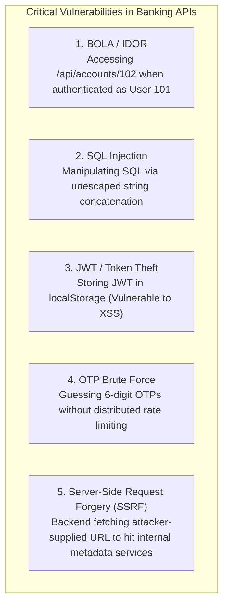

# Banking Application Security, PCI-DSS, RBI Guidelines & OWASP

## 1. Why This Matters
Security in a banking application is non-negotiable. A breach at IDFC FIRST Bank does not simply mean bad PR; it invites severe regulatory penalties from the Reserve Bank of India (RBI), immediate suspension of payment acquiring licenses, and catastrophic customer trust collapse. In an interview for a 3+ YoE developer role in Strategic Projects, security questions will be woven into every round: from preventing Broken Object Level Authorization (BOLA/IDOR) in API endpoints to encrypting card data under PCI-DSS guidelines.

---

## 2. Prerequisites
- HTTP headers, Cookies, Sessions, and JWTs.
- Public-key cryptography (RSA, asymmetric keys) and symmetric encryption (AES).

---

## 3. Concept

### 1. Regulatory & Compliance Frameworks
- **PCI-DSS (Payment Card Industry Data Security Standard):**
  - **Rule 1:** Never store sensitive authentication data (SAD) after authorization—specifically the **3-digit CVV/CVC** or raw card PIN!
  - **Rule 2:** Primary Account Numbers (PAN / 16-digit card number) must be masked when displayed (only first 6 and last 4 digits visible: `4111-XXXX-XXXX-8921`) and encrypted using AES-256 at rest.
  - **Tokenization:** Card networks (Visa, Mastercard, RuPay) replace raw 16-digit PANs with network tokens stored securely in a vault.
- **RBI Mandates:**
  - **Data Localization:** All end-to-end transaction data, logs, and customer PII for domestic payment transactions must reside **exclusively on servers physically located in India**.
  - **Mandatory 2FA:** Two-factor authentication (SMS OTP, biometric, or mPIN) required for all digital transactions.
  - **Cooling-off Period:** Newly added beneficiaries face a cooling period (e.g., maximum transfer limit of ₹50,000 for the first 24 hours) to prevent immediate drainage by account takeover malware.

---

## 4. OWASP Top 10 in Banking: Threat Vectors & Defenses



---

## 5. Real-World Banking Example: The BOLA / IDOR Vulnerability
Consider an Express.js API endpoint written by an inexperienced developer:

```javascript
// VULNERABLE ENDPOINT:
app.get('/api/v1/accounts/:accountId/statement', authenticateUser, async (req, res) => {
    // BUG: Checks if user is logged in, but NEVER checks if req.user OWNS accountId!
    const statement = await db.query('SELECT * FROM statements WHERE account_id = $1', [req.params.accountId]);
    res.json(statement.rows);
});
```

- An attacker logs in as legitimate Customer A (account `101`).
- The attacker then calls `GET /api/v1/accounts/103/statement`.
- The server responds with Customer B's complete transaction history and balance! This is **Broken Object Level Authorization (BOLA / IDOR)**, the #1 API security vulnerability according to OWASP.

---

## 6. Code: Defense-in-Depth Authorization & Encryption in Node.js

```javascript
const crypto = require('crypto');

// 1. Secure BOLA Defense: Explicit Ownership Guard
async function getAccountStatement(req, res) {
    const requestedAccountId = req.params.accountId;
    const authenticatedCustomerId = req.user.customerId; // From verified JWT

    // Query must filter BOTH by accountId AND customerId!
    const result = await db.query(
        `SELECT a.account_number, a.balance, t.*
         FROM accounts a
         JOIN transactions t ON (a.account_id = t.from_account_id OR a.account_id = t.to_account_id)
         WHERE a.account_id = $1 AND a.customer_id = $2
         ORDER BY t.created_at DESC LIMIT 50`,
        [requestedAccountId, authenticatedCustomerId]
    );

    if (result.rows.length === 0) {
        // Return 404 to avoid leaking whether the account exists
        return res.status(404).json({ error: 'Account not found or access denied' });
    }

    return res.json(result.rows);
}

// 2. AES-256-GCM Authenticated Encryption for PII Data at Rest
const ALGORITHM = 'aes-256-gcm';
const MASTER_KEY = Buffer.from(process.env.ENCRYPTION_KEY_HEX, 'hex'); // 32 bytes (256 bits)

function encryptPII(plainText) {
    const iv = crypto.randomBytes(12); // 96-bit IV for GCM
    const cipher = crypto.createCipheriv(ALGORITHM, MASTER_KEY, iv);
    
    let encrypted = cipher.update(plainText, 'utf8', 'hex');
    encrypted += cipher.final('hex');
    const authTag = cipher.getAuthTag().toString('hex'); // 16-byte authentication tag

    // Store IV + AuthTag + EncryptedText
    return `${iv.toString('hex')}:${authTag}:${encrypted}`;
}

function decryptPII(payload) {
    const [ivHex, authTagHex, encryptedHex] = payload.split(':');
    const decipher = crypto.createDecipheriv(ALGORITHM, MASTER_KEY, Buffer.from(ivHex, 'hex'));
    decipher.setAuthTag(Buffer.from(authTagHex, 'hex'));

    let decrypted = decipher.update(encryptedHex, 'hex', 'utf8');
    decrypted += decipher.final('utf8');
    return decrypted;
}
```

---

## 7. How It Works Internally: Authenticated Encryption (AES-256-GCM)
Why is AES-GCM mandatory in modern banking over older AES-CBC mode?
- **AES-CBC:** Encrypts data, but does **not** protect integrity. An attacker can manipulate encrypted ciphertext bits in transit (Bit-Flipping Attack) or launch Padding Oracle attacks.
- **AES-GCM (Galois/Counter Mode):** Provides **Authenticated Encryption with Associated Data (AEAD)**. It simultaneously produces ciphertext and a 128-bit cryptographic **Authentication Tag**.
- If a single bit of the ciphertext or IV is altered, decryption throws an immediate authentication failure, preventing ciphertext tampering attacks completely.

---

## 8. Common Mistakes
1. **Storing JWTs in Browser `localStorage`:** Any Cross-Site Scripting (XSS) flaw allows malicious JavaScript to execute `localStorage.getItem('token')` and exfiltrate authentication tokens. In banking applications, tokens should be stored in **`HttpOnly`, `Secure`, `SameSite=Strict` cookies** or in memory with short expirations.
2. **Logging Sensitive Data (Log Leaks):** Printing full HTTP request bodies (`console.log(req.body)`) inadvertently writes PAN numbers, Aadhaar numbers, and passwords into log files (Splunk / OpenSearch), causing severe compliance violations.
3. **Using Fast Hash Functions for Passwords:** Hashing passwords with MD5, SHA-1, or plain SHA-256 is dangerously insecure because GPUs can calculate billions of hashes per second. Always use **Argon2id** or **Bcrypt** with appropriate work factors.

---

## 9. Performance / Complexity Matrix

| Hashing / Encryption Algorithm | Purpose | Hardware Resistance |
| :--- | :--- | :--- |
| **Argon2id / Bcrypt** | User Passwords / PINs | High (Memory-hard & CPU-hard, prevents GPU brute-forcing) |
| **AES-256-GCM** | Data at Rest (PAN, PII) | Hardware accelerated (AES-NI instructions on modern CPUs) |
| **RSA-2048 / RSA-4096** | Asymmetric Signatures & Key Exchange | CPU intensive; used during handshake only |
| **HMAC-SHA256** | Webhook Signatures & Token Verification | Sub-microsecond calculation |

---

## 10. Interview Questions (Easy → Medium → Hard)

### Easy
- **Q:** Why should you never store a credit card's CVV in a database, even if it is encrypted?

### Medium
- **Q:** What is Broken Object Level Authorization (BOLA/IDOR)? How do you prevent it at the architectural layer?

### Hard
- **Q:** Design a distributed defense against Credential Stuffing and OTP Brute-Force attacks for an IDFC mobile login API handling 100,000 requests/minute. Detail the rate-limiting keys, storage mechanics, and IP reputation safeguards.

---

## 11. Follow-up Questions from Interviewer
- *"What is Certificate Pinning (SSL Pinning) in mobile banking apps, and how does it prevent Man-In-The-Middle (MITM) attacks with proxy tools like Charles or Burp Suite?"*
- *"Explain the difference between Symmetric and Asymmetric encryption, and how TLS 1.3 combines both during a secure session."*

---

## 12. Model Answer: Certificate Pinning & MITM Defense

> **Interviewer:** *"Why is standard HTTPS with a public CA certificate insufficient for mobile banking apps, and why do we require SSL Pinning?"*
> 
> **Model Answer:**
> "By default, an operating system (iOS or Android) trusts hundreds of built-in Root Certificate Authorities (CAs).
> 
> If a malicious actor compromises a single intermediate CA, or if a user installs a custom root certificate on their rooted/jailbroken device (such as running proxy tools to inspect network traffic), they can generate a fraudulent SSL certificate for `api.idfcfirstbank.com`. The mobile OS will blindly trust it, enabling transparent interception and modification of sensitive financial requests.
> 
> **SSL / Public Key Pinning:**
> To eliminate reliance on third-party CAs, the mobile application hardcodes (pins) the **public key hash (SPKI)** of the bank's production TLS certificate into the application binary.
> 
> During the TLS handshake, the app verifies that the server's presented public key matches the pinned hash. If an intercepting proxy presents a different certificate, the app immediately terminates the connection, preventing Man-in-the-Middle attacks even on compromised devices."

---

## 13. Practical Exercise
Inspect the masked card numbers and check constraints in `05-SQL-DBMS/schema.sql`. Notice that the `cards` table masks card numbers (`4111-XXXX-XXXX-8921`) and never stores CVV columns, complying with PCI-DSS guidelines.

---

## 14. Quick Revision
- PCI-DSS: Never store CVV; mask and encrypt PANs with AES-256.
- RBI requires complete data localization for all Indian payment data.
- BOLA/IDOR is the #1 API vulnerability; always filter queries by `accountId AND customerId`.
- Always store JWTs in `HttpOnly`, `Secure`, `SameSite=Strict` cookies.
- Use AES-256-GCM for authenticated encryption to prevent ciphertext bit-flipping.

---

## 15. Interview Checklist
- [ ] Articulates PCI-DSS Rule 1 (never store CVV) and tokenization.
- [ ] Explains RBI data localization mandates.
- [ ] Writes code demonstrating secure authorization to prevent BOLA/IDOR.
- [ ] Explains SSL Pinning and its role in preventing MITM attacks on mobile clients.
