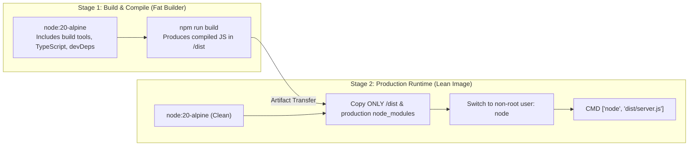

# Docker Containerization, Multi-Stage Builds & Graceful Shutdown

## 1. Why This Matters
At IDFC FIRST Bank's Strategic Projects, all microservices run containerized inside Kubernetes (GKE / EKS / OpenShift). In a technical interview, writing a basic `FROM node:latest` Dockerfile signals inexperience with production systems. Senior engineers evaluate whether you know how to build **secure, minimal multi-stage Docker images**, run containers as **non-root users**, and handle **OS process signals (`SIGTERM`)** to ensure financial transactions in flight are not abruptly severed during deployments.

---

## 2. Prerequisites
- Linux processes, signals (`SIGINT`, `SIGTERM`, `SIGKILL`).
- Basic Docker commands (`docker build`, `docker run`).

---

## 3. Concept

### Multi-Stage Docker Builds
A naive Dockerfile packages the entire source tree, compiler toolchains (`gcc`, `python`, `make`), development dependencies (`devDependencies`), and package managers into the final image. This results in:
- Bloated images ($> 1\text{ GB}$).
- Severe security vulnerabilities (attackers have access to compilers and package managers inside the container).



---

## 4. Simple Example: Naive vs Multi-Stage Dockerfile

### Naive Dockerfile (Dangerous & Bloated):
```dockerfile
# NEVER DO THIS IN PRODUCTION:
FROM node:20
WORKDIR /app
COPY . .
RUN npm install
RUN npm run build
EXPOSE 3000
CMD ["npm", "start"] # Runs via npm wrapper which swallows SIGTERM!
```

---

## 5. Production Banking Dockerfile: Secure Multi-Stage Build

```dockerfile
# ==============================================================================
# STAGE 1: Builder
# ==============================================================================
FROM node:20-alpine AS builder

WORKDIR /app

# Install dependencies needed for compiling native C++ addons
RUN apk add --no-cache python3 make g++

# Copy package manifests first to leverage Docker layer caching
COPY package*.json tsconfig.json ./

# Install ALL dependencies (including devDependencies for building)
RUN npm ci

# Copy application source code
COPY src/ ./src

# Compile TypeScript to JavaScript
RUN npm run build

# Prune devDependencies, leaving only production modules
RUN npm prune --production

# ==============================================================================
# STAGE 2: Production Runner
# ==============================================================================
FROM node:20-alpine AS runner

WORKDIR /app

# Set production environment
ENV NODE_ENV=production

# Install dumb-init or tini to handle PID 1 signal forwarding
RUN apk add --no-cache dumb-init

# Copy only production artifacts from builder stage
COPY --from=builder /app/package*.json ./
COPY --from=builder /app/node_modules ./node_modules
COPY --from=builder /app/dist ./dist

# Security: Never run containers as root!
USER node

EXPOSE 3000

# Use dumb-init as entrypoint to properly forward OS signals
ENTRYPOINT ["dumb-init", "--"]

# Execute Node directly (avoid npm start which swallows signals)
CMD ["node", "dist/server.js"]
```

---

## 6. Code: Graceful Shutdown Implementation in Express / Node.js
When Kubernetes scales down a pod or deploys a new version, it sends a `SIGTERM` signal. Your application must:
1. Stop accepting new incoming HTTP connections.
2. Allow currently in-flight financial transfers to finish processing.
3. Close database connection pools cleanly.
4. Exit process with code 0.

```javascript
const express = require('express');
const http = require('http');
const { pool } = require('./db');

const app = express();
const server = http.createServer(app);

// Liveness Probe (Is container alive?)
app.get('/healthz', (req, res) => res.status(200).send('OK'));

// Readiness Probe (Is container ready to serve traffic?)
let isShuttingDown = false;
app.get('/ready', (req, res) => {
    if (isShuttingDown) {
        return res.status(503).send('Service Shutting Down');
    }
    return res.status(200).send('Ready');
});

// Start Server
const PORT = process.env.PORT || 3000;
server.listen(PORT, () => console.log(`Payment Service listening on port ${PORT}`));

// Graceful Shutdown Handler
function handleGracefulShutdown(signal) {
    console.log(`Received ${signal}. Initiating graceful shutdown...`);
    isShuttingDown = true;

    // 1. Stop accepting new connections
    server.close(async () => {
        console.log('HTTP server closed. In-flight requests finished.');

        try {
            // 2. Drain and close database connection pool
            console.log('Closing database connection pool...');
            await pool.end();
            console.log('Database connections closed cleanly.');
            process.exit(0);
        } catch (err) {
            console.error('Error during database pool shutdown:', err);
            process.exit(1);
        }
    });

    // Force exit if shutdown hangs beyond 25 seconds (K8s default grace period is 30s)
    setTimeout(() => {
        console.error('Graceful shutdown timeout exceeded! Forcefully terminating.');
        process.exit(1);
    }, 25000).unref();
}

// Listen for Kubernetes termination signals
process.on('SIGTERM', () => handleGracefulShutdown('SIGTERM'));
process.on('SIGINT', () => handleGracefulShutdown('SIGINT'));
```

---

## 7. How It Works Internally: The PID 1 Problem in Linux Containers
In Linux, **Process ID 1 (PID 1)** is the init process (`systemd`).
- PID 1 has special kernel properties: default signal handlers are not registered for it.
- If you start a container with `CMD ["npm", "start"]` or `CMD ["node", "server.js"]` without an init process, Node runs as PID 1.
- When Kubernetes sends `SIGTERM`, Node.js may ignore it, or `npm` may consume the signal without forwarding it to the child Node process!
- After the Kubernetes termination grace period (30s), the kernel sends `SIGKILL`, abruptly aborting active payment transactions mid-flight.
- **Solution:** Use **`dumb-init`** or `tini` as the container entrypoint. It runs as PID 1, spawns Node as a child process, and properly forwards all OS signals (`SIGTERM`, `SIGINT`) while reaping orphaned zombie processes.

---

## 8. Common Mistakes
1. **Running Containers as `root`:** By default, Docker containers run as the root user (`UID 0`). If an attacker exploits an RCE vulnerability in an npm package, they have root access to the underlying container namespace. Always switch to `USER node`.
2. **Using `npm start` in `CMD`:** `npm start` spawns a sub-shell that swallows POSIX termination signals, breaking graceful shutdown. Always use `CMD ["node", "server.js"]`.
3. **Copying `node_modules` from Host Machine:** Always put `node_modules` in `.dockerignore`. Copying local modules into a Linux container fails because native C++ binaries (e.g., `bcrypt`) built on macOS or Windows cannot run on Alpine Linux.

---

## 9. Performance / Complexity Matrix

| Image Strategy | Image Size | Build Time | Security Posture |
| :--- | :---: | :---: | :--- |
| **`node:latest` (Single Stage)** | $\approx 1.1\text{ GB}$ | Fast | Dangerous (Includes compilers, root user) |
| **`node:alpine` (Single Stage)** | $\approx 350\text{ MB}$ | Moderate | Moderate |
| **Multi-Stage with `node:alpine` + `USER node`** | $\approx 120\text{ MB}$ | Optimized | **Production & Banking Grade** |

---

## 10. Interview Questions (Easy $\to$ Medium $\to$ Hard)

### Easy
- **Q:** Why should you avoid using `node:latest` in production Dockerfiles?

### Medium
- **Q:** Explain how Docker layer caching works. Why do we copy `package.json` and run `npm install` before copying the rest of the application code?

### Hard
- **Q:** Describe the "PID 1 problem" in Docker containers. What happens when a containerized Node.js application receives a `SIGTERM` from Kubernetes, and how does `dumb-init` or `tini` solve it?

---

## 11. Follow-up Questions from Interviewer
- *"What is the difference between Kubernetes Liveness and Readiness probes in a banking microservice?"*
  *(Answer: Liveness checks if the process is alive; if it fails, K8s restarts the container. Readiness checks if the process can accept traffic; if it fails, K8s removes the pod from the service load balancer without killing it).*
- *"What is a Distroless Docker image and why is it increasingly mandated in banking institutions?"*

---

## 12. Model Answer: Docker Layer Caching Strategy

> **Interviewer:** *"Why do we split the `COPY` instructions for `package.json` and the source code in a Dockerfile?"*
> 
> **Model Answer:**
> "Docker creates an immutable cached layer for each instruction in a Dockerfile. A cache hit occurs only if the instruction and all underlying files have not changed since the previous build.
> 
> Running `npm ci` is expensive because it downloads and verifies hundreds of packages.
> 
> - If we write `COPY . .` followed by `RUN npm ci`, every tiny modification to a JavaScript file, comment, or README invalidates the cache from that point onward, forcing a full `npm ci` re-download on every single build.
> - By copying `package*.json` first and executing `RUN npm ci`, Docker caches the `node_modules` layer. Subsequent code changes only invalidate the later `COPY src/ ./src` layer.
> - As a result, code-only continuous integration builds take **3–5 seconds** instead of minutes, accelerating CI/CD deployment pipelines."

---

## 13. Practical Exercise
Review the multi-stage Dockerfile in Section 5. Create a `.dockerignore` file in your mental model:
```text
node_modules
dist
.git
.env
*.log
```

---

## 14. Quick Revision
- Multi-stage builds separate compilation tools from the lean runtime container.
- Always run containers as non-root (`USER node`).
- Handle `SIGTERM` to close HTTP listeners and drain database connections before exiting.
- Use `dumb-init` or `tini` to solve PID 1 signal forwarding and zombie reaping.
- Leverage Docker layer caching by copying package manifests before source code.

---

## 15. Interview Checklist
- [ ] Can write a 2-stage Dockerfile from memory.
- [ ] Explains why containers should never run as root.
- [ ] Understands the PID 1 problem and signal forwarding.
- [ ] Writes graceful shutdown logic handling `SIGTERM`.
