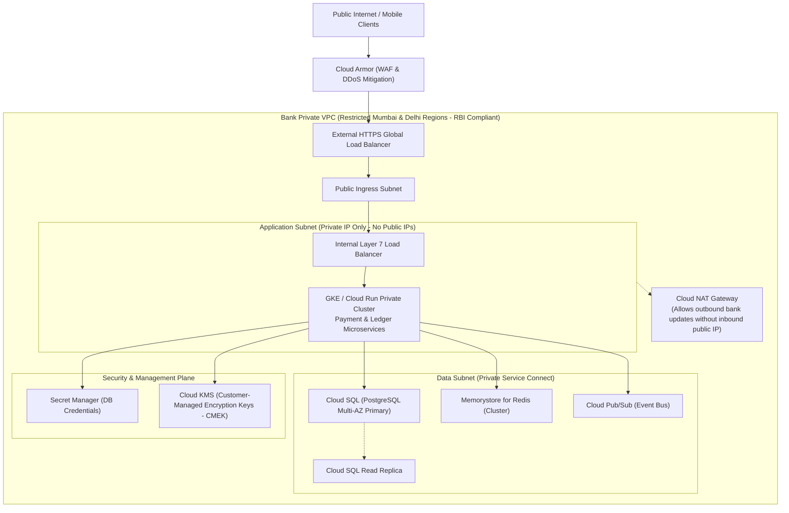

# Google Cloud Platform (GCP) Infrastructure for Enterprise Banking

## 1. Why This Matters
IDFC FIRST Bank leverages modern cloud and hybrid infrastructure to scale digital acquisition, mobile banking APIs, and analytics. As a 3+ YoE developer with familiarity in GCP, demonstrating how to architect secure, highly available services using **Google Kubernetes Engine (GKE)**, **Cloud Run**, **Cloud SQL**, **Cloud Pub/Sub**, and **IAM Workload Identity** proves that you understand modern production cloud infrastructure, rather than just writing code locally on `localhost:3000`.

---

## 2. Prerequisites
- Basic networking: Virtual Private Cloud (VPC), Subnets, CIDR blocks, NAT Gateways.
- Cloud primitives: Virtual Machines, Containers, Object Storage, IAM.

---

## 3. Concept: Enterprise Banking VPC Architecture on GCP



---

## 4. Key GCP Services in Digital Banking

1. **Google Kubernetes Engine (GKE):** Managed Kubernetes for containerized microservices. In banking, GKE is configured with **Private Clusters** (nodes have no public IP addresses; API server endpoint is restricted to authorized networks).
2. **Cloud Run:** Fully managed serverless container runtime. Ideal for lightweight event-driven microservices (e.g., PDF generation, statement dispatch, webhook ingestion) that scale to zero when idle.
3. **Cloud SQL for PostgreSQL:** Managed relational database with automated High Availability (HA) across multiple Availability Zones, automated point-in-time recovery (PITR), and automatic WAL archiving.
4. **Cloud Armor:** Web Application Firewall (WAF) and DDoS protection that blocks OWASP Top 10 vulnerabilities, enforces rate limiting, and geofences inbound traffic strictly to Indian IP ranges.
5. **Cloud KMS (Key Management Service):** Stores encryption master keys in FIPS 140-2 Level 3 Hardware Security Modules (HSMs) for **Customer-Managed Encryption Keys (CMEK)**.
6. **Secret Manager:** Stores API keys, database credentials, and certificates with strict versioning and automatic rotation.

---

## 5. Real-World Banking Example: Workload Identity Federation (Eliminating Service Account Keys)
In traditional cloud setups, developers downloaded a JSON service account key (`service-account-key.json`) and mounted it inside the container.
- **The Security Danger:** If an engineer accidentally commits the JSON file to GitHub or a developer workstation is compromised, attackers gain permanent administrative access to the bank's cloud resources.
- **The Banking Standard (Workload Identity):**
  - GKE maps a native Kubernetes Service Account (KSA) directly to a Google Cloud IAM Service Account (GSA).
  - When the Node.js application calls GCP APIs (Cloud Storage or Secret Manager), the Google Cloud Client Library retrieves short-lived, automatically rotated OIDC tokens from the local metadata server (`http://metadata.google.internal`).
  - **Zero static keys exist anywhere on disk or in environment variables!**

---

## 6. Code: Accessing GCP Secret Manager Securely in Node.js

```javascript
const { SecretManagerServiceClient } = require('@google-cloud/secret-manager');
const client = new SecretManagerServiceClient();

/**
 * Retrieves database credentials dynamically from GCP Secret Manager
 * at startup using Workload Identity (no static credentials needed!).
 */
async function getDatabaseCredentials(projectId, secretName, version = 'latest') {
    const name = `projects/${projectId}/secrets/${secretName}/versions/${version}`;
    
    try {
        const [response] = await client.accessSecretVersion({ name });
        const payload = response.payload.data.toString('utf8');
        return JSON.parse(payload);
    } catch (err) {
        console.error(`Failed to access secret ${secretName}:`, err.message);
        throw err;
    }
}

// Usage in application startup:
(async () => {
    const dbConfig = await getDatabaseCredentials('idfc-banking-prod', 'database-master-credentials');
    console.log('Successfully fetched credentials for user:', dbConfig.username);
})();
```

---

## 7. How It Works Internally: Private Service Connect & Cloud NAT
In an enterprise banking VPC:
1. **No Public IP Addresses:** Worker nodes in the GKE cluster must have **zero public IPv4 addresses**.
2. **Private Service Connect (PSC):** Connections from GKE to Cloud SQL or Cloud Storage traverse Google's private software-defined network backbone via private IP endpoints, completely bypassing the public internet.
3. **Cloud NAT:** When a microservice needs to initiate an outbound connection to an external partner bank or NPCI switch, it routes through **Cloud NAT**. The external switch sees a fixed, whitelisted static public IP, while no inbound connections can penetrate back through the NAT.

---

## 8. Common Mistakes
1. **Hardcoding Secrets in Environment Variables or Dockerfiles:** Environment variables leak through crash dumps, `docker inspect`, and process listings. Always fetch secrets at runtime via Secret Manager or mount them as Kubernetes Secret volumes backed by Secret Store CSI Driver.
2. **Deploying Cloud Resources Outside India:** For IDFC FIRST Bank, creating Cloud SQL or GCS buckets in `us-central1` or `europe-west1` is a direct violation of RBI Data Localization mandates. All resources must be provisioned in **`asia-south1` (Mumbai)** or **`asia-south2` (Delhi)**.
3. **Overly Permissive IAM Roles:** Granting `Editor` or `Owner` roles to service accounts violates the **Principle of Least Privilege**. Service accounts should only hold narrow roles (e.g., `roles/secretmanager.secretAccessor` on a specific secret).

---

## 9. Performance / Complexity Matrix

| GCP Service | Compute / Storage Model | High Availability SLA | Best Used For |
| :--- | :--- | :---: | :--- |
| **GKE Private Cluster** | Kubernetes Container Orchestration | $99.95\%$ (Zonal) / $99.99\%$ (Regional) | Core transactional microservices |
| **Cloud Run** | Serverless Container | $99.95\%$ | Event-driven APIs & Webhook receivers |
| **Cloud SQL** | Managed PostgreSQL Multi-AZ | $99.95\%$ | Transaction ledger & relational source of truth |
| **Cloud Storage (GCS)** | Object Storage (Regional) | $99.99\%$ | PDF statements & raw settlement file archive |
| **Cloud Pub/Sub** | At-least-once Distributed Queue | $99.95\%$ | Transactional events & notification triggers |

---

## 10. Interview Questions (Easy $\to$ Medium $\to$ Hard)

### Easy
- **Q:** What is the difference between a regional and zonal resource in Google Cloud?

### Medium
- **Q:** Why should production Kubernetes nodes in a banking deployment be configured as a "Private Cluster" without public IP addresses? How do pods access external partner APIs?

### Hard
- **Q:** Explain how Workload Identity works in GKE. Walk through the authentication handshake between a Kubernetes pod, the GKE metadata server, and Google Cloud IAM.

---

## 11. Follow-up Questions from Interviewer
- *"How does Cloud Armor mitigate a Layer 7 HTTP flood attack targeting an IDFC login endpoint?"*
  *(Answer: Enforces adaptive rate-limiting rules based on IP or session tokens, validates reCAPTCHA Enterprise tokens, and inspects HTTP request headers for known malicious bot signatures).*
- *"What is Customer-Managed Encryption Keys (CMEK) and why does RBI mandate it over default Google-managed keys?"*

---

## 12. Model Answer: Workload Identity Federation

> **Interviewer:** *"How do you securely grant a Node.js microservice running in GKE access to GCP Cloud SQL and Secret Manager without storing static credentials?"*
> 
> **Model Answer:**
> "We implement **GKE Workload Identity**, which is Google Cloud's recommended best practice for zero-trust security.
> 
> 1. We create a Google Cloud IAM Service Account (GSA) and grant it the exact least-privilege IAM roles needed (e.g., `roles/secretmanager.secretAccessor`).
> 2. We create a Kubernetes Service Account (KSA) in our namespace and annotate it with the GSA's email address.
> 3. We bind the two accounts using IAM policy binding (`roles/iam.workloadIdentityUser`).
> 
> **At Runtime:**
> When our Node.js app initializes the Google Cloud Client SDK, the SDK queries the local GKE node metadata server.
> 
> The GKE metadata server intercepts the call, validates the pod's projected Kubernetes service account token, exchanges it with the Google Security Token Service (STS) for a short-lived Google IAM access token (valid for 1 hour), and returns it to the client SDK.
> 
> As a result, our code accesses Cloud SQL and Secret Manager seamlessly without any static credentials, private keys, or passwords ever residing in configuration files, Git repositories, or container images."

---

## 13. Practical Exercise
Review how your Node.js application configures database connection strings: ensure it supports loading connection configurations from environment variables populated via Kubernetes Secrets or runtime secret fetches rather than static config files.

---

## 14. Quick Revision
- All banking cloud resources must reside in Indian regions (`asia-south1` / `asia-south2`) for RBI compliance.
- GKE Private Clusters prevent worker nodes from having public IP addresses.
- Cloud NAT enables secure outbound traffic without exposing inbound ports.
- Workload Identity eliminates static JSON service account keys.
- Cloud Armor protects banking APIs against DDoS and OWASP Layer 7 threats.

---

## 15. Interview Checklist
- [ ] Understands the difference between GKE and Cloud Run.
- [ ] Explains the architecture of a Private Cluster and Cloud NAT.
- [ ] Articulates how Workload Identity functions under the hood.
- [ ] Knows the RBI data localization requirement for GCP regions.
