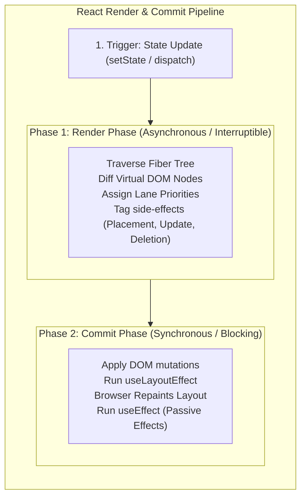

# React.js Architecture, Fiber Reconciliation & Fullstack Integration

## 1. Why This Matters
As an engineer with strong React and Node.js experience, your ability to deliver end-to-end fullstack features is a significant competitive edge at IDFC FIRST Bank's Strategic Projects. In technical rounds, interviewers will challenge you beyond surface-level component creation: they will probe the **Fiber reconciliation algorithm**, the **stale closure trap** in React hooks, high-performance rendering of massive financial ledgers, and seamless frontend-to-backend consistency.

---

## 2. Prerequisites
- Modern JavaScript ES6+ (Closures, Promises, Destructuring).
- DOM manipulation and browser rendering pipelines (Layout, Paint, Composite).

---

## 3. Concept: The React Fiber Architecture



### Why Fiber was Built:
Prior to React 16 (the Stack Reconciler), reconciliation was synchronous and recursive. If a component tree was large (like a 5,000-row banking statement), diffing the tree locked the browser's main thread for 150ms, causing dropped animation frames and freezing user typing in input fields.
**Fiber** represents every React element as an individual unit of work (a **Fiber Node**) with `child`, `sibling`, and `return` pointers. This turns recursion into an iterative loop that can **pause, yield execution to the browser to handle urgent user input, and resume later**.

---

## 4. Simple Example: The Stale Closure Trap in `useEffect`

```javascript
import React, { useState, useEffect } from 'react';

// BAD: Classic Stale Closure Bug
function StaleCounter() {
    const [count, setCount] = useState(0);

    useEffect(() => {
        const interval = setInterval(() => {
            // BUG: Closes over the initial count (0) on mount and NEVER sees updates!
            console.log('Current count:', count);
            setCount(count + 1); // Continuously sets 0 + 1 = 1!
        }, 1000);

        return () => clearInterval(interval);
    }, []); // Empty dependency array captures count = 0 forever!

    return <div>Count: {count}</div>;
}

// FIX: Functional State Update (Always receives freshest state!)
function FreshCounter() {
    const [count, setCount] = useState(0);

    useEffect(() => {
        const interval = setInterval(() => {
            setCount(prev => prev + 1); // Resolves freshest value atomically!
        }, 1000);

        return () => clearInterval(interval);
    }, []);

    return <div>Count: {count}</div>;
}
```

---

## 5. Real-World Banking Example: Virtualized Statement Rendering
In IDFC FIRST Bank's customer portal, a user loads a 1-year transaction statement containing 15,000 records.
- **Naive Rendering:** Creating 15,000 DOM nodes (`<tr>`) consumes 300MB of RAM and causes severe scroll jank.
- **Windowing / Virtualization (`react-window` / `@tanstack/react-virtual`):**
  The virtualizer calculates the viewport height and renders **strictly the 20 visible rows** plus an overscan buffer of 5 rows. As the user scrolls, old DOM nodes are recycled and repositioned via absolute transforms. DOM nodes remain capped at ≈ 30, maintaining 60 FPS smooth scrolling regardless of dataset size.

---

## 6. Code: High-Performance Banking Transaction Dashboard

```jsx
import React, { useState, useMemo, useCallback } from 'react';

// Memoized Transaction Row Component
const TransactionRow = React.memo(({ tx, onSelect }) => {
    console.log(`Rendering row: ${tx.id}`);
    return (
        <tr onClick={() => onSelect(tx.id)} className="hover:bg-gray-50 cursor-pointer">
            <td className="px-4 py-2 font-mono text-sm">{tx.reference}</td>
            <td className="px-4 py-2">{tx.channel}</td>
            <td className={`px-4 py-2 font-bold ${tx.direction === 'CREDIT' ? 'text-green-600' : 'text-red-600'}`}>
                {tx.direction === 'CREDIT' ? '+' : '-'}₹{tx.amount.toLocaleString('en-IN')}
            </td>
            <td className="px-4 py-2">{tx.status}</td>
        </tr>
    );
});

export default function StatementDashboard({ transactions }) {
    const [selectedChannel, setSelectedChannel] = useState('ALL');

    // 1. useMemo prevents expensive re-filtering unless transactions or filter changes
    const filteredTransactions = useMemo(() => {
        if (selectedChannel === 'ALL') return transactions;
        return transactions.filter(t => t.channel === selectedChannel);
    }, [transactions, selectedChannel]);

    // 2. useCallback ensures the callback reference remains stable across renders
    const handleSelect = useCallback((txId) => {
        console.log('Selected transaction details:', txId);
    }, []); // Stable dependency

    return (
        <div className="p-6 max-w-4xl mx-auto">
            <h1 className="text-2xl font-bold mb-4">Account Statement</h1>
            <select 
                value={selectedChannel} 
                onChange={(e) => setSelectedChannel(e.target.value)}
                className="mb-4 p-2 border rounded"
            >
                <option value="ALL">All Channels</option>
                <option value="UPI">UPI</option>
                <option value="IMPS">IMPS</option>
                <option value="NEFT">NEFT</option>
            </select>

            <table className="w-full border text-left">
                <thead>
                    <tr className="bg-gray-100">
                        <th className="px-4 py-2">Reference</th>
                        <th className="px-4 py-2">Channel</th>
                        <th className="px-4 py-2">Amount</th>
                        <th className="px-4 py-2">Status</th>
                    </tr>
                </thead>
                <tbody>
                    {filteredTransactions.map(tx => (
                        <TransactionRow key={tx.id} tx={tx} onSelect={handleSelect} />
                    ))}
                </tbody>
            </table>
        </div>
    );
}
```

---

## 7. How It Works Internally: Diffing Heuristics & Keys
The React reconciliation algorithm operates in O(N) linear time by enforcing two core heuristics:
1. **Different Element Types:** Two elements of different types produce different trees. If a `<div>` is replaced by a `<span>`, React destroys the old subtree and reconstructs from scratch.
2. **The `key` Prop Invariant:**
   - Keys must be stable, predictable, and unique across siblings.
   - When an item is prepended to a list without keys, React compares old index 0 to new index 0, mutating every single child DOM node!
   - With unique keys (`key={tx.id}`), React identifies that items shifted and performs a single DOM move (`insertBefore`) in O(1).
   - **Index as Key Anti-Pattern:** Using array index as key (`key={index}`) causes corrupted form inputs and subtle UI bugs when list items are filtered, deleted, or reordered!

---

## 8. Common Mistakes
1. **Using Array Index as `key` for Dynamic Lists:** Causes state leakage between components when items are added or deleted.
2. **Missing Dependencies in `useEffect`:** Omitting variables used inside an effect from its dependency array creates **stale closure bugs**.
3. **Overusing `useMemo` and `useCallback` Prematurely:** Wrapping simple primitive calculations or small components in `useMemo` adds memory overhead (allocating dependency arrays and cache objects) that exceeds the cost of re-rendering. Use them for expensive computations or to preserve reference stability for `React.memo` children.

---

## 9. Performance / Complexity Matrix

| Technique | Problem Solved | Overhead |
| :--- | :--- | :--- |
| **`React.memo`** | Skips child re-renders if props are shallow equal | Shallow comparison check per render |
| **`useCallback`** | Preserves function reference equality | Retains closure memory |
| **`useMemo`** | Caches expensive O(N log N) calculations | Memory allocation for cached result |
| **List Virtualization** | Limits DOM nodes to visible viewport (≈ 25 nodes) | Scroll calculation listener |

---

## 10. Interview Questions (Easy → Medium → Hard)

### Easy
- **Q:** What is the Virtual DOM and how does React use it to optimize rendering?

### Medium
- **Q:** Explain what causes a "Stale Closure" in React hooks. How do functional state updates (`setCount(prev => prev + 1)`) resolve it?

### Hard
- **Q:** Walk through how React Fiber performs concurrent rendering. How does it prioritize an urgent user keystroke over a low-priority background data fetch using Lanes?

---

## 11. Follow-up Questions from Interviewer
- *"What is the difference between `useEffect` and `useLayoutEffect`? When would using `useEffect` cause visible UI flickering?"*
  *(Answer: `useLayoutEffect` runs synchronously after DOM mutations but before the browser paints. It is used to read DOM measurements or synchronously update styles to prevent layout shifts. `useEffect` runs asynchronously after the paint).*
- *"How do you design an optimistic UI update in React for a money transfer? What happens if the backend API returns an error?"*

---

## 12. Model Answer: Fullstack Optimistic Updates & Rollback

> **Interviewer:** *"How do you implement an Optimistic UI update in a React banking dashboard when a user transfers funds, and how do you handle backend failures?"*
> 
> **Model Answer:**
> "Optimistic UI updates give users instantaneous feedback by updating the frontend state *before* waiting for the network API round-trip:
> 
> 1. **Capture Previous Snapshot:** Before dispatching the HTTP request, we capture a snapshot of current accounts and balance state in local memory.
> 2. **Immediate Optimistic Mutation:** We immediately deduct the amount from the UI balance and prepend a temporary transaction item with status `PENDING`.
> 3. **API Dispatch:** We send the `POST /api/v1/transfers` request with a client-generated UUID as `X-Idempotency-Key`.
> 4. **Success Handling:** When the server returns HTTP 200 with the confirmed transaction reference and settled balance, we reconcile the temporary pending item with the official ledger record.
> 5. **Failure Rollback:** If the network request fails or returns HTTP 4xx/5xx (e.g., insufficient funds or route down), we immediately **revert the UI state back to the pre-transaction snapshot** and display a clear toast notification informing the user of the reversal.
> 
> This approach provides perceived zero-latency performance while guaranteeing that UI state never desynchronizes from backend truth."

---

## 13. Practical Exercise
Review Section 6 and explain why `handleSelect` was wrapped in `useCallback` when passing it to `TransactionRow`.
*(Hint: If `handleSelect` were an inline arrow function, a new function reference would be instantiated on every render of `StatementDashboard`, causing `React.memo(TransactionRow)` to fail shallow equality check and re-render every row).*

---

## 14. Quick Revision
- Fiber turns recursive reconciliation into an interruptible iterative work loop.
- Keys must be stable, unique IDs; never use array indices for dynamic lists.
- Functional state updates (`setVal(prev => ... )`) eliminate stale closures.
- List virtualization caps DOM nodes to viewport height, enabling 60 FPS scrolling on 10,000+ records.
- `useLayoutEffect` executes before paint (synchronous); `useEffect` executes after paint.

---

## 15. Interview Checklist
- [ ] Can explain Fiber nodes (`child`, `sibling`, `return`) and concurrent rendering.
- [ ] Understands stale closures in hooks.
- [ ] Can write virtualized rendering architectures for massive ledgers.
- [ ] Explains optimistic UI updates with snapshot rollback mechanisms.
