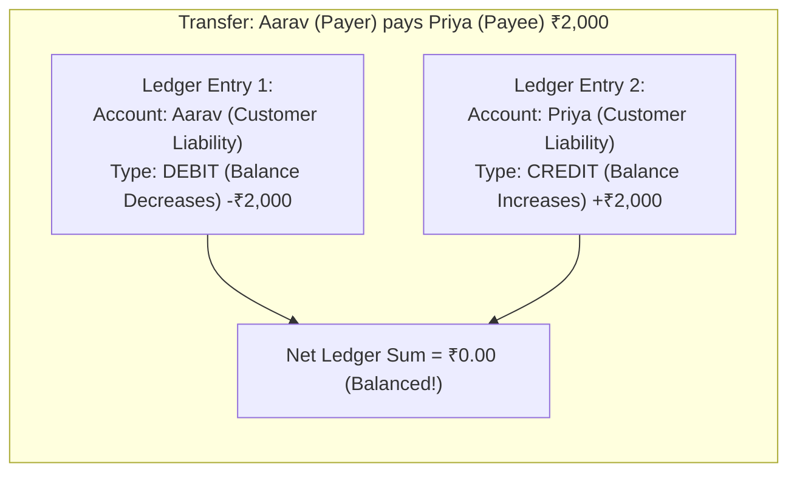
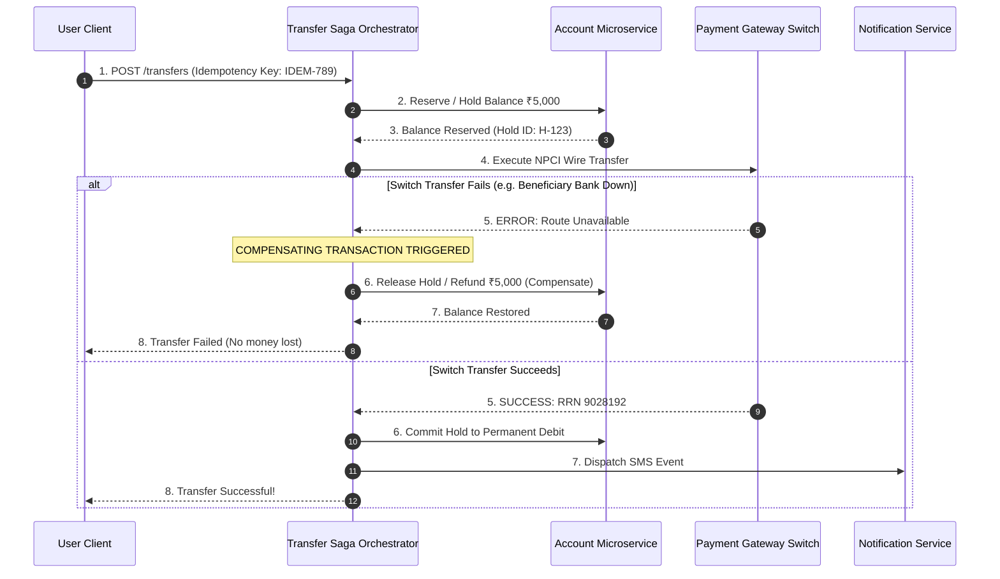

# Core Banking Transaction Processing, Double-Entry Ledgers & Sagas

## 1. Why This Matters
In banking applications at IDFC FIRST Bank, money is never simply an integer updated in a single database column (`UPDATE accounts SET balance = balance + 100`). Real financial platforms use **immutable double-entry bookkeeping ledgers**, **distributed sagas**, and **strict idempotency filters**. In a 3+ YoE interview, if you propose mutating a single balance column without an immutable ledger audit trail, your architecture will be disqualified immediately.

---

## 2. Prerequisites
- Relational database transactions (ACID, isolation levels).
- Basic accounting principles (Debits and Credits).
- Distributed systems concepts (REST APIs, message brokers).

---

## 3. Concept

### 1. The Double-Entry Bookkeeping Principle
In accounting, money is neither created nor destroyed; it simply transfers between accounts.
Σ Debits = Σ Credits
- **Debit:** An increase in Assets or Expenses, or a decrease in Liabilities or Equity.
- **Credit:** An increase in Liabilities or Equity, or a decrease in Assets or Expenses.
- **The Ledger Invariant:** Every financial transaction must insert **at least two immutable ledger entries**: one debit and one credit. The net sum of the entries for any transaction must strictly equal **zero**.



---

## 4. Simple Example: Double-Entry Ledger Schema

```sql
CREATE TABLE ledger_entries (
    entry_id INTEGER PRIMARY KEY AUTOINCREMENT,
    transaction_reference VARCHAR(64) NOT NULL,
    account_id INTEGER NOT NULL,
    direction VARCHAR(6) NOT NULL CHECK (direction IN ('DEBIT', 'CREDIT')),
    amount DECIMAL(15, 2) NOT NULL CHECK (amount > 0),
    created_at TIMESTAMP DEFAULT CURRENT_TIMESTAMP,
    FOREIGN KEY (account_id) REFERENCES accounts(account_id)
);

-- Aarav transfers 2000 to Priya:
-- Entry 1 (Debit Aarav):
INSERT INTO ledger_entries (transaction_reference, account_id, direction, amount)
VALUES ('TXN-1001', 101, 'DEBIT', 2000.00);

-- Entry 2 (Credit Priya):
INSERT INTO ledger_entries (transaction_reference, account_id, direction, amount)
VALUES ('TXN-1001', 103, 'CREDIT', 2000.00);
```

---

## 5. Real-World Banking Example: Distributed Transaction Across Microservices (The Saga Pattern)
In a microservices architecture:
- **Account Service:** Manages balance deductions (PostgreSQL).
- **Payment Switch Service:** Talks to NPCI / Visa / Mastercard.
- **Notification Service:** Dispatches transactional SMS / Email (Kafka).



---

## 6. Code: Production-Grade Idempotency Engine in Express / Node.js

```javascript
const redis = require('redis');
const redisClient = redis.createClient();

/**
 * Express Middleware: Guarantees exactly-once payment processing
 * using an Idempotency Key header.
 */
function idempotencyMiddleware(ttlSeconds = 86400) { // 24-hour retention
    return async (req, res, next) => {
        const idempotencyKey = req.headers['x-idempotency-key'];

        if (!idempotencyKey) {
            return res.status(400).json({ error: 'Missing required X-Idempotency-Key header' });
        }

        const cacheKey = `idempotency:${idempotencyKey}`;

        // Step 1: Check if key exists or acquire lock (SET NX)
        // Returns 'OK' if key was successfully set, null if key already existed
        const acquired = await redisClient.set(cacheKey, JSON.stringify({ status: 'PROCESSING' }), {
            NX: true,
            EX: ttlSeconds
        });

        if (!acquired) {
            // Key already exists! Fetch existing result or check progress
            const existingRecord = JSON.parse(await redisClient.get(cacheKey));

            if (existingRecord.status === 'PROCESSING') {
                return res.status(409).json({
                    error: 'A request with this idempotency key is currently processing. Please wait.'
                });
            }

            // Return cached previous response (replay response!)
            return res.status(existingRecord.statusCode).json(existingRecord.responseBody);
        }

        // Step 2: Intercept response to cache final outcome
        const originalSend = res.send.bind(res);
        res.send = (body) => {
            const parsedBody = JSON.parse(body);
            // Save final terminal outcome to Redis
            redisClient.set(cacheKey, JSON.stringify({
                status: 'COMPLETED',
                statusCode: res.statusCode,
                responseBody: parsedBody
            }), { EX: ttlSeconds });

            return originalSend(body);
        };

        next();
    };
}
```

---

## 7. How It Works Internally: Two-Phase Commit (2PC) vs Saga

| Dimension | Two-Phase Commit (2PC) | Distributed Saga Pattern |
| :--- | :--- | :--- |
| **Coordination** | Central Transaction Coordinator | Saga Orchestrator or Choreography (Events) |
| **Locking** | Holds locks across all nodes during prepare phase | **No cross-service distributed locks!** Local DB commits immediately. |
| **Failure Recovery** | Automatic rollback via coordinator | **Compensating Transactions** undo previous local commits. |
| **Latency & Scale** | Poor scalability; slowest node delays all locks | **High throughput & fault tolerant.** |
| **Consistency** | Strict immediate consistency | **Eventual consistency** with intermediate states. |

> **Why modern banking microservices use Sagas:** In a modern cloud deployment, holding database locks across different microservices over network boundaries (2PC) creates single points of failure and catastrophic latency bottlenecks. Sagas execute independent local transactions and reverse failed steps using **compensating actions** (e.g., if a debit occurs but credit fails, issue a credit compensation).

---

## 8. Common Mistakes
1. **Mutating Balance Without Writing Ledger Records:** Calculating `balance = balance - 50` in-place leaves zero audit trail. If a customer questions a statement, the bank cannot prove where the money went. **Current balance should always be verifiable as the sum of all historical ledger entries.**
2. **Missing Distributed Idempotency Keys:** If a mobile client experiences a network glitch after sending a payment request, the user presses the "Pay" button a second time. Without an idempotency key, the server debits the account twice.
3. **Designing Non-Idempotent Compensations in Sagas:** Compensating transactions (refunds/cancellations) can *also* fail or be retried multiple times. Compensating transactions must themselves be strictly idempotent!

---

## 9. Performance / Complexity Matrix

| Ledger Model | Read Complexity (Balance) | Write Complexity | Auditability |
| :--- | :---: | :---: | :---: |
| **Naive Balance Update** | O(1) | O(1) | Zero (Dangerous) |
| **Pure Immutable Ledger (Sum of entries)** | O(N) (Requires caching snapshot) | O(1) append-only | 100% Perfect |
| **Hybrid (Snapshot Balance + Ledger Table)** | O(1) read snapshot | O(1) append + lock update | Excellent & Production Standard |

---

## 10. Interview Questions (Easy → Medium → Hard)

### Easy
- **Q:** What is the core rule of double-entry bookkeeping?

### Medium
- **Q:** How do you implement idempotency for an HTTP `POST /api/v1/payments` endpoint? What happens if the second request arrives while the first is still processing?

### Hard
- **Q:** Explain the difference between Orchestration-based Sagas and Choreography-based Sagas in financial systems. When would you strictly mandate an Orchestrator?

---

## 11. Follow-up Questions from Interviewer
- *"In a double-entry system, how do you handle balance caching without desynchronizing from the immutable ledger table?"*
- *"What is 3-Way Reconciliation between the Bank's Core Ledger, the Payment Gateway Switch, and the Settlement Bank (NPCI/RBI)?"*

---

## 12. Model Answer: Orchestration vs Choreography in Banking Sagas

> **Interviewer:** *"Why do core banking architectures typically prefer an Orchestration Saga over Choreography for fund transfers?"*
> 
> **Model Answer:**
> "While Choreography (where services react autonomously to domain events on Kafka) works well for loosely coupled workflows like order fulfillment, banking fund transfers almost universally demand **Orchestration**.
> 
> 1. **Centralized State Machine & Auditability:** A transfer involves strict legal states (`INITIATED`, `RESERVED`, `SWITCH_IN_FLIGHT`, `SETTLED`, `COMPENSATED`). An Orchestrator maintains a centralized state machine in a durable database, allowing operators to inspect the exact status of every flight transaction in real time.
> 2. **Deterministic Error & Compensation Handling:** If a transfer fails at Step 3, the orchestrator explicitly invokes compensating transactions in reverse order with exponential backoff. In choreography, coordinating multi-step compensations across asynchronous event topics introduces cyclic dependencies and high debugging complexity.
> 3. **Regulatory Compliance & Timeouts:** RBI regulations impose strict SLAs on transaction resolution. An orchestrator can easily manage timeouts and circuit breakers, escalating to manual operations queues if compensation retries are exhausted."

---

## 13. Practical Exercise
Review the `transactions` and `payments` tables in `05-SQL-DBMS/schema.sql`. Notice that:
1. `payments` has a `UNIQUE` constraint on `idempotency_key VARCHAR(64) UNIQUE NOT NULL`.
2. Any attempt to insert a duplicate payment with the same key triggers an immediate constraint violation at the database storage layer, preventing duplicate processing.

---

## 14. Quick Revision
- Double-entry: Σ Debits = Σ Credits; net sum of transaction is zero.
- Never mutate balances without creating append-only ledger entries.
- Idempotency middleware uses Redis `SET NX` with a 24-hour TTL and caches the response.
- Sagas replace 2PC across microservices using local transactions + compensating actions.
- Orchestrators maintain centralized state machines for regulatory compliance and auditability.

---

## 15. Interview Checklist
- [ ] Understands the accounting definition of debits and credits in bank liabilities.
- [ ] Can design a Redis-based idempotency lock engine with replay capability.
- [ ] Explains why Sagas are preferred over Two-Phase Commit in microservices.
- [ ] Articulates the difference between Orchestration and Choreography Sagas.
