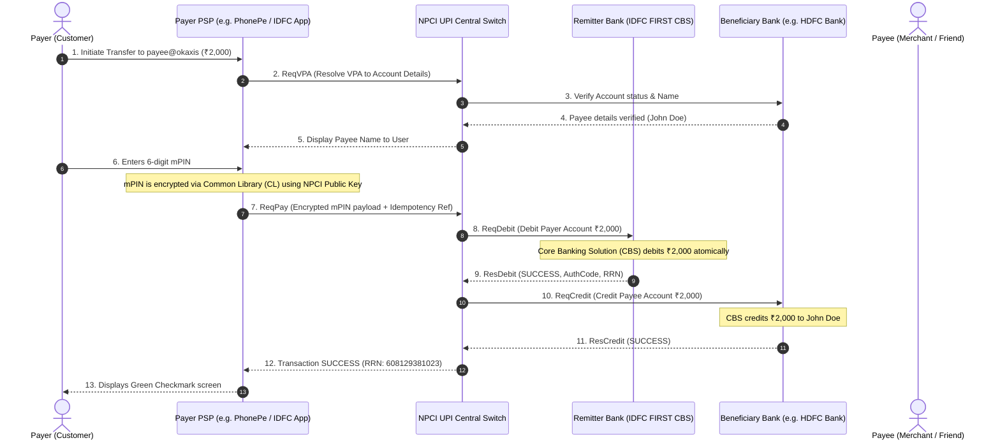
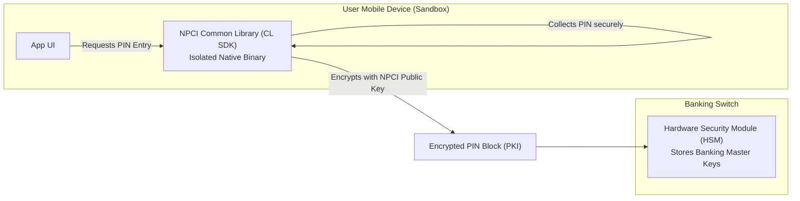

# Indian Banking Rails, UPI 2.0 Architecture & Digital Payments

## 1. Why This Matters
You are interviewing for the **Strategic Projects** division within **IDFC FIRST Bank**, Bengaluru. IDFC FIRST Bank prides itself on cutting-edge digital banking infrastructure, instant account opening, and high-volume UPI/IMPS transaction switches. If you walk into this interview and only know generic CRUD web development, you will struggle when they ask about Indian payment rails. Demonstrating command over **UPI 2.0**, NPCI settlement switches, VPA routing, and idempotency guarantees will immediately set you apart as a top 5% candidate.

---

## 2. Prerequisites
- Client-server architecture, REST APIs, and asynchronous message queues.
- Basic understanding of public-key cryptography (digital signatures, PKI).

---

## 3. Concept

### Indian Payment Rails Comparison Matrix
| Rail | Governing Body | Settlement Type | Operating Hours | Max Limit / Txn | Typical Latency |
| :--- | :--- | :--- | :---: | :---: | :---: |
| **UPI** | NPCI | Real-Time Gross (Per-Txn) | 24x7x365 | ₹1 Lakh (₹5 Lakh for hospitals/education) | 1–3 seconds |
| **IMPS** | NPCI | Real-Time Gross | 24x7x365 | ₹5 Lakh | 2–5 seconds |
| **NEFT** | RBI | Deferred Net Settlement (DNS) in half-hourly batches | 24x7x365 | No minimum / No limit | 30–60 mins |
| **RTGS** | RBI | Real-Time Gross Settlement (Continuous) | 24x7x365 | Min ₹2 Lakh / No upper limit | Instant (< 30s) |

---

## 4. UPI 2.0 System Architecture & Key Entities



### The Key Participants:
1. **Payer (Remitter) & Payee (Beneficiary):** End customers or merchants.
2. **Payment Service Provider (PSP) App:** The frontend application (IDFC FIRST Mobile App, Google Pay, CRED).
3. **Payer / Payee PSP (Bank):** The acquiring or routing bank providing the API gateway for the PSP app.
4. **NPCI (National Payments Corporation of India):** The central switch coordinating routing, authentication payloads, and inter-bank multilateral netting settlements.
5. **Remitter Bank (Issuer):** The bank holding the payer's account (e.g., IDFC FIRST Bank). Validates the encrypted mPIN and debits the core balance.
6. **Beneficiary Bank (Acquirer):** The bank holding the payee's account. Receives credit instruction from NPCI and credits the recipient.

---

## 5. Real-World Banking Example: The Dreaded "Debit Success, Credit Timeout"
What happens when:
- **Remitter Bank (IDFC FIRST):** Successfully debits ₹5,000 from customer's account.
- **NPCI $\to$ Beneficiary Bank:** Network cable cut or Beneficiary Bank CBS hangs.
- **Result:** Payer's money is debited, but Payee does not receive credit.

### The Resolution Protocol (RBI T+1 Auto-Reversal Mandate):
1. **Deemed Success vs Deemed Failure:** If the credit request times out, NPCI initiates automated **Transaction Status Inquiries (ReqHbt / UPI Check Status API)** every few minutes.
2. **Auto-Reversal (Credit Reversal):** If Beneficiary Bank confirms no credit took place, NPCI transmits a `ReqReversal` to Remitter Bank to refund the ₹5,000 back to the customer.
3. **Turnaround Time (TAT) Rules:** RBI mandates that failed UPI transactions where account is debited must be reversed within **T+1 business days**. Failure to do so incurs an automatic statutory penalty of **₹100 per day** paid directly to the customer.

---

## 6. Code: Generating and Enforcing UPI Idempotency Keys in Node.js

```javascript
const crypto = require('crypto');

/**
 * Generates an immutable, collision-resistant Retrieval Reference Number (RRN)
 * compliant with NPCI 12-digit format:
 * Format: YDDDHHNNNNNN (Year last digit, Day of Year, Hour, 6-digit sequence)
 */
function generateUPIReferenceNumber(counter = 1) {
    const now = new Date();
    const yearLastDigit = now.getFullYear() % 10;
    
    // Day of year (001 - 366)
    const startOfYear = new Date(now.getFullYear(), 0, 0);
    const diff = now - startOfYear;
    const oneDay = 1000 * 60 * 60 * 24;
    const dayOfYear = String(Math.floor(diff / oneDay)).padStart(3, '0');
    
    const hour = String(now.getHours()).padStart(2, '0');
    const sequence = String(counter % 1000000).padStart(6, '0');

    return `${yearLastDigit}${dayOfYear}${hour}${sequence}`;
}

console.log('Sample NPCI RRN:', generateUPIReferenceNumber(45291));
```

---

## 7. How It Works Internally: The Common Library (CL) & mPIN Security
How does the NPCI prevent malicious PSP apps (like a third-party app) from stealing a user's 6-digit ATM/mPIN?



- Every UPI app must embed the **NPCI Common Library (CL SDK)** as an isolated native binary.
- When the user types their mPIN, the PSP app's JavaScript layer has **zero access to the keyboard events**.
- The CL encrypts the raw PIN using **RSA-2048 / 3DES** encryption inside a hardware security enclave using NPCI's public key.
- Only the **Hardware Security Module (HSM)** inside the Remitter Bank's core data center holds the corresponding private key to decrypt and verify the mPIN!

---

## 8. Common Mistakes
1. **Confusing VPA with Account Numbers:** Virtual Payment Addresses (`username@idfcbank`) decouple sensitive bank account numbers and IFSC codes from merchants. The mapping is resolved dynamically via NPCI central directory.
2. **Treating Payment Statuses as Binary (Success/Fail):** Payment gateways have an essential third state: **PENDING / IN-DOUBT**. Never trigger a refund or repeat debit on an "IN-DOUBT" status until the reconciliation loop or check-status API returns a terminal state.
3. **Assuming UPI Settlements are Real-Time Between Banks:** While customer accounts are debited and credited instantly, the actual **multilateral inter-bank settlement** between IDFC FIRST Bank and other banks occurs in discrete net clearing cycles managed by RBI and NPCI multiple times daily.

---

## 9. Performance / Complexity Matrix

| Metric | UPI | IMPS | NEFT | RTGS |
| :--- | :---: | :---: | :---: | :---: |
| **Switch Latency (SLA)** | $< 2$ seconds | $< 5$ seconds | 30–60 minutes | $< 30$ seconds |
| **System Throughput** | $> 15,000$ TPS nationwide | $\approx 2,000$ TPS | Batch files | Continuous gross |
| **Idempotency Lifetime** | 48 hours | 24 hours | N/A (Batch ref) | N/A |

---

## 10. Interview Questions (Easy $\to$ Medium $\to$ Hard)

### Easy
- **Q:** What is a VPA in UPI and what role does NPCI play during a UPI transaction?

### Medium
- **Q:** What is the difference between IMPS and UPI? If IMPS already existed, why was UPI created?

### Hard
- **Q:** Design an end-to-end reconciliation engine for IDFC FIRST Bank that processes 20 million daily UPI settlement records against NPCI raw clearing files. How do you detect and resolve one-way debits and settlement mismatches?

---

## 11. Follow-up Questions from Interviewer
- *"What is a Mandate in UPI 2.0 (Autopay) and how does pre-authorization work for IPO subscriptions or recurring subscriptions?"*
- *"If NPCI returns a TIMEOUT during a `ReqCredit` call, what exact state machine transition must the Remitter Bank's transaction record undergo?"*

---

## 12. Model Answer: Why UPI Exists Over IMPS

> **Interviewer:** *"If IMPS already provided 24x7 instant interbank transfers, why did NPCI design UPI?"*
> 
> **Model Answer:**
> "While IMPS established the underlying real-time clearing switch, it suffered from severe friction that prevented mass consumer and merchant adoption:
> 1. **Frictional Addressing:** IMPS required exchanging sensitive 11-digit account numbers and 11-character IFSC codes (or MMID), raising security concerns and high error rates during manual entry. UPI introduced the **Virtual Payment Address (VPA)**, abstracting account details behind an intuitive identifier (`name@idfc`).
> 2. **Pull Payments (Collect Requests):** IMPS was strictly a 'Push' architecture (payer sends money). UPI introduced bidirectional protocols: 'Push' (pay) and 'Pull' (merchants requesting funds / collect requests / autopay mandates).
> 3. **Interoperable Single-Click 2FA:** IMPS relied on divergent, clunky bank OTPs and SMS gateways. UPI standardized the **NPCI Common Library (CL)**, providing seamless 2-factor authentication (Device Fingerprint + 6-digit mPIN) across any interoperable PSP application.
> 4. **Standardized QR Code Rails:** UPI homogenized Bharat QR and dynamic payment strings, turning any smartphone into an instant point-of-sale terminal."

---

## 13. Practical Exercise
Review `05-SQL-DBMS/schema.sql` and note how the `transactions` table records `payment_channel` with explicit values (`'UPI'`, `'NEFT'`, `'RTGS'`, `'IMPS'`) and stores `transaction_reference` as an immutable lookup token.

---

## 14. Quick Revision
- UPI 2.0 = NPCI Central Switch + Remitter Bank (debit) + Beneficiary Bank (credit) + PSP Apps.
- Addressing is decoupled via Virtual Payment Address (VPA).
- mPIN is encrypted by the NPCI Common Library native binary using public key cryptography before touching the application layer.
- RBI T+1 rule mandates automated refunds for one-way debits with a ₹100/day delay penalty.
- Transactions are 3-state: `SUCCESS`, `FAILED`, and `IN-DOUBT` (requires reconciliation).

---

## 15. Interview Checklist
- [ ] Can draw the 13-step sequence diagram of a UPI transaction from memory.
- [ ] Explains how the Common Library protects mPIN from rogue mobile apps.
- [ ] Articulates the difference between Push and Pull transactions.
- [ ] Explains Deemed Success and T+1 auto-reversal mandates.
