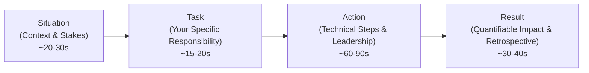

# Behavioral & Engineering Leadership Preparation (STAR Method)
### Strategic Projects Division | IDFC FIRST Bank (3+ Years Experience Standard)

---

## 🎯 Behavioral Expectations for 3+ YoE at IDFC FIRST Bank

In senior engineering interviews, purely technical answers are not enough. The engineering management team at IDFC FIRST Bank evaluates:
1. **Ownership & Accountability:** Do you take personal responsibility for production incidents, or do you blame infrastructure/libraries?
2. **Mentorship & Code Review Standards:** How do you elevate junior developers and uphold software quality without being pedantic or demotivating?
3. **Cross-Functional Collaboration:** How do you interface with Product Managers, Compliance Officers, and Security teams when requirements conflict?
4. **Pragmatic Delivery:** How do you balance technical perfection against aggressive business launch deadlines?

---

## 📐 The STAR Method Structure

Every behavioral answer should strictly follow the **STAR framework** (target length: 2 to 3 minutes):

---

## 🌟 Top 5 Behavioral Scenarios & Model Answers

### 1. Mentoring a Junior Developer & Code Review Culture
* **Interviewer Prompt:** *"Tell me about a time you mentored a junior engineer or handled a difficult code review."*
* **STAR Response:**
  - **Situation:** A junior developer on our backend team submitted a Pull Request for an account balance update endpoint. The code functioned correctly in staging, but it implemented raw balance mutation without database transactions or idempotency checks, creating a severe race condition vulnerability.
  - **Task:** I needed to guide the engineer to recognize the concurrency bug, rewrite the code to adhere to ACID standards, and instill good practices without discouraging them.
  - **Action:**
    1. Rather than writing blunt rejections on GitHub, I scheduled a 30-minute pair-programming session.
    2. I walked through an interactive simulation showing how two concurrent requests using `curl` could withdraw ₹1,000 simultaneously from an account holding ₹1,000.
    3. I explained how `SELECT ... FOR UPDATE` and database transactions guarantee atomicity.
    4. Together, we refactored the code to use transactions and wrote automated integration tests simulating concurrent requests.
  - **Result:** The pull request was merged with 100% test coverage. Over the subsequent quarter, that engineer became the team's strongest advocate for database concurrency testing, and I established a team-wide code review checklist for transactional endpoints.

---

### 2. Disagreeing with a Product Manager on an Unrealistic Deadline
* **Interviewer Prompt:** *"How do you handle a situation where a Product Manager pushes for a launch date that would force you to cut corners on security or testing?"*
* **STAR Response:**
  - **Situation:** Two weeks before a major marketing campaign, our PM requested launching a third-party instant payment integration ahead of schedule by skipping our automated integration test suite and rate-limiting safeguards.
  - **Task:** As a senior developer responsible for service stability, I could not permit launching an unhedged financial endpoint, but I also understood the business urgency of the marketing campaign.
  - **Action:**
    1. I did not simply say "No". I documented the concrete risks: without rate limiting and test verification, an API failure or bot attack during the campaign could cause unrecoverable financial discrepancies and customer attrition.
    2. I proposed a **phased release compromise**: we would launch on time for an invite-only beta of 500 users with strict manual transfer limits (₹2,000 max), while our engineering team completed the automated test suite and rate-limiter over the following 7 days before general public rollout.
  - **Result:** The PM appreciated the risk mitigation; the marketing launch proceeded successfully with the beta group, and the full public launch rolled out 7 days later with zero production defects.

---

### 3. Handling a Production Incident Under Severe Pressure
* **Interviewer Prompt:** *"Describe a time a production deployment went wrong and how you resolved it under pressure."*
* **STAR Response:**
  - **Situation:** Immediately following an evening deployment, our authentication service began returning HTTP 500 errors for 40% of mobile login requests. The mobile app's active user sessions dropped precipitously.
  - **Task:** As the engineer who deployed the release, my primary priority was immediate customer restoration, followed by root cause analysis.
  - **Action:**
    1. Instead of attempting a live debug or hotfix in production, I immediately executed an automated rollback to the previous stable Docker image tag, restoring login traffic to 100% health within 4 minutes.
    2. I notified customer support and leadership on the incident Slack channel with clear status updates.
    3. Once the system was stable, I analyzed the application logs and identified that a new environment variable for the JWT public key was missing in the production Kubernetes secret manifest, causing a silent null pointer exception during token verification.
    4. Added a strict pre-flight environment variable validation check in our CI/CD pipeline.
  - **Result:** Total downtime was under 4 minutes with zero data corruption. The new CI/CD validation check prevented configuration drift from ever recurring in subsequent deployments.

---

## 📋 Behavioral Question Preparation Checklist
Prepare one concrete personal story for each of these prompts:
- [ ] A time you resolved a complex technical disagreement with a peer.
- [ ] A time you took the initiative to optimize an existing system that wasn't officially assigned to you.
- [ ] A time you made a mistake that impacted users, and how you owned and resolved it.
- [ ] Why you want to work at IDFC FIRST Bank specifically (Focus on digital-first culture, tech-driven strategic banking platform, and scale).
