# Project Deep Dive & Technical Defense Framework
### Deconstructing & Defending Your Real-World Full-Stack Engineering Projects

> [!IMPORTANT]
> In an interview for a **3+ YoE Developer at IDFC FIRST Bank**, up to 50% of your technical screening and engineering manager rounds will revolve around the projects on your resume.
> Interviewers will test whether you truly designed and understood the system, or simply copied boilerplate CRUD code.
> 
> When you share your specific resume or project details in our chat, I will automatically populate customized deep-dive question sets for each project using the rigorous 10-dimension framework below.

---

## 🎯 The 10-Dimension Project Defense Framework

```mermaid
flowchart TD
    subgraph Dimensions["10 Architectural Pressure Tests"]
        D1["1. Architecture & Data Flow"] --> D2["2. Technology Choice ('Why X over Y?')"]
        D2 --> D3["3. Database Schema & Indexing Decisions"]
        D3 --> D4["4. Scalability & Traffic Surges (100x Growth)"]
        D4 --> D5["5. Security & Authentication Posture"]
        D5 --> D6["6. Bottleneck Identification & Performance Tuning"]
        D6 --> D7["7. Live Production Debugging & Incident Triage"]
        D7 --> D8["8. Trade-offs & What Broke"]
        D8 --> D9["9. 'What Would You Re-architect Today?'"]
        D9 --> D10["10. Mentorship, Code Reviews & Team Collaboration"]
    end
```

---

## 🔬 Sample Full-Stack Project Defense (Node.js + React + PostgreSQL)

Below is an exemplar dissection of a production-grade full-stack project so you can see the expected depth of answers.

### 1. Architecture & System Flow
* **Interviewer Question:** *"Walk me through the high-level architecture of your application. What happens when a user clicks 'Submit Payment' on the React UI until the database is updated?"*
* **Candidate Defense Strategy:**
  - Trace request path: React client $\to$ Cloudflare / CDN $\to$ Nginx / Ingress Controller $\to$ Express.js API Gateway $\to$ JWT Authentication Middleware $\to$ Validation Layer (Joi / Zod) $\to$ Service Business Logic $\to$ Connection Pool $\to$ PostgreSQL Database (Transaction).
  - Explicitly mention asynchronous operations (Kafka/Redis) and response serialization.

---

### 2. Technology Choice: "Why Did You Choose X Over Y?"
* **Question 1:** *"Why did you choose Node.js over Java (Spring Boot) or Go for this backend?"*
  - **Weak Answer:** *"Because JavaScript is easy and our team already knew it."*
  - **Strong Answer (3+ YoE Standard):** *"Our service is predominantly I/O-bound, managing high-concurrency real-time WebSocket connections and database queries. Node.js's non-blocking, single-threaded event loop powered by libuv handles thousands of concurrent socket connections with a minimal memory footprint (under 30MB per instance) compared to the thread-per-request model of traditional Java applications which consume 1MB of stack memory per thread. Furthermore, sharing TypeScript interfaces across our React frontend and Express backend eliminated API contract drift and accelerated our feature delivery cycles."*

* **Question 2:** *"Why did you choose PostgreSQL over MongoDB?"*
  - **Strong Answer:** *"Our domain requires strict relational integrity, ACID guarantees on user balances, and complex multi-table joins between users, orders, and payment records. MongoDB's document model lacks strict foreign key constraints at the storage engine level, making data corruption possible if application code fails. PostgreSQL gave us ACID compliance, robust partial indexes, and JSONB support when flexible schema attributes were needed."*

---

### 3. Database Decisions & Optimization
* **Interviewer Question:** *"What was your database indexing strategy? Can you describe a specific slow query you optimized?"*
* **Model Defense:**
  - *"We had an endpoint fetching a user's transaction history with pagination: `WHERE user_id = :id ORDER BY created_at DESC LIMIT 20`."*
  - *"Initially, we only had an index on `user_id`. `EXPLAIN ANALYZE` revealed that while the index filtered the rows quickly, the database had to perform an expensive in-memory sort on the remaining rows by `created_at` before slicing the top 20."*
  - *"We replaced it with a **composite index on `(user_id, created_at DESC)`**. This enabled an index-only backward traversal, eliminating the sort phase entirely and dropping query latency from 320ms to 4ms on a 5-million-row table."*

---

### 4. Scalability: "What Happens If Traffic Increases 100x?"
* **Interviewer Question:** *"If your daily active users jump from 10,000 to 1,000,000 overnight, what will break first in your architecture, and how will you scale it?"*
* **Model Defense:**
  1. **First Bottleneck:** Database connection pool exhaustion and read latency.
     - *Fix:* Introduce **PgBouncer** for lightweight connection pooling; provision Read Replicas for reporting queries; implement Redis caching (Cache-Aside pattern) for read-heavy session data.
  2. **Second Bottleneck:** Node.js CPU saturation on the single event loop.
     - *Fix:* Deploy via Kubernetes with Horizontal Pod Autoscaler (HPA) targeting $70\%$ CPU utilization behind an Application Load Balancer.

---

### 5. Production Incident & Debugging
* **Interviewer Question:** *"Tell me about the hardest production bug you personally diagnosed and resolved."*
* **Candidate Framework (STAR Method):**
  - **Situation:** A microservice began suffering intermittent memory exhaustion crashes (`JavaScript heap out of memory`) every 48 hours under high load.
  - **Diagnosis:** We attached Chrome DevTools via `--inspect` on a staging replica under simulated traffic and captured heap snapshots spaced 30 minutes apart. Comparing the snapshots revealed thousands of un-garbage-collected `EventEmitter` instances.
  - **Root Cause:** A request logging middleware was registering a listener on `res.on('finish')` without removing it during socket timeouts.
  - **Resolution:** Replaced manual listeners with native Node.js `stream.finished()` utility, stabilizing memory usage under 150MB indefinitely.

---

## 📋 How to Prepare Your Own Projects

When you share your projects, ensure you can answer these 6 questions without hesitating:
1. [ ] What was the core business problem your project solved?
2. [ ] What was the exact throughput (requests/sec) and database size (rows/GB)?
3. [ ] Why did you choose your primary database, and what was the schema design?
4. [ ] How did you authenticate requests and protect sensitive user data?
5. [ ] What was the most difficult architectural tradeoff you made?
6. [ ] If you had another 3 months to rebuild the project from scratch, what would you do differently?
