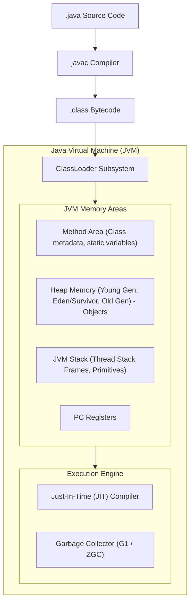
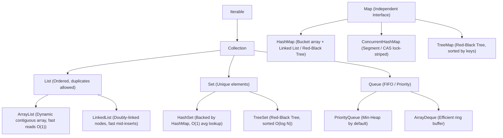

# Enterprise Java Fundamentals (Safeguard Module)

## 1. Why This Matters
The IDFC FIRST Bank job description states: *"Java / Python / C++"*. While your primary engineering strength is Node.js and your algorithmic coding language is Python, large Indian private banks often maintain legacy or enterprise microservices built in Java (Spring Boot). This guide provides a rapid, high-yield safeguard covering **Java OOP**, the **Collections Framework**, and **multithreading fundamentals** so you can confidently converse with enterprise Java interviewers without fear.

---

## 2. Prerequisites
- General Object-Oriented Programming (Classes, Inheritance, Polymorphism).
- Basic understanding of compiled vs interpreted execution (JVM, Bytecode).

---

## 3. Concept: The Java Virtual Machine (JVM) Architecture



---

## 4. Key Collections Framework Hierarchy



---

## 5. Real-World Banking Example: Safe Account Balance Thread Synchronization
In multi-threaded Java applications, multiple threads can access the same account object simultaneously.

```java
public class BankAccount {
    private final String accountNumber;
    private double balance;
    private final Object lock = new Object(); // Explicit lock object

    public BankAccount(String accountNumber, double initialBalance) {
        this.accountNumber = accountNumber;
        this.balance = initialBalance;
    }

    // Thread-safe deposit using synchronized block
    public void deposit(double amount) {
        if (amount <= 0) throw new IllegalArgumentException("Amount must be positive");
        synchronized (lock) {
            this.balance += amount;
        }
    }

    // Thread-safe withdrawal
    public boolean withdraw(double amount) {
        if (amount <= 0) throw new IllegalArgumentException("Amount must be positive");
        synchronized (lock) {
            if (this.balance >= amount) {
                this.balance -= amount;
                return true;
            }
            return false;
        }
    }

    public double getBalance() {
        synchronized (lock) {
            return this.balance;
        }
    }
}
```

---

## 6. Code: Java Streams API for Financial Analytics

```java
import java.util.*;
import java.util.stream.Collectors;

record Transaction(String id, String accountId, double amount, String status) {}

public class TransactionAnalytics {
    public static void main(String[] args) {
        List<Transaction> transactions = List.of(
            new Transaction("TX1", "ACC101", 15000.0, "SUCCESS"),
            new Transaction("TX2", "ACC102", 5000.0, "FAILED"),
            new Transaction("TX3", "ACC101", 25000.0, "SUCCESS"),
            new Transaction("TX4", "ACC103", 80000.0, "SUCCESS")
        );

        // 1. Filter high-value successful transactions (>= 20,000)
        List<Transaction> highValue = transactions.stream()
            .filter(t -> "SUCCESS".equals(t.status()))
            .filter(t -> t.amount() >= 20000.0)
            .collect(Collectors.toList());

        // 2. Sum total successful volume using mapToDouble
        double totalSettled = transactions.stream()
            .filter(t -> "SUCCESS".equals(t.status()))
            .mapToDouble(Transaction::amount)
            .sum();

        // 3. Group transactions by accountId
        Map<String, List<Transaction>> groupedByAccount = transactions.stream()
            .collect(Collectors.groupingBy(Transaction::accountId));

        System.out.println("Total Settled Volume: ₹" + totalSettled);
    }
}
```

---

## 7. How It Works Internally: HashMap Bucket Treeification (Java 8+)

### The O(N) Collision Defense
1. In Java 7, a `HashMap` resolved collisions strictly via **separate chaining** using a singly linked list. If an attacker flooded a bucket with colliding keys, lookups degraded to O(N).
2. **Java 8 Treeification:**
   - When the number of elements in a single bucket reaches **`TREEIFY_THRESHOLD = 8`** AND the total table capacity is at least 64, the linked list is transformed into a balanced **Red-Black Tree (`TreeNode`)**!
   - Lookup complexity improves from O(N) to **O(log N)**, mitigating algorithmic denial-of-service (HashDoS) attacks.
   - If deletions reduce bucket size back to **`UNTREEIFY_THRESHOLD = 6`**, it converts back to a linked list.

---

## 8. Common Mistakes
1. **Confusing `==` with `.equals()`:** In Java, `==` compares object memory references. `.equals()` compares logical values. Using `str1 == str2` checks whether both pointers point to the exact same memory address! Always use `.equals()` for strings and objects.
2. **Using `Vector` or `Hashtable`:** These are obsolete legacy classes from Java 1.0 that synchronize every single method, introducing massive performance penalties. Use `ArrayList` and `HashMap`, or `ConcurrentHashMap` for multithreading.
3. **Ignoring Checked Exceptions:** Java enforces checked exceptions (`IOException`, `SQLException`). Unhandled checked exceptions fail to compile unless caught in a `try-catch` block or declared via `throws`.

---

## 9. Performance / Complexity Matrix

| Collection | Underlying Data Structure | Access Time | Search Time | Insertion Time |
| :--- | :--- | :---: | :---: | :---: |
| **`ArrayList`** | Resizable Object Array | O(1) | O(N) | O(1) amortized |
| **`LinkedList`** | Doubly-Linked List | O(N) | O(N) | O(1) at ends |
| **`HashMap`** | Hash Table + Red-Black Tree | N/A | O(1) avg / O(log N) worst | O(1) avg |
| **`ConcurrentHashMap`**| Synchronized Buckets + CAS | N/A | O(1) avg | O(1) lock-free CAS |
| **`PriorityQueue`** | Min-Heap Array | O(1) (peek) | O(N) | O(log N) |

---

## 10. Interview Questions (Easy → Medium → Hard)

### Easy
- **Q:** What is the difference between an Abstract Class and an Interface in Java 8+?

### Medium
- **Q:** How does `ConcurrentHashMap` achieve thread safety without locking the entire table like `Collections.synchronizedMap()`?

### Hard
- **Q:** Explain the `volatile` keyword in Java. How does it interact with the CPU L1/L2 cache, the Java Memory Model (JMM), and instruction reordering?

---

## 11. Follow-up Questions from Interviewer
- *"What happens if you override `.equals()` without overriding `.hashCode()` in a custom class used as a HashMap key?"*
  *(Answer: Breaks the contract! Two objects with identical values will return different hash codes, ending up in different buckets. `map.get(key)` will fail to find the existing object).*
- *"What is the difference between Checked and Unchecked exceptions in Java?"*

---

## 12. Model Answer: How `ConcurrentHashMap` Works Internally

> **Interviewer:** *"How does `ConcurrentHashMap` provide high write throughput in multi-threaded Java applications?"*
> 
> **Model Answer:**
> "In earlier Java versions, `ConcurrentHashMap` used **Segment Locking** (partitioning the table into 16 independent segments, each with its own lock).
> 
> In modern Java (Java 8+), performance was optimized further:
> 1. **Lock-Free Reads:** Read operations (`get()`) require **zero locks**. All node values and next pointers are declared `volatile`, guaranteeing immediate visibility of writes across CPU cores without locking overhead.
> 2. **Compare-And-Swap (CAS) for New Buckets:** When inserting a key into an empty bucket, it uses atomic hardware instructions (**CAS via `Unsafe` / `VarHandle`**) without taking any lock.
> 3. **Node-Level `synchronized` for Collisions:** If the bucket already contains nodes (a linked list or red-black tree), it acquires a synchronized lock **strictly on the head node of that specific bucket**.
> 
> Because locks are acquired only on individual bucket heads rather than the whole table, thousands of threads can read and write to different buckets concurrently without contention."

---

## 13. Practical Exercise
Review the code in Section 5 and notice how locking on a dedicated `private final Object lock` is superior to synchronizing the entire method (`public synchronized void deposit()`), because external callers cannot hijack or deadlock on your internal lock object.

---

## 14. Quick Revision
- JVM = ClassLoader + Heap (Objects) + Stack (Frames) + JIT Compiler + GC.
- `==` checks reference identity; `.equals()` checks logical equality.
- Overriding `.equals()` strictly requires overriding `.hashCode()`.
- Java 8 HashMap treeifies buckets to Red-Black Trees when depth ≥ 8.
- `ConcurrentHashMap` uses volatile reads, CAS for empty buckets, and locks only the head node during collisions.

---

## 15. Interview Checklist
- [ ] Articulates `.equals()` and `.hashCode()` contract.
- [ ] Explains HashMap bucket treeification (O(log N) worst-case).
- [ ] Contrasts `ArrayList` vs `LinkedList` cache locality.
- [ ] Explains `ConcurrentHashMap` lock-striping and CAS.
